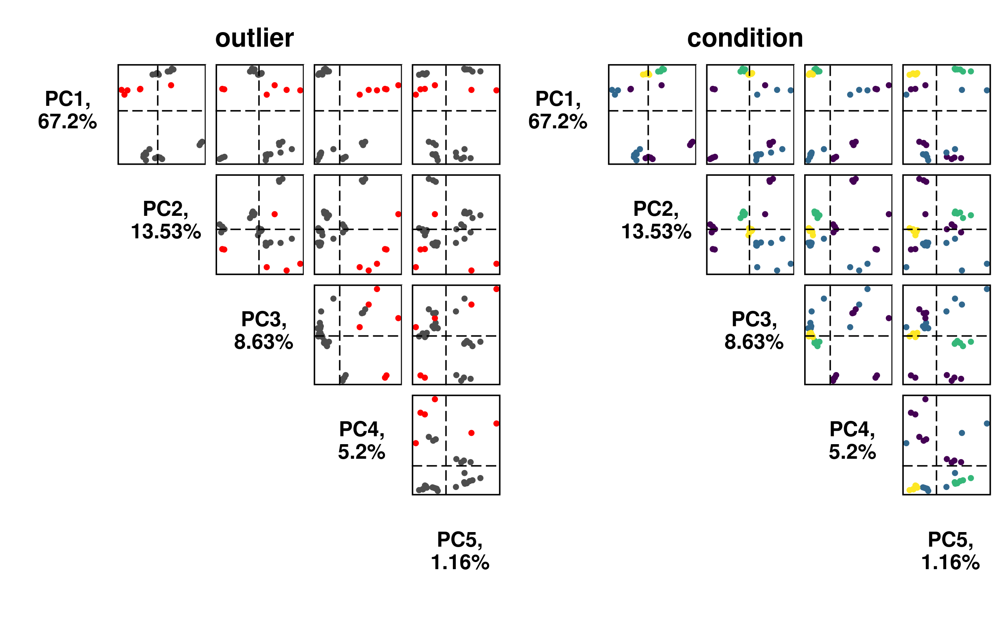
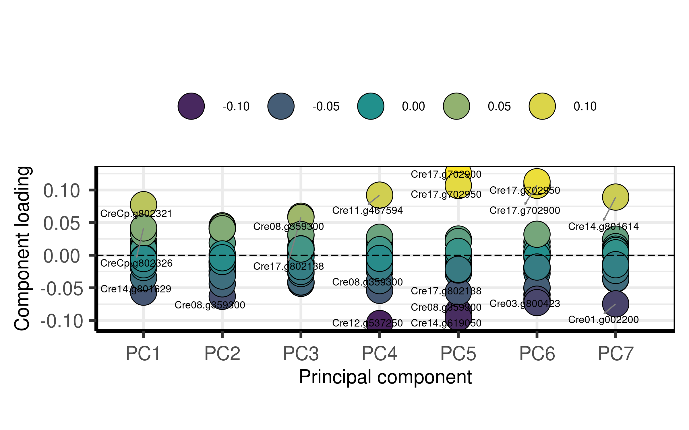
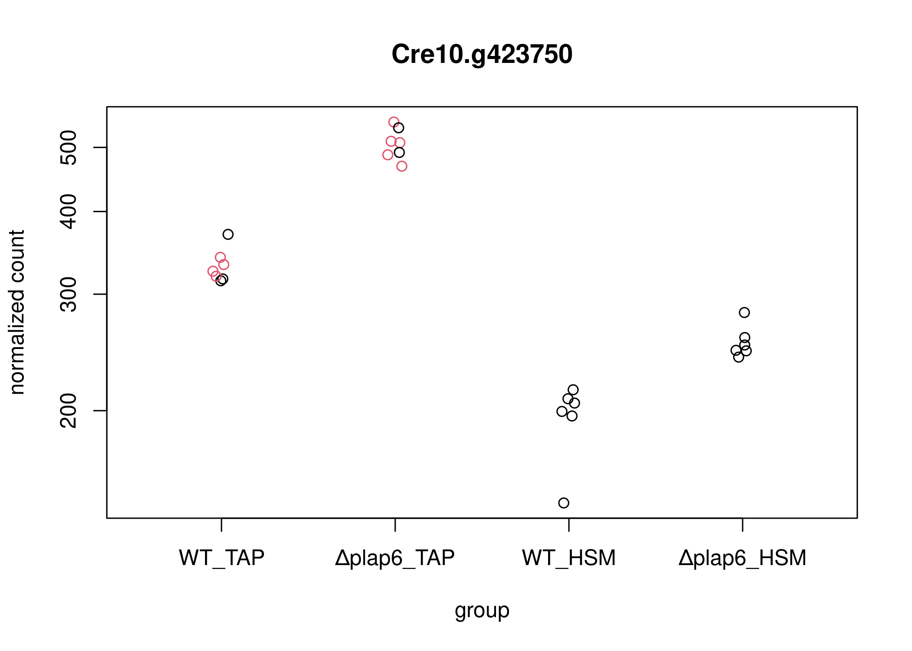
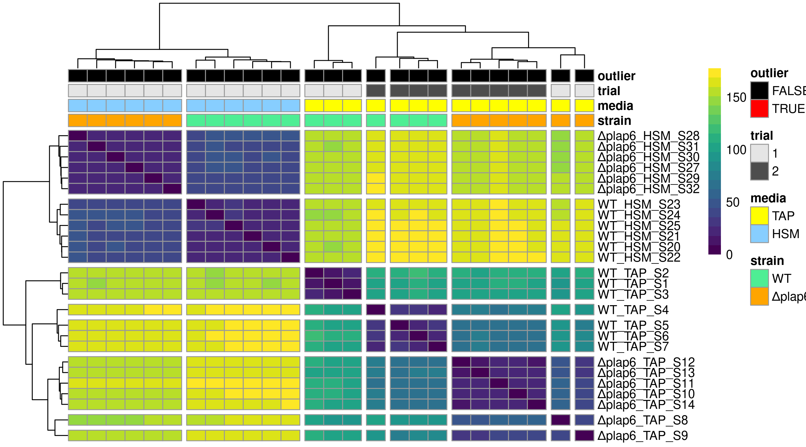
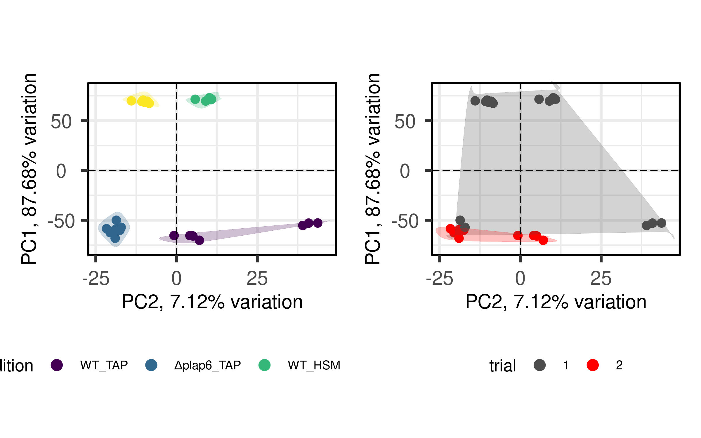

# 0. Prepare System

BiocManager::install()

## Load System

    library(stringr)
    library(R.utils)
    library(RColorBrewer)
    library(sessioninfo)
    library(data.table)
    library(plyr)
    library(tidyverse)
    library(tximeta)
    library(tximport)
    library(curl)
    library(AnnotationHub)
    library(DESeq2)
    library(EnhancedVolcano)
    library(pheatmap)
    library(writexl)
    library(biomaRt)
    library(ape)
    library(kableExtra)
    library(knitr)

    library(stringr)
    library(R.utils)
    library(RColorBrewer)

    library(sessioninfo)
    library(data.table)
    library(plyr)
    library(tidyverse)
    library(tximeta)
    library(tximport)
    library(curl)

    library(SummarizedExperiment)
    library(GenomicRanges)
    library(ape)

    library(viridis)
    library(patchwork)
    library("ggpubr")
    library(vsn)

    library(PCAtools)

    # library(wget)

## Download data

Username: uFZjGr6t Password: nYGTAdUw Link
<https://filetransfer.mdc-berlin.de/?u=uFZjGr6t&p=nYGTAdUw>

You can find detailed instruction accessing the folder in different
settings here: <https://t1p.de/gdmhowtocrush>

    # wget("https://filetransfer.mdc-berlin.de/?u=uFZjGr6t&p=nYGTAdUw")

    ifelse(Sys.info()["sysname"]== "Linux",
           s <- "/mnt/s",
           s <- "S:")

    ##  sysname 
    ## "/mnt/s"

    dir <- paste(s,"AG/AG-Scholz-NGS/Daten/Simon/P3043",sep="/")
    gitdir <- paste(dir,"git_Chlamy_RNAseq_plap6",sep="/")
    datadir <- paste(dir,"data",sep="/")
    outdir <- gitdir
    quantdir <- paste(dirname(datadir),"quants2",sep="/")

    dir1 <- paste(dirname(dir),"linux-ngs/salmon/salmon_index_chlamy",sep="/")

    indexDir <- file.path(dirname(dir),"linux-ngs/salmon/salmon_index_chlamy/chlamy_index_v6.1")
    fastaPath <- file.path(dir1,"Phytozone_v6.1/CreinhardtiiCC_4532_707_v6.0.hardmasked.fa.gz")
    # list.files(dirname(fastaPath))
    # head(readLines(fastaPath,n=50))
    gtfPath <- file.path(dir1,"Phytozone_v6.1/CreinhardtiiCC_4532_707_v6.1.repeatmasked_assembly_v6.0.gff3.gz")
    # readLines(gtfPath,n=20)
    gtfPath <- file.path(dir1,"Phytozone_v6.1/CreinhardtiiCC_4532_707_v6.1.gene_exons.gff3.gz")
    # readLines(gtfPath,n=20)
    gtfPath <- file.path(dir1,"Phytozone_v6.1/CreinhardtiiCC_4532_707_v6.1.gene.gff3.gz")
    # readLines(gtfPath,n=20)

    file.exists(indexDir, fastaPath, gtfPath)

    ## [1] TRUE TRUE TRUE

setwd(“S:/AG/AG-Scholz-NGS/Daten/Simon/P3043”)

# 1. Process Data

## Sample names

    f <- list.files(path = quantdir)
    files <- as.factor(str_remove(f,pattern ="_quant"))
    # short form
    sample <- str_remove(files,pattern ="P3043_") 
    sample %>% head() %>% kable() %>% kable_styling("striped", full_width = T) %>% scroll_box(height = "400px")

<table class="table table-striped" style="margin-left: auto; margin-right: auto;">
<thead>
<tr>
<th style="text-align:left;position: sticky; top:0; background-color: #FFFFFF;">
x
</th>
</tr>
</thead>
<tbody>
<tr>
<td style="text-align:left;">
RNA\_01\_WT-TAP-OR1\_S1\_L007
</td>
</tr>
<tr>
<td style="text-align:left;">
RNA\_01\_WT-TAP-OR1\_S1\_L008
</td>
</tr>
<tr>
<td style="text-align:left;">
RNA\_02\_WT-TAP-OR2\_S2\_L007
</td>
</tr>
<tr>
<td style="text-align:left;">
RNA\_02\_WT-TAP-OR2\_S2\_L008
</td>
</tr>
<tr>
<td style="text-align:left;">
RNA\_03\_WT-TAP-OR3\_S3\_L007
</td>
</tr>
<tr>
<td style="text-align:left;">
RNA\_03\_WT-TAP-OR3\_S3\_L008
</td>
</tr>
</tbody>
</table>

    sampleid <- {}
    strain  <- {}
    lane  <- {}
    condition <- {}
    media  <- {}
    replicate <- {}
    trial <- {}

    for (i in list.files(path = quantdir)){
      # print(i)
      si <- substring(i,14,18)
      sampleid <-c(sampleid,str_split(i, pattern = "_", simplify = TRUE)[,5])
      condition.i <- str_split(i, pattern = "_", simplify = TRUE)[,4]
      strain <-c(strain,str_split(condition.i, pattern = "-", simplify = TRUE)[,1])
      media <-c(media,str_split(condition.i, pattern = "-", simplify = TRUE)[,2])
      replicate <-c(replicate,str_split(condition.i, pattern = "-", simplify = TRUE)[,3])
      lane <-c(lane,str_split(i, pattern = "_", simplify = TRUE)[,6])
    }
    strain <- str_replace_all(strain, pattern="fib",replacement="Δplap6")
    condition <- paste(strain,media,sep="_") %>% factor(levels = c("WT_TAP","Δplap6_TAP","WT_HSM","Δplap6_HSM"))
    strain  <- strain %>% factor() %>% relevel("WT")
    lane  <- lane %>% factor()
    media  <- media %>% factor()  %>% relevel("TAP")
    replicate <- replicate %>% factor()

    trial <- c(rep(1,6),rep(2,8),rep(1,2),rep(2,4),rep(1,8),rep(1,12),rep(2,12),rep(1,12)) %>% factor() %>% relevel("1")

    # outliner: S15, S16, S17, S18, S19, S26

    # Make table
    sample.table <- data.frame(sample,sampleid,strain,media,condition,replicate,trial,lane)

    sample.table$samplename <- paste(condition,sampleid,sep="_")
    outlier <- c("S15", "S16", "S17", "S18", "S19", "S26")
    sample.table$outlier <- str_detect(sample.table$sampleid, paste(outlier, collapse = "|")) %>% factor() %>% relevel("FALSE")

    sample.table %>% head() %>% kable() %>% kable_styling("striped", full_width = T) %>% scroll_box(height = "400px")

<table class="table table-striped" style="margin-left: auto; margin-right: auto;">
<thead>
<tr>
<th style="text-align:left;position: sticky; top:0; background-color: #FFFFFF;">
sample
</th>
<th style="text-align:left;position: sticky; top:0; background-color: #FFFFFF;">
sampleid
</th>
<th style="text-align:left;position: sticky; top:0; background-color: #FFFFFF;">
strain
</th>
<th style="text-align:left;position: sticky; top:0; background-color: #FFFFFF;">
media
</th>
<th style="text-align:left;position: sticky; top:0; background-color: #FFFFFF;">
condition
</th>
<th style="text-align:left;position: sticky; top:0; background-color: #FFFFFF;">
replicate
</th>
<th style="text-align:left;position: sticky; top:0; background-color: #FFFFFF;">
trial
</th>
<th style="text-align:left;position: sticky; top:0; background-color: #FFFFFF;">
lane
</th>
<th style="text-align:left;position: sticky; top:0; background-color: #FFFFFF;">
samplename
</th>
<th style="text-align:left;position: sticky; top:0; background-color: #FFFFFF;">
outlier
</th>
</tr>
</thead>
<tbody>
<tr>
<td style="text-align:left;">
RNA\_01\_WT-TAP-OR1\_S1\_L007
</td>
<td style="text-align:left;">
S1
</td>
<td style="text-align:left;">
WT
</td>
<td style="text-align:left;">
TAP
</td>
<td style="text-align:left;">
WT\_TAP
</td>
<td style="text-align:left;">
OR1
</td>
<td style="text-align:left;">
1
</td>
<td style="text-align:left;">
L007
</td>
<td style="text-align:left;">
WT\_TAP\_S1
</td>
<td style="text-align:left;">
FALSE
</td>
</tr>
<tr>
<td style="text-align:left;">
RNA\_01\_WT-TAP-OR1\_S1\_L008
</td>
<td style="text-align:left;">
S1
</td>
<td style="text-align:left;">
WT
</td>
<td style="text-align:left;">
TAP
</td>
<td style="text-align:left;">
WT\_TAP
</td>
<td style="text-align:left;">
OR1
</td>
<td style="text-align:left;">
1
</td>
<td style="text-align:left;">
L008
</td>
<td style="text-align:left;">
WT\_TAP\_S1
</td>
<td style="text-align:left;">
FALSE
</td>
</tr>
<tr>
<td style="text-align:left;">
RNA\_02\_WT-TAP-OR2\_S2\_L007
</td>
<td style="text-align:left;">
S2
</td>
<td style="text-align:left;">
WT
</td>
<td style="text-align:left;">
TAP
</td>
<td style="text-align:left;">
WT\_TAP
</td>
<td style="text-align:left;">
OR2
</td>
<td style="text-align:left;">
1
</td>
<td style="text-align:left;">
L007
</td>
<td style="text-align:left;">
WT\_TAP\_S2
</td>
<td style="text-align:left;">
FALSE
</td>
</tr>
<tr>
<td style="text-align:left;">
RNA\_02\_WT-TAP-OR2\_S2\_L008
</td>
<td style="text-align:left;">
S2
</td>
<td style="text-align:left;">
WT
</td>
<td style="text-align:left;">
TAP
</td>
<td style="text-align:left;">
WT\_TAP
</td>
<td style="text-align:left;">
OR2
</td>
<td style="text-align:left;">
1
</td>
<td style="text-align:left;">
L008
</td>
<td style="text-align:left;">
WT\_TAP\_S2
</td>
<td style="text-align:left;">
FALSE
</td>
</tr>
<tr>
<td style="text-align:left;">
RNA\_03\_WT-TAP-OR3\_S3\_L007
</td>
<td style="text-align:left;">
S3
</td>
<td style="text-align:left;">
WT
</td>
<td style="text-align:left;">
TAP
</td>
<td style="text-align:left;">
WT\_TAP
</td>
<td style="text-align:left;">
OR3
</td>
<td style="text-align:left;">
1
</td>
<td style="text-align:left;">
L007
</td>
<td style="text-align:left;">
WT\_TAP\_S3
</td>
<td style="text-align:left;">
FALSE
</td>
</tr>
<tr>
<td style="text-align:left;">
RNA\_03\_WT-TAP-OR3\_S3\_L008
</td>
<td style="text-align:left;">
S3
</td>
<td style="text-align:left;">
WT
</td>
<td style="text-align:left;">
TAP
</td>
<td style="text-align:left;">
WT\_TAP
</td>
<td style="text-align:left;">
OR3
</td>
<td style="text-align:left;">
1
</td>
<td style="text-align:left;">
L008
</td>
<td style="text-align:left;">
WT\_TAP\_S3
</td>
<td style="text-align:left;">
FALSE
</td>
</tr>
</tbody>
</table>

    sample.table$strain %>% levels()

    ## [1] "WT"     "Δplap6"

## Mapping Rates

    # list.files(path = outdir)
    # list.files(path = datadir)
    # list.files(path = quantdir)

    samplelist <- {}
    mappingrates <- {}
    for (i in list.files(path = quantdir)){
      # print(i)
      si <- paste("",str_sub(i,11,-7),sep = "")
      samplelist <- c(samplelist,si)
      f <- readLines(paste(quantdir,i,"logs/salmon_quant.log", sep="/"))
      line <- grep("Mapping rate = ",f,value=TRUE)
      sl <- str_length(line)
      notime <- substring(line,30,sl)
      manual <- substring(line,sl-7,sl-1)
      val <- as.numeric(str_extract(notime,"[0-9.]+"))
      valr<-round(val, digits=2)
      # print(paste("Mapping rate of ",si," is: ",valr," %"))
      mappingrates <- c(mappingrates,valr)
    }

    # Make table

    m.table <- data.frame(sample.table,mappingrates)
    m.table[1:10,c("sample","mappingrates")] %>% kable() %>% kable_styling("striped", full_width = T) %>% scroll_box(height = "400px")

<table class="table table-striped" style="margin-left: auto; margin-right: auto;">
<thead>
<tr>
<th style="text-align:left;position: sticky; top:0; background-color: #FFFFFF;">
sample
</th>
<th style="text-align:right;position: sticky; top:0; background-color: #FFFFFF;">
mappingrates
</th>
</tr>
</thead>
<tbody>
<tr>
<td style="text-align:left;">
RNA\_01\_WT-TAP-OR1\_S1\_L007
</td>
<td style="text-align:right;">
81.99
</td>
</tr>
<tr>
<td style="text-align:left;">
RNA\_01\_WT-TAP-OR1\_S1\_L008
</td>
<td style="text-align:right;">
81.92
</td>
</tr>
<tr>
<td style="text-align:left;">
RNA\_02\_WT-TAP-OR2\_S2\_L007
</td>
<td style="text-align:right;">
83.08
</td>
</tr>
<tr>
<td style="text-align:left;">
RNA\_02\_WT-TAP-OR2\_S2\_L008
</td>
<td style="text-align:right;">
83.00
</td>
</tr>
<tr>
<td style="text-align:left;">
RNA\_03\_WT-TAP-OR3\_S3\_L007
</td>
<td style="text-align:right;">
81.84
</td>
</tr>
<tr>
<td style="text-align:left;">
RNA\_03\_WT-TAP-OR3\_S3\_L008
</td>
<td style="text-align:right;">
81.78
</td>
</tr>
<tr>
<td style="text-align:left;">
RNA\_04\_WT-TAP-1\_S4\_L007
</td>
<td style="text-align:right;">
84.01
</td>
</tr>
<tr>
<td style="text-align:left;">
RNA\_04\_WT-TAP-1\_S4\_L008
</td>
<td style="text-align:right;">
83.96
</td>
</tr>
<tr>
<td style="text-align:left;">
RNA\_05\_WT-TAP-2\_S15\_L007
</td>
<td style="text-align:right;">
80.99
</td>
</tr>
<tr>
<td style="text-align:left;">
RNA\_05\_WT-TAP-2\_S15\_L008
</td>
<td style="text-align:right;">
80.90
</td>
</tr>
</tbody>
</table>

### Plot mapping rates

    # Colours

    # Plot
    # plot(m.table$mappingrates)
    # -> boring

    # increase margin for longer names
    # par(mar=c(4,15,4,4)+.1)
    # barplot(height=mappingrates, names=m.table$sample, horiz=T, las=1)

    par(mar=c(4,8,4,4)+.1)
    xx <- barplot(height=mappingrates, names=m.table$sample, cex.names=0.5, horiz=T, las=1, xlim=c(0,100)) #col=col
    text(x = mappingrates, y = xx, label = mappingrates, pos = 4, cex = 0.5, col = "red")

## Tximeta

    example.quant <- paste(quantdir,list.files(quantdir)[1],"quant.sf",sep="/")

    list.files(quantdir)[1]
    file.exists(example.quant)

    # first file:
    example.table <- read.table(example.quant, header=T)
    head(example.table)
    basename(example.quant)
    dirname(example.quant)
    basename(dirname(example.quant))

    # generate file list & prepare variables
    files={}
    for (i in list.dirs(path = dirname(dirname(example.quant)), full.names = TRUE, recursive = FALSE)) {
      files <- c(files,paste(i,"/quant.sf",sep=""))
      # print(basename(i))
      # print(head(read.table(files[length(files)], header=T)))
      # print (files[length(files)])
    }
    # head(files)

    dir <- dirname(files)
    # head(dir)
    # head(basename(dir))
    run <- basename(dir)
    dirdir <- dirname(dir)
    # head(dirdir)

    tximeta_files <- file.path(dirdir, run, "quant.sf") 
    file.exists(files,tximeta_files) %>% summary()

    # names as working sample names
    # see 'm.table' at mapping rates
    coldata <- data.frame(files, names = run, stringsAsFactors=FALSE)
    coldata <- data.frame(coldata,m.table)
    coldata %>% head(10) %>% kable() %>% kable_styling("striped", full_width = T) %>% scroll_box(height = "400px")
    colnames(coldata)
    condition %>% levels()

    # load tximeta
    # with linked Transcriptome
    ## Chlamy

    file.exists(indexDir, fastaPath, gtfPath)

    makeLinkedTxome(indexDir=indexDir,
                    source="Phytozome",
                    organism="Chlamydomonas reinhardtii",
                    release="v6.1",
                    genome="CreinhardtiiCC_4532_707",
                    fasta=fastaPath,
                    gtf=gtfPath,
                    write=FALSE)

    gtfdata <- readLines(gtfPath)
    # head(gtfdata, n=20)

    # gene_name info sind in gff3 abder nicht in se?

    se <- tximeta(coldata, useHub=TRUE)
    se

    colData(se) %>% kable() %>% kable_styling("striped", full_width = T) %>% scroll_box(height = "400px")

    # meta infos sind da (genotype, media,...)

    # rename Samples
    rownames(colData(se)) <- colData(se)$sample.id

    rowRanges(se)
    # genome info
    seqinfo(se)
    # ?
    head(assays(se)[["counts"]])
    # counts. THE DATA

    # Mapping infos:
    # names(metadata(se)[["quantInfo"]])
    # str(metadata(se)[["quantInfo"]]) # Infos from Salmon Mapping
    metadata(se)[["quantInfo"]]$percent_mapped
    metadata(se)[["quantInfo"]]$num_processed

    par(mfrow=c(1,2),
        mar=c(4,4,4,4)+.1)
    barplot(metadata(se)[["quantInfo"]]$percent_mapped, main="Mapping Rate")
    barplot(metadata(se)[["quantInfo"]]$num_processed/1000000, main="Mio. Reads")
    par(mfrow=c(1,1))
    edb <- retrieveDb(se)
    class(edb)
    genes(edb) %>% kable() %>% kable_styling("striped", full_width = T) %>% scroll_box(height = "400px")
    columns(edb)

    se.exons <- addExons(se)
    rowRanges(se.exons)[[1]] %>% kable() %>% kable_styling("striped", full_width = T) %>% scroll_box(height = "400px")
    gse <- summarizeToGene(se)
    rowRanges(gse) %>% head() %>% kable() %>% kable_styling("striped", full_width = T) %>% scroll_box(height = "400px")

    head(assays(gse)[["counts"]])[1:5,1:5] %>% kable() %>% kable_styling("striped", full_width = T) %>% scroll_box(height = "400px")
    head(assays(gse)[["abundance"]])[1:5,1:5] %>% kable() %>% kable_styling("striped", full_width = T) %>% scroll_box(height = "400px")
    head(assays(gse)[["length"]])[1:5,1:5] %>% kable() %>% kable_styling("striped", full_width = T) %>% scroll_box(height = "400px")

    #### add gene symbol
    columns(retrieveDb(se))
    edb
    metadata(se)$txomeInfo$source

    TXNAME <- as.character(mapIds(edb,keys = mcols(gse)$gene_id, column = "TXNAME", keytype = "GENEID", multiVals="first"))
    # select()' returned 1:many mapping between keys and columns = 1 gene has many transcripts...
    TXNAME.list <- (mapIds(edb,keys = mcols(gse)$gene_id, column = "TXNAME", keytype = "GENEID", multiVals="list"))
    head(TXNAME.list)
    # info is already there
    CDSID <- as.character(mapIds(edb,keys = mcols(gse)$gene_id, column = "CDSID", keytype = "GENEID", multiVals="first"))
    head(CDSID)
    # ?
    CDSNAME <- as.character(mapIds(edb,keys = mcols(gse)$gene_id, column = "CDSNAME", keytype = "GENEID", multiVals="first"))
    head(CDSNAME)
    # same as gene_id
    EXONNAME <- as.character(mapIds(edb,keys = mcols(gse)$gene_id, column = "EXONNAME", keytype = "GENEID", multiVals="first"))
    head(EXONNAME)
    TXTYPE <- as.character(mapIds(edb,keys = mcols(gse)$gene_id, column = "TXTYPE", keytype = "GENEID", multiVals="first"))
    head(TXTYPE)
    # no useful info... no gene Symbol!!

    # add CDSID
    mcols(gse)$CDSID <- as.character(mapIds(edb,keys = mcols(gse)$gene_id, column = "CDSID", keytype = "GENEID", multiVals="first"))

    colnames(mcols(gse))
    head(rownames(gse))

    # getwd()
    # datadir
    # saveRDS(gse, file = paste(datadir,"gse.RDS",sep="/"), compress = FALSE)
    # gse <- {}
    # gse <- readRDS(paste(datadir,"gse.RDS",sep="/"))
    # gse

## Get Gene Names from GFF3 file

### a-I) Prepare gene.gff3 data

Use data from transcriptome used fore mapping:
CreinhardtiiCC\_4532\_707\_v6.1.gene.gff3.gz

    readLines(gtfPath,n=10)
    gff <- read.delim(gtfPath, header=F, comment.char="#")
    head(gff)

    getAttributeField <- function (x, field, attrsep = ";") {
      s = strsplit(x, split = attrsep, fixed = TRUE)
      sapply(s, function(atts) {
        a = strsplit(atts, split = "=", fixed = TRUE)
        m = match(field, sapply(a, "[", 1))
        if (!is.na(m)) {
          rv = a[[m]][2]
        }
        else {
          rv = as.character(NA)
        }
        return(rv)
      })
    }

    gffRead <- function(gffFile, nrows = -1) {
      cat("Reading ", gffFile, ": ", sep="")
      gff = read.table(gffFile, sep="\t", as.is=TRUE, quote="",
                       header=FALSE, comment.char="#", nrows = nrows,
                       colClasses=c("character", "character", "character", "integer",
                                    "integer",
                                    "character", "character", "character", "character"))
      colnames(gff) = c("seqname", "source", "feature", "start", "end","score", "strand", "frame", "attributes")
      cat("found", nrow(gff), "rows with classes:",
          paste(sapply(gff, class), collapse=", "), "\n")
      stopifnot(!any(is.na(gff$start)), !any(is.na(gff$end)))
      return(gff)
    }

    Chlamy_gff <- gffRead(gtfPath)
    Chlamy_gff
    Chlamy_gff$Name <- getAttributeField(Chlamy_gff$attributes, "Name")
    Chlamy_gff$ID <- getAttributeField(Chlamy_gff$attributes, "ID")
    # Chlamy_gff$Parent <- getAttributeField(Chlamy_gff$attributes, "Parent")
    Chlamy_gff$pacid <- getAttributeField(Chlamy_gff$attributes, "pacid")
    # Chlamy_gff$tID <- getAttributeField(Chlamy_gff$attributes, "tID")
    Chlamy_gff$geneName <- getAttributeField(Chlamy_gff$attributes, "geneName")
    # Chlamy_gff$longest <- getAttributeField(Chlamy_gff$attributes, "longest")
    dim(Chlamy_gff)

    # all IDs, some Gene symbols but no description etc...

    # get only genes with Gene symbol
    Chlamy_genes <- subset(Chlamy_gff, !geneName =="")
    Chlamy_genes$gene_id <- paste(str_split(Chlamy_genes$Name, pattern = "_", simplify = TRUE)[,1])
    gene2symbol <- data.frame(gene_id=Chlamy_genes$gene_id,
                              Symbol=Chlamy_genes$geneName)
    dim(gene2symbol)
    gene2symbol[duplicated(gene2symbol$gene_id),]
    gene2symbol <- gene2symbol[!duplicated(gene2symbol$gene_id),]
    dim(gene2symbol)
    summary(mcols(gse)$gene_id %in% gene2symbol$gene_id)
    # all FALSE (Cre01.g050800_4532)
    summary(gene2symbol$gene_id %in% mcols(gse)$gene_id)
    # 1 outliner

    gene2symbol[!gene2symbol$gene_id %in% mcols(gse)$gene_id,] %>% dim()
    # CreCp.g802322 icreI   

### a-II) add gene.gff3 data into gse

    # Remove "_4532"
    mcols(gse)$gene_id2 <- mcols(gse)[,"gene_id"]
    mcols(gse)$gene_id <- str_remove(mcols(gse)[,"gene_id2"], pattern = "_4532")
    rownames(gse) <- mcols(gse)$gene_id

    gsetable <- as.data.frame(mcols(gse)[,c("gene_id","gene_id2")])

    dim(gsetable)
    dim(gene2symbol)

    summary(mcols(gse)$gene_id %in% gene2symbol$gene_id)
    summary(gene2symbol$gene_id %in% mcols(gse)$gene_id)

    new <- plyr::join(gsetable,gene2symbol)
    dim(new)
    head(new)
    new2 <- left_join(gsetable,gene2symbol,by = "gene_id")
    head(new2)

    summary(new == new2)
    # both methods worked!

    mcols(gse)$symbol <- new$Symbol
    mcols(gse)

    # saveRDS(gse, file = paste(datadir,"gse.RDS",sep="/"), compress = FALSE)
    # gse <- readRDS(paste(datadir,"gse.RDS",sep="/"))
    # gse

### b-I) More gene data: master\_annotation\_table.tsv

Use other files from Phytozome database:
CreinhardtiiCC\_4532\_707\_v6.1.master\_annotation\_table.tsv

    # more gene info from master_annotation_table
    annopath <- file.path(dir1,"Phytozone_v6.1/CreinhardtiiCC_4532_707_v6.1.master_annotation_table.tsv")

    anno <- read.delim2(annopath, header = T, sep = "\t",)
    head(anno) %>% kable() %>% kable_styling("striped", full_width = T) %>% scroll_box(height = "400px")

    # search for genes
    anno[str_detect(anno[["locusName_4532"]],"Cre01.g000050"),]
    anno[str_detect(anno[["geneSymbol"]],"HKR"),]
    anno[str_detect(anno[["previousIdentifiers"]],"HKR"),]
    anno[str_detect(anno[["geneSymbol"]],"COP"),]
    anno[str_detect(anno[["previousIdentifiers"]],"COP1"),]
    anno[str_detect(anno[["geneSymbol"]],"cop"),]
    anno[str_detect(anno[["geneSymbol"]],"PLAP6"),]
    anno[str_detect(anno[["geneSymbol"]],"COQ3"),]
    anno[str_detect(anno[["geneSymbol"]],"PCRY"),]
    anno[str_detect(anno[["geneSymbol"]],"CRY"),]
    anno[str_detect(anno[["geneSymbol"]],"CRY-DASH"),]
    anno[str_detect(anno[["previousIdentifiers"]],"CRY-DASH"),]

    dim(anno)

    # Remove "_4532"
    anno$gene_id <- str_remove(anno$locusName_4532,pattern = "_4532")
    rownames(anno) <- anno$gene_id

    # convert previousIdentifiers to list
    anno$previousIdentifiers_list <- strsplit(anno$previousIdentifiers, "#")
    head(anno) %>% kable() %>% kable_styling("striped", full_width = T) %>% scroll_box(height = "400px")
    anno$previousIdentifiers_list[1]

    # polish "previousIdentifiers"
    # remove Cre & g-numbers
    head(anno$previousIdentifiers)
    tail(anno$previousIdentifiers)
    prev.symbols <-  
      str_replace_all(anno$previousIdentifiers,pattern="Cre\\d+.g\\d+.t\\d+.\\d+", replacement="?") %>% 
      str_replace_all(pattern="Cre...g\\d+", replacement="?") %>% 
      str_replace_all(pattern="g\\d+.t\\d+", replacement="?") %>% 
      str_remove_all(pattern="\\?") %>%
      str_remove_all("^#|#$| ") %>% str_remove_all("^#|#$") %>% str_remove_all("^#|#$|^0") %>% 
      str_replace_all(pattern="##","#") %>% str_replace_all(pattern="##","#")
    prev.symbols[str_detect(prev.symbols,"#")] %>% head(n=20)
    prev.symbols[str_detect(prev.symbols,"0")] %>% head(n=20)
    prev.symbols[str_detect(prev.symbols,"Cre")] %>% head(n=20)
    tail(anno$previousIdentifiers[str_detect(anno$previousIdentifiers,"Cre")])

    anno$prev.symbols <- prev.symbols
    head(anno, n=10) %>% kable() %>% kable_styling("striped", full_width = T) %>% scroll_box(height = "400px")

    # Make colum with gene symbol or prev.symbol or Gene id
    anno$combname <- anno$geneSymbol

    summary(anno$combname)
    summary(anno$combname=="")
    summary(anno$combname==" ")
    summary(is.na(anno$combname))
    summary(anno$combname=="0")

    # replace "" with prev.symbol
    summary(anno$combname=="")
    length(anno$combname[anno$combname==""])
    length(str_split(
      anno$prev.symbols[anno$combname==""],pattern ="#", simplify = T)[,1])
    anno$combname[anno$combname==""] <- str_split(
      anno$prev.symbols[anno$combname==""],pattern ="#", simplify = T)[,1]
    summary(anno$combname=="")

    anno$combname[anno$combname==""] <- anno$gene_id[anno$combname==""]
    summary(anno$combname=="")
    subset(anno,anno$combname=="")

    summary(duplicated(anno$combname))
    # some duplicates

    colnames(anno)[which(names(anno) == "combname")] <- "id.symbol"

    summary(anno$geneSymbol!="")
    # 4408 gene Symbols
    summary(anno$previousIdentifiers!="")
    # all (!) 17712 genes have "previousIdentifiers"
    summary(anno$prev.symbols!="")
    # 7236 have alternative/old symbols
    summary(anno$id.symbol)

    dim(anno)

    saveRDS(anno, file = paste(datadir,"anno.RDS",sep="/"), compress = FALSE)
    anno <- readRDS(paste(datadir,"anno.RDS",sep="/"))

### b-II) add anno data into gse

    anno <- readRDS(paste(datadir,"anno.RDS",sep="/"))

    summary(anno$gene_id %in% mcols(gse)$gene_id)
    summary(mcols(gse)$gene_id %in% anno$gene_id)

    # choose info
    anno_join <- anno[,c("gene_id", "geneSymbol", "id.symbol","prev.symbols", "previousIdentifiers", "previousIdentifiers_list", "Description", "Comments", "TargetP", "Predalgo")]

    class(gsetable)
    class(anno_join)

    dim(gsetable)
    dim(anno_join)

    # any duplicated:
    summary(duplicated(anno$gene_id))

    new <- plyr::join(gsetable,anno_join, by = "gene_id", type = "left")
    dim(new)
    head(new)
    new2 <- left_join(gsetable,anno_join,by = "gene_id")
    dim(new2)
    head(new2)

    mcols(gse) <- left_join(as.data.frame(mcols(gse)),anno_join,by = "gene_id")
    mcols(gse)

    getwd()

    saveRDS(gse, file = paste(datadir,"gse.RDS",sep="/"), compress = FALSE)
    gse <- readRDS(paste(datadir,"gse.RDS",sep="/"))
    gse

## DESeq2 Analysis

    gse <- readRDS(paste(datadir,"gse.RDS",sep="/"))

    colData(gse) %>% head() %>% kable() %>% kable_styling("striped", full_width = T) %>% scroll_box(height = "400px")

<table class="table table-striped" style="margin-left: auto; margin-right: auto;">
<thead>
<tr>
<th style="text-align:left;position: sticky; top:0; background-color: #FFFFFF;">
names
</th>
<th style="text-align:left;position: sticky; top:0; background-color: #FFFFFF;">
sample
</th>
<th style="text-align:left;position: sticky; top:0; background-color: #FFFFFF;">
sampleid
</th>
<th style="text-align:left;position: sticky; top:0; background-color: #FFFFFF;">
strain
</th>
<th style="text-align:left;position: sticky; top:0; background-color: #FFFFFF;">
media
</th>
<th style="text-align:left;position: sticky; top:0; background-color: #FFFFFF;">
condition
</th>
<th style="text-align:left;position: sticky; top:0; background-color: #FFFFFF;">
replicate
</th>
<th style="text-align:left;position: sticky; top:0; background-color: #FFFFFF;">
trial
</th>
<th style="text-align:left;position: sticky; top:0; background-color: #FFFFFF;">
lane
</th>
<th style="text-align:left;position: sticky; top:0; background-color: #FFFFFF;">
samplename
</th>
<th style="text-align:left;position: sticky; top:0; background-color: #FFFFFF;">
outlier
</th>
<th style="text-align:right;position: sticky; top:0; background-color: #FFFFFF;">
mappingrates
</th>
</tr>
</thead>
<tbody>
<tr>
<td style="text-align:left;">
P3043\_RNA\_01\_WT-TAP-OR1\_S1\_L007\_quant
</td>
<td style="text-align:left;">
RNA\_01\_WT-TAP-OR1\_S1\_L007
</td>
<td style="text-align:left;">
S1
</td>
<td style="text-align:left;">
WT
</td>
<td style="text-align:left;">
TAP
</td>
<td style="text-align:left;">
WT\_TAP
</td>
<td style="text-align:left;">
OR1
</td>
<td style="text-align:left;">
1
</td>
<td style="text-align:left;">
L007
</td>
<td style="text-align:left;">
WT\_TAP\_S1
</td>
<td style="text-align:left;">
FALSE
</td>
<td style="text-align:right;">
81.99
</td>
</tr>
<tr>
<td style="text-align:left;">
P3043\_RNA\_01\_WT-TAP-OR1\_S1\_L008\_quant
</td>
<td style="text-align:left;">
RNA\_01\_WT-TAP-OR1\_S1\_L008
</td>
<td style="text-align:left;">
S1
</td>
<td style="text-align:left;">
WT
</td>
<td style="text-align:left;">
TAP
</td>
<td style="text-align:left;">
WT\_TAP
</td>
<td style="text-align:left;">
OR1
</td>
<td style="text-align:left;">
1
</td>
<td style="text-align:left;">
L008
</td>
<td style="text-align:left;">
WT\_TAP\_S1
</td>
<td style="text-align:left;">
FALSE
</td>
<td style="text-align:right;">
81.92
</td>
</tr>
<tr>
<td style="text-align:left;">
P3043\_RNA\_02\_WT-TAP-OR2\_S2\_L007\_quant
</td>
<td style="text-align:left;">
RNA\_02\_WT-TAP-OR2\_S2\_L007
</td>
<td style="text-align:left;">
S2
</td>
<td style="text-align:left;">
WT
</td>
<td style="text-align:left;">
TAP
</td>
<td style="text-align:left;">
WT\_TAP
</td>
<td style="text-align:left;">
OR2
</td>
<td style="text-align:left;">
1
</td>
<td style="text-align:left;">
L007
</td>
<td style="text-align:left;">
WT\_TAP\_S2
</td>
<td style="text-align:left;">
FALSE
</td>
<td style="text-align:right;">
83.08
</td>
</tr>
<tr>
<td style="text-align:left;">
P3043\_RNA\_02\_WT-TAP-OR2\_S2\_L008\_quant
</td>
<td style="text-align:left;">
RNA\_02\_WT-TAP-OR2\_S2\_L008
</td>
<td style="text-align:left;">
S2
</td>
<td style="text-align:left;">
WT
</td>
<td style="text-align:left;">
TAP
</td>
<td style="text-align:left;">
WT\_TAP
</td>
<td style="text-align:left;">
OR2
</td>
<td style="text-align:left;">
1
</td>
<td style="text-align:left;">
L008
</td>
<td style="text-align:left;">
WT\_TAP\_S2
</td>
<td style="text-align:left;">
FALSE
</td>
<td style="text-align:right;">
83.00
</td>
</tr>
<tr>
<td style="text-align:left;">
P3043\_RNA\_03\_WT-TAP-OR3\_S3\_L007\_quant
</td>
<td style="text-align:left;">
RNA\_03\_WT-TAP-OR3\_S3\_L007
</td>
<td style="text-align:left;">
S3
</td>
<td style="text-align:left;">
WT
</td>
<td style="text-align:left;">
TAP
</td>
<td style="text-align:left;">
WT\_TAP
</td>
<td style="text-align:left;">
OR3
</td>
<td style="text-align:left;">
1
</td>
<td style="text-align:left;">
L007
</td>
<td style="text-align:left;">
WT\_TAP\_S3
</td>
<td style="text-align:left;">
FALSE
</td>
<td style="text-align:right;">
81.84
</td>
</tr>
<tr>
<td style="text-align:left;">
P3043\_RNA\_03\_WT-TAP-OR3\_S3\_L008\_quant
</td>
<td style="text-align:left;">
RNA\_03\_WT-TAP-OR3\_S3\_L008
</td>
<td style="text-align:left;">
S3
</td>
<td style="text-align:left;">
WT
</td>
<td style="text-align:left;">
TAP
</td>
<td style="text-align:left;">
WT\_TAP
</td>
<td style="text-align:left;">
OR3
</td>
<td style="text-align:left;">
1
</td>
<td style="text-align:left;">
L008
</td>
<td style="text-align:left;">
WT\_TAP\_S3
</td>
<td style="text-align:left;">
FALSE
</td>
<td style="text-align:right;">
81.78
</td>
</tr>
</tbody>
</table>

    head(mcols(gse)) %>% kable() %>% kable_styling("striped", full_width = T) %>% scroll_box(height = "400px")

<table class="table table-striped" style="margin-left: auto; margin-right: auto;">
<thead>
<tr>
<th style="text-align:left;position: sticky; top:0; background-color: #FFFFFF;">
</th>
<th style="text-align:left;position: sticky; top:0; background-color: #FFFFFF;">
gene\_id
</th>
<th style="text-align:left;position: sticky; top:0; background-color: #FFFFFF;">
tx\_ids
</th>
<th style="text-align:left;position: sticky; top:0; background-color: #FFFFFF;">
CDSID
</th>
<th style="text-align:left;position: sticky; top:0; background-color: #FFFFFF;">
gene\_id2
</th>
<th style="text-align:left;position: sticky; top:0; background-color: #FFFFFF;">
symbol
</th>
<th style="text-align:left;position: sticky; top:0; background-color: #FFFFFF;">
geneSymbol
</th>
<th style="text-align:left;position: sticky; top:0; background-color: #FFFFFF;">
id.symbol
</th>
<th style="text-align:left;position: sticky; top:0; background-color: #FFFFFF;">
prev.symbols
</th>
<th style="text-align:left;position: sticky; top:0; background-color: #FFFFFF;">
previousIdentifiers
</th>
<th style="text-align:left;position: sticky; top:0; background-color: #FFFFFF;">
previousIdentifiers\_list
</th>
<th style="text-align:left;position: sticky; top:0; background-color: #FFFFFF;">
Description
</th>
<th style="text-align:left;position: sticky; top:0; background-color: #FFFFFF;">
Comments
</th>
<th style="text-align:left;position: sticky; top:0; background-color: #FFFFFF;">
TargetP
</th>
<th style="text-align:left;position: sticky; top:0; background-color: #FFFFFF;">
Predalgo
</th>
</tr>
</thead>
<tbody>
<tr>
<td style="text-align:left;">
Cre01.g000050
</td>
<td style="text-align:left;">
Cre01.g000050
</td>
<td style="text-align:left;">
Cre01.g0….
</td>
<td style="text-align:left;">
1
</td>
<td style="text-align:left;">
Cre01.g000050\_4532
</td>
<td style="text-align:left;">
RWP14
</td>
<td style="text-align:left;">
RWP14
</td>
<td style="text-align:left;">
RWP14
</td>
<td style="text-align:left;">
RWP14
</td>
<td style="text-align:left;">
g4.t1#RWP14
</td>
<td style="text-align:left;">
g4.t1, RWP14
</td>
<td style="text-align:left;">
RWP-RK transcription factor
</td>
<td style="text-align:left;">
putative RWP-RK domain transcription factor, however the domain is
non-canonical (RWPaqk)
</td>
<td style="text-align:left;">
Chloroplast (RC 5 score: 0.458 on \#1 protein)
</td>
<td style="text-align:left;">
Chloroplast (score 1.646 on \#1 protein)
</td>
</tr>
<tr>
<td style="text-align:left;">
Cre01.g000100
</td>
<td style="text-align:left;">
Cre01.g000100
</td>
<td style="text-align:left;">
Cre01.g0….
</td>
<td style="text-align:left;">
15
</td>
<td style="text-align:left;">
Cre01.g000100\_4532
</td>
<td style="text-align:left;">
NA
</td>
<td style="text-align:left;">
</td>
<td style="text-align:left;">
Cre01.g000100
</td>
<td style="text-align:left;">
</td>
<td style="text-align:left;">
g5.t1
</td>
<td style="text-align:left;">
g5.t1
</td>
<td style="text-align:left;">
</td>
<td style="text-align:left;">
</td>
<td style="text-align:left;">
Other (RC 5 on \#1 protein)
</td>
<td style="text-align:left;">
Other (score - on \#1 protein)
</td>
</tr>
<tr>
<td style="text-align:left;">
Cre01.g000150
</td>
<td style="text-align:left;">
Cre01.g000150
</td>
<td style="text-align:left;">
Cre01.g0….
</td>
<td style="text-align:left;">
31
</td>
<td style="text-align:left;">
Cre01.g000150\_4532
</td>
<td style="text-align:left;">
ZRT2
</td>
<td style="text-align:left;">
ZRT2
</td>
<td style="text-align:left;">
ZRT2
</td>
<td style="text-align:left;">
CrZIP2
</td>
<td style="text-align:left;">
CrZIP2#g6.t1
</td>
<td style="text-align:left;">
CrZIP2, ….
</td>
<td style="text-align:left;">
Zinc-nutrition responsive permease transporter
</td>
<td style="text-align:left;">
Similarity to ZIP Subfamily I# expression specific to Zn deficiency#
constitutive expression in a CRR1\_cys mutant coincident with zinc
accumulation#
</td>
<td style="text-align:left;">
Mitochondrion (RC 4 score: 0.741 TPlen: 39 on \#1 protein)
</td>
<td style="text-align:left;">
Chloroplast (score 0.681 on \#1 protein)
</td>
</tr>
<tr>
<td style="text-align:left;">
Cre01.g000200
</td>
<td style="text-align:left;">
Cre01.g000200
</td>
<td style="text-align:left;">
Cre01.g0….
</td>
<td style="text-align:left;">
11362
</td>
<td style="text-align:left;">
Cre01.g000200\_4532
</td>
<td style="text-align:left;">
NA
</td>
<td style="text-align:left;">
</td>
<td style="text-align:left;">
Cre01.g000200
</td>
<td style="text-align:left;">
</td>
<td style="text-align:left;">
g7.t1
</td>
<td style="text-align:left;">
g7.t1
</td>
<td style="text-align:left;">
Esterase, SGNH hydrolase-type
</td>
<td style="text-align:left;">
</td>
<td style="text-align:left;">
Mitochondrion (RC 2 score: 0.686 TPlen: 16 on \#1 protein)
</td>
<td style="text-align:left;">
Mitochondrion (score 0.874 on \#1 protein)
</td>
</tr>
<tr>
<td style="text-align:left;">
Cre01.g000250
</td>
<td style="text-align:left;">
Cre01.g000250
</td>
<td style="text-align:left;">
Cre01.g0….
</td>
<td style="text-align:left;">
11368
</td>
<td style="text-align:left;">
Cre01.g000250\_4532
</td>
<td style="text-align:left;">
NA
</td>
<td style="text-align:left;">
</td>
<td style="text-align:left;">
SNR1
</td>
<td style="text-align:left;">
SNR1
</td>
<td style="text-align:left;">
SNR1#g8.t1#
</td>
<td style="text-align:left;">
SNR1, g8.t1
</td>
<td style="text-align:left;">
Predicted SNARE-associated Golgi protein
</td>
<td style="text-align:left;">
</td>
<td style="text-align:left;">
Mitochondrion (RC 1 score: 0.923 TPlen: 35 on \#1 protein)
</td>
<td style="text-align:left;">
Mitochondrion (score 1.771 on \#1 protein)
</td>
</tr>
<tr>
<td style="text-align:left;">
Cre01.g000300
</td>
<td style="text-align:left;">
Cre01.g000300
</td>
<td style="text-align:left;">
Cre01.g0….
</td>
<td style="text-align:left;">
33
</td>
<td style="text-align:left;">
Cre01.g000300\_4532
</td>
<td style="text-align:left;">
CGI58
</td>
<td style="text-align:left;">
CGI58
</td>
<td style="text-align:left;">
CGI58
</td>
<td style="text-align:left;">
GDP8
</td>
<td style="text-align:left;">
GDP8#g9.t1
</td>
<td style="text-align:left;">
GDP8, g9.t1
</td>
<td style="text-align:left;">
Esterase/lipase/thioesterase
</td>
<td style="text-align:left;">
Glycerophosphoryl diester phosphodiesterase family protein# Predicted
glycerophosphodiester phosphodiesterasehydrolase in the hydrolase,
alpha/beta fold family# Name comes from Comparative gene
identification-58 protein#
</td>
<td style="text-align:left;">
Mitochondrion (RC 3 score: 0.862 TPlen: 44 on \#1 protein)
</td>
<td style="text-align:left;">
Mitochondrion (score 0.988 on \#1 protein)
</td>
</tr>
</tbody>
</table>

    gse$condition %>% levels()

    ## [1] "WT_TAP"     "Δplap6_TAP" "WT_HSM"     "Δplap6_HSM"

    # dds <- DESeqDataSet(gse, ~media+strain+media:genotype)
    dds <- DESeqDataSet(gse, ~condition)
    colData(dds)$names %>% head()

    ## [1] "P3043_RNA_01_WT-TAP-OR1_S1_L007_quant"
    ## [2] "P3043_RNA_01_WT-TAP-OR1_S1_L008_quant"
    ## [3] "P3043_RNA_02_WT-TAP-OR2_S2_L007_quant"
    ## [4] "P3043_RNA_02_WT-TAP-OR2_S2_L008_quant"
    ## [5] "P3043_RNA_03_WT-TAP-OR3_S3_L007_quant"
    ## [6] "P3043_RNA_03_WT-TAP-OR3_S3_L008_quant"

    ##########################################\n
    ## filter all rows with rowsum = 0 ####

    hist(log(counts(dds)), breaks=100, ylim = c(0,100000))
    hist(counts(dds), breaks=1000000, ylim = c(0,100000), xlim = c(0,100))
    # -> dip at log(counts(dds)=2)

    # remove 0 counts
    remove0 <- rowSums(counts(dds) == 0) == length(colData(dds)[, 1])
    summary(remove0)

    ##    Mode   FALSE    TRUE 
    ## logical   17492     124

    dds <- dds[!remove0,]

    # min 16 counts in 16 samples
    sample.number <- nrow(colData(dds)) / colData(gse)$condition %>% levels() %>% length()
    keep.sn <- rowSums(counts(dds) >= sample.number) >= sample.number
    summary(keep.sn)

    ##    Mode   FALSE    TRUE 
    ## logical    1743   15749

    dds <- dds[keep.sn,]

    dds

    ## class: DESeqDataSet 
    ## dim: 15749 64 
    ## metadata(8): tximetaInfo quantInfo ... assignRanges version
    ## assays(3): counts abundance avgTxLength
    ## rownames(15749): Cre01.g000050 Cre01.g000100 ... CreMt.g802343
    ##   CreMt.g802344
    ## rowData names(14): gene_id tx_ids ... TargetP Predalgo
    ## colnames: NULL
    ## colData names(12): names sample ... outlier mappingrates

    head(assays(dds)[["counts"]])[1:5,1:5] %>% kable() %>% kable_styling("striped", full_width = T) %>% scroll_box(height = "400px")

<table class="table table-striped" style="margin-left: auto; margin-right: auto;">
<thead>
<tr>
<th style="text-align:left;position: sticky; top:0; background-color: #FFFFFF;">
</th>
<th style="text-align:right;position: sticky; top:0; background-color: #FFFFFF;">
</th>
<th style="text-align:right;position: sticky; top:0; background-color: #FFFFFF;">
</th>
<th style="text-align:right;position: sticky; top:0; background-color: #FFFFFF;">
</th>
<th style="text-align:right;position: sticky; top:0; background-color: #FFFFFF;">
</th>
<th style="text-align:right;position: sticky; top:0; background-color: #FFFFFF;">
</th>
</tr>
</thead>
<tbody>
<tr>
<td style="text-align:left;">
Cre01.g000050
</td>
<td style="text-align:right;">
428
</td>
<td style="text-align:right;">
417
</td>
<td style="text-align:right;">
387
</td>
<td style="text-align:right;">
326
</td>
<td style="text-align:right;">
453
</td>
</tr>
<tr>
<td style="text-align:left;">
Cre01.g000100
</td>
<td style="text-align:right;">
339
</td>
<td style="text-align:right;">
327
</td>
<td style="text-align:right;">
317
</td>
<td style="text-align:right;">
331
</td>
<td style="text-align:right;">
414
</td>
</tr>
<tr>
<td style="text-align:left;">
Cre01.g000150
</td>
<td style="text-align:right;">
1783
</td>
<td style="text-align:right;">
1763
</td>
<td style="text-align:right;">
1363
</td>
<td style="text-align:right;">
1377
</td>
<td style="text-align:right;">
2155
</td>
</tr>
<tr>
<td style="text-align:left;">
Cre01.g000200
</td>
<td style="text-align:right;">
1223
</td>
<td style="text-align:right;">
1185
</td>
<td style="text-align:right;">
957
</td>
<td style="text-align:right;">
856
</td>
<td style="text-align:right;">
1351
</td>
</tr>
<tr>
<td style="text-align:left;">
Cre01.g000250
</td>
<td style="text-align:right;">
1395
</td>
<td style="text-align:right;">
1365
</td>
<td style="text-align:right;">
1170
</td>
<td style="text-align:right;">
1075
</td>
<td style="text-align:right;">
1858
</td>
</tr>
</tbody>
</table>

    length(rownames(counts(dds)))

    ## [1] 15749

    ## combine technical replicates #####
    dds <- collapseReplicates(dds, dds$sampleid,dds$lane)
    colData(dds) %>% kable() %>% kable_styling("striped", full_width = T) %>% scroll_box(height = "400px")

<table class="table table-striped" style="margin-left: auto; margin-right: auto;">
<thead>
<tr>
<th style="text-align:left;position: sticky; top:0; background-color: #FFFFFF;">
</th>
<th style="text-align:left;position: sticky; top:0; background-color: #FFFFFF;">
names
</th>
<th style="text-align:left;position: sticky; top:0; background-color: #FFFFFF;">
sample
</th>
<th style="text-align:left;position: sticky; top:0; background-color: #FFFFFF;">
sampleid
</th>
<th style="text-align:left;position: sticky; top:0; background-color: #FFFFFF;">
strain
</th>
<th style="text-align:left;position: sticky; top:0; background-color: #FFFFFF;">
media
</th>
<th style="text-align:left;position: sticky; top:0; background-color: #FFFFFF;">
condition
</th>
<th style="text-align:left;position: sticky; top:0; background-color: #FFFFFF;">
replicate
</th>
<th style="text-align:left;position: sticky; top:0; background-color: #FFFFFF;">
trial
</th>
<th style="text-align:left;position: sticky; top:0; background-color: #FFFFFF;">
lane
</th>
<th style="text-align:left;position: sticky; top:0; background-color: #FFFFFF;">
samplename
</th>
<th style="text-align:left;position: sticky; top:0; background-color: #FFFFFF;">
outlier
</th>
<th style="text-align:right;position: sticky; top:0; background-color: #FFFFFF;">
mappingrates
</th>
<th style="text-align:left;position: sticky; top:0; background-color: #FFFFFF;">
runsCollapsed
</th>
</tr>
</thead>
<tbody>
<tr>
<td style="text-align:left;">
S1
</td>
<td style="text-align:left;">
P3043\_RNA\_01\_WT-TAP-OR1\_S1\_L007\_quant
</td>
<td style="text-align:left;">
RNA\_01\_WT-TAP-OR1\_S1\_L007
</td>
<td style="text-align:left;">
S1
</td>
<td style="text-align:left;">
WT
</td>
<td style="text-align:left;">
TAP
</td>
<td style="text-align:left;">
WT\_TAP
</td>
<td style="text-align:left;">
OR1
</td>
<td style="text-align:left;">
1
</td>
<td style="text-align:left;">
L007
</td>
<td style="text-align:left;">
WT\_TAP\_S1
</td>
<td style="text-align:left;">
FALSE
</td>
<td style="text-align:right;">
81.99
</td>
<td style="text-align:left;">
L007,L008
</td>
</tr>
<tr>
<td style="text-align:left;">
S10
</td>
<td style="text-align:left;">
P3043\_RNA\_22\_fib-TAP-2\_S10\_L007\_quant
</td>
<td style="text-align:left;">
RNA\_22\_fib-TAP-2\_S10\_L007
</td>
<td style="text-align:left;">
S10
</td>
<td style="text-align:left;">
Δplap6
</td>
<td style="text-align:left;">
TAP
</td>
<td style="text-align:left;">
Δplap6\_TAP
</td>
<td style="text-align:left;">
2
</td>
<td style="text-align:left;">
2
</td>
<td style="text-align:left;">
L007
</td>
<td style="text-align:left;">
Δplap6\_TAP\_S10
</td>
<td style="text-align:left;">
FALSE
</td>
<td style="text-align:right;">
81.82
</td>
<td style="text-align:left;">
L007,L008
</td>
</tr>
<tr>
<td style="text-align:left;">
S11
</td>
<td style="text-align:left;">
P3043\_RNA\_23\_fib-TAP-3\_S11\_L007\_quant
</td>
<td style="text-align:left;">
RNA\_23\_fib-TAP-3\_S11\_L007
</td>
<td style="text-align:left;">
S11
</td>
<td style="text-align:left;">
Δplap6
</td>
<td style="text-align:left;">
TAP
</td>
<td style="text-align:left;">
Δplap6\_TAP
</td>
<td style="text-align:left;">
3
</td>
<td style="text-align:left;">
2
</td>
<td style="text-align:left;">
L007
</td>
<td style="text-align:left;">
Δplap6\_TAP\_S11
</td>
<td style="text-align:left;">
FALSE
</td>
<td style="text-align:right;">
83.46
</td>
<td style="text-align:left;">
L007,L008
</td>
</tr>
<tr>
<td style="text-align:left;">
S12
</td>
<td style="text-align:left;">
P3043\_RNA\_24\_fib-TAP-4\_S12\_L007\_quant
</td>
<td style="text-align:left;">
RNA\_24\_fib-TAP-4\_S12\_L007
</td>
<td style="text-align:left;">
S12
</td>
<td style="text-align:left;">
Δplap6
</td>
<td style="text-align:left;">
TAP
</td>
<td style="text-align:left;">
Δplap6\_TAP
</td>
<td style="text-align:left;">
4
</td>
<td style="text-align:left;">
2
</td>
<td style="text-align:left;">
L007
</td>
<td style="text-align:left;">
Δplap6\_TAP\_S12
</td>
<td style="text-align:left;">
FALSE
</td>
<td style="text-align:right;">
83.31
</td>
<td style="text-align:left;">
L007,L008
</td>
</tr>
<tr>
<td style="text-align:left;">
S13
</td>
<td style="text-align:left;">
P3043\_RNA\_25\_fib-TAP-5\_S13\_L007\_quant
</td>
<td style="text-align:left;">
RNA\_25\_fib-TAP-5\_S13\_L007
</td>
<td style="text-align:left;">
S13
</td>
<td style="text-align:left;">
Δplap6
</td>
<td style="text-align:left;">
TAP
</td>
<td style="text-align:left;">
Δplap6\_TAP
</td>
<td style="text-align:left;">
5
</td>
<td style="text-align:left;">
2
</td>
<td style="text-align:left;">
L007
</td>
<td style="text-align:left;">
Δplap6\_TAP\_S13
</td>
<td style="text-align:left;">
FALSE
</td>
<td style="text-align:right;">
83.38
</td>
<td style="text-align:left;">
L007,L008
</td>
</tr>
<tr>
<td style="text-align:left;">
S14
</td>
<td style="text-align:left;">
P3043\_RNA\_26\_fib-TAP-6\_S14\_L007\_quant
</td>
<td style="text-align:left;">
RNA\_26\_fib-TAP-6\_S14\_L007
</td>
<td style="text-align:left;">
S14
</td>
<td style="text-align:left;">
Δplap6
</td>
<td style="text-align:left;">
TAP
</td>
<td style="text-align:left;">
Δplap6\_TAP
</td>
<td style="text-align:left;">
6
</td>
<td style="text-align:left;">
2
</td>
<td style="text-align:left;">
L007
</td>
<td style="text-align:left;">
Δplap6\_TAP\_S14
</td>
<td style="text-align:left;">
FALSE
</td>
<td style="text-align:right;">
83.38
</td>
<td style="text-align:left;">
L007,L008
</td>
</tr>
<tr>
<td style="text-align:left;">
S15
</td>
<td style="text-align:left;">
P3043\_RNA\_05\_WT-TAP-2\_S15\_L007\_quant
</td>
<td style="text-align:left;">
RNA\_05\_WT-TAP-2\_S15\_L007
</td>
<td style="text-align:left;">
S15
</td>
<td style="text-align:left;">
WT
</td>
<td style="text-align:left;">
TAP
</td>
<td style="text-align:left;">
WT\_TAP
</td>
<td style="text-align:left;">
2
</td>
<td style="text-align:left;">
2
</td>
<td style="text-align:left;">
L007
</td>
<td style="text-align:left;">
WT\_TAP\_S15
</td>
<td style="text-align:left;">
TRUE
</td>
<td style="text-align:right;">
80.99
</td>
<td style="text-align:left;">
L007,L008
</td>
</tr>
<tr>
<td style="text-align:left;">
S16
</td>
<td style="text-align:left;">
P3043\_RNA\_06\_WT-TAP-3\_S16\_L007\_quant
</td>
<td style="text-align:left;">
RNA\_06\_WT-TAP-3\_S16\_L007
</td>
<td style="text-align:left;">
S16
</td>
<td style="text-align:left;">
WT
</td>
<td style="text-align:left;">
TAP
</td>
<td style="text-align:left;">
WT\_TAP
</td>
<td style="text-align:left;">
3
</td>
<td style="text-align:left;">
2
</td>
<td style="text-align:left;">
L007
</td>
<td style="text-align:left;">
WT\_TAP\_S16
</td>
<td style="text-align:left;">
TRUE
</td>
<td style="text-align:right;">
82.36
</td>
<td style="text-align:left;">
L007,L008
</td>
</tr>
<tr>
<td style="text-align:left;">
S17
</td>
<td style="text-align:left;">
P3043\_RNA\_08\_WT-TAP-OR4\_S17\_L007\_quant
</td>
<td style="text-align:left;">
RNA\_08\_WT-TAP-OR4\_S17\_L007
</td>
<td style="text-align:left;">
S17
</td>
<td style="text-align:left;">
WT
</td>
<td style="text-align:left;">
TAP
</td>
<td style="text-align:left;">
WT\_TAP
</td>
<td style="text-align:left;">
OR4
</td>
<td style="text-align:left;">
1
</td>
<td style="text-align:left;">
L007
</td>
<td style="text-align:left;">
WT\_TAP\_S17
</td>
<td style="text-align:left;">
TRUE
</td>
<td style="text-align:right;">
76.80
</td>
<td style="text-align:left;">
L007,L008
</td>
</tr>
<tr>
<td style="text-align:left;">
S18
</td>
<td style="text-align:left;">
P3043\_RNA\_11\_fib-TAP-OR1\_S18\_L007\_quant
</td>
<td style="text-align:left;">
RNA\_11\_fib-TAP-OR1\_S18\_L007
</td>
<td style="text-align:left;">
S18
</td>
<td style="text-align:left;">
Δplap6
</td>
<td style="text-align:left;">
TAP
</td>
<td style="text-align:left;">
Δplap6\_TAP
</td>
<td style="text-align:left;">
OR1
</td>
<td style="text-align:left;">
1
</td>
<td style="text-align:left;">
L007
</td>
<td style="text-align:left;">
Δplap6\_TAP\_S18
</td>
<td style="text-align:left;">
TRUE
</td>
<td style="text-align:right;">
79.87
</td>
<td style="text-align:left;">
L007,L008
</td>
</tr>
<tr>
<td style="text-align:left;">
S19
</td>
<td style="text-align:left;">
P3043\_RNA\_13\_fib-TAP-OR3\_S19\_L007\_quant
</td>
<td style="text-align:left;">
RNA\_13\_fib-TAP-OR3\_S19\_L007
</td>
<td style="text-align:left;">
S19
</td>
<td style="text-align:left;">
Δplap6
</td>
<td style="text-align:left;">
TAP
</td>
<td style="text-align:left;">
Δplap6\_TAP
</td>
<td style="text-align:left;">
OR3
</td>
<td style="text-align:left;">
1
</td>
<td style="text-align:left;">
L007
</td>
<td style="text-align:left;">
Δplap6\_TAP\_S19
</td>
<td style="text-align:left;">
TRUE
</td>
<td style="text-align:right;">
76.43
</td>
<td style="text-align:left;">
L007,L008
</td>
</tr>
<tr>
<td style="text-align:left;">
S2
</td>
<td style="text-align:left;">
P3043\_RNA\_02\_WT-TAP-OR2\_S2\_L007\_quant
</td>
<td style="text-align:left;">
RNA\_02\_WT-TAP-OR2\_S2\_L007
</td>
<td style="text-align:left;">
S2
</td>
<td style="text-align:left;">
WT
</td>
<td style="text-align:left;">
TAP
</td>
<td style="text-align:left;">
WT\_TAP
</td>
<td style="text-align:left;">
OR2
</td>
<td style="text-align:left;">
1
</td>
<td style="text-align:left;">
L007
</td>
<td style="text-align:left;">
WT\_TAP\_S2
</td>
<td style="text-align:left;">
FALSE
</td>
<td style="text-align:right;">
83.08
</td>
<td style="text-align:left;">
L007,L008
</td>
</tr>
<tr>
<td style="text-align:left;">
S20
</td>
<td style="text-align:left;">
P3043\_RNA\_15\_WT-HSM-1\_S20\_L007\_quant
</td>
<td style="text-align:left;">
RNA\_15\_WT-HSM-1\_S20\_L007
</td>
<td style="text-align:left;">
S20
</td>
<td style="text-align:left;">
WT
</td>
<td style="text-align:left;">
HSM
</td>
<td style="text-align:left;">
WT\_HSM
</td>
<td style="text-align:left;">
1
</td>
<td style="text-align:left;">
1
</td>
<td style="text-align:left;">
L007
</td>
<td style="text-align:left;">
WT\_HSM\_S20
</td>
<td style="text-align:left;">
FALSE
</td>
<td style="text-align:right;">
79.70
</td>
<td style="text-align:left;">
L007,L008
</td>
</tr>
<tr>
<td style="text-align:left;">
S21
</td>
<td style="text-align:left;">
P3043\_RNA\_16\_WT-HSM-2\_S21\_L007\_quant
</td>
<td style="text-align:left;">
RNA\_16\_WT-HSM-2\_S21\_L007
</td>
<td style="text-align:left;">
S21
</td>
<td style="text-align:left;">
WT
</td>
<td style="text-align:left;">
HSM
</td>
<td style="text-align:left;">
WT\_HSM
</td>
<td style="text-align:left;">
2
</td>
<td style="text-align:left;">
1
</td>
<td style="text-align:left;">
L007
</td>
<td style="text-align:left;">
WT\_HSM\_S21
</td>
<td style="text-align:left;">
FALSE
</td>
<td style="text-align:right;">
78.71
</td>
<td style="text-align:left;">
L007,L008
</td>
</tr>
<tr>
<td style="text-align:left;">
S22
</td>
<td style="text-align:left;">
P3043\_RNA\_17\_WT-HSM-3\_S22\_L007\_quant
</td>
<td style="text-align:left;">
RNA\_17\_WT-HSM-3\_S22\_L007
</td>
<td style="text-align:left;">
S22
</td>
<td style="text-align:left;">
WT
</td>
<td style="text-align:left;">
HSM
</td>
<td style="text-align:left;">
WT\_HSM
</td>
<td style="text-align:left;">
3
</td>
<td style="text-align:left;">
1
</td>
<td style="text-align:left;">
L007
</td>
<td style="text-align:left;">
WT\_HSM\_S22
</td>
<td style="text-align:left;">
FALSE
</td>
<td style="text-align:right;">
78.69
</td>
<td style="text-align:left;">
L007,L008
</td>
</tr>
<tr>
<td style="text-align:left;">
S23
</td>
<td style="text-align:left;">
P3043\_RNA\_18\_WT-HSM-4\_S23\_L007\_quant
</td>
<td style="text-align:left;">
RNA\_18\_WT-HSM-4\_S23\_L007
</td>
<td style="text-align:left;">
S23
</td>
<td style="text-align:left;">
WT
</td>
<td style="text-align:left;">
HSM
</td>
<td style="text-align:left;">
WT\_HSM
</td>
<td style="text-align:left;">
4
</td>
<td style="text-align:left;">
1
</td>
<td style="text-align:left;">
L007
</td>
<td style="text-align:left;">
WT\_HSM\_S23
</td>
<td style="text-align:left;">
FALSE
</td>
<td style="text-align:right;">
78.87
</td>
<td style="text-align:left;">
L007,L008
</td>
</tr>
<tr>
<td style="text-align:left;">
S24
</td>
<td style="text-align:left;">
P3043\_RNA\_19\_WT-HSM-5\_S24\_L007\_quant
</td>
<td style="text-align:left;">
RNA\_19\_WT-HSM-5\_S24\_L007
</td>
<td style="text-align:left;">
S24
</td>
<td style="text-align:left;">
WT
</td>
<td style="text-align:left;">
HSM
</td>
<td style="text-align:left;">
WT\_HSM
</td>
<td style="text-align:left;">
5
</td>
<td style="text-align:left;">
1
</td>
<td style="text-align:left;">
L007
</td>
<td style="text-align:left;">
WT\_HSM\_S24
</td>
<td style="text-align:left;">
FALSE
</td>
<td style="text-align:right;">
81.41
</td>
<td style="text-align:left;">
L007,L008
</td>
</tr>
<tr>
<td style="text-align:left;">
S25
</td>
<td style="text-align:left;">
P3043\_RNA\_20\_WT-HSM-6\_S25\_L007\_quant
</td>
<td style="text-align:left;">
RNA\_20\_WT-HSM-6\_S25\_L007
</td>
<td style="text-align:left;">
S25
</td>
<td style="text-align:left;">
WT
</td>
<td style="text-align:left;">
HSM
</td>
<td style="text-align:left;">
WT\_HSM
</td>
<td style="text-align:left;">
6
</td>
<td style="text-align:left;">
1
</td>
<td style="text-align:left;">
L007
</td>
<td style="text-align:left;">
WT\_HSM\_S25
</td>
<td style="text-align:left;">
FALSE
</td>
<td style="text-align:right;">
73.11
</td>
<td style="text-align:left;">
L007,L008
</td>
</tr>
<tr>
<td style="text-align:left;">
S26
</td>
<td style="text-align:left;">
P3043\_RNA\_21\_fib-TAP-1\_S26\_L007\_quant
</td>
<td style="text-align:left;">
RNA\_21\_fib-TAP-1\_S26\_L007
</td>
<td style="text-align:left;">
S26
</td>
<td style="text-align:left;">
Δplap6
</td>
<td style="text-align:left;">
TAP
</td>
<td style="text-align:left;">
Δplap6\_TAP
</td>
<td style="text-align:left;">
1
</td>
<td style="text-align:left;">
2
</td>
<td style="text-align:left;">
L007
</td>
<td style="text-align:left;">
Δplap6\_TAP\_S26
</td>
<td style="text-align:left;">
TRUE
</td>
<td style="text-align:right;">
83.45
</td>
<td style="text-align:left;">
L007,L008
</td>
</tr>
<tr>
<td style="text-align:left;">
S27
</td>
<td style="text-align:left;">
P3043\_RNA\_27\_fib-HSM-1\_S27\_L007\_quant
</td>
<td style="text-align:left;">
RNA\_27\_fib-HSM-1\_S27\_L007
</td>
<td style="text-align:left;">
S27
</td>
<td style="text-align:left;">
Δplap6
</td>
<td style="text-align:left;">
HSM
</td>
<td style="text-align:left;">
Δplap6\_HSM
</td>
<td style="text-align:left;">
1
</td>
<td style="text-align:left;">
1
</td>
<td style="text-align:left;">
L007
</td>
<td style="text-align:left;">
Δplap6\_HSM\_S27
</td>
<td style="text-align:left;">
FALSE
</td>
<td style="text-align:right;">
80.33
</td>
<td style="text-align:left;">
L007,L008
</td>
</tr>
<tr>
<td style="text-align:left;">
S28
</td>
<td style="text-align:left;">
P3043\_RNA\_28\_fib-HSM-2\_S28\_L007\_quant
</td>
<td style="text-align:left;">
RNA\_28\_fib-HSM-2\_S28\_L007
</td>
<td style="text-align:left;">
S28
</td>
<td style="text-align:left;">
Δplap6
</td>
<td style="text-align:left;">
HSM
</td>
<td style="text-align:left;">
Δplap6\_HSM
</td>
<td style="text-align:left;">
2
</td>
<td style="text-align:left;">
1
</td>
<td style="text-align:left;">
L007
</td>
<td style="text-align:left;">
Δplap6\_HSM\_S28
</td>
<td style="text-align:left;">
FALSE
</td>
<td style="text-align:right;">
83.03
</td>
<td style="text-align:left;">
L007,L008
</td>
</tr>
<tr>
<td style="text-align:left;">
S29
</td>
<td style="text-align:left;">
P3043\_RNA\_29\_fib-HSM-3\_S29\_L007\_quant
</td>
<td style="text-align:left;">
RNA\_29\_fib-HSM-3\_S29\_L007
</td>
<td style="text-align:left;">
S29
</td>
<td style="text-align:left;">
Δplap6
</td>
<td style="text-align:left;">
HSM
</td>
<td style="text-align:left;">
Δplap6\_HSM
</td>
<td style="text-align:left;">
3
</td>
<td style="text-align:left;">
1
</td>
<td style="text-align:left;">
L007
</td>
<td style="text-align:left;">
Δplap6\_HSM\_S29
</td>
<td style="text-align:left;">
FALSE
</td>
<td style="text-align:right;">
78.89
</td>
<td style="text-align:left;">
L007,L008
</td>
</tr>
<tr>
<td style="text-align:left;">
S3
</td>
<td style="text-align:left;">
P3043\_RNA\_03\_WT-TAP-OR3\_S3\_L007\_quant
</td>
<td style="text-align:left;">
RNA\_03\_WT-TAP-OR3\_S3\_L007
</td>
<td style="text-align:left;">
S3
</td>
<td style="text-align:left;">
WT
</td>
<td style="text-align:left;">
TAP
</td>
<td style="text-align:left;">
WT\_TAP
</td>
<td style="text-align:left;">
OR3
</td>
<td style="text-align:left;">
1
</td>
<td style="text-align:left;">
L007
</td>
<td style="text-align:left;">
WT\_TAP\_S3
</td>
<td style="text-align:left;">
FALSE
</td>
<td style="text-align:right;">
81.84
</td>
<td style="text-align:left;">
L007,L008
</td>
</tr>
<tr>
<td style="text-align:left;">
S30
</td>
<td style="text-align:left;">
P3043\_RNA\_30\_fib-HSM-4\_S30\_L007\_quant
</td>
<td style="text-align:left;">
RNA\_30\_fib-HSM-4\_S30\_L007
</td>
<td style="text-align:left;">
S30
</td>
<td style="text-align:left;">
Δplap6
</td>
<td style="text-align:left;">
HSM
</td>
<td style="text-align:left;">
Δplap6\_HSM
</td>
<td style="text-align:left;">
4
</td>
<td style="text-align:left;">
1
</td>
<td style="text-align:left;">
L007
</td>
<td style="text-align:left;">
Δplap6\_HSM\_S30
</td>
<td style="text-align:left;">
FALSE
</td>
<td style="text-align:right;">
80.17
</td>
<td style="text-align:left;">
L007,L008
</td>
</tr>
<tr>
<td style="text-align:left;">
S31
</td>
<td style="text-align:left;">
P3043\_RNA\_31\_fib-HSM-5\_S31\_L007\_quant
</td>
<td style="text-align:left;">
RNA\_31\_fib-HSM-5\_S31\_L007
</td>
<td style="text-align:left;">
S31
</td>
<td style="text-align:left;">
Δplap6
</td>
<td style="text-align:left;">
HSM
</td>
<td style="text-align:left;">
Δplap6\_HSM
</td>
<td style="text-align:left;">
5
</td>
<td style="text-align:left;">
1
</td>
<td style="text-align:left;">
L007
</td>
<td style="text-align:left;">
Δplap6\_HSM\_S31
</td>
<td style="text-align:left;">
FALSE
</td>
<td style="text-align:right;">
46.63
</td>
<td style="text-align:left;">
L007,L008
</td>
</tr>
<tr>
<td style="text-align:left;">
S32
</td>
<td style="text-align:left;">
P3043\_RNA\_32\_fib-HSM-6\_S32\_L007\_quant
</td>
<td style="text-align:left;">
RNA\_32\_fib-HSM-6\_S32\_L007
</td>
<td style="text-align:left;">
S32
</td>
<td style="text-align:left;">
Δplap6
</td>
<td style="text-align:left;">
HSM
</td>
<td style="text-align:left;">
Δplap6\_HSM
</td>
<td style="text-align:left;">
6
</td>
<td style="text-align:left;">
1
</td>
<td style="text-align:left;">
L007
</td>
<td style="text-align:left;">
Δplap6\_HSM\_S32
</td>
<td style="text-align:left;">
FALSE
</td>
<td style="text-align:right;">
75.90
</td>
<td style="text-align:left;">
L007,L008
</td>
</tr>
<tr>
<td style="text-align:left;">
S4
</td>
<td style="text-align:left;">
P3043\_RNA\_04\_WT-TAP-1\_S4\_L007\_quant
</td>
<td style="text-align:left;">
RNA\_04\_WT-TAP-1\_S4\_L007
</td>
<td style="text-align:left;">
S4
</td>
<td style="text-align:left;">
WT
</td>
<td style="text-align:left;">
TAP
</td>
<td style="text-align:left;">
WT\_TAP
</td>
<td style="text-align:left;">
1
</td>
<td style="text-align:left;">
2
</td>
<td style="text-align:left;">
L007
</td>
<td style="text-align:left;">
WT\_TAP\_S4
</td>
<td style="text-align:left;">
FALSE
</td>
<td style="text-align:right;">
84.01
</td>
<td style="text-align:left;">
L007,L008
</td>
</tr>
<tr>
<td style="text-align:left;">
S5
</td>
<td style="text-align:left;">
P3043\_RNA\_07\_WT-TAP-4\_S5\_L007\_quant
</td>
<td style="text-align:left;">
RNA\_07\_WT-TAP-4\_S5\_L007
</td>
<td style="text-align:left;">
S5
</td>
<td style="text-align:left;">
WT
</td>
<td style="text-align:left;">
TAP
</td>
<td style="text-align:left;">
WT\_TAP
</td>
<td style="text-align:left;">
4
</td>
<td style="text-align:left;">
2
</td>
<td style="text-align:left;">
L007
</td>
<td style="text-align:left;">
WT\_TAP\_S5
</td>
<td style="text-align:left;">
FALSE
</td>
<td style="text-align:right;">
85.69
</td>
<td style="text-align:left;">
L007,L008
</td>
</tr>
<tr>
<td style="text-align:left;">
S6
</td>
<td style="text-align:left;">
P3043\_RNA\_09\_WT-TAP-5\_S6\_L007\_quant
</td>
<td style="text-align:left;">
RNA\_09\_WT-TAP-5\_S6\_L007
</td>
<td style="text-align:left;">
S6
</td>
<td style="text-align:left;">
WT
</td>
<td style="text-align:left;">
TAP
</td>
<td style="text-align:left;">
WT\_TAP
</td>
<td style="text-align:left;">
5
</td>
<td style="text-align:left;">
2
</td>
<td style="text-align:left;">
L007
</td>
<td style="text-align:left;">
WT\_TAP\_S6
</td>
<td style="text-align:left;">
FALSE
</td>
<td style="text-align:right;">
84.93
</td>
<td style="text-align:left;">
L007,L008
</td>
</tr>
<tr>
<td style="text-align:left;">
S7
</td>
<td style="text-align:left;">
P3043\_RNA\_10\_WT-TAP-6\_S7\_L007\_quant
</td>
<td style="text-align:left;">
RNA\_10\_WT-TAP-6\_S7\_L007
</td>
<td style="text-align:left;">
S7
</td>
<td style="text-align:left;">
WT
</td>
<td style="text-align:left;">
TAP
</td>
<td style="text-align:left;">
WT\_TAP
</td>
<td style="text-align:left;">
6
</td>
<td style="text-align:left;">
2
</td>
<td style="text-align:left;">
L007
</td>
<td style="text-align:left;">
WT\_TAP\_S7
</td>
<td style="text-align:left;">
FALSE
</td>
<td style="text-align:right;">
83.00
</td>
<td style="text-align:left;">
L007,L008
</td>
</tr>
<tr>
<td style="text-align:left;">
S8
</td>
<td style="text-align:left;">
P3043\_RNA\_12\_fib-TAP-OR2\_S8\_L007\_quant
</td>
<td style="text-align:left;">
RNA\_12\_fib-TAP-OR2\_S8\_L007
</td>
<td style="text-align:left;">
S8
</td>
<td style="text-align:left;">
Δplap6
</td>
<td style="text-align:left;">
TAP
</td>
<td style="text-align:left;">
Δplap6\_TAP
</td>
<td style="text-align:left;">
OR2
</td>
<td style="text-align:left;">
1
</td>
<td style="text-align:left;">
L007
</td>
<td style="text-align:left;">
Δplap6\_TAP\_S8
</td>
<td style="text-align:left;">
FALSE
</td>
<td style="text-align:right;">
77.71
</td>
<td style="text-align:left;">
L007,L008
</td>
</tr>
<tr>
<td style="text-align:left;">
S9
</td>
<td style="text-align:left;">
P3043\_RNA\_14\_fib-TAP-OR4\_S9\_L007\_quant
</td>
<td style="text-align:left;">
RNA\_14\_fib-TAP-OR4\_S9\_L007
</td>
<td style="text-align:left;">
S9
</td>
<td style="text-align:left;">
Δplap6
</td>
<td style="text-align:left;">
TAP
</td>
<td style="text-align:left;">
Δplap6\_TAP
</td>
<td style="text-align:left;">
OR4
</td>
<td style="text-align:left;">
1
</td>
<td style="text-align:left;">
L007
</td>
<td style="text-align:left;">
Δplap6\_TAP\_S9
</td>
<td style="text-align:left;">
FALSE
</td>
<td style="text-align:right;">
82.69
</td>
<td style="text-align:left;">
L007,L008
</td>
</tr>
</tbody>
</table>

    dds$runsCollapsed

    ##          S1         S10         S11         S12         S13         S14 
    ## "L007,L008" "L007,L008" "L007,L008" "L007,L008" "L007,L008" "L007,L008" 
    ##         S15         S16         S17         S18         S19          S2 
    ## "L007,L008" "L007,L008" "L007,L008" "L007,L008" "L007,L008" "L007,L008" 
    ##         S20         S21         S22         S23         S24         S25 
    ## "L007,L008" "L007,L008" "L007,L008" "L007,L008" "L007,L008" "L007,L008" 
    ##         S26         S27         S28         S29          S3         S30 
    ## "L007,L008" "L007,L008" "L007,L008" "L007,L008" "L007,L008" "L007,L008" 
    ##         S31         S32          S4          S5          S6          S7 
    ## "L007,L008" "L007,L008" "L007,L008" "L007,L008" "L007,L008" "L007,L008" 
    ##          S8          S9 
    ## "L007,L008" "L007,L008"

    colnames(dds)

    ##  [1] "S1"  "S10" "S11" "S12" "S13" "S14" "S15" "S16" "S17" "S18" "S19" "S2" 
    ## [13] "S20" "S21" "S22" "S23" "S24" "S25" "S26" "S27" "S28" "S29" "S3"  "S30"
    ## [25] "S31" "S32" "S4"  "S5"  "S6"  "S7"  "S8"  "S9"

    matchFirstLevel <- dds$sampleid == levels(factor(dds$sampleid))[1]
    all(rowSums(counts(dds[,matchFirstLevel])) == counts(dds[,1]))

    ## [1] TRUE

    # dds <- estimateSizeFactors(dds)
    colData(dds)$genotype <- colData(dds)$strain

    ###########
    # run DESeq
    dds <- DESeq(dds)
    plotMA(dds)

    plotCounts(dds, gene = "Cre10.g423750", intgroup = "condition", col=colData(dds)$outlier, main = "Cre10.g423750 (COQ3)")

    ###############
    # save dds #####

    # saveRDS(dds, file = paste(datadir,"dds.RDS",sep="/"), compress = FALSE)
    # dds <- readRDS(paste(datadir,"dds.RDS",sep="/"))

## -Quality I

### - Data transformations

    # dds <- readRDS(paste(datadir,"dds.RDS",sep="/"))
    vsd <- vst(dds, blind=FALSE) #Variance stabilized transformation
    ntd <- normTransform(dds)

    meanSdPlot(assay(ntd))
    meanSdPlot(assay(vsd))

### - Check sample distance

    sampleDists <- dist(t(assay(vsd)))

    sampleDistMatrix <- as.matrix(sampleDists)
    rownames(sampleDistMatrix) <- vsd$samplename
    # colnames(sampleDistMatrix) <- NULL
    colors <- colorRampPalette( rev(brewer.pal(9, "Blues")) )(255)
    anno_col <- as.data.frame(colData(vsd)[,c("strain","media","trial","outlier")])
    anno_colors <- list(media = c("yellow","skyblue1"),
                        strain = c("seagreen2","orange"),
                        trial = c("grey90","grey30"),
                        outlier = c("black","red"))

    names(anno_colors$media) <- levels(anno_col$media)
    names(anno_colors$strain) <- levels(anno_col$strain)
    names(anno_colors$trial) <- levels(anno_col$trial)
    names(anno_colors$outlier) <- levels(anno_col$outlier)

    pheatmap(sampleDistMatrix,
             clustering_distance_rows=sampleDists,
             clustering_distance_cols=sampleDists,
             annotation_col=anno_col,
             annotation_colors = anno_colors,
             show_colnames     = FALSE,
             col=viridis(20),
             cutree_rows = 8,
             cutree_cols = 8)

### - Advanced PCA

    vst_dat <- assay(vst(dds))
    p <- pca(vst_dat, metadata = colData(dds), removeVar = 0.2)

    bi1 <- biplot(p,x="PC2",y="PC1",
        lab = p$metadata$experiment,
        colby = 'condition',colkey = viridis(4),
        hline = 0, vline = 0,
        encircle = TRUE, encircleFill = TRUE,
        legendLabSize = 10, legendIconSize = 4.0,
        legendPosition = 'bottom')
    bi2 <- biplot(p,x="PC2",y="PC1",
        lab = p$metadata$experiment,
        colby = 'outlier',colkey = c("grey30","red1"),
        hline = 0, vline = 0,
        encircle = TRUE, encircleFill = TRUE,
        legendLabSize = 10, legendIconSize = 4.0,
        legendPosition = 'bottom')
    bi1+bi2

    p3 <- pairsplot(p,colby = 'outlier', colkey = c("grey30","red1"),title = 'outlier',titleLabSize = 15,trianglelabSize = 12,
                    hline = 0, vline = 0,gridlines.major = FALSE, gridlines.minor = FALSE,
                    plotaxes = FALSE,margingaps = unit(c(-0.01, -0.01, -0.01, -0.01), 'cm')) # -> PC4 = experiment
    p4 <- pairsplot(p,colby = 'condition', colkey = viridis(4),title = 'condition',titleLabSize = 15,trianglelabSize = 12,
                    hline = 0, vline = 0,gridlines.major = FALSE, gridlines.minor = FALSE,
                    plotaxes = FALSE,margingaps = unit(c(-0.01, -0.01, -0.01, -0.01), 'cm')) # PC1 & PC3 = condition

    p3+p4

    plotloadings(p,
                 components = getComponents(p)[1:7],
                 col = viridis(3),labSize = 3)

## 

vst\_dat &lt;- assay(vst(dds)) p &lt;- pca(vst\_dat, metadata =
colData(dds), removeVar = 0.2)

## Remove outlier

# outliner: S15, S16, S17, S18, S19, S26

    outliner <- c("S15", "S16", "S17", "S18", "S19", "S26")
    rmo <- colnames(dds)[str_detect(colnames(dds), paste(outliner, collapse = "|"))]
    keep <- colnames(dds)[!str_detect(colnames(dds), paste(outliner, collapse = "|"))]
    keep

    ##  [1] "S1"  "S10" "S11" "S12" "S13" "S14" "S2"  "S20" "S21" "S22" "S23" "S24"
    ## [13] "S25" "S27" "S28" "S29" "S3"  "S30" "S31" "S32" "S4"  "S5"  "S6"  "S7" 
    ## [25] "S8"  "S9"

    dds[,keep]

    ## class: DESeqDataSet 
    ## dim: 15749 26 
    ## metadata(8): tximetaInfo quantInfo ... assignRanges version
    ## assays(6): counts mu ... replaceCounts replaceCooks
    ## rownames(15749): Cre01.g000050 Cre01.g000100 ... CreMt.g802343
    ##   CreMt.g802344
    ## rowData names(45): gene_id tx_ids ... maxCooks replace
    ## colnames(26): S1 S10 ... S8 S9
    ## colData names(16): names sample ... sizeFactor replaceable

    dds <- dds[,keep] 

    # run DESeq
    dds <- DESeq(dds)
    plotMA(dds)

    plotCounts(dds, gene = "Cre10.g423750", intgroup = "condition",col=colData(dds)$trial)

    # save dds #####

    saveRDS(dds, file = paste(datadir,"dds.RDS",sep="/"), compress = FALSE)
    dds <- readRDS(paste(datadir,"dds.RDS",sep="/"))
    dds

    ## class: DESeqDataSet 
    ## dim: 15749 26 
    ## metadata(8): tximetaInfo quantInfo ... assignRanges version
    ## assays(6): counts mu ... replaceCounts replaceCooks
    ## rownames(15749): Cre01.g000050 Cre01.g000100 ... CreMt.g802343
    ##   CreMt.g802344
    ## rowData names(45): gene_id tx_ids ... maxCooks replace
    ## colnames(26): S1 S10 ... S8 S9
    ## colData names(16): names sample ... sizeFactor replaceable

## -Quality II

### - Data transformations

    dds <- readRDS(paste(datadir,"dds.RDS",sep="/"))
    vsd <- vst(dds, blind=FALSE) #Variance stabilized transformation
    ntd <- normTransform(dds)

    rld <- rlog(dds, blind=FALSE) #regularized logarithm
    save(rld,file=paste(datadir,"rlog.rld", sep="/"))
    rld <- 1
    load(file=paste(datadir,"rlog.rld", sep="/"))
    rld

    ## class: DESeqTransform 
    ## dim: 15749 26 
    ## metadata(8): tximetaInfo quantInfo ... assignRanges version
    ## assays(1): ''
    ## rownames(15749): Cre01.g000050 Cre01.g000100 ... CreMt.g802343
    ##   CreMt.g802344
    ## rowData names(46): gene_id tx_ids ... replace rlogIntercept
    ## colnames(26): S1 S10 ... S8 S9
    ## colData names(16): names sample ... sizeFactor replaceable

    load(file=paste(datadir,"rlog.rld", sep="/"))
    meanSdPlot(assay(ntd))
    meanSdPlot(assay(vsd))
    meanSdPlot(assay(rld))

### - Check sample distance

    sampleDists <- dist(t(assay(vsd)))

    sampleDistMatrix <- as.matrix(sampleDists)
    rownames(sampleDistMatrix) <- vsd$samplename
    # colnames(sampleDistMatrix) <- NULL
    colors <- colorRampPalette( rev(brewer.pal(9, "Blues")) )(255)
    anno_col <- as.data.frame(colData(vsd)[,c("strain","media","trial","outlier")])
    anno_colors <- list(media = c("yellow","skyblue1"),
                        strain = c("seagreen2","orange"),
                        trial = c("grey90","grey30"),
                        outlier = c("black","red"))

    names(anno_colors$media) <- levels(anno_col$media)
    names(anno_colors$strain) <- levels(anno_col$strain)
    names(anno_colors$trial) <- levels(anno_col$trial)
    names(anno_colors$outlier) <- levels(anno_col$outlier)

    pheatmap(sampleDistMatrix,
             clustering_distance_rows=sampleDists,
             clustering_distance_cols=sampleDists,
             annotation_col=anno_col,
             annotation_colors = anno_colors,
             show_colnames     = FALSE,
             col=viridis(20),
             cutree_rows = 8,
             cutree_cols = 8)

### - Advanced PCA

    vst_dat <- assay(vst(dds))
    p <- pca(vst_dat, metadata = colData(dds), removeVar = 0.9)

    bi1 <- biplot(p,x="PC2",y="PC1",
        lab = p$metadata$experiment,
        colby = 'condition',colkey = viridis(4),
        hline = 0, vline = 0,
        encircle = TRUE, encircleFill = TRUE,
        legendLabSize = 10, legendIconSize = 4.0,
        legendPosition = 'bottom')
    bi2 <- biplot(p,x="PC2",y="PC1",
        lab = p$metadata$experiment,
        colby = 'trial',colkey = c("grey30","red1"),
        hline = 0, vline = 0,
        encircle = TRUE, encircleFill = TRUE,
        legendLabSize = 10, legendIconSize = 4.0,
        legendPosition = 'bottom')
    bi1+bi2

    # check different PCAs
    p1 <- pairsplot(p,colby = 'media', colkey = viridis(2),title = 'media',titleLabSize = 15,trianglelabSize = 12,
                    hline = 0, vline = 0,gridlines.major = FALSE, gridlines.minor = FALSE,
                    plotaxes = FALSE,margingaps = unit(c(-0.01, -0.01, -0.01, -0.01), 'cm')) # -> PC1 = treatment
    p2 <- pairsplot(p,colby = 'genotype', colkey = viridis(2),title = 'genotype',titleLabSize = 15,trianglelabSize = 12,
                    hline = 0, vline = 0,gridlines.major = FALSE, gridlines.minor = FALSE,
                    plotaxes = FALSE,margingaps = unit(c(-0.01, -0.01, -0.01, -0.01), 'cm')) # -> PC1&3 = genotype
    p3 <- pairsplot(p,colby = 'trial', colkey = c("grey30","red1"),title = 'trial',titleLabSize = 15,trianglelabSize = 12,
                    hline = 0, vline = 0,gridlines.major = FALSE, gridlines.minor = FALSE,
                    plotaxes = FALSE,margingaps = unit(c(-0.01, -0.01, -0.01, -0.01), 'cm')) # -> PC4 = experiment
    p4 <- pairsplot(p,colby = 'condition', colkey = viridis(4),title = 'condition',titleLabSize = 15,trianglelabSize = 12,
                    hline = 0, vline = 0,gridlines.major = FALSE, gridlines.minor = FALSE,
                    plotaxes = FALSE,margingaps = unit(c(-0.01, -0.01, -0.01, -0.01), 'cm')) # PC1 & PC3 = condition

    p1+p2+p3+p4

    plotloadings(p,
                 components = getComponents(p)[1:7],
                 col = viridis(3),labSize = 3)

