# 0. Start

## Load System

    library(stringr)
    library(R.utils)
    library(RColorBrewer)
    library(sessioninfo)
    library(data.table)
    library(plyr)
    library(tidyverse)
    library(tximeta)
    library(tximport)
    library(curl)
    library(AnnotationHub)
    library(DESeq2)
    library(EnhancedVolcano)
    library(pheatmap)
    library(writexl)
    library(biomaRt)
    library(ape)
    library(kableExtra)
    library(knitr)

    library(stringr)
    library(R.utils)
    library(RColorBrewer)

    library(sessioninfo)
    library(data.table)
    library(plyr)
    library(tidyverse)
    library(tximeta)
    library(tximport)
    library(curl)

    library(SummarizedExperiment)
    library(GenomicRanges)
    library(ape)

    library(viridis)
    library(patchwork)
    library("ggpubr")
    library(vsn)

    library(PCAtools)
    library(aplot)

    # library(wget)

### R folders

    ifelse(Sys.info()["sysname"]== "Linux",
           s <- "/mnt/s",
           s <- "S:")

    ##  sysname 
    ## "/mnt/s"

    dir <- paste(s,"AG/AG-Scholz-NGS/Daten/Simon/P3043",sep="/")
    gitdir <- paste(dir,"git_Chlamy_RNAseq_plap6",sep="/")
    datadir <- paste(dir,"data",sep="/")
    outdir <- gitdir
    pubdir <- paste(gitdir,"pub_figures",sep="/")
    quantdir <- paste(dirname(datadir),"quants2",sep="/")

    dir1 <- paste(dirname(dir),"linux-ngs/salmon/salmon_index_chlamy",sep="/")

    indexDir <- file.path(dirname(dir),"linux-ngs/salmon/salmon_index_chlamy/chlamy_index_v6.1")
    fastaPath <- file.path(dir1,"Phytozone_v6.1/CreinhardtiiCC_4532_707_v6.0.hardmasked.fa.gz")
    # list.files(dirname(fastaPath))
    # head(readLines(fastaPath,n=50))
    gtfPath <- file.path(dir1,"Phytozone_v6.1/CreinhardtiiCC_4532_707_v6.1.repeatmasked_assembly_v6.0.gff3.gz")
    # readLines(gtfPath,n=20)
    gtfPath <- file.path(dir1,"Phytozone_v6.1/CreinhardtiiCC_4532_707_v6.1.gene_exons.gff3.gz")
    # readLines(gtfPath,n=20)
    gtfPath <- file.path(dir1,"Phytozone_v6.1/CreinhardtiiCC_4532_707_v6.1.gene.gff3.gz")
    # readLines(gtfPath,n=20)

    file.exists(indexDir, fastaPath, gtfPath)

    ## [1] TRUE TRUE TRUE

## Load dds

    dds <- readRDS(paste(datadir,"dds.RDS",sep="/"))
    anno <- readRDS(paste(datadir,"anno.RDS",sep="/"))

    # load(paste(datadir,"dds.RDS",sep="/"))

## Make results

    resultsNames(dds)

    ## [1] "Intercept"                      "condition_Δplap6_TAP_vs_WT_TAP"
    ## [3] "condition_WT_HSM_vs_WT_TAP"     "condition_Δplap6_HSM_vs_WT_TAP"

    # TAP = Δplap6_TAP - WT_TAP
    # HSM = Δplap6_HSM - WT_HSM
    # Δplap6 = Δplap6_HSM - Δplap6_TAP
    # WT = WT_HSM - WT_TAP

    res_Δplap6.TAP.vs.WT.TAP <-
      results(dds, contrast = c("condition","Δplap6_TAP","WT_TAP"))
    res_Δplap6.TAP.vs.WT.TAP$Symbol <- mcols(dds)$id.symbol

    res_Δplap6.HSM.vs.WT.HSM <-
      results(dds, contrast = c("condition","Δplap6_HSM","WT_HSM"))
    res_Δplap6.HSM.vs.WT.HSM$Symbol <- mcols(dds)$id.symbol

    res_Δplap6.HSM.vs.Δplap6.TAP <-
      results(dds, contrast = c("condition","Δplap6_HSM","Δplap6_TAP"))
    res_Δplap6.HSM.vs.Δplap6.TAP$Symbol <- mcols(dds)$id.symbol

    res_WT.HSM.vs.WT.TAP <-
      results(dds, contrast = c("condition","WT_HSM","WT_TAP"))
    res_WT.HSM.vs.WT.TAP$Symbol <- mcols(dds)$id.symbol

    res1 <- res_Δplap6.TAP.vs.WT.TAP
    res2 <- res_Δplap6.HSM.vs.WT.HSM
    res3 <- res_Δplap6.HSM.vs.Δplap6.TAP
    res4 <- res_WT.HSM.vs.WT.TAP

    summary(res1)

    ## 
    ## out of 15749 with nonzero total read count
    ## adjusted p-value < 0.1
    ## LFC > 0 (up)       : 4097, 26%
    ## LFC < 0 (down)     : 5418, 34%
    ## outliers [1]       : 0, 0%
    ## low counts [2]     : 0, 0%
    ## (mean count < 11)
    ## [1] see 'cooksCutoff' argument of ?results
    ## [2] see 'independentFiltering' argument of ?results

    top_res1 <- subset(res1, padj < 0.01 & baseMean > 50 &
                         (log2FoldChange < -1 | log2FoldChange > 1))
    top_res1 <- top_res1[order(top_res1$log2FoldChange, decreasing = T),]
    dim(top_res1)

    ## [1] 1563    7

    summary(res2)

    ## 
    ## out of 15749 with nonzero total read count
    ## adjusted p-value < 0.1
    ## LFC > 0 (up)       : 1789, 11%
    ## LFC < 0 (down)     : 1966, 12%
    ## outliers [1]       : 0, 0%
    ## low counts [2]     : 0, 0%
    ## (mean count < 11)
    ## [1] see 'cooksCutoff' argument of ?results
    ## [2] see 'independentFiltering' argument of ?results

    top_res2 <- subset(res2, padj < 0.01 & baseMean > 50 &
                         (log2FoldChange < -1 | log2FoldChange > 1))
    top_res2 <- top_res2[order(top_res2$log2FoldChange, decreasing = T),]
    dim(top_res2)

    ## [1] 276   7

    summary(res3)

    ## 
    ## out of 15749 with nonzero total read count
    ## adjusted p-value < 0.1
    ## LFC > 0 (up)       : 6395, 41%
    ## LFC < 0 (down)     : 6547, 42%
    ## outliers [1]       : 0, 0%
    ## low counts [2]     : 0, 0%
    ## (mean count < 11)
    ## [1] see 'cooksCutoff' argument of ?results
    ## [2] see 'independentFiltering' argument of ?results

    top_res3 <- subset(res3, padj < 0.01 & baseMean > 50 &
                         (log2FoldChange < -2 | log2FoldChange > 2))
    top_res3 <- top_res3[order(top_res3$log2FoldChange, decreasing = T),]
    dim(top_res3)

    ## [1] 1569    7

    summary(res4)

    ## 
    ## out of 15749 with nonzero total read count
    ## adjusted p-value < 0.1
    ## LFC > 0 (up)       : 5973, 38%
    ## LFC < 0 (down)     : 7000, 44%
    ## outliers [1]       : 0, 0%
    ## low counts [2]     : 0, 0%
    ## (mean count < 11)
    ## [1] see 'cooksCutoff' argument of ?results
    ## [2] see 'independentFiltering' argument of ?results

    top_res4 <- subset(res4, padj < 0.01 & baseMean > 50 &
                         (log2FoldChange < -2 | log2FoldChange > 2))
    top_res4 <- top_res4[order(top_res4$log2FoldChange, decreasing = T),]
    dim(top_res4)

    ## [1] 1413    7

    resLFC_TAP <- lfcShrink(dds, contrast = c("condition","Δplap6_TAP","WT_TAP"), type="ashr")
    resLFC_TAP$Symbol <- mcols(dds)$id.symbol
    resLFC_HSM <- lfcShrink(dds, contrast = c("condition","Δplap6_HSM","WT_HSM"), type="ashr")
    resLFC_HSM$Symbol <- mcols(dds)$id.symbol
    resLFC_Δplap6 <- lfcShrink(dds, contrast = c("condition","Δplap6_HSM","Δplap6_TAP"), type="ashr")
    resLFC_Δplap6$Symbol <- mcols(dds)$id.symbol
    resLFC_WT <- lfcShrink(dds, contrast = c("condition","WT_HSM","WT_TAP"), type="ashr")
    resLFC_WT$Symbol <- mcols(dds)$id.symbol

    res1["Cre01.g000150",]

    ## log2 fold change (MLE): condition Δplap6_TAP vs WT_TAP 
    ## Wald test p-value: condition Δplap6 TAP vs WT TAP 
    ## DataFrame with 1 row and 7 columns
    ##                baseMean log2FoldChange     lfcSE      stat      pvalue
    ##               <numeric>      <numeric> <numeric> <numeric>   <numeric>
    ## Cre01.g000150   1531.01       -0.42827 0.0652672  -6.56179 5.31649e-11
    ##                      padj      Symbol
    ##                 <numeric> <character>
    ## Cre01.g000150 3.46993e-10        ZRT2

    plotMA(res1, main = "Δplap6 vs. WT in TAP", ylim=c(-4,4))
    plotMA(resLFC_TAP, main = "Δplap6 vs. WT in TAP", ylim=c(-4,4))
    summary(res1)

    ## 
    ## out of 15749 with nonzero total read count
    ## adjusted p-value < 0.1
    ## LFC > 0 (up)       : 4097, 26%
    ## LFC < 0 (down)     : 5418, 34%
    ## outliers [1]       : 0, 0%
    ## low counts [2]     : 0, 0%
    ## (mean count < 11)
    ## [1] see 'cooksCutoff' argument of ?results
    ## [2] see 'independentFiltering' argument of ?results

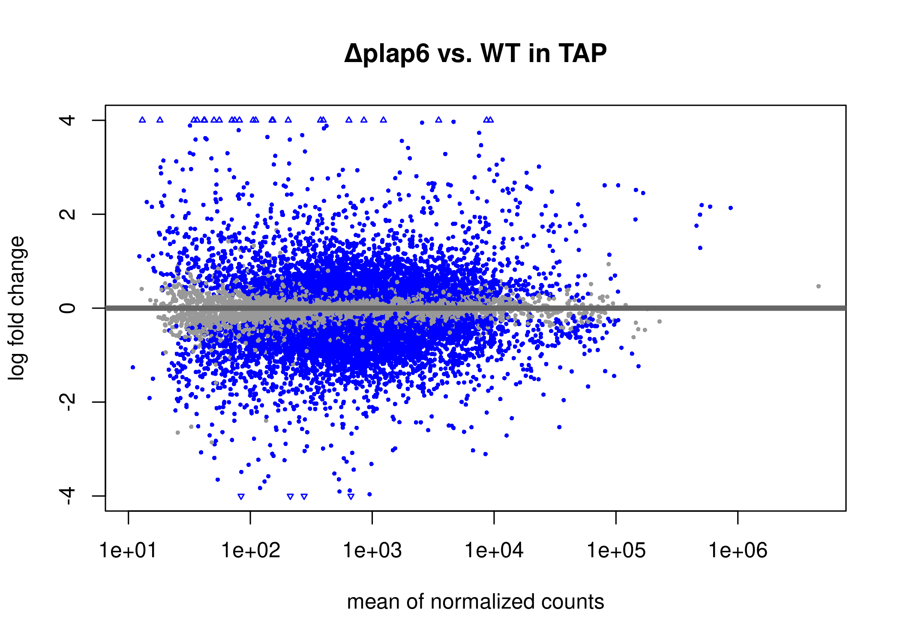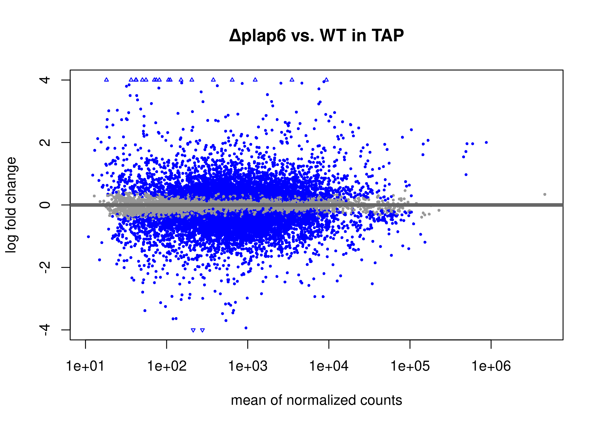

# 2.) Data Dive

## Get gen names

    # Load data
    COQ3 <- "Cre10.g423750"
    PHO1 <- "Cre08.g359300"

    # search genes
    anno[str_detect(anno[["geneSymbol"]],"COQ3"),1:9] %>% head() %>% kable() %>% kable_styling("striped", full_width = T) %>% scroll_box(height = "400px")

<table class="table table-striped" style="margin-left: auto; margin-right: auto;">
<thead>
<tr>
<th style="text-align:left;position: sticky; top:0; background-color: #FFFFFF;">
</th>
<th style="text-align:left;position: sticky; top:0; background-color: #FFFFFF;">
locusName\_4532
</th>
<th style="text-align:left;position: sticky; top:0; background-color: #FFFFFF;">
initial\_v6\_locus\_ID
</th>
<th style="text-align:left;position: sticky; top:0; background-color: #FFFFFF;">
action
</th>
<th style="text-align:left;position: sticky; top:0; background-color: #FFFFFF;">
Replacement\_v5.v6.\_model
</th>
<th style="text-align:left;position: sticky; top:0; background-color: #FFFFFF;">
geneSymbol
</th>
<th style="text-align:left;position: sticky; top:0; background-color: #FFFFFF;">
strainLocusId
</th>
<th style="text-align:left;position: sticky; top:0; background-color: #FFFFFF;">
PMID
</th>
<th style="text-align:left;position: sticky; top:0; background-color: #FFFFFF;">
previousIdentifiers
</th>
<th style="text-align:left;position: sticky; top:0; background-color: #FFFFFF;">
Description
</th>
</tr>
</thead>
<tbody>
<tr>
<td style="text-align:left;">
Cre10.g423750
</td>
<td style="text-align:left;">
Cre10.g423750\_4532
</td>
<td style="text-align:left;">
Cr\_10\_46047
</td>
<td style="text-align:left;">
</td>
<td style="text-align:left;">
</td>
<td style="text-align:left;">
COQ3
</td>
<td style="text-align:left;">
4532\_10\_50891
</td>
<td style="text-align:left;">
</td>
<td style="text-align:left;">
COQ3#g10480.t1#
</td>
<td style="text-align:left;">
Hexaprenyldihydroxybenzoate methyltransferase
</td>
</tr>
</tbody>
</table>

    # get only gene IDs
    anno[str_detect(anno[["geneSymbol"]],"CRY"),"gene_id"] %>% head() %>% kable() %>% kable_styling("striped", full_width = T) %>% scroll_box(height = "400px")

<table class="table table-striped" style="margin-left: auto; margin-right: auto;">
<thead>
<tr>
<th style="text-align:left;position: sticky; top:0; background-color: #FFFFFF;">
x
</th>
</tr>
</thead>
<tbody>
<tr>
<td style="text-align:left;">
Cre01.g030650
</td>
</tr>
<tr>
<td style="text-align:left;">
Cre02.g078939
</td>
</tr>
<tr>
<td style="text-align:left;">
Cre06.g278251
</td>
</tr>
<tr>
<td style="text-align:left;">
Cre06.g295200
</td>
</tr>
</tbody>
</table>

    # gene ID
    # g245450
    anno[str_detect(anno[["gene_id"]],"g245450"),1:9] %>% head() %>% kable() %>% kable_styling("striped", full_width = T) %>% scroll_box(height = "400px")

<table class="table table-striped" style="margin-left: auto; margin-right: auto;">
<thead>
<tr>
<th style="text-align:left;position: sticky; top:0; background-color: #FFFFFF;">
</th>
<th style="text-align:left;position: sticky; top:0; background-color: #FFFFFF;">
locusName\_4532
</th>
<th style="text-align:left;position: sticky; top:0; background-color: #FFFFFF;">
initial\_v6\_locus\_ID
</th>
<th style="text-align:left;position: sticky; top:0; background-color: #FFFFFF;">
action
</th>
<th style="text-align:left;position: sticky; top:0; background-color: #FFFFFF;">
Replacement\_v5.v6.\_model
</th>
<th style="text-align:left;position: sticky; top:0; background-color: #FFFFFF;">
geneSymbol
</th>
<th style="text-align:left;position: sticky; top:0; background-color: #FFFFFF;">
strainLocusId
</th>
<th style="text-align:left;position: sticky; top:0; background-color: #FFFFFF;">
PMID
</th>
<th style="text-align:left;position: sticky; top:0; background-color: #FFFFFF;">
previousIdentifiers
</th>
<th style="text-align:left;position: sticky; top:0; background-color: #FFFFFF;">
Description
</th>
</tr>
</thead>
<tbody>
<tr>
<td style="text-align:left;">
Cre05.g245450
</td>
<td style="text-align:left;">
Cre05.g245450\_4532
</td>
<td style="text-align:left;">
Cr\_05\_23506
</td>
<td style="text-align:left;">
</td>
<td style="text-align:left;">
</td>
<td style="text-align:left;">
COQ5A
</td>
<td style="text-align:left;">
4532\_05\_25995
</td>
<td style="text-align:left;">
</td>
<td style="text-align:left;">
UMM4#COQ5A#g5224.t1#
</td>
<td style="text-align:left;">
Ubiquinone/menaquinone biosynthesis methyltransferase
</td>
</tr>
</tbody>
</table>

    # More searches:
    anno[str_detect(anno[["geneSymbol"]],"ROC"),1:9] %>% head() %>% kable() %>% kable_styling("striped", full_width = T) %>% scroll_box(height = "400px")

<table class="table table-striped" style="margin-left: auto; margin-right: auto;">
<thead>
<tr>
<th style="text-align:left;position: sticky; top:0; background-color: #FFFFFF;">
</th>
<th style="text-align:left;position: sticky; top:0; background-color: #FFFFFF;">
locusName\_4532
</th>
<th style="text-align:left;position: sticky; top:0; background-color: #FFFFFF;">
initial\_v6\_locus\_ID
</th>
<th style="text-align:left;position: sticky; top:0; background-color: #FFFFFF;">
action
</th>
<th style="text-align:left;position: sticky; top:0; background-color: #FFFFFF;">
Replacement\_v5.v6.\_model
</th>
<th style="text-align:left;position: sticky; top:0; background-color: #FFFFFF;">
geneSymbol
</th>
<th style="text-align:left;position: sticky; top:0; background-color: #FFFFFF;">
strainLocusId
</th>
<th style="text-align:left;position: sticky; top:0; background-color: #FFFFFF;">
PMID
</th>
<th style="text-align:left;position: sticky; top:0; background-color: #FFFFFF;">
previousIdentifiers
</th>
<th style="text-align:left;position: sticky; top:0; background-color: #FFFFFF;">
Description
</th>
</tr>
</thead>
<tbody>
<tr>
<td style="text-align:left;">
Cre02.g083750
</td>
<td style="text-align:left;">
Cre02.g083750\_4532
</td>
<td style="text-align:left;">
Cr\_02\_07241
</td>
<td style="text-align:left;">
</td>
<td style="text-align:left;">
</td>
<td style="text-align:left;">
ROC75
</td>
<td style="text-align:left;">
4532\_02\_07991
</td>
<td style="text-align:left;">
18334618#32555650
</td>
<td style="text-align:left;">
ROC75#g1542.t2
</td>
<td style="text-align:left;">
Rhythm Of Chloroplast 75
</td>
</tr>
<tr>
<td style="text-align:left;">
Cre02.g095900
</td>
<td style="text-align:left;">
Cre02.g095900\_4532
</td>
<td style="text-align:left;">
Cr\_02\_08481
</td>
<td style="text-align:left;">
</td>
<td style="text-align:left;">
</td>
<td style="text-align:left;">
ROC114
</td>
<td style="text-align:left;">
4532\_02\_09366
</td>
<td style="text-align:left;">
18334618#23898163
</td>
<td style="text-align:left;">
ROC108#ROC114#g1947.t1
</td>
<td style="text-align:left;">
Rhythm Of Chloroplast 114
</td>
</tr>
<tr>
<td style="text-align:left;">
Cre06.g275350
</td>
<td style="text-align:left;">
Cre06.g275350\_4532
</td>
<td style="text-align:left;">
Cr\_06\_27878
</td>
<td style="text-align:left;">
</td>
<td style="text-align:left;">
</td>
<td style="text-align:left;">
ROC40
</td>
<td style="text-align:left;">
4532\_06\_30821
</td>
<td style="text-align:left;">
18334618#26920093
</td>
<td style="text-align:left;">
ROC40#g6174.t1
</td>
<td style="text-align:left;">
Rhythm Of Chloroplast 40
</td>
</tr>
<tr>
<td style="text-align:left;">
Cre06.g278200
</td>
<td style="text-align:left;">
Cre06.g278200\_4532
</td>
<td style="text-align:left;">
Cr\_06\_29242
</td>
<td style="text-align:left;">
</td>
<td style="text-align:left;">
</td>
<td style="text-align:left;">
ROC66
</td>
<td style="text-align:left;">
4532\_06\_32316
</td>
<td style="text-align:left;">
18334618
</td>
<td style="text-align:left;">
ROC66#g6470.t1
</td>
<td style="text-align:left;">
Rhythm Of Chloroplast 66
</td>
</tr>
<tr>
<td style="text-align:left;">
Cre09.g410450
</td>
<td style="text-align:left;">
Cre09.g410450\_4532
</td>
<td style="text-align:left;">
Cr\_09\_44703
</td>
<td style="text-align:left;">
</td>
<td style="text-align:left;">
</td>
<td style="text-align:left;">
ROC15
</td>
<td style="text-align:left;">
4532\_09\_49415
</td>
<td style="text-align:left;">
18334618#23898163
</td>
<td style="text-align:left;">
ROC74#g10169.t1
</td>
<td style="text-align:left;">
Rhythm Of Chloroplast 15
</td>
</tr>
<tr>
<td style="text-align:left;">
Cre10.g425050
</td>
<td style="text-align:left;">
Cre10.g425050\_4532
</td>
<td style="text-align:left;">
Cr\_10\_46166
</td>
<td style="text-align:left;">
</td>
<td style="text-align:left;">
</td>
<td style="text-align:left;">
ROC59
</td>
<td style="text-align:left;">
4532\_10\_51020
</td>
<td style="text-align:left;">
32555650
</td>
<td style="text-align:left;">
ROC28#g10507.t1#ROC59
</td>
<td style="text-align:left;">
Rhythm Of Chloroplast 59
</td>
</tr>
</tbody>
</table>

    anno[str_detect(anno[["prev.symbols"]],"CRY"),1:9] %>% head() %>% kable() %>% kable_styling("striped", full_width = T) %>% scroll_box(height = "400px")

<table class="table table-striped" style="margin-left: auto; margin-right: auto;">
<thead>
<tr>
<th style="text-align:left;position: sticky; top:0; background-color: #FFFFFF;">
</th>
<th style="text-align:left;position: sticky; top:0; background-color: #FFFFFF;">
locusName\_4532
</th>
<th style="text-align:left;position: sticky; top:0; background-color: #FFFFFF;">
initial\_v6\_locus\_ID
</th>
<th style="text-align:left;position: sticky; top:0; background-color: #FFFFFF;">
action
</th>
<th style="text-align:left;position: sticky; top:0; background-color: #FFFFFF;">
Replacement\_v5.v6.\_model
</th>
<th style="text-align:left;position: sticky; top:0; background-color: #FFFFFF;">
geneSymbol
</th>
<th style="text-align:left;position: sticky; top:0; background-color: #FFFFFF;">
strainLocusId
</th>
<th style="text-align:left;position: sticky; top:0; background-color: #FFFFFF;">
PMID
</th>
<th style="text-align:left;position: sticky; top:0; background-color: #FFFFFF;">
previousIdentifiers
</th>
<th style="text-align:left;position: sticky; top:0; background-color: #FFFFFF;">
Description
</th>
</tr>
</thead>
<tbody>
<tr>
<td style="text-align:left;">
Cre01.g030650
</td>
<td style="text-align:left;">
Cre01.g030650\_4532
</td>
<td style="text-align:left;">
Cr\_01\_03270
</td>
<td style="text-align:left;">
</td>
<td style="text-align:left;">
</td>
<td style="text-align:left;">
DCRY2
</td>
<td style="text-align:left;">
4532\_01\_03610
</td>
<td style="text-align:left;">
12535521# 1617454
</td>
<td style="text-align:left;">
PHR5#CRY-DASH2#g694.t1
</td>
<td style="text-align:left;">
DASH-type Cryptochrome 2
</td>
</tr>
<tr>
<td style="text-align:left;">
Cre02.g078939
</td>
<td style="text-align:left;">
Cre02.g078939\_4532
</td>
<td style="text-align:left;">
Cr\_02\_06774
</td>
<td style="text-align:left;">
</td>
<td style="text-align:left;">
</td>
<td style="text-align:left;">
DCRY1
</td>
<td style="text-align:left;">
4532\_02\_07480
</td>
<td style="text-align:left;">
</td>
<td style="text-align:left;">
CRY-DASH1#Cre64.g793000.t1.2#Cre64.g793000.t1.1#g1436.t1
</td>
<td style="text-align:left;">
DASH-type Cryptochrome 1
</td>
</tr>
<tr>
<td style="text-align:left;">
Cre06.g278251
</td>
<td style="text-align:left;">
Cre06.g278251\_4532
</td>
<td style="text-align:left;">
Cr\_06\_28988
</td>
<td style="text-align:left;">
</td>
<td style="text-align:left;">
</td>
<td style="text-align:left;">
ACRY1
</td>
<td style="text-align:left;">
4532\_06\_32035
</td>
<td style="text-align:left;">
</td>
<td style="text-align:left;">
aCRY#Cre13.g600850.t1.1#g6392.t1
</td>
<td style="text-align:left;">
Animal-like Cryptochrome
</td>
</tr>
<tr>
<td style="text-align:left;">
Cre06.g295200
</td>
<td style="text-align:left;">
Cre06.g295200\_4532
</td>
<td style="text-align:left;">
Cr\_06\_31035
</td>
<td style="text-align:left;">
</td>
<td style="text-align:left;">
</td>
<td style="text-align:left;">
PCRY1
</td>
<td style="text-align:left;">
4532\_06\_34296
</td>
<td style="text-align:left;">
7632915# 15064387
</td>
<td style="text-align:left;">
CPH1#pCRY#g6833.t1#
</td>
<td style="text-align:left;">
Plant-like Cryptochrome photoreceptor
</td>
</tr>
</tbody>
</table>

    anno[str_detect(anno[["Description"]],paste(c('Opsin', 'opsin','photoreceptor'), collapse="|")),1:9] %>% head() %>% kable() %>% kable_styling("striped", full_width = T) %>% scroll_box(height = "400px")

<table class="table table-striped" style="margin-left: auto; margin-right: auto;">
<thead>
<tr>
<th style="text-align:left;position: sticky; top:0; background-color: #FFFFFF;">
</th>
<th style="text-align:left;position: sticky; top:0; background-color: #FFFFFF;">
locusName\_4532
</th>
<th style="text-align:left;position: sticky; top:0; background-color: #FFFFFF;">
initial\_v6\_locus\_ID
</th>
<th style="text-align:left;position: sticky; top:0; background-color: #FFFFFF;">
action
</th>
<th style="text-align:left;position: sticky; top:0; background-color: #FFFFFF;">
Replacement\_v5.v6.\_model
</th>
<th style="text-align:left;position: sticky; top:0; background-color: #FFFFFF;">
geneSymbol
</th>
<th style="text-align:left;position: sticky; top:0; background-color: #FFFFFF;">
strainLocusId
</th>
<th style="text-align:left;position: sticky; top:0; background-color: #FFFFFF;">
PMID
</th>
<th style="text-align:left;position: sticky; top:0; background-color: #FFFFFF;">
previousIdentifiers
</th>
<th style="text-align:left;position: sticky; top:0; background-color: #FFFFFF;">
Description
</th>
</tr>
</thead>
<tbody>
<tr>
<td style="text-align:left;">
Cre01.g002500
</td>
<td style="text-align:left;">
Cre01.g002500\_4532
</td>
<td style="text-align:left;">
Cr\_01\_00253
</td>
<td style="text-align:left;">
</td>
<td style="text-align:left;">
</td>
<td style="text-align:left;">
COP21
</td>
<td style="text-align:left;">
4532\_01\_00280
</td>
<td style="text-align:left;">
8846778#28978758
</td>
<td style="text-align:left;">
COP2#COP1#g60.t1
</td>
<td style="text-align:left;">
Chlamyopsin 2/1
</td>
</tr>
<tr>
<td style="text-align:left;">
Cre01.g038050
</td>
<td style="text-align:left;">
Cre01.g038050\_4532
</td>
<td style="text-align:left;">
Cr\_01\_04014
</td>
<td style="text-align:left;">
</td>
<td style="text-align:left;">
</td>
<td style="text-align:left;">
HKR3
</td>
<td style="text-align:left;">
4532\_01\_04425
</td>
<td style="text-align:left;">
23027869#15143209
</td>
<td style="text-align:left;">
COP7#COP#g852.t1
</td>
<td style="text-align:left;">
Histidine kinase rhodopsin 3
</td>
</tr>
<tr>
<td style="text-align:left;">
Cre02.g074150
</td>
<td style="text-align:left;">
Cre02.g074150\_4532
</td>
<td style="text-align:left;">
Cr\_02\_06164
</td>
<td style="text-align:left;">
</td>
<td style="text-align:left;">
</td>
<td style="text-align:left;">
HKR1
</td>
<td style="text-align:left;">
4532\_02\_06801
</td>
<td style="text-align:left;">
23027869#15143209
</td>
<td style="text-align:left;">
COP5#g1315.t2
</td>
<td style="text-align:left;">
Histidine kinase rhodopsin 1
</td>
</tr>
<tr>
<td style="text-align:left;">
Cre02.g085257
</td>
<td style="text-align:left;">
Cre02.g085257\_4532
</td>
<td style="text-align:left;">
Cr\_02\_07395
</td>
<td style="text-align:left;">
</td>
<td style="text-align:left;">
</td>
<td style="text-align:left;">
CHR2
</td>
<td style="text-align:left;">
4532\_02\_08161
</td>
<td style="text-align:left;">
14615590#27694882
</td>
<td style="text-align:left;">
COP4#CSOB#g1575.t1
</td>
<td style="text-align:left;">
Channelrhodopsin 2
</td>
</tr>
<tr>
<td style="text-align:left;">
Cre06.g295200
</td>
<td style="text-align:left;">
Cre06.g295200\_4532
</td>
<td style="text-align:left;">
Cr\_06\_31035
</td>
<td style="text-align:left;">
</td>
<td style="text-align:left;">
</td>
<td style="text-align:left;">
PCRY1
</td>
<td style="text-align:left;">
4532\_06\_34296
</td>
<td style="text-align:left;">
7632915# 15064387
</td>
<td style="text-align:left;">
CPH1#pCRY#g6833.t1#
</td>
<td style="text-align:left;">
Plant-like Cryptochrome photoreceptor
</td>
</tr>
<tr>
<td style="text-align:left;">
Cre07.g329900
</td>
<td style="text-align:left;">
Cre07.g329900\_4532
</td>
<td style="text-align:left;">
Cr\_07\_34704
</td>
<td style="text-align:left;">
</td>
<td style="text-align:left;">
</td>
<td style="text-align:left;">
HKR4
</td>
<td style="text-align:left;">
4532\_07\_38341
</td>
<td style="text-align:left;">
23027869#15143209
</td>
<td style="text-align:left;">
COP8#g7678.t1#COP
</td>
<td style="text-align:left;">
Histidine kinase rhodopsin 4
</td>
</tr>
</tbody>
</table>

    anno[str_detect(anno[["Comments"]],paste(c('phototaxis'), collapse="|")),1:9] %>% head() %>% kable() %>% kable_styling("striped", full_width = T) %>% scroll_box(height = "400px")

<table class="table table-striped" style="margin-left: auto; margin-right: auto;">
<thead>
<tr>
<th style="text-align:left;position: sticky; top:0; background-color: #FFFFFF;">
</th>
<th style="text-align:left;position: sticky; top:0; background-color: #FFFFFF;">
locusName\_4532
</th>
<th style="text-align:left;position: sticky; top:0; background-color: #FFFFFF;">
initial\_v6\_locus\_ID
</th>
<th style="text-align:left;position: sticky; top:0; background-color: #FFFFFF;">
action
</th>
<th style="text-align:left;position: sticky; top:0; background-color: #FFFFFF;">
Replacement\_v5.v6.\_model
</th>
<th style="text-align:left;position: sticky; top:0; background-color: #FFFFFF;">
geneSymbol
</th>
<th style="text-align:left;position: sticky; top:0; background-color: #FFFFFF;">
strainLocusId
</th>
<th style="text-align:left;position: sticky; top:0; background-color: #FFFFFF;">
PMID
</th>
<th style="text-align:left;position: sticky; top:0; background-color: #FFFFFF;">
previousIdentifiers
</th>
<th style="text-align:left;position: sticky; top:0; background-color: #FFFFFF;">
Description
</th>
</tr>
</thead>
<tbody>
<tr>
<td style="text-align:left;">
Cre02.g083700
</td>
<td style="text-align:left;">
Cre02.g083700\_4532
</td>
<td style="text-align:left;">
Cr\_02\_07237\_EX
</td>
<td style="text-align:left;">
</td>
<td style="text-align:left;">
</td>
<td style="text-align:left;">
LSP1
</td>
<td style="text-align:left;">
4532\_02\_07985\_EX
</td>
<td style="text-align:left;">
</td>
<td style="text-align:left;">
g1541.t1#LSP1
</td>
<td style="text-align:left;">
Signal transducer for phototaxis
</td>
</tr>
<tr>
<td style="text-align:left;">
Cre02.g085257
</td>
<td style="text-align:left;">
Cre02.g085257\_4532
</td>
<td style="text-align:left;">
Cr\_02\_07395
</td>
<td style="text-align:left;">
</td>
<td style="text-align:left;">
</td>
<td style="text-align:left;">
CHR2
</td>
<td style="text-align:left;">
4532\_02\_08161
</td>
<td style="text-align:left;">
14615590#27694882
</td>
<td style="text-align:left;">
COP4#CSOB#g1575.t1
</td>
<td style="text-align:left;">
Channelrhodopsin 2
</td>
</tr>
<tr>
<td style="text-align:left;">
Cre03.g188450
</td>
<td style="text-align:left;">
Cre03.g188450\_4532
</td>
<td style="text-align:left;">
Cr\_03\_17625
</td>
<td style="text-align:left;">
</td>
<td style="text-align:left;">
</td>
<td style="text-align:left;">
PTX2
</td>
<td style="text-align:left;">
4532\_03\_19436
</td>
<td style="text-align:left;">
</td>
<td style="text-align:left;">
PTX2#g3903.t1
</td>
<td style="text-align:left;">
Phototaxis regulator
</td>
</tr>
<tr>
<td style="text-align:left;">
Cre10.g456100
</td>
<td style="text-align:left;">
Cre10.g456100\_4532
</td>
<td style="text-align:left;">
Cr\_10\_49341
</td>
<td style="text-align:left;">
</td>
<td style="text-align:left;">
</td>
<td style="text-align:left;">
AGG3
</td>
<td style="text-align:left;">
4532\_10\_54526
</td>
<td style="text-align:left;">
16753570#15998802#28781053
</td>
<td style="text-align:left;">
POC21#FAP142#AGG3#g11191.t1
</td>
<td style="text-align:left;">
Aggregation 3
</td>
</tr>
</tbody>
</table>

    # all Chloroplast
    anno %>% filter_at(.vars = vars(Predalgo, TargetP),
                       .vars_predicate = any_vars(str_detect
                                                  (. , paste0("^(", paste("Chloroplast", collapse = "|"), ")")))) %>% head() %>% kable() %>% kable_styling("striped", full_width = T) %>% scroll_box(height = "400px")

<table class="table table-striped" style="margin-left: auto; margin-right: auto;">
<thead>
<tr>
<th style="text-align:left;position: sticky; top:0; background-color: #FFFFFF;">
</th>
<th style="text-align:left;position: sticky; top:0; background-color: #FFFFFF;">
locusName\_4532
</th>
<th style="text-align:left;position: sticky; top:0; background-color: #FFFFFF;">
initial\_v6\_locus\_ID
</th>
<th style="text-align:left;position: sticky; top:0; background-color: #FFFFFF;">
action
</th>
<th style="text-align:left;position: sticky; top:0; background-color: #FFFFFF;">
Replacement\_v5.v6.\_model
</th>
<th style="text-align:left;position: sticky; top:0; background-color: #FFFFFF;">
geneSymbol
</th>
<th style="text-align:left;position: sticky; top:0; background-color: #FFFFFF;">
strainLocusId
</th>
<th style="text-align:left;position: sticky; top:0; background-color: #FFFFFF;">
PMID
</th>
<th style="text-align:left;position: sticky; top:0; background-color: #FFFFFF;">
previousIdentifiers
</th>
<th style="text-align:left;position: sticky; top:0; background-color: #FFFFFF;">
Description
</th>
<th style="text-align:left;position: sticky; top:0; background-color: #FFFFFF;">
Comments
</th>
<th style="text-align:left;position: sticky; top:0; background-color: #FFFFFF;">
Polycistronic
</th>
<th style="text-align:left;position: sticky; top:0; background-color: #FFFFFF;">
TMHMM\_transmembrane
</th>
<th style="text-align:left;position: sticky; top:0; background-color: #FFFFFF;">
TargetP
</th>
<th style="text-align:left;position: sticky; top:0; background-color: #FFFFFF;">
Predalgo
</th>
<th style="text-align:left;position: sticky; top:0; background-color: #FFFFFF;">
interactions
</th>
<th style="text-align:left;position: sticky; top:0; background-color: #FFFFFF;">
experimental\_localization
</th>
<th style="text-align:left;position: sticky; top:0; background-color: #FFFFFF;">
CLiP\_library
</th>
<th style="text-align:left;position: sticky; top:0; background-color: #FFFFFF;">
mutant\_phenotypes
</th>
<th style="text-align:left;position: sticky; top:0; background-color: #FFFFFF;">
Plastid.ribosome\_pulldown
</th>
<th style="text-align:left;position: sticky; top:0; background-color: #FFFFFF;">
TF\_database..PMID.27067009.
</th>
<th style="text-align:left;position: sticky; top:0; background-color: #FFFFFF;">
Flagellar\_Proteome
</th>
<th style="text-align:left;position: sticky; top:0; background-color: #FFFFFF;">
Co.expression.cluster..PMID.28710131.
</th>
<th style="text-align:left;position: sticky; top:0; background-color: #FFFFFF;">
GEnome.scale.Metabolic.Model
</th>
<th style="text-align:left;position: sticky; top:0; background-color: #FFFFFF;">
gene\_id
</th>
<th style="text-align:left;position: sticky; top:0; background-color: #FFFFFF;">
previousIdentifiers\_list
</th>
<th style="text-align:left;position: sticky; top:0; background-color: #FFFFFF;">
prev.symbols
</th>
<th style="text-align:left;position: sticky; top:0; background-color: #FFFFFF;">
id.symbol
</th>
</tr>
</thead>
<tbody>
<tr>
<td style="text-align:left;">
Cre01.g000050
</td>
<td style="text-align:left;">
Cre01.g000050\_4532
</td>
<td style="text-align:left;">
Cr\_01\_00004
</td>
<td style="text-align:left;">
</td>
<td style="text-align:left;">
</td>
<td style="text-align:left;">
RWP14
</td>
<td style="text-align:left;">
4532\_01\_00005
</td>
<td style="text-align:left;">
15785851#24987011
</td>
<td style="text-align:left;">
g4.t1#RWP14
</td>
<td style="text-align:left;">
RWP-RK transcription factor
</td>
<td style="text-align:left;">
putative RWP-RK domain transcription factor, however the domain is
non-canonical (RWPaqk)
</td>
<td style="text-align:left;">
</td>
<td style="text-align:left;">
TMHMM: 0 helices
</td>
<td style="text-align:left;">
Chloroplast (RC 5 score: 0.458 on \#1 protein)
</td>
<td style="text-align:left;">
Chloroplast (score 1.646 on \#1 protein)
</td>
<td style="text-align:left;">
</td>
<td style="text-align:left;">
</td>
<td style="text-align:left;">
<https://www.chlamylibrary.org/showGene?geneIdentifier=Cre01.g000050>
</td>
<td style="text-align:left;">
no phenotype detected
</td>
<td style="text-align:left;">
</td>
<td style="text-align:left;">
bZIP transcription factor (PMID 27067009)
</td>
<td style="text-align:left;">
</td>
<td style="text-align:left;">
cluster 42
</td>
<td style="text-align:left;">
</td>
<td style="text-align:left;">
Cre01.g000050
</td>
<td style="text-align:left;">
g4.t1, RWP14
</td>
<td style="text-align:left;">
RWP14
</td>
<td style="text-align:left;">
RWP14
</td>
</tr>
<tr>
<td style="text-align:left;">
Cre01.g000150
</td>
<td style="text-align:left;">
Cre01.g000150\_4532
</td>
<td style="text-align:left;">
Cr\_01\_00012
</td>
<td style="text-align:left;">
</td>
<td style="text-align:left;">
</td>
<td style="text-align:left;">
ZRT2
</td>
<td style="text-align:left;">
4532\_01\_00015
</td>
<td style="text-align:left;">
15710683#16766055#22569643#21131558#21498682
</td>
<td style="text-align:left;">
CrZIP2#g6.t1
</td>
<td style="text-align:left;">
Zinc-nutrition responsive permease transporter
</td>
<td style="text-align:left;">
Similarity to ZIP Subfamily I# expression specific to Zn deficiency#
constitutive expression in a CRR1\_cys mutant coincident with zinc
accumulation#
</td>
<td style="text-align:left;">
</td>
<td style="text-align:left;">
TMHMM: 9 helices Topology:
o351-373i380-402o522-544i627-649o659-681i686-708o718-740i753-775o813-830i
</td>
<td style="text-align:left;">
Mitochondrion (RC 4 score: 0.741 TPlen: 39 on \#1 protein)
</td>
<td style="text-align:left;">
Chloroplast (score 0.681 on \#1 protein)
</td>
<td style="text-align:left;">
</td>
<td style="text-align:left;">
</td>
<td style="text-align:left;">
</td>
<td style="text-align:left;">
no mutant mapped
</td>
<td style="text-align:left;">
</td>
<td style="text-align:left;">
</td>
<td style="text-align:left;">
</td>
<td style="text-align:left;">
cluster 27
</td>
<td style="text-align:left;">
</td>
<td style="text-align:left;">
Cre01.g000150
</td>
<td style="text-align:left;">
CrZIP2, ….
</td>
<td style="text-align:left;">
CrZIP2
</td>
<td style="text-align:left;">
ZRT2
</td>
</tr>
<tr>
<td style="text-align:left;">
Cre01.g000800
</td>
<td style="text-align:left;">
Cre01.g000800\_4532
</td>
<td style="text-align:left;">
Cr\_01\_00071
</td>
<td style="text-align:left;">
</td>
<td style="text-align:left;">
</td>
<td style="text-align:left;">
CGL136
</td>
<td style="text-align:left;">
4532\_01\_00080
</td>
<td style="text-align:left;">
21515685
</td>
<td style="text-align:left;">
\#g19.t1
</td>
<td style="text-align:left;">
Conserved in the Green Lineage
</td>
<td style="text-align:left;">
</td>
<td style="text-align:left;">
</td>
<td style="text-align:left;">
TMHMM: 0 helices
</td>
<td style="text-align:left;">
Chloroplast (RC 1 score: 0.854 on \#1 protein)
</td>
<td style="text-align:left;">
Mitochondrion (score 1.645 on \#1 protein)
</td>
<td style="text-align:left;">
</td>
<td style="text-align:left;">
</td>
<td style="text-align:left;">
<https://www.chlamylibrary.org/showGene?geneIdentifier=Cre01.g000800>
</td>
<td style="text-align:left;">
no phenotype detected
</td>
<td style="text-align:left;">
</td>
<td style="text-align:left;">
</td>
<td style="text-align:left;">
</td>
<td style="text-align:left;">
cluster 6
</td>
<td style="text-align:left;">
</td>
<td style="text-align:left;">
Cre01.g000800
</td>
<td style="text-align:left;">
, g19.t1
</td>
<td style="text-align:left;">
</td>
<td style="text-align:left;">
CGL136
</td>
</tr>
<tr>
<td style="text-align:left;">
Cre01.g000850
</td>
<td style="text-align:left;">
Cre01.g000850\_4532
</td>
<td style="text-align:left;">
Cr\_01\_00075
</td>
<td style="text-align:left;">
</td>
<td style="text-align:left;">
</td>
<td style="text-align:left;">
CPLD38
</td>
<td style="text-align:left;">
4532\_01\_00086
</td>
<td style="text-align:left;">
23303190#29602195
</td>
<td style="text-align:left;">
g20.t1#
</td>
<td style="text-align:left;">
cytochrome b6f biogenesis protein
</td>
<td style="text-align:left;">
Conserved in the Plant Lineage and Diatoms# interacts with CPLD49 in the
thylakoid membrane
</td>
<td style="text-align:left;">
</td>
<td style="text-align:left;">
TMHMM: 2 helices Topology: i81-103o113-135i
</td>
<td style="text-align:left;">
Chloroplast (RC 3 score: 0.904 on \#1 protein)
</td>
<td style="text-align:left;">
Chloroplast (score 2.068 on \#1 protein)
</td>
<td style="text-align:left;">
</td>
<td style="text-align:left;">
</td>
<td style="text-align:left;">
<https://www.chlamylibrary.org/showGene?geneIdentifier=Cre01.g000850>
</td>
<td style="text-align:left;">
no phenotype detected
</td>
<td style="text-align:left;">
</td>
<td style="text-align:left;">
</td>
<td style="text-align:left;">
</td>
<td style="text-align:left;">
cluster 6
</td>
<td style="text-align:left;">
</td>
<td style="text-align:left;">
Cre01.g000850
</td>
<td style="text-align:left;">
g20.t1
</td>
<td style="text-align:left;">
</td>
<td style="text-align:left;">
CPLD38
</td>
</tr>
<tr>
<td style="text-align:left;">
Cre01.g000900
</td>
<td style="text-align:left;">
Cre01.g000900\_4532
</td>
<td style="text-align:left;">
Cr\_01\_00080
</td>
<td style="text-align:left;">
</td>
<td style="text-align:left;">
</td>
<td style="text-align:left;">
CPLD20
</td>
<td style="text-align:left;">
4532\_01\_00091
</td>
<td style="text-align:left;">
21515685
</td>
<td style="text-align:left;">
\#g21.t1
</td>
<td style="text-align:left;">
Conserved in the Plant Lineage and Diatoms
</td>
<td style="text-align:left;">
Predicted protein of unknown function containing DUF135 domain#
Conserved expressed protein
</td>
<td style="text-align:left;">
</td>
<td style="text-align:left;">
TMHMM: 0 helices
</td>
<td style="text-align:left;">
Mitochondrion (RC 5 score: 0.612 TPlen: 17 on \#1 protein)
</td>
<td style="text-align:left;">
Chloroplast (score 2.640 on \#1 protein)
</td>
<td style="text-align:left;">
</td>
<td style="text-align:left;">
</td>
<td style="text-align:left;">
<https://www.chlamylibrary.org/showGene?geneIdentifier=Cre01.g000900>
</td>
<td style="text-align:left;">
no phenotype detected
</td>
<td style="text-align:left;">
enriched on 30S plastid ribosomal subunit
</td>
<td style="text-align:left;">
</td>
<td style="text-align:left;">
</td>
<td style="text-align:left;">
cluster 17
</td>
<td style="text-align:left;">
</td>
<td style="text-align:left;">
Cre01.g000900
</td>
<td style="text-align:left;">
, g21.t1
</td>
<td style="text-align:left;">
</td>
<td style="text-align:left;">
CPLD20
</td>
</tr>
<tr>
<td style="text-align:left;">
Cre01.g001100
</td>
<td style="text-align:left;">
Cre01.g001100\_4532
</td>
<td style="text-align:left;">
Cr\_01\_00093
</td>
<td style="text-align:left;">
</td>
<td style="text-align:left;">
</td>
<td style="text-align:left;">
</td>
<td style="text-align:left;">
4532\_01\_00106
</td>
<td style="text-align:left;">
</td>
<td style="text-align:left;">
\#g25.t1
</td>
<td style="text-align:left;">
</td>
<td style="text-align:left;">
</td>
<td style="text-align:left;">
</td>
<td style="text-align:left;">
TMHMM: 0 helices
</td>
<td style="text-align:left;">
Chloroplast (RC 2 score: 0.880 on \#1 protein)
</td>
<td style="text-align:left;">
Other (score - on \#1 protein)
</td>
<td style="text-align:left;">
</td>
<td style="text-align:left;">
</td>
<td style="text-align:left;">
<https://www.chlamylibrary.org/showGene?geneIdentifier=Cre01.g001100>
</td>
<td style="text-align:left;">
no phenotype detected
</td>
<td style="text-align:left;">
</td>
<td style="text-align:left;">
</td>
<td style="text-align:left;">
</td>
<td style="text-align:left;">
cluster 24 (Lysin treatment-specific)
</td>
<td style="text-align:left;">
</td>
<td style="text-align:left;">
Cre01.g001100
</td>
<td style="text-align:left;">
, g25.t1
</td>
<td style="text-align:left;">
</td>
<td style="text-align:left;">
Cre01.g001100
</td>
</tr>
</tbody>
</table>

    # all Flagellar
    anno[str_detect(anno[["Flagellar_Proteome"]],"Total Peptides:"),1:9] %>% head() %>% kable() %>% kable_styling("striped", full_width = T) %>% scroll_box(height = "400px")

<table class="table table-striped" style="margin-left: auto; margin-right: auto;">
<thead>
<tr>
<th style="text-align:left;position: sticky; top:0; background-color: #FFFFFF;">
</th>
<th style="text-align:left;position: sticky; top:0; background-color: #FFFFFF;">
locusName\_4532
</th>
<th style="text-align:left;position: sticky; top:0; background-color: #FFFFFF;">
initial\_v6\_locus\_ID
</th>
<th style="text-align:left;position: sticky; top:0; background-color: #FFFFFF;">
action
</th>
<th style="text-align:left;position: sticky; top:0; background-color: #FFFFFF;">
Replacement\_v5.v6.\_model
</th>
<th style="text-align:left;position: sticky; top:0; background-color: #FFFFFF;">
geneSymbol
</th>
<th style="text-align:left;position: sticky; top:0; background-color: #FFFFFF;">
strainLocusId
</th>
<th style="text-align:left;position: sticky; top:0; background-color: #FFFFFF;">
PMID
</th>
<th style="text-align:left;position: sticky; top:0; background-color: #FFFFFF;">
previousIdentifiers
</th>
<th style="text-align:left;position: sticky; top:0; background-color: #FFFFFF;">
Description
</th>
</tr>
</thead>
<tbody>
<tr>
<td style="text-align:left;">
Cre01.g000350
</td>
<td style="text-align:left;">
Cre01.g000350\_4532
</td>
<td style="text-align:left;">
Cr\_01\_00031
</td>
<td style="text-align:left;">
</td>
<td style="text-align:left;">
</td>
<td style="text-align:left;">
</td>
<td style="text-align:left;">
4532\_01\_00036
</td>
<td style="text-align:left;">
</td>
<td style="text-align:left;">
g10.t1#OXR1
</td>
<td style="text-align:left;">
possible oxidoreductase
</td>
</tr>
<tr>
<td style="text-align:left;">
Cre01.g001150
</td>
<td style="text-align:left;">
Cre01.g001150\_4532
</td>
<td style="text-align:left;">
Cr\_01\_00098\_EX
</td>
<td style="text-align:left;">
</td>
<td style="text-align:left;">
</td>
<td style="text-align:left;">
</td>
<td style="text-align:left;">
4532\_01\_00111\_EX
</td>
<td style="text-align:left;">
</td>
<td style="text-align:left;">
g26.t1
</td>
<td style="text-align:left;">
</td>
</tr>
<tr>
<td style="text-align:left;">
Cre01.g001800
</td>
<td style="text-align:left;">
Cre01.g001800\_4532
</td>
<td style="text-align:left;">
Cr\_01\_00180
</td>
<td style="text-align:left;">
</td>
<td style="text-align:left;">
</td>
<td style="text-align:left;">
FAP403
</td>
<td style="text-align:left;">
4532\_01\_00201
</td>
<td style="text-align:left;">
</td>
<td style="text-align:left;">
g44.t1#MLCK1
</td>
<td style="text-align:left;">
Flagellar Associated Protein 403
</td>
</tr>
<tr>
<td style="text-align:left;">
Cre01.g002300
</td>
<td style="text-align:left;">
Cre01.g002300\_4532
</td>
<td style="text-align:left;">
Cr\_01\_00239
</td>
<td style="text-align:left;">
</td>
<td style="text-align:left;">
</td>
<td style="text-align:left;">
CYN19B
</td>
<td style="text-align:left;">
4532\_01\_00266
</td>
<td style="text-align:left;">
15051864#15047905#10527429#15998802
</td>
<td style="text-align:left;">
CYN19-2#ROC1#CYN4#g56.t1#
</td>
<td style="text-align:left;">
Cyclophilin 19-2
</td>
</tr>
<tr>
<td style="text-align:left;">
Cre01.g002550
</td>
<td style="text-align:left;">
Cre01.g002550\_4532
</td>
<td style="text-align:left;">
Cr\_01\_00258
</td>
<td style="text-align:left;">
</td>
<td style="text-align:left;">
</td>
<td style="text-align:left;">
FAP335
</td>
<td style="text-align:left;">
4532\_01\_00285
</td>
<td style="text-align:left;">
</td>
<td style="text-align:left;">
g61.t1
</td>
<td style="text-align:left;">
Kinase-like Flagellar Associated Protein 335
</td>
</tr>
<tr>
<td style="text-align:left;">
Cre01.g003050
</td>
<td style="text-align:left;">
Cre01.g003050\_4532
</td>
<td style="text-align:left;">
Cr\_01\_00301
</td>
<td style="text-align:left;">
</td>
<td style="text-align:left;">
</td>
<td style="text-align:left;">
SEC8
</td>
<td style="text-align:left;">
4532\_01\_00336
</td>
<td style="text-align:left;">
</td>
<td style="text-align:left;">
\#g72.t1
</td>
<td style="text-align:left;">
Component of the Exocyst Complex
</td>
</tr>
</tbody>
</table>

    # all transmembrane with 7 helices
    anno[str_detect(anno[["TMHMM_transmembrane"]],"TMHMM: 7 helices"),1:9] %>% head() %>% kable() %>% kable_styling("striped", full_width = T) %>% scroll_box(height = "400px")

<table class="table table-striped" style="margin-left: auto; margin-right: auto;">
<thead>
<tr>
<th style="text-align:left;position: sticky; top:0; background-color: #FFFFFF;">
</th>
<th style="text-align:left;position: sticky; top:0; background-color: #FFFFFF;">
locusName\_4532
</th>
<th style="text-align:left;position: sticky; top:0; background-color: #FFFFFF;">
initial\_v6\_locus\_ID
</th>
<th style="text-align:left;position: sticky; top:0; background-color: #FFFFFF;">
action
</th>
<th style="text-align:left;position: sticky; top:0; background-color: #FFFFFF;">
Replacement\_v5.v6.\_model
</th>
<th style="text-align:left;position: sticky; top:0; background-color: #FFFFFF;">
geneSymbol
</th>
<th style="text-align:left;position: sticky; top:0; background-color: #FFFFFF;">
strainLocusId
</th>
<th style="text-align:left;position: sticky; top:0; background-color: #FFFFFF;">
PMID
</th>
<th style="text-align:left;position: sticky; top:0; background-color: #FFFFFF;">
previousIdentifiers
</th>
<th style="text-align:left;position: sticky; top:0; background-color: #FFFFFF;">
Description
</th>
</tr>
</thead>
<tbody>
<tr>
<td style="text-align:left;">
Cre01.g000250
</td>
<td style="text-align:left;">
Cre01.g000250\_4532
</td>
<td style="text-align:left;">
Cr\_01\_00021
</td>
<td style="text-align:left;">
</td>
<td style="text-align:left;">
</td>
<td style="text-align:left;">
</td>
<td style="text-align:left;">
4532\_01\_00026
</td>
<td style="text-align:left;">
</td>
<td style="text-align:left;">
SNR1#g8.t1#
</td>
<td style="text-align:left;">
Predicted SNARE-associated Golgi protein
</td>
</tr>
<tr>
<td style="text-align:left;">
Cre01.g026700
</td>
<td style="text-align:left;">
Cre01.g026700\_4532
</td>
<td style="text-align:left;">
Cr\_01\_02874
</td>
<td style="text-align:left;">
</td>
<td style="text-align:left;">
</td>
<td style="text-align:left;">
</td>
<td style="text-align:left;">
4532\_01\_03176
</td>
<td style="text-align:left;">
29743196
</td>
<td style="text-align:left;">
g612.t1
</td>
<td style="text-align:left;">
</td>
</tr>
<tr>
<td style="text-align:left;">
Cre01.g026750
</td>
<td style="text-align:left;">
Cre01.g026750\_4532
</td>
<td style="text-align:left;">
Cr\_01\_02878
</td>
<td style="text-align:left;">
</td>
<td style="text-align:left;">
</td>
<td style="text-align:left;">
</td>
<td style="text-align:left;">
4532\_01\_03180
</td>
<td style="text-align:left;">
</td>
<td style="text-align:left;">
g613.t1
</td>
<td style="text-align:left;">
</td>
</tr>
<tr>
<td style="text-align:left;">
Cre01.g029900
</td>
<td style="text-align:left;">
Cre01.g029900\_4532
</td>
<td style="text-align:left;">
Cr\_01\_03191
</td>
<td style="text-align:left;">
</td>
<td style="text-align:left;">
</td>
<td style="text-align:left;">
</td>
<td style="text-align:left;">
4532\_01\_03521
</td>
<td style="text-align:left;">
</td>
<td style="text-align:left;">
\#g679.t1
</td>
<td style="text-align:left;">
</td>
</tr>
<tr>
<td style="text-align:left;">
Cre01.g031800
</td>
<td style="text-align:left;">
Cre01.g031800\_4532
</td>
<td style="text-align:left;">
Cr\_01\_03379
</td>
<td style="text-align:left;">
</td>
<td style="text-align:left;">
</td>
<td style="text-align:left;">
</td>
<td style="text-align:left;">
4532\_01\_03731
</td>
<td style="text-align:left;">
</td>
<td style="text-align:left;">
g719.t1
</td>
<td style="text-align:left;">
</td>
</tr>
<tr>
<td style="text-align:left;">
Cre01.g035450
</td>
<td style="text-align:left;">
Cre01.g035450\_4532
</td>
<td style="text-align:left;">
Cr\_01\_03765
</td>
<td style="text-align:left;">
</td>
<td style="text-align:left;">
</td>
<td style="text-align:left;">
</td>
<td style="text-align:left;">
4532\_01\_04156
</td>
<td style="text-align:left;">
</td>
<td style="text-align:left;">
\#g799.t1
</td>
<td style="text-align:left;">
</td>
</tr>
</tbody>
</table>

    # fibrillin related
    coqs <- anno[str_detect(anno[["geneSymbol"]],"COQ"),]
    anno[str_detect(anno[["Comments"]],paste(c('Coenzyme Q'), collapse="|")),1:9] %>% head() %>% kable() %>% kable_styling("striped", full_width = T) %>% scroll_box(height = "400px")

<table class="table table-striped" style="margin-left: auto; margin-right: auto;">
<thead>
<tr>
<th style="text-align:left;position: sticky; top:0; background-color: #FFFFFF;">
</th>
<th style="text-align:left;position: sticky; top:0; background-color: #FFFFFF;">
locusName\_4532
</th>
<th style="text-align:left;position: sticky; top:0; background-color: #FFFFFF;">
initial\_v6\_locus\_ID
</th>
<th style="text-align:left;position: sticky; top:0; background-color: #FFFFFF;">
action
</th>
<th style="text-align:left;position: sticky; top:0; background-color: #FFFFFF;">
Replacement\_v5.v6.\_model
</th>
<th style="text-align:left;position: sticky; top:0; background-color: #FFFFFF;">
geneSymbol
</th>
<th style="text-align:left;position: sticky; top:0; background-color: #FFFFFF;">
strainLocusId
</th>
<th style="text-align:left;position: sticky; top:0; background-color: #FFFFFF;">
PMID
</th>
<th style="text-align:left;position: sticky; top:0; background-color: #FFFFFF;">
previousIdentifiers
</th>
<th style="text-align:left;position: sticky; top:0; background-color: #FFFFFF;">
Description
</th>
</tr>
</thead>
<tbody>
<tr>
<td style="text-align:left;">
Cre07.g345700
</td>
<td style="text-align:left;">
Cre07.g345700\_4532
</td>
<td style="text-align:left;">
Cr\_07\_36374
</td>
<td style="text-align:left;">
</td>
<td style="text-align:left;">
</td>
<td style="text-align:left;">
COQ10
</td>
<td style="text-align:left;">
4532\_07\_40190
</td>
<td style="text-align:left;">
</td>
<td style="text-align:left;">
\#COQ10#g8044.t1
</td>
<td style="text-align:left;">
Coenzyme Q-binding protein
</td>
</tr>
<tr>
<td style="text-align:left;">
Cre10.g423750
</td>
<td style="text-align:left;">
Cre10.g423750\_4532
</td>
<td style="text-align:left;">
Cr\_10\_46047
</td>
<td style="text-align:left;">
</td>
<td style="text-align:left;">
</td>
<td style="text-align:left;">
COQ3
</td>
<td style="text-align:left;">
4532\_10\_50891
</td>
<td style="text-align:left;">
</td>
<td style="text-align:left;">
COQ3#g10480.t1#
</td>
<td style="text-align:left;">
Hexaprenyldihydroxybenzoate methyltransferase
</td>
</tr>
</tbody>
</table>

    goi <- anno[c(PHO1,coqs[,"gene_id"]),]

### Genes Yousef

    #
    tocopherol <- c("Cre09.g414000", "Cre01.g013801", "Cre14.g624350", "Cre09.g393400")
    plastoquinone <- c("Cre09.g398993", "Cre06.g283750", "Cre14.g625450", "Cre12.g503550")
    phylloquinone <- c("Cre10.g455950", "Cre16.g671000", "Cre04.g219787", "Cre09.g416500")
    goi_y <- c(tocopherol,plastoquinone, phylloquinone)
    goi_y

    ##  [1] "Cre09.g414000" "Cre01.g013801" "Cre14.g624350" "Cre09.g393400"
    ##  [5] "Cre09.g398993" "Cre06.g283750" "Cre14.g625450" "Cre12.g503550"
    ##  [9] "Cre10.g455950" "Cre16.g671000" "Cre04.g219787" "Cre09.g416500"

## Plot Counts

### Examples

    head(mcols(dds)$symbol)

    ## [1] "RWP14" NA      "ZRT2"  NA      NA      "CGI58"

    anno[str_detect(anno[["geneSymbol"]],"CRY-DASH"),]

    ##  [1] locusName_4532                        initial_v6_locus_ID                  
    ##  [3] action                                Replacement_v5.v6._model             
    ##  [5] geneSymbol                            strainLocusId                        
    ##  [7] PMID                                  previousIdentifiers                  
    ##  [9] Description                           Comments                             
    ## [11] Polycistronic                         TMHMM_transmembrane                  
    ## [13] TargetP                               Predalgo                             
    ## [15] interactions                          experimental_localization            
    ## [17] CLiP_library                          mutant_phenotypes                    
    ## [19] Plastid.ribosome_pulldown             TF_database..PMID.27067009.          
    ## [21] Flagellar_Proteome                    Co.expression.cluster..PMID.28710131.
    ## [23] GEnome.scale.Metabolic.Model          gene_id                              
    ## [25] previousIdentifiers_list              prev.symbols                         
    ## [27] id.symbol                            
    ## <0 Zeilen> (oder row.names mit Länge 0)

    # no hit
    g <- anno[str_detect(anno[["previousIdentifiers"]],"CRY-DASH1"),"gene_id"]
    g

    ## [1] "Cre02.g078939"

    plotCounts(dds, gene = g, intgroup = "condition")

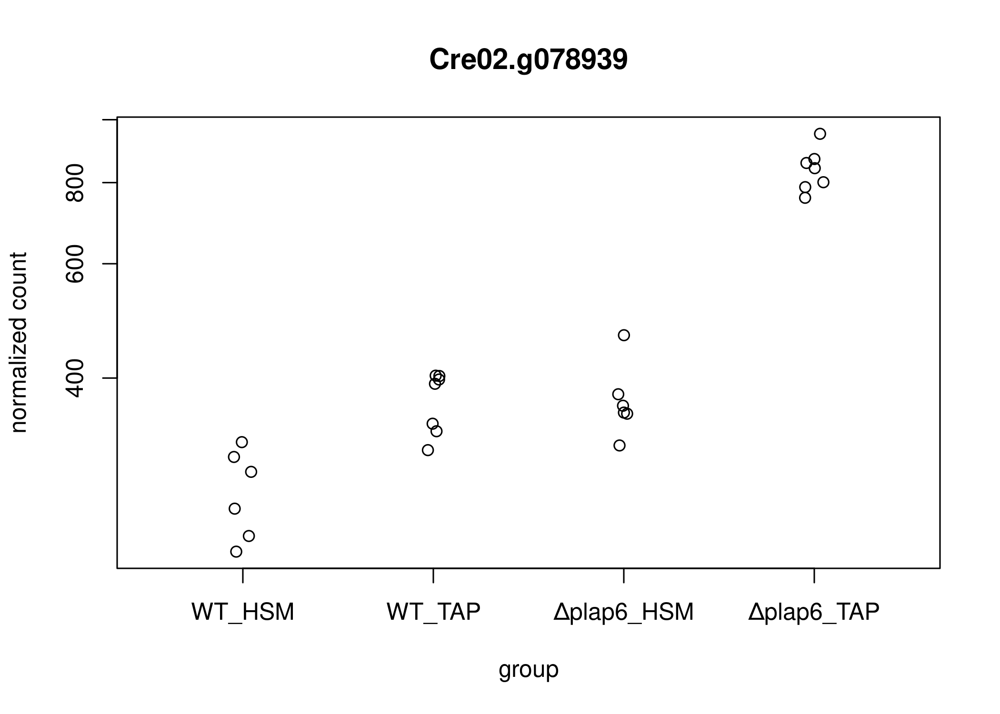

    g <- anno[str_detect(anno[["geneSymbol"]],"PCRY"),"gene_id"]
    plotCounts(dds, gene = g, intgroup = "condition", col=colData(dds)$genotype, main =anno[g,"geneSymbol"])

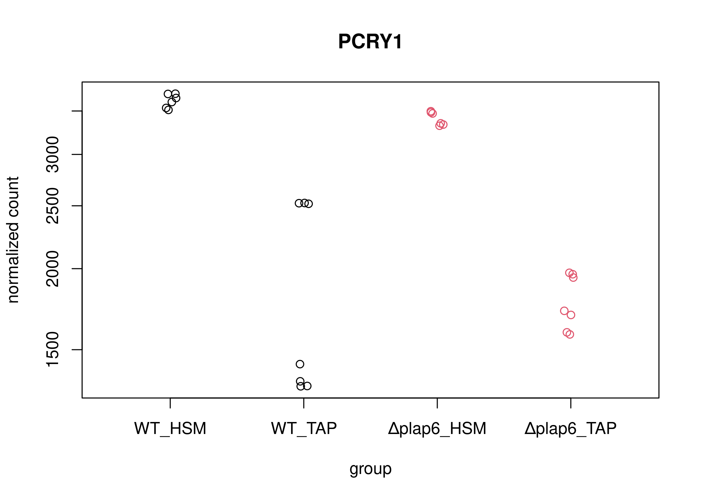

    g <- anno[str_detect(anno[["geneSymbol"]],"ACRY"),"gene_id"]
    plotCounts(dds, gene = g, intgroup = "condition", col=colData(dds)$genotype, main =anno[g,"geneSymbol"])

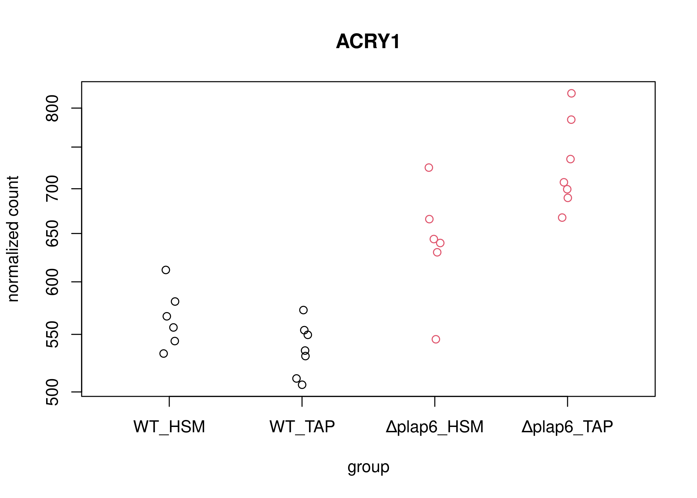

    g <- anno[str_detect(anno[["geneSymbol"]],"ROC15"),"gene_id"]
    plotCounts(dds, gene = g, intgroup = "condition", col=colData(dds)$genotype, main =anno[g,"geneSymbol"])

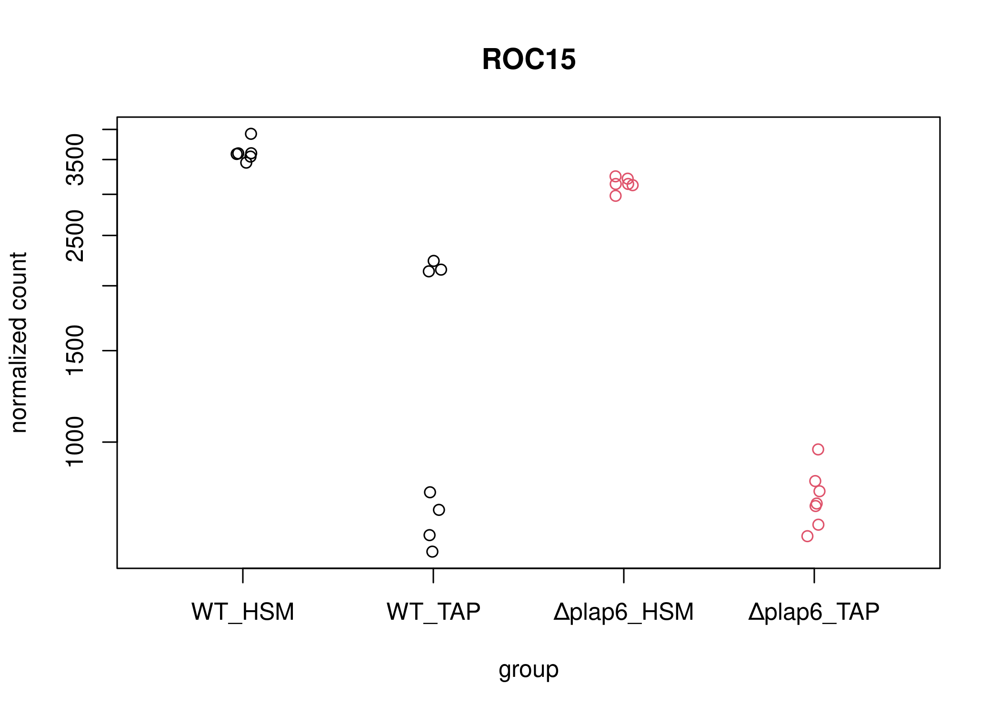

    g <- anno[str_detect(anno[["geneSymbol"]],"ROC40"),"gene_id"]
    plotCounts(dds, gene = g, intgroup = "condition", col=colData(dds)$genotype, main =anno[g,"geneSymbol"])

    # search genes
    anno[str_detect(anno[["geneSymbol"]],"CRY"),1:9] %>% head() %>% kable() %>% kable_styling("striped", full_width = T) %>% scroll_box(height = "400px")

<table class="table table-striped" style="margin-left: auto; margin-right: auto;">
<thead>
<tr>
<th style="text-align:left;position: sticky; top:0; background-color: #FFFFFF;">
</th>
<th style="text-align:left;position: sticky; top:0; background-color: #FFFFFF;">
locusName\_4532
</th>
<th style="text-align:left;position: sticky; top:0; background-color: #FFFFFF;">
initial\_v6\_locus\_ID
</th>
<th style="text-align:left;position: sticky; top:0; background-color: #FFFFFF;">
action
</th>
<th style="text-align:left;position: sticky; top:0; background-color: #FFFFFF;">
Replacement\_v5.v6.\_model
</th>
<th style="text-align:left;position: sticky; top:0; background-color: #FFFFFF;">
geneSymbol
</th>
<th style="text-align:left;position: sticky; top:0; background-color: #FFFFFF;">
strainLocusId
</th>
<th style="text-align:left;position: sticky; top:0; background-color: #FFFFFF;">
PMID
</th>
<th style="text-align:left;position: sticky; top:0; background-color: #FFFFFF;">
previousIdentifiers
</th>
<th style="text-align:left;position: sticky; top:0; background-color: #FFFFFF;">
Description
</th>
</tr>
</thead>
<tbody>
<tr>
<td style="text-align:left;">
Cre01.g030650
</td>
<td style="text-align:left;">
Cre01.g030650\_4532
</td>
<td style="text-align:left;">
Cr\_01\_03270
</td>
<td style="text-align:left;">
</td>
<td style="text-align:left;">
</td>
<td style="text-align:left;">
DCRY2
</td>
<td style="text-align:left;">
4532\_01\_03610
</td>
<td style="text-align:left;">
12535521# 1617454
</td>
<td style="text-align:left;">
PHR5#CRY-DASH2#g694.t1
</td>
<td style="text-align:left;">
DASH-type Cryptochrome 2
</td>
</tr>
<tr>
<td style="text-align:left;">
Cre02.g078939
</td>
<td style="text-align:left;">
Cre02.g078939\_4532
</td>
<td style="text-align:left;">
Cr\_02\_06774
</td>
<td style="text-align:left;">
</td>
<td style="text-align:left;">
</td>
<td style="text-align:left;">
DCRY1
</td>
<td style="text-align:left;">
4532\_02\_07480
</td>
<td style="text-align:left;">
</td>
<td style="text-align:left;">
CRY-DASH1#Cre64.g793000.t1.2#Cre64.g793000.t1.1#g1436.t1
</td>
<td style="text-align:left;">
DASH-type Cryptochrome 1
</td>
</tr>
<tr>
<td style="text-align:left;">
Cre06.g278251
</td>
<td style="text-align:left;">
Cre06.g278251\_4532
</td>
<td style="text-align:left;">
Cr\_06\_28988
</td>
<td style="text-align:left;">
</td>
<td style="text-align:left;">
</td>
<td style="text-align:left;">
ACRY1
</td>
<td style="text-align:left;">
4532\_06\_32035
</td>
<td style="text-align:left;">
</td>
<td style="text-align:left;">
aCRY#Cre13.g600850.t1.1#g6392.t1
</td>
<td style="text-align:left;">
Animal-like Cryptochrome
</td>
</tr>
<tr>
<td style="text-align:left;">
Cre06.g295200
</td>
<td style="text-align:left;">
Cre06.g295200\_4532
</td>
<td style="text-align:left;">
Cr\_06\_31035
</td>
<td style="text-align:left;">
</td>
<td style="text-align:left;">
</td>
<td style="text-align:left;">
PCRY1
</td>
<td style="text-align:left;">
4532\_06\_34296
</td>
<td style="text-align:left;">
7632915# 15064387
</td>
<td style="text-align:left;">
CPH1#pCRY#g6833.t1#
</td>
<td style="text-align:left;">
Plant-like Cryptochrome photoreceptor
</td>
</tr>
</tbody>
</table>

    anno[str_detect(anno[["geneSymbol"]],"ROC"),1:9] %>% head() %>% kable() %>% kable_styling("striped", full_width = T) %>% scroll_box(height = "400px")

<table class="table table-striped" style="margin-left: auto; margin-right: auto;">
<thead>
<tr>
<th style="text-align:left;position: sticky; top:0; background-color: #FFFFFF;">
</th>
<th style="text-align:left;position: sticky; top:0; background-color: #FFFFFF;">
locusName\_4532
</th>
<th style="text-align:left;position: sticky; top:0; background-color: #FFFFFF;">
initial\_v6\_locus\_ID
</th>
<th style="text-align:left;position: sticky; top:0; background-color: #FFFFFF;">
action
</th>
<th style="text-align:left;position: sticky; top:0; background-color: #FFFFFF;">
Replacement\_v5.v6.\_model
</th>
<th style="text-align:left;position: sticky; top:0; background-color: #FFFFFF;">
geneSymbol
</th>
<th style="text-align:left;position: sticky; top:0; background-color: #FFFFFF;">
strainLocusId
</th>
<th style="text-align:left;position: sticky; top:0; background-color: #FFFFFF;">
PMID
</th>
<th style="text-align:left;position: sticky; top:0; background-color: #FFFFFF;">
previousIdentifiers
</th>
<th style="text-align:left;position: sticky; top:0; background-color: #FFFFFF;">
Description
</th>
</tr>
</thead>
<tbody>
<tr>
<td style="text-align:left;">
Cre02.g083750
</td>
<td style="text-align:left;">
Cre02.g083750\_4532
</td>
<td style="text-align:left;">
Cr\_02\_07241
</td>
<td style="text-align:left;">
</td>
<td style="text-align:left;">
</td>
<td style="text-align:left;">
ROC75
</td>
<td style="text-align:left;">
4532\_02\_07991
</td>
<td style="text-align:left;">
18334618#32555650
</td>
<td style="text-align:left;">
ROC75#g1542.t2
</td>
<td style="text-align:left;">
Rhythm Of Chloroplast 75
</td>
</tr>
<tr>
<td style="text-align:left;">
Cre02.g095900
</td>
<td style="text-align:left;">
Cre02.g095900\_4532
</td>
<td style="text-align:left;">
Cr\_02\_08481
</td>
<td style="text-align:left;">
</td>
<td style="text-align:left;">
</td>
<td style="text-align:left;">
ROC114
</td>
<td style="text-align:left;">
4532\_02\_09366
</td>
<td style="text-align:left;">
18334618#23898163
</td>
<td style="text-align:left;">
ROC108#ROC114#g1947.t1
</td>
<td style="text-align:left;">
Rhythm Of Chloroplast 114
</td>
</tr>
<tr>
<td style="text-align:left;">
Cre06.g275350
</td>
<td style="text-align:left;">
Cre06.g275350\_4532
</td>
<td style="text-align:left;">
Cr\_06\_27878
</td>
<td style="text-align:left;">
</td>
<td style="text-align:left;">
</td>
<td style="text-align:left;">
ROC40
</td>
<td style="text-align:left;">
4532\_06\_30821
</td>
<td style="text-align:left;">
18334618#26920093
</td>
<td style="text-align:left;">
ROC40#g6174.t1
</td>
<td style="text-align:left;">
Rhythm Of Chloroplast 40
</td>
</tr>
<tr>
<td style="text-align:left;">
Cre06.g278200
</td>
<td style="text-align:left;">
Cre06.g278200\_4532
</td>
<td style="text-align:left;">
Cr\_06\_29242
</td>
<td style="text-align:left;">
</td>
<td style="text-align:left;">
</td>
<td style="text-align:left;">
ROC66
</td>
<td style="text-align:left;">
4532\_06\_32316
</td>
<td style="text-align:left;">
18334618
</td>
<td style="text-align:left;">
ROC66#g6470.t1
</td>
<td style="text-align:left;">
Rhythm Of Chloroplast 66
</td>
</tr>
<tr>
<td style="text-align:left;">
Cre09.g410450
</td>
<td style="text-align:left;">
Cre09.g410450\_4532
</td>
<td style="text-align:left;">
Cr\_09\_44703
</td>
<td style="text-align:left;">
</td>
<td style="text-align:left;">
</td>
<td style="text-align:left;">
ROC15
</td>
<td style="text-align:left;">
4532\_09\_49415
</td>
<td style="text-align:left;">
18334618#23898163
</td>
<td style="text-align:left;">
ROC74#g10169.t1
</td>
<td style="text-align:left;">
Rhythm Of Chloroplast 15
</td>
</tr>
<tr>
<td style="text-align:left;">
Cre10.g425050
</td>
<td style="text-align:left;">
Cre10.g425050\_4532
</td>
<td style="text-align:left;">
Cr\_10\_46166
</td>
<td style="text-align:left;">
</td>
<td style="text-align:left;">
</td>
<td style="text-align:left;">
ROC59
</td>
<td style="text-align:left;">
4532\_10\_51020
</td>
<td style="text-align:left;">
32555650
</td>
<td style="text-align:left;">
ROC28#g10507.t1#ROC59
</td>
<td style="text-align:left;">
Rhythm Of Chloroplast 59
</td>
</tr>
</tbody>
</table>

    anno[str_detect(anno[["previousIdentifiers"]],"CRY"),1:9] %>% head() %>% kable() %>% kable_styling("striped", full_width = T) %>% scroll_box(height = "400px")

<table class="table table-striped" style="margin-left: auto; margin-right: auto;">
<thead>
<tr>
<th style="text-align:left;position: sticky; top:0; background-color: #FFFFFF;">
</th>
<th style="text-align:left;position: sticky; top:0; background-color: #FFFFFF;">
locusName\_4532
</th>
<th style="text-align:left;position: sticky; top:0; background-color: #FFFFFF;">
initial\_v6\_locus\_ID
</th>
<th style="text-align:left;position: sticky; top:0; background-color: #FFFFFF;">
action
</th>
<th style="text-align:left;position: sticky; top:0; background-color: #FFFFFF;">
Replacement\_v5.v6.\_model
</th>
<th style="text-align:left;position: sticky; top:0; background-color: #FFFFFF;">
geneSymbol
</th>
<th style="text-align:left;position: sticky; top:0; background-color: #FFFFFF;">
strainLocusId
</th>
<th style="text-align:left;position: sticky; top:0; background-color: #FFFFFF;">
PMID
</th>
<th style="text-align:left;position: sticky; top:0; background-color: #FFFFFF;">
previousIdentifiers
</th>
<th style="text-align:left;position: sticky; top:0; background-color: #FFFFFF;">
Description
</th>
</tr>
</thead>
<tbody>
<tr>
<td style="text-align:left;">
Cre01.g030650
</td>
<td style="text-align:left;">
Cre01.g030650\_4532
</td>
<td style="text-align:left;">
Cr\_01\_03270
</td>
<td style="text-align:left;">
</td>
<td style="text-align:left;">
</td>
<td style="text-align:left;">
DCRY2
</td>
<td style="text-align:left;">
4532\_01\_03610
</td>
<td style="text-align:left;">
12535521# 1617454
</td>
<td style="text-align:left;">
PHR5#CRY-DASH2#g694.t1
</td>
<td style="text-align:left;">
DASH-type Cryptochrome 2
</td>
</tr>
<tr>
<td style="text-align:left;">
Cre02.g078939
</td>
<td style="text-align:left;">
Cre02.g078939\_4532
</td>
<td style="text-align:left;">
Cr\_02\_06774
</td>
<td style="text-align:left;">
</td>
<td style="text-align:left;">
</td>
<td style="text-align:left;">
DCRY1
</td>
<td style="text-align:left;">
4532\_02\_07480
</td>
<td style="text-align:left;">
</td>
<td style="text-align:left;">
CRY-DASH1#Cre64.g793000.t1.2#Cre64.g793000.t1.1#g1436.t1
</td>
<td style="text-align:left;">
DASH-type Cryptochrome 1
</td>
</tr>
<tr>
<td style="text-align:left;">
Cre06.g278251
</td>
<td style="text-align:left;">
Cre06.g278251\_4532
</td>
<td style="text-align:left;">
Cr\_06\_28988
</td>
<td style="text-align:left;">
</td>
<td style="text-align:left;">
</td>
<td style="text-align:left;">
ACRY1
</td>
<td style="text-align:left;">
4532\_06\_32035
</td>
<td style="text-align:left;">
</td>
<td style="text-align:left;">
aCRY#Cre13.g600850.t1.1#g6392.t1
</td>
<td style="text-align:left;">
Animal-like Cryptochrome
</td>
</tr>
<tr>
<td style="text-align:left;">
Cre06.g295200
</td>
<td style="text-align:left;">
Cre06.g295200\_4532
</td>
<td style="text-align:left;">
Cr\_06\_31035
</td>
<td style="text-align:left;">
</td>
<td style="text-align:left;">
</td>
<td style="text-align:left;">
PCRY1
</td>
<td style="text-align:left;">
4532\_06\_34296
</td>
<td style="text-align:left;">
7632915# 15064387
</td>
<td style="text-align:left;">
CPH1#pCRY#g6833.t1#
</td>
<td style="text-align:left;">
Plant-like Cryptochrome photoreceptor
</td>
</tr>
</tbody>
</table>

    gene <- COQ3
    plotCounts(dds, gene = gene, intgroup = "condition", col=colData(dds)$genotype, main =anno[gene,"geneSymbol"])

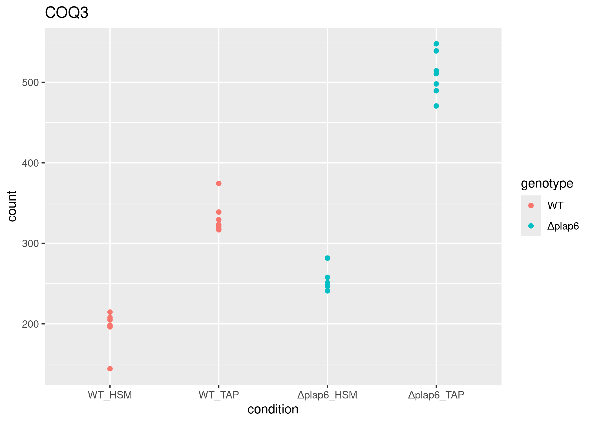

    # with ggplot
    d <- plotCounts(dds, gene = gene, intgroup = c("condition","media","genotype"), col=colData(dds)$genotype, main =anno[gene,"geneSymbol"], returnData=TRUE)
    d %>% head() %>% kable() %>% kable_styling("striped", full_width = T) %>% scroll_box(height = "400px")

<table class="table table-striped" style="margin-left: auto; margin-right: auto;">
<thead>
<tr>
<th style="text-align:left;position: sticky; top:0; background-color: #FFFFFF;">
</th>
<th style="text-align:right;position: sticky; top:0; background-color: #FFFFFF;">
count
</th>
<th style="text-align:left;position: sticky; top:0; background-color: #FFFFFF;">
condition
</th>
<th style="text-align:left;position: sticky; top:0; background-color: #FFFFFF;">
media
</th>
<th style="text-align:left;position: sticky; top:0; background-color: #FFFFFF;">
genotype
</th>
</tr>
</thead>
<tbody>
<tr>
<td style="text-align:left;">
S1
</td>
<td style="text-align:right;">
314.3222
</td>
<td style="text-align:left;">
WT\_TAP
</td>
<td style="text-align:left;">
TAP
</td>
<td style="text-align:left;">
WT
</td>
</tr>
<tr>
<td style="text-align:left;">
S10
</td>
<td style="text-align:right;">
546.2275
</td>
<td style="text-align:left;">
Δplap6\_TAP
</td>
<td style="text-align:left;">
TAP
</td>
<td style="text-align:left;">
Δplap6
</td>
</tr>
<tr>
<td style="text-align:left;">
S11
</td>
<td style="text-align:right;">
468.3312
</td>
<td style="text-align:left;">
Δplap6\_TAP
</td>
<td style="text-align:left;">
TAP
</td>
<td style="text-align:left;">
Δplap6
</td>
</tr>
<tr>
<td style="text-align:left;">
S12
</td>
<td style="text-align:right;">
487.2699
</td>
<td style="text-align:left;">
Δplap6\_TAP
</td>
<td style="text-align:left;">
TAP
</td>
<td style="text-align:left;">
Δplap6
</td>
</tr>
<tr>
<td style="text-align:left;">
S13
</td>
<td style="text-align:right;">
510.7922
</td>
<td style="text-align:left;">
Δplap6\_TAP
</td>
<td style="text-align:left;">
TAP
</td>
<td style="text-align:left;">
Δplap6
</td>
</tr>
<tr>
<td style="text-align:left;">
S14
</td>
<td style="text-align:right;">
508.3305
</td>
<td style="text-align:left;">
Δplap6\_TAP
</td>
<td style="text-align:left;">
TAP
</td>
<td style="text-align:left;">
Δplap6
</td>
</tr>
</tbody>
</table>

    # extract data and save as table

    g1 <- ggplot(d, aes(x = condition, y = count, color = genotype)) + 
      geom_point() +
      ggtitle(anno[gene,"geneSymbol"])
    plot(g1)

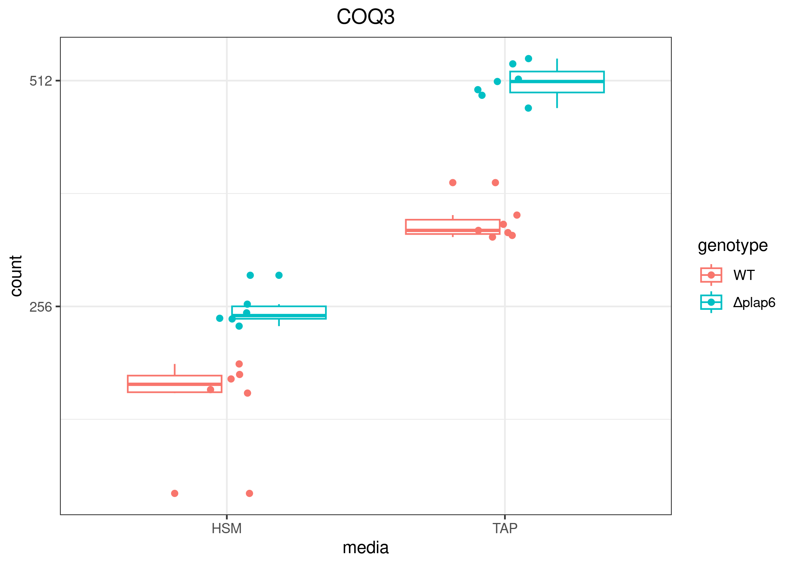

    # more advanced:
    g1 <- ggplot(d, aes(x = media, y = count, color = genotype)) + 
      geom_boxplot(aes(group = condition, colour = genotype)) +
      geom_point(position=position_jitter(w = 0.1,h = 0)) +
      # geom_text_repel(aes(label = rownames(d))) +
      scale_y_continuous(trans = "log2") +
      theme_bw() +
      ggtitle(anno[gene,"geneSymbol"]) +
      theme(plot.title = element_text(hjust = 0.5))
    plot(g1)

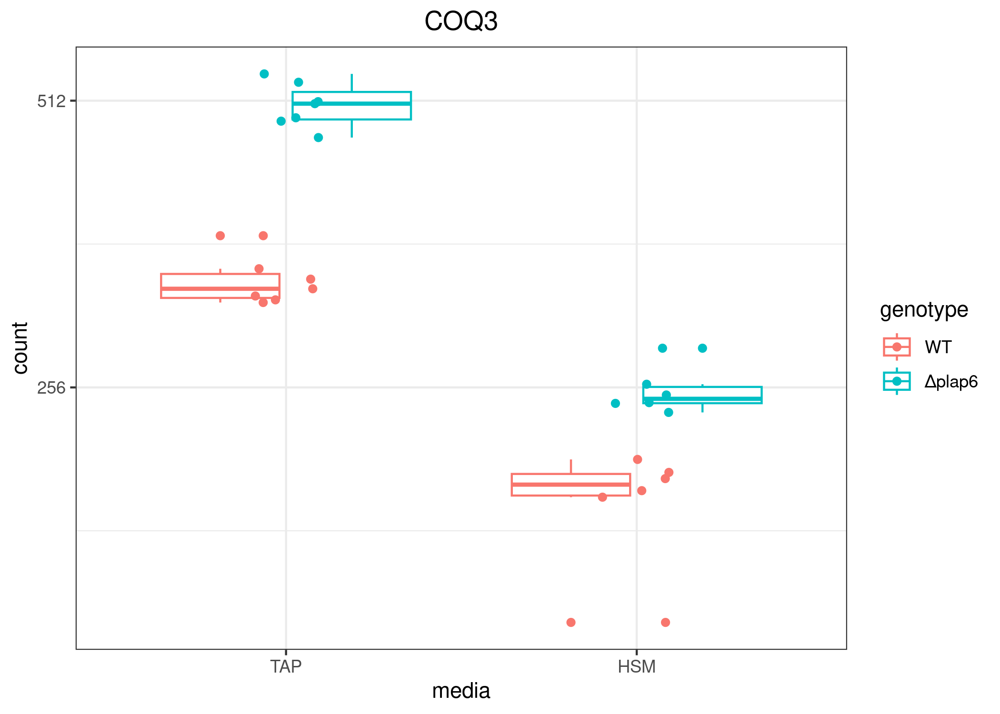

### COQs

    # all COQ genes
    goi <- anno[c(PHO1,coqs[,"gene_id"]),]
    goi

    ##                   locusName_4532 initial_v6_locus_ID action
    ## Cre08.g359300 Cre08.g359300_4532         Cr_08_38152       
    ## Cre01.g029000 Cre01.g029000_4532         Cr_01_03107       
    ## Cre02.g084300 Cre02.g084300_4532         Cr_02_07298       
    ## Cre02.g112850 Cre02.g112850_4532         Cr_02_10181       
    ## Cre03.g154850 Cre03.g154850_4532         Cr_03_14287       
    ## Cre05.g245450 Cre05.g245450_4532         Cr_05_23506       
    ## Cre06.g269550 Cre06.g269550_4532         Cr_06_27298       
    ## Cre06.g286300 Cre06.g286300_4532         Cr_06_30048       
    ## Cre06.g291800 Cre06.g291800_4532         Cr_06_30659       
    ## Cre07.g345700 Cre07.g345700_4532         Cr_07_36374       
    ## Cre10.g423750 Cre10.g423750_4532         Cr_10_46047       
    ## Cre10.g429800 Cre10.g429800_4532         Cr_10_46685       
    ##               Replacement_v5.v6._model geneSymbol strainLocusId PMID
    ## Cre08.g359300                                PHO1 4532_08_42146     
    ## Cre01.g029000                               COQD2 4532_01_03431     
    ## Cre02.g084300                                COQ5 4532_02_08056     
    ## Cre02.g112850                                COQ6 4532_02_11235     
    ## Cre03.g154850                                COQ4 4532_03_15776     
    ## Cre05.g245450                               COQ5A 4532_05_25995     
    ## Cre06.g269550                                COQ9 4532_06_30185     
    ## Cre06.g286300                               COQ5B 4532_06_33210     
    ## Cre06.g291800                                COQ2 4532_06_33881     
    ## Cre07.g345700                               COQ10 4532_07_40190     
    ## Cre10.g423750                                COQ3 4532_10_50891     
    ## Cre10.g429800                                COQ8 4532_10_51596     
    ##                     previousIdentifiers
    ## Cre08.g359300             g8416.t1#PHO1
    ## Cre01.g029000       UMM1#COQ5D#g661.t1#
    ## Cre02.g084300 COQ5C#UMM2#MENG#g1555.t1#
    ## Cre02.g112850             COQ6#g2324.t1
    ## Cre03.g154850             g3157.t1#COQ4
    ## Cre05.g245450      UMM4#COQ5A#g5224.t1#
    ## Cre06.g269550             COQ9#g6048.t1
    ## Cre06.g286300      UMM5#COQ5B#g6653.t1#
    ## Cre06.g291800            #g6761.t1#COQ2
    ## Cre07.g345700           #COQ10#g8044.t1
    ## Cre10.g423750           COQ3#g10480.t1#
    ## Cre10.g429800       ABC1#COQ8#g10617.t1
    ##                                                         Description
    ## Cre08.g359300                                  Alkaline phosphatase
    ## Cre01.g029000 Ubiquinone/menaquinone biosynthesis methyltransferase
    ## Cre02.g084300          Phylloquinone biosynthesis methyltransferase
    ## Cre02.g112850                         Flavin-dependent monoxygenase
    ## Cre03.g154850                       Ubiquinone biosynthesis protein
    ## Cre05.g245450 Ubiquinone/menaquinone biosynthesis methyltransferase
    ## Cre06.g269550                       Ubiquinone biosynthesis protein
    ## Cre06.g286300 Ubiquinone/menaquinone biosynthesis methyltransferase
    ## Cre06.g291800            Para-hydroxybenzoate-polyprenyltransferase
    ## Cre07.g345700                            Coenzyme Q-binding protein
    ## Cre10.g423750         Hexaprenyldihydroxybenzoate methyltransferase
    ## Cre10.g429800                       Ubiquinone biosynthesis protein
    ##                                                                                                                                                                                                                                      Comments
    ## Cre08.g359300                                                                                   Similar to C-terminal half of 145 kDa, phosphate-deficiency inducible alkaline phosphatase, encoded by phoA, from Synechococcus sp. PCC 7942.
    ## Cre01.g029000                                                                                                                                                         UbiE/COQ5 methyltransferase family# possibly functioning in chloroplast
    ## Cre02.g084300                                            UbiE/COQ5 methyltransferase family# ortholog of AT1G23360,  a 2-phytyl-1,4-naphthoquinone methyltransferase that catalyzes the final step in phylloquinone (vitamin K1) biosynthesis
    ## Cre02.g112850                                                                                                               putative mitochondrial flavin-dependent monoxygenase required for coenzyme Q biosynthesis [PMID: 12721307] (UbiH)
    ## Cre03.g154850                                                                                                                                                                                    ubiquinone biosynthesis protein COQ4 homolog
    ## Cre05.g245450                                                                                                                                                                                                                                
    ## Cre06.g269550                                                                                           Putative ubiquinone biosynthesis protein, mitochondrial precursor# similar to yeast ubiquinone biosynthesis protein COQ9(gi 74644909)
    ## Cre06.g286300                                                                                                                                                                                                                                
    ## Cre06.g291800                                                                                                                                               para-hydroxybenzoate-polyprenyltransferase, mitochondrial precursor# UbiA homolog
    ## Cre07.g345700                                                             Putative coenzyme Q-binding protein COQ10, mitochondrial precursor# similiar to COQ10_YEAST Coenzyme Q-binding protein COQ10, mitochondrial precursor (gi 74676458)
    ## Cre10.g423750                                                                                                               Similar to yeast hexaprenyldihydroxybenzoate methyltransferase (GI:92090588), involved in Coenzyme Q biosynthesis
    ## Cre10.g429800 70 kDa protein similar to yeast COQ8 protein involved in ubiquinone-10 biosynthesis (PMID: 11279158)# previously called ABC1 (for Activity of bc1 complex) (PMID: 14695938)# similar to At4g01660 gene product (PMID: 15710684)
    ##               Polycistronic
    ## Cre08.g359300              
    ## Cre01.g029000              
    ## Cre02.g084300              
    ## Cre02.g112850              
    ## Cre03.g154850              
    ## Cre05.g245450              
    ## Cre06.g269550              
    ## Cre06.g286300              
    ## Cre06.g291800              
    ## Cre07.g345700              
    ## Cre10.g423750              
    ## Cre10.g429800              
    ##                                                                        TMHMM_transmembrane
    ## Cre08.g359300                                      TMHMM: 1 helices (SP) Topology: i13-35o
    ## Cre01.g029000                                                             TMHMM: 0 helices
    ## Cre02.g084300                                                             TMHMM: 0 helices
    ## Cre02.g112850                                                             TMHMM: 0 helices
    ## Cre03.g154850                                                             TMHMM: 0 helices
    ## Cre05.g245450                                                             TMHMM: 0 helices
    ## Cre06.g269550                                                             TMHMM: 0 helices
    ## Cre06.g286300                                                             TMHMM: 0 helices
    ## Cre06.g291800 TMHMM: 6 helices Topology: i194-213o218-240i273-290o314-336i343-365o391-413i
    ## Cre07.g345700                                                             TMHMM: 0 helices
    ## Cre10.g423750                                                             TMHMM: 0 helices
    ## Cre10.g429800                                                             TMHMM: 0 helices
    ##                                                                  TargetP
    ## Cre08.g359300        Secretory_pathway (RC 5 score: 0.227 on #1 protein)
    ## Cre01.g029000  Mitochondrion (RC 3 score: 0.670 TPlen: 12 on #1 protein)
    ## Cre02.g084300  Mitochondrion (RC 2 score: 0.798 TPlen: 24 on #1 protein)
    ## Cre02.g112850   Mitochondrion (RC 2 score: 0.865 TPlen: 6 on #1 protein)
    ## Cre03.g154850 Mitochondrion (RC 1 score: 0.912 TPlen: 120 on #1 protein)
    ## Cre05.g245450  Mitochondrion (RC 2 score: 0.817 TPlen: 52 on #1 protein)
    ## Cre06.g269550  Mitochondrion (RC 2 score: 0.840 TPlen: 46 on #1 protein)
    ## Cre06.g286300  Mitochondrion (RC 4 score: 0.396 TPlen: 25 on #1 protein)
    ## Cre06.g291800  Mitochondrion (RC 3 score: 0.826 TPlen: 90 on #1 protein)
    ## Cre07.g345700  Mitochondrion (RC 3 score: 0.598 TPlen: 71 on #1 protein)
    ## Cre10.g423750  Mitochondrion (RC 5 score: 0.771 TPlen: 30 on #1 protein)
    ## Cre10.g429800                                 Other (RC 5 on #1 protein)
    ##                                                    Predalgo interactions
    ## Cre08.g359300 Secretory_pathway (score 2.414 on #1 protein)             
    ## Cre01.g029000       Chloroplast (score 2.179 on #1 protein)             
    ## Cre02.g084300       Chloroplast (score 2.589 on #1 protein)             
    ## Cre02.g112850     Mitochondrion (score 1.029 on #1 protein)             
    ## Cre03.g154850                 Other (score - on #1 protein)             
    ## Cre05.g245450     Mitochondrion (score 1.744 on #1 protein)             
    ## Cre06.g269550       Chloroplast (score 1.005 on #1 protein)             
    ## Cre06.g286300       Chloroplast (score 1.218 on #1 protein)             
    ## Cre06.g291800       Chloroplast (score 0.663 on #1 protein)             
    ## Cre07.g345700       Chloroplast (score 1.100 on #1 protein)             
    ## Cre10.g423750       Chloroplast (score 1.139 on #1 protein)             
    ## Cre10.g429800                 Other (score - on #1 protein)             
    ##               experimental_localization
    ## Cre08.g359300                          
    ## Cre01.g029000                          
    ## Cre02.g084300                          
    ## Cre02.g112850                          
    ## Cre03.g154850                          
    ## Cre05.g245450                          
    ## Cre06.g269550                          
    ## Cre06.g286300                          
    ## Cre06.g291800                          
    ## Cre07.g345700                          
    ## Cre10.g423750                          
    ## Cre10.g429800                          
    ##                                                                      CLiP_library
    ## Cre08.g359300 https://www.chlamylibrary.org/showGene?geneIdentifier=Cre08.g359300
    ## Cre01.g029000 https://www.chlamylibrary.org/showGene?geneIdentifier=Cre01.g029000
    ## Cre02.g084300 https://www.chlamylibrary.org/showGene?geneIdentifier=Cre02.g084300
    ## Cre02.g112850                                                                    
    ## Cre03.g154850 https://www.chlamylibrary.org/showGene?geneIdentifier=Cre03.g154850
    ## Cre05.g245450                                                                    
    ## Cre06.g269550 https://www.chlamylibrary.org/showGene?geneIdentifier=Cre06.g269550
    ## Cre06.g286300 https://www.chlamylibrary.org/showGene?geneIdentifier=Cre06.g286300
    ## Cre06.g291800 https://www.chlamylibrary.org/showGene?geneIdentifier=Cre06.g291800
    ## Cre07.g345700 https://www.chlamylibrary.org/showGene?geneIdentifier=Cre07.g345700
    ## Cre10.g423750 https://www.chlamylibrary.org/showGene?geneIdentifier=Cre10.g423750
    ## Cre10.g429800 https://www.chlamylibrary.org/showGene?geneIdentifier=Cre10.g429800
    ##                   mutant_phenotypes Plastid.ribosome_pulldown
    ## Cre08.g359300 no phenotype detected                          
    ## Cre01.g029000 no phenotype detected                          
    ## Cre02.g084300 no phenotype detected                          
    ## Cre02.g112850      no mutant mapped                          
    ## Cre03.g154850 no phenotype detected                          
    ## Cre05.g245450      no mutant mapped                          
    ## Cre06.g269550 no phenotype detected                          
    ## Cre06.g286300 no phenotype detected                          
    ## Cre06.g291800 no phenotype detected                          
    ## Cre07.g345700 no phenotype detected                          
    ## Cre10.g423750 no phenotype detected                          
    ## Cre10.g429800 no phenotype detected                          
    ##               TF_database..PMID.27067009. Flagellar_Proteome
    ## Cre08.g359300                                               
    ## Cre01.g029000                                               
    ## Cre02.g084300                                               
    ## Cre02.g112850                                               
    ## Cre03.g154850                                               
    ## Cre05.g245450                                               
    ## Cre06.g269550                                               
    ## Cre06.g286300                                               
    ## Cre06.g291800                                               
    ## Cre07.g345700                                               
    ## Cre10.g423750                                               
    ## Cre10.g429800                                               
    ##                 Co.expression.cluster..PMID.28710131.
    ## Cre08.g359300                              cluster 28
    ## Cre01.g029000                              cluster 46
    ## Cre02.g084300 cluster 26 (Mating activation-specific)
    ## Cre02.g112850                              cluster 23
    ## Cre03.g154850                              cluster 11
    ## Cre05.g245450                              cluster 40
    ## Cre06.g269550                              cluster 14
    ## Cre06.g286300                              cluster 19
    ## Cre06.g291800     cluster 8 (Lysin-treatment induced)
    ## Cre07.g345700                               cluster 1
    ## Cre10.g423750                               cluster 7
    ## Cre10.g429800                              cluster 31
    ##                                                                                                                                                                                                          GEnome.scale.Metabolic.Model
    ## Cre08.g359300                                                                                                                                                                                                                        
    ## Cre01.g029000                                                                                                                                                                                                                        
    ## Cre02.g084300                                                                                                                                                                                                                        
    ## Cre02.g112850 Name= beta-carotene hydroxylase;beta-Cryptoxanthin hydroxylase;alpha-carotene hydroxylase (zeinoxanthin forming)# KEGG= R07558;R07559;R07530# E.C.= 1.14.13.- # [Stern 2009, Niyogi 1997];[Lohr 2005] # (PMID:30202653)
    ## Cre03.g154850                                                                                                                                                                                                                        
    ## Cre05.g245450                                                                                                                                                                                                                        
    ## Cre06.g269550                                                                                                                                                                                                                        
    ## Cre06.g286300                                                                                                                                                                                                                        
    ## Cre06.g291800                                                                                                                                                                                                                        
    ## Cre07.g345700                                                                                                                                                                                                                        
    ## Cre10.g423750                                                                                                                                                                                                                        
    ## Cre10.g429800                                                                                                                                                                                                                        
    ##                     gene_id previousIdentifiers_list    prev.symbols id.symbol
    ## Cre08.g359300 Cre08.g359300             g8416.t1....            PHO1      PHO1
    ## Cre01.g029000 Cre01.g029000             UMM1, CO....      UMM1#COQ5D     COQD2
    ## Cre02.g084300 Cre02.g084300             COQ5C, U.... COQ5C#UMM2#MENG      COQ5
    ## Cre02.g112850 Cre02.g112850             COQ6, g2....            COQ6      COQ6
    ## Cre03.g154850 Cre03.g154850             g3157.t1....            COQ4      COQ4
    ## Cre05.g245450 Cre05.g245450             UMM4, CO....      UMM4#COQ5A     COQ5A
    ## Cre06.g269550 Cre06.g269550             COQ9, g6....            COQ9      COQ9
    ## Cre06.g286300 Cre06.g286300             UMM5, CO....      UMM5#COQ5B     COQ5B
    ## Cre06.g291800 Cre06.g291800             , g6761.....            COQ2      COQ2
    ## Cre07.g345700 Cre07.g345700             , COQ10,....           COQ10     COQ10
    ## Cre10.g423750 Cre10.g423750             COQ3, g1....            COQ3      COQ3
    ## Cre10.g429800 Cre10.g429800             ABC1, CO....       ABC1#COQ8      COQ8

    n <- {0}
    for (i in goi$gene_id){
      n <- n+1
      print(n)
      print(i)
      s <- print(anno[i,"geneSymbol"])
      d <-  plotCounts(dds, gene=i, intgroup=c("condition","media","genotype"),main=s,returnData=TRUE)
      g <- ggplot(d, aes(x = media, y = count, color = genotype)) + 
        geom_boxplot(aes(fill=genotype), alpha=0.5) +
        geom_point(position=position_dodge(width=0.75)) +
        scale_y_continuous(trans = "log2",limits = c(250,2100)) +
        # coord_cartesian(ylim = c(0,2500)) +
        scale_color_manual(values=c("grey30","orchid1")) +
        scale_fill_manual(values=c("grey30","orchid1")) +
        theme_bw() +
        ggtitle(s) +
        theme(plot.title = element_text(hjust = 0.5)) +
        ylab("Normalized RNA counts [log2])")
      assign(x = paste("g",n, sep=""),g)
      plot(g)
    }

    ## [1] 1
    ## [1] "Cre08.g359300"
    ## [1] "PHO1"

    ## [1] 2
    ## [1] "Cre01.g029000"
    ## [1] "COQD2"

    ## [1] 3
    ## [1] "Cre02.g084300"
    ## [1] "COQ5"

    ## [1] 4
    ## [1] "Cre02.g112850"
    ## [1] "COQ6"

    ## [1] 5
    ## [1] "Cre03.g154850"
    ## [1] "COQ4"

    ## [1] 6
    ## [1] "Cre05.g245450"
    ## [1] "COQ5A"

    ## [1] 7
    ## [1] "Cre06.g269550"
    ## [1] "COQ9"

    ## [1] 8
    ## [1] "Cre06.g286300"
    ## [1] "COQ5B"

    ## [1] 9
    ## [1] "Cre06.g291800"
    ## [1] "COQ2"

    ## [1] 10
    ## [1] "Cre07.g345700"
    ## [1] "COQ10"

    ## [1] 11
    ## [1] "Cre10.g423750"
    ## [1] "COQ3"

    ## [1] 12
    ## [1] "Cre10.g429800"
    ## [1] "COQ8"

    length(goi)

    ## [1] 27

    p <- g9+g2+g11+g6+g8+g12+ plot_layout(guides = "collect", axis_titles="collect", axes = 'collect_y') & theme(legend.position = 'right')
    p

    # ga <- ggarrange(g1,g2,g3,g4,g5,g6,g7,g8,g9,g10,g11,g12,ncol = 3, nrow = 4)
    # ga1 <- ggarrange(g2+rremove("xlab"),
    #                 g8+rremove("xlab")+rremove("ylab"),
    #                 g6+rremove("xlab")+rremove("ylab"),
    #                 g12+rremove("xlab"),
    #                 g11+rremove("xlab")+rremove("ylab"),
    #                 g9+rremove("xlab")+rremove("ylab"),
    #                 common.legend = TRUE, legend = "right",
    #                 widths = c(1.05,1,1), heights = c(1,1),
    #                 ncol = 3, nrow = 2)
    # ga1
    # ggexport(ga1, filename = "pub_figures/Counts_COQs.pdf",width = 8.2, height = 4.7)
    # ggsave(ga1, filename = "pub_figures/Counts_COQs.png",width = 8.2, height = 4.7)

    # ((g2+g8+g6)/(g12+g11+g9)) + plot_layout(guides = "collect", axes = "collect", axis_titles="collect")

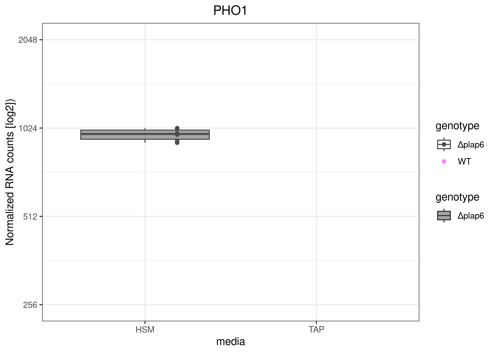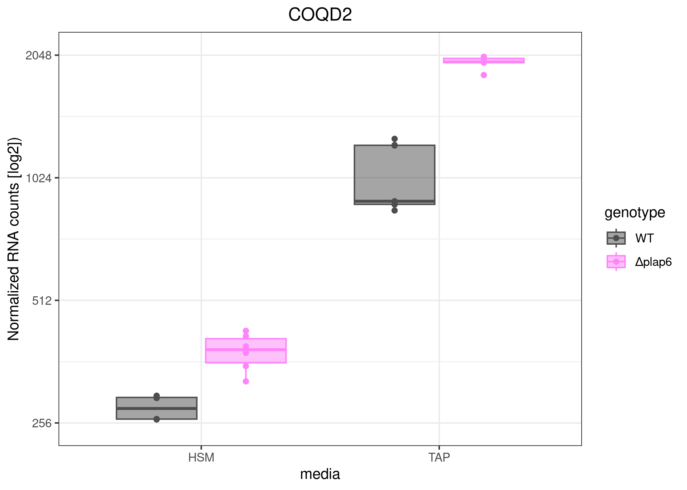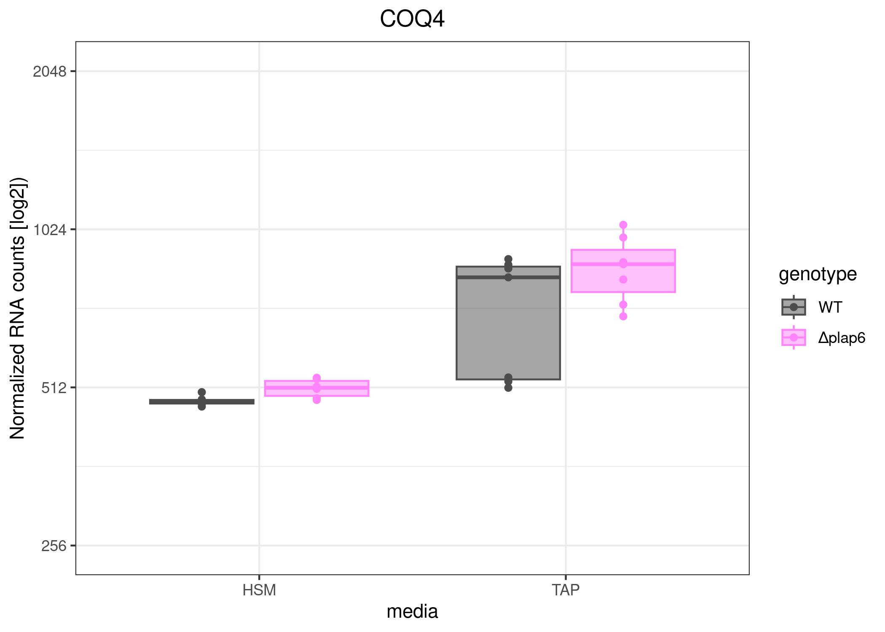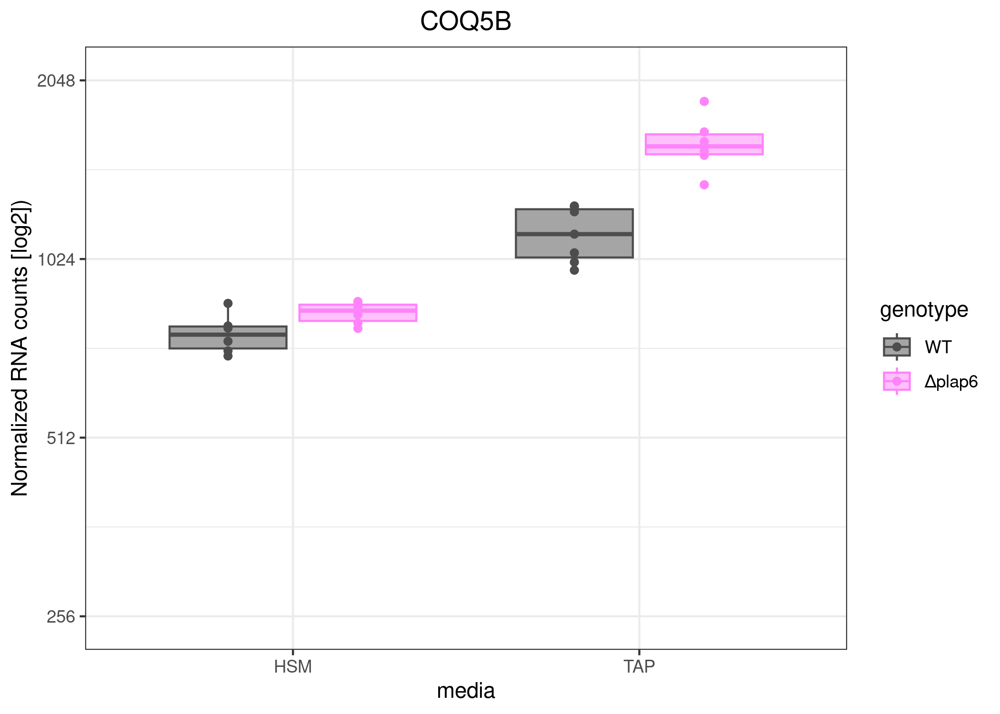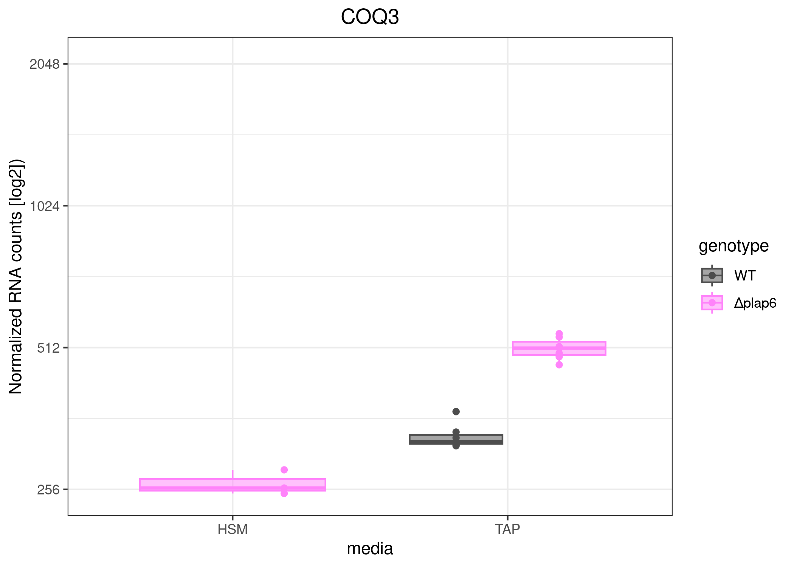

#### -export COQs

    ggexport(p, filename = paste(pubdir,"Counts_plap6_COQs.pdf",sep="/"),width = 8.2, height = 4.7)
    ggsave(p, filename = paste(pubdir,"Counts_plap6_COQs.tiff",sep="/"),width = 8.2, height = 4.7)

### CIA5, rbcl, LHCSR3, LHCSR1, PSBS

    anno[str_detect(anno[["geneSymbol"]],"CCM1"),1:9]

    ##                   locusName_4532 initial_v6_locus_ID action
    ## Cre02.g096300 Cre02.g096300_4532         Cr_02_08521       
    ##               Replacement_v5.v6._model geneSymbol strainLocusId
    ## Cre02.g096300                                CCM1 4532_02_09410
    ##                                                       PMID previousIdentifiers
    ## Cre02.g096300 11287669#15235119#11309511#18202004#21253860  CIA5#CCM1#g1955.t1
    ##                                     Description
    ## Cre02.g096300 Regulator of CO2-responsive genes

    anno[str_detect(anno[["previousIdentifiers"]],"CIA5"),1:9]

    ##                   locusName_4532 initial_v6_locus_ID action
    ## Cre02.g096300 Cre02.g096300_4532         Cr_02_08521       
    ##               Replacement_v5.v6._model geneSymbol strainLocusId
    ## Cre02.g096300                                CCM1 4532_02_09410
    ##                                                       PMID previousIdentifiers
    ## Cre02.g096300 11287669#15235119#11309511#18202004#21253860  CIA5#CCM1#g1955.t1
    ##                                     Description
    ## Cre02.g096300 Regulator of CO2-responsive genes

    anno[str_detect(anno[["geneSymbol"]],"PSBS"),1:9]

    ##                   locusName_4532 initial_v6_locus_ID action
    ## Cre01.g016600 Cre01.g016600_4532         Cr_01_01885       
    ## Cre01.g016750 Cre01.g016750_4532         Cr_01_01900       
    ##               Replacement_v5.v6._model geneSymbol strainLocusId
    ## Cre01.g016600                               PSBS1 4532_01_02081
    ## Cre01.g016750                               PSBS2 4532_01_02096
    ##                                                                PMID
    ## Cre01.g016600 16143839#27329221#27930292#20673336#10667783#15222740
    ## Cre01.g016750                   16143839#27329221#27930292#20673336
    ##               previousIdentifiers
    ## Cre01.g016600            #g397.t1
    ## Cre01.g016750            #g400.t1
    ##                                                        Description
    ## Cre01.g016600 chloroplast Photosystem II-associated 22 kDa protein
    ## Cre01.g016750 chloroplast Photosystem II-associated 22 kDa protein

    PLAP6 <- "Cre03.g188700"
    CIA5 <- "Cre02.g096300"
    rbcl <- "CreCp.g802313"
    LHCSR3 <- c("Cre08.g367500","Cre08.g367400")
    LHCSR1 <- "Cre08.g365900"
    PSBS <- c("Cre01.g016600","Cre01.g016750")

    ## multiple genes
    # all COQ genes
    goi <- anno[c(CIA5,PSBS,LHCSR1,LHCSR3),]  # ,rbcl
    goi[,c("geneSymbol","Description")]

    ##               geneSymbol                                          Description
    ## Cre02.g096300       CCM1                    Regulator of CO2-responsive genes
    ## Cre01.g016600      PSBS1 chloroplast Photosystem II-associated 22 kDa protein
    ## Cre01.g016750      PSBS2 chloroplast Photosystem II-associated 22 kDa protein
    ## Cre08.g365900     LHCSR1     Stress-related chlorophyll a/b binding protein 1
    ## Cre08.g367500    LHCSR3A     Stress-related chlorophyll a/b binding protein 2
    ## Cre08.g367400    LHCSR3B     Stress-related chlorophyll a/b binding protein 3

    goi$geneSymbol[1] <- "CIA5"

    n <- {0}
    g_list <- list()
    for (i in goi$gene_id){
      n <- n+1
      print(n)
      print(i)
      s <- print(goi[i,"geneSymbol"])
      d <-  plotCounts(dds, gene=i, intgroup=c("condition","media","genotype"),main=s,returnData=TRUE)
      g <- ggplot(d, aes(x = media, y = count, color = genotype)) + 
        geom_boxplot(aes(fill=genotype), alpha=0.5) +
        geom_point(position=position_dodge(width=0.75)) +
        scale_y_continuous(trans = "log2") +
        # coord_cartesian(ylim = c(0,2500)) +
        scale_color_manual(values=c("grey30","orchid1")) +
        scale_fill_manual(values=c("grey30","orchid1")) +
        theme_bw() +
    #    ggtitle(paste0(s," (",goi[i,"gene_id"],")")) +
        ggtitle(s) +
        theme(plot.title = element_text(hjust = 0.5)) + 
        ylab("Normalized RNA counts [log2])")
      g_list[[s]] <- g
      assign(x = paste("g",n, sep=""),g)
      plot(g)
    }

    ## [1] 1
    ## [1] "Cre02.g096300"
    ## [1] "CIA5"

    ## [1] 2
    ## [1] "Cre01.g016600"
    ## [1] "PSBS1"

    ## [1] 3
    ## [1] "Cre01.g016750"
    ## [1] "PSBS2"

    ## [1] 4
    ## [1] "Cre08.g365900"
    ## [1] "LHCSR1"

    ## [1] 5
    ## [1] "Cre08.g367500"
    ## [1] "LHCSR3A"

    ## [1] 6
    ## [1] "Cre08.g367400"
    ## [1] "LHCSR3B"

    length(goi)

    ## [1] 27

    g_list

    ## $CIA5

    ## 
    ## $PSBS1

    ## 
    ## $PSBS2

    ## 
    ## $LHCSR1

    ## 
    ## $LHCSR3A

    ## 
    ## $LHCSR3B

    p <- patchwork::wrap_plots(g_list) + plot_layout(guides = "collect", axis_titles="collect", axes='collect_y')
    p

    # p <- g1 + g2 + plot_layout(guides = "collect", axis_titles="collect", axes='collect')
    # p

    # only rbcl in TAP
    i <- goi$gene_id[2]
    d <-  plotCounts(dds, gene=i, intgroup=c("condition","media","genotype"),main=s,returnData=TRUE)

    gt <- ggplot(d[d$media == "TAP",], aes(x = media, y = count, color = genotype)) + 
        geom_boxplot(aes(fill=genotype), alpha=0.5) +
        geom_point(position=position_dodge(width=0.75)) +
        scale_y_continuous(trans = "log2") +
        # coord_cartesian(ylim = c(0,2500)) +
        scale_color_manual(values=c("grey30","orchid1")) +
        scale_fill_manual(values=c("grey30","orchid1")) +
        theme_bw() +
        ggtitle(s) +
        theme(plot.title = element_text(hjust = 0.5))
    plot(gt)

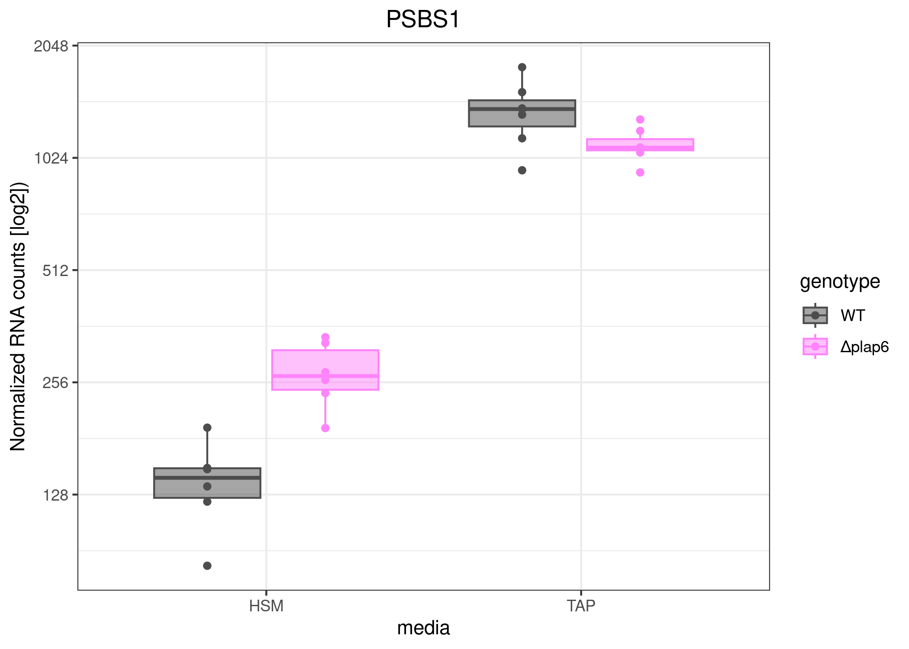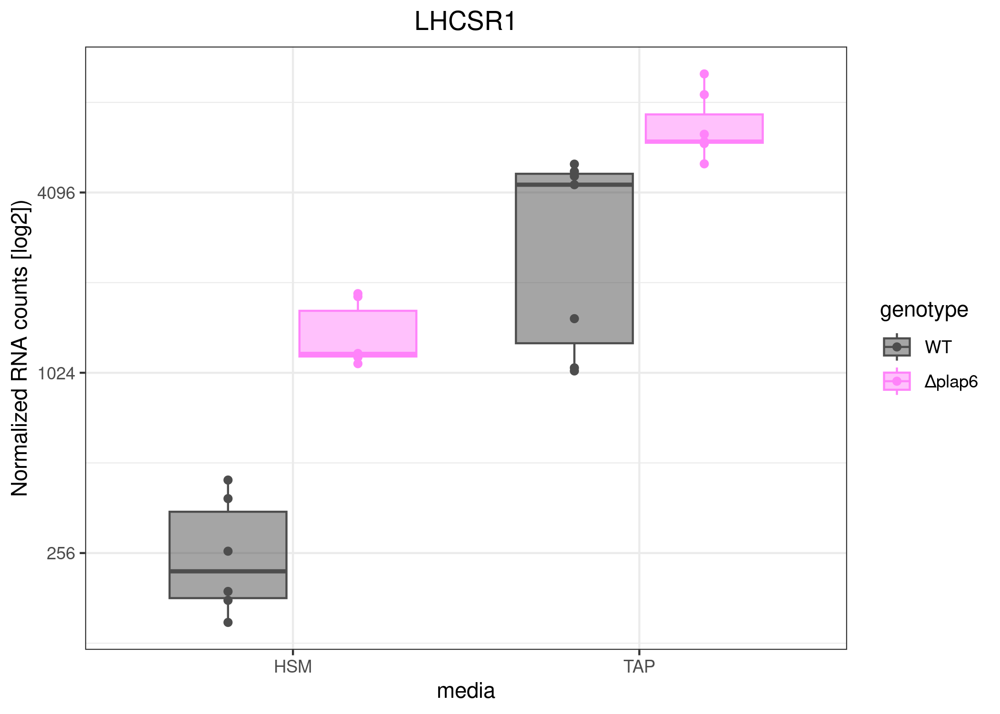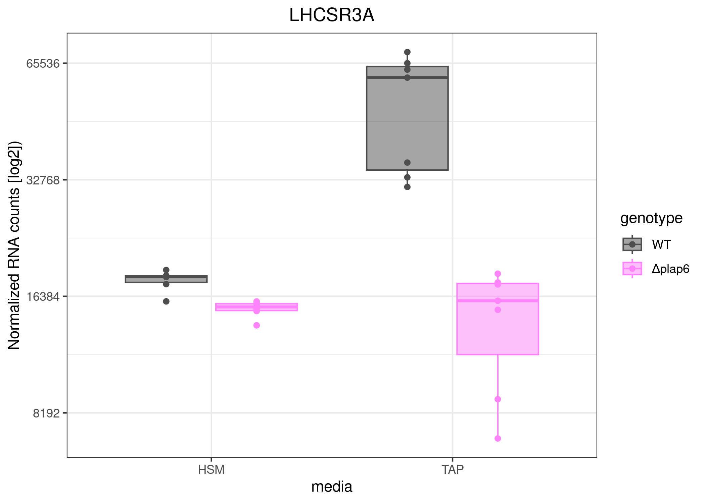

#### -export CIA5

    ggexport(g1, filename = paste(pubdir,"Counts_plap6_CIA5.pdf",sep="/"),width = 8.2, height = 4.7)
    ggsave(g1, filename = paste(pubdir,"Counts_plap6_CIA5.tiff",sep="/"),width = 8.2, height = 4.7)

    ggexport(gt, filename = paste(pubdir,"Counts_plap6_rbcl.pdf",sep="/"),width = 8.2, height = 4.7)
    ggsave(gt, filename = paste(pubdir,"Counts_plap6_rbcl.tiff",sep="/"),width = 8.2, height = 4.7)

    ggexport(p, filename = paste(pubdir,"Counts_plap6_CIA5+LHCSR+PSBS.pdf",sep="/"),width = 8.2, height = 4.7)
    ggsave(p, filename = paste(pubdir,"Counts_plap6_CIA5+LHCSR+PSBS.tiff",sep="/"),width = 8.2, height = 4.7)

### PQs

    library("ggpubr")

    ## multiple genes
    goi <- anno[goi_y,]
    dim(goi)

    ## [1] 12 27

    n <- {0}
    for (i in goi$gene_id){
      n <- n+1
      print(n)
      print(i)
      s <- print(anno[i,"id.symbol"])
      print
      d <-  plotCounts(dds, gene=i, intgroup=c("condition","media","genotype"),main=s,returnData=TRUE)
      g <- ggplot(d, aes(x = condition, y = count, color = genotype)) + 
        geom_boxplot(aes(group = condition, colour = genotype)) +
        geom_point() + #position=position_jitter(w = 0.1,h = 0)
        # geom_text_repel(aes(label = rownames(d))) + 
        theme_bw() +
        ggtitle(s) +
        theme(plot.title = element_text(hjust = 0.5))
      assign(x = paste("g",n, sep=""),g)
      plot(g)
    }

    ## [1] 1
    ## [1] "Cre09.g414000"
    ## [1] "HPT1"

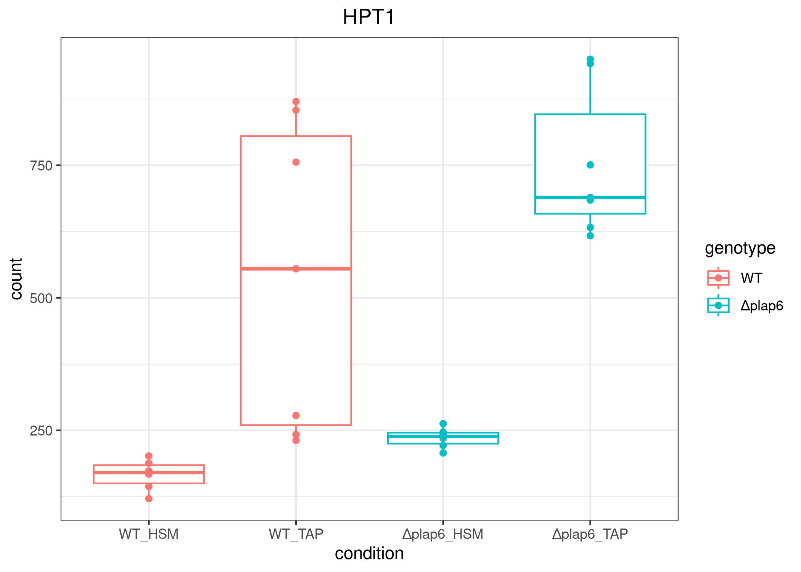

    ## [1] 2
    ## [1] "Cre01.g013801"
    ## [1] "TCY1"

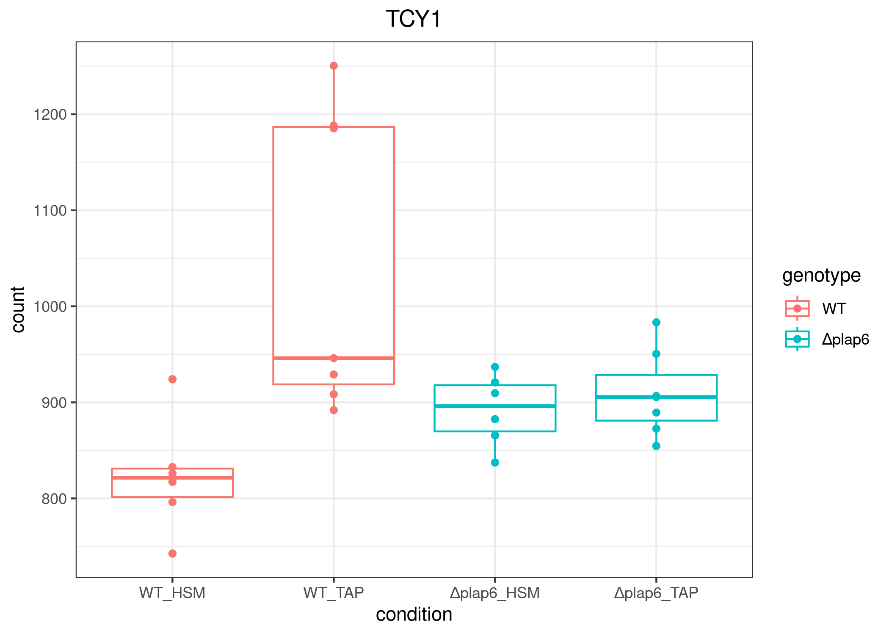

    ## [1] 3
    ## [1] "Cre14.g624350"
    ## [1] "VTE6"

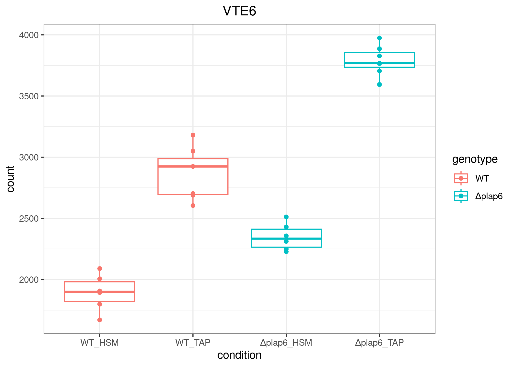

    ## [1] 4
    ## [1] "Cre09.g393400"
    ## [1] "VTE4"

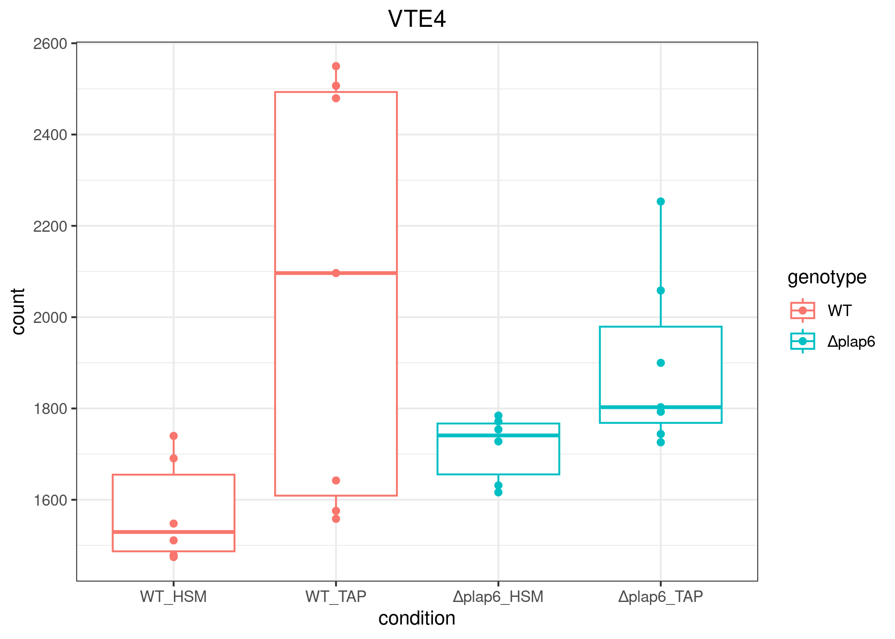

    ## [1] 5
    ## [1] "Cre09.g398993"
    ## [1] "HPD1"

    ## [1] 6
    ## [1] "Cre06.g283750"
    ## [1] "HST1"

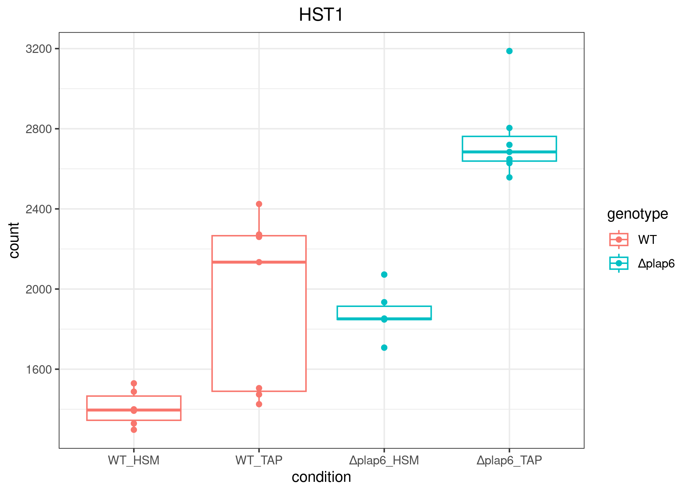

    ## [1] 7
    ## [1] "Cre14.g625450"
    ## [1] "VTE3"

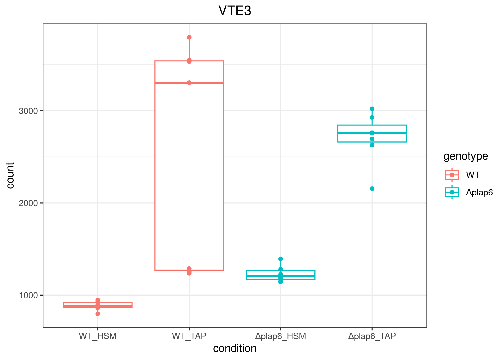

    ## [1] 8
    ## [1] "Cre12.g503550"
    ## [1] "MEC1"

    ## [1] 9
    ## [1] "Cre10.g455950"
    ## [1] "FAP407"

    ## [1] 10
    ## [1] "Cre16.g671000"
    ## [1] "NDA5"

    ## [1] 11
    ## [1] "Cre04.g219787"
    ## [1] "Cre04.g219787"

    ## [1] 12
    ## [1] "Cre09.g416500"
    ## [1] "CGL151"

    length(goi)

    ## [1] 27

    ga2 <- cowplot::plot_grid(g1,g2,g3,g4,g5,g6,g7,g8,g9,g10,g11,g12, byrow = FALSE, nrow = 4, ncol = 3)
    ga2

    # ggexport(ga, filename = "graphs3/Counts_YYK.pdf",width = 12, height = 12)

## Volcano Plot

    library(EnhancedVolcano)

    plot(res1$log2FoldChange,res1$baseMean )

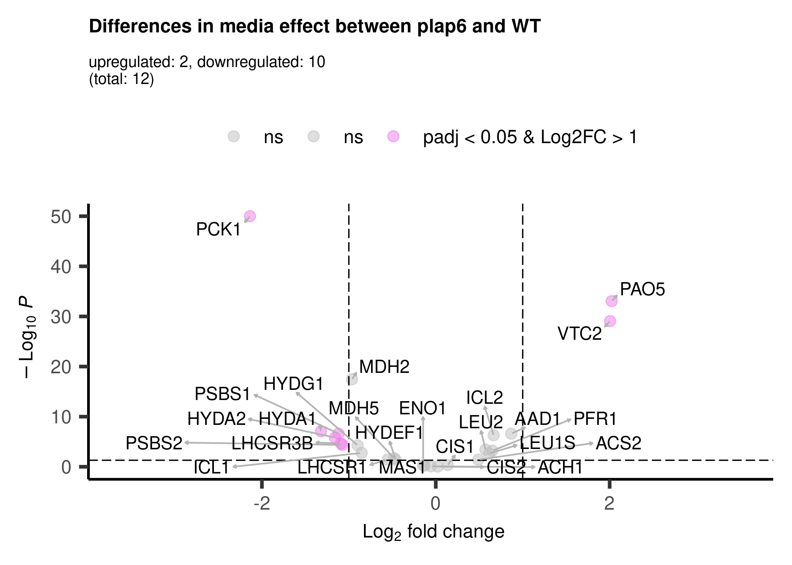

    # colnames(mcols(dds))
    # mcols(dds) <- left_join(as.data.frame(mcols(dds)),anno[,c("gene_id","prev.symbols","id.symbol")],by = "gene_id")

    summary(res1)

    ## 
    ## out of 15749 with nonzero total read count
    ## adjusted p-value < 0.1
    ## LFC > 0 (up)       : 4097, 26%
    ## LFC < 0 (down)     : 5418, 34%
    ## outliers [1]       : 0, 0%
    ## low counts [2]     : 0, 0%
    ## (mean count < 11)
    ## [1] see 'cooksCutoff' argument of ?results
    ## [2] see 'independentFiltering' argument of ?results

    EnhancedVolcano(res1,
                    x = 'log2FoldChange',
                    y = 'pvalue',
                    lab = mcols(dds)$id.symbol,
                    # boxedLabels = TRUE,
                    labSize = 2.0,
                    drawConnectors = TRUE,
                    max.overlaps = 20,
                    # xlim = c(-10, 10),
                    # ylim = c(0, 50),
                    ylab = "Padj (-log10)",
                    title = 'Δplap6 vs. WT in TAP',
                    subtitle = "DE genes: ?? (red)",
                    # sub = "SVF",
                    pCutoff = 0.01,
                    FCcutoff = 2,
                    pointSize = 2.0,
                    legendLabels=c('Not sig.','|L2F| > 2','p-adj < 0.01',
                                   'p-adj & L2F'),
                    legendPosition = 'right',
    )

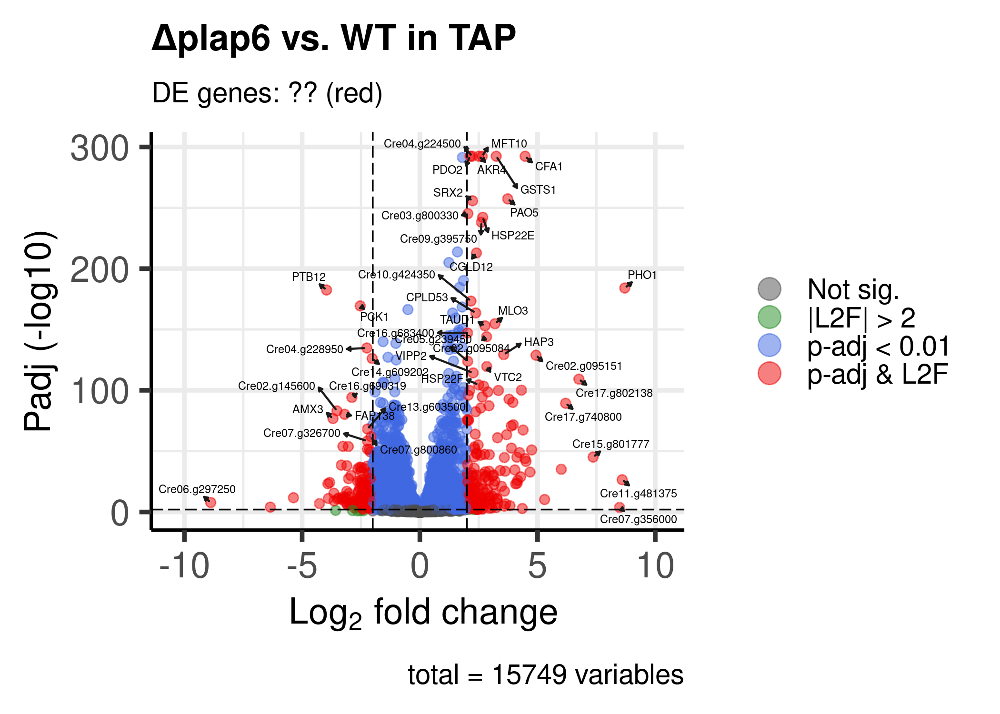

    # ggsave("graphs3/EnhancedVolcano.pdf",
    #        width = 12,
    #        height = 10)

    # with ggplot
    ggplot(as.data.frame(res1),aes(log2FoldChange,-log(padj))) +
      geom_point() +
      geom_point(data = as.data.frame(res1[rownames(top_res1),]), colour = "blue") + 
      geom_point(data = as.data.frame(res1[goi$gene_id,]), colour = "red") +
      geom_text_repel(data = as.data.frame(res1[goi$gene_id,]), aes(label=anno[goi$gene_id,"id.symbol"]),colour = "red",hjust=-0.5, vjust=-1) + xlim(-5,5)

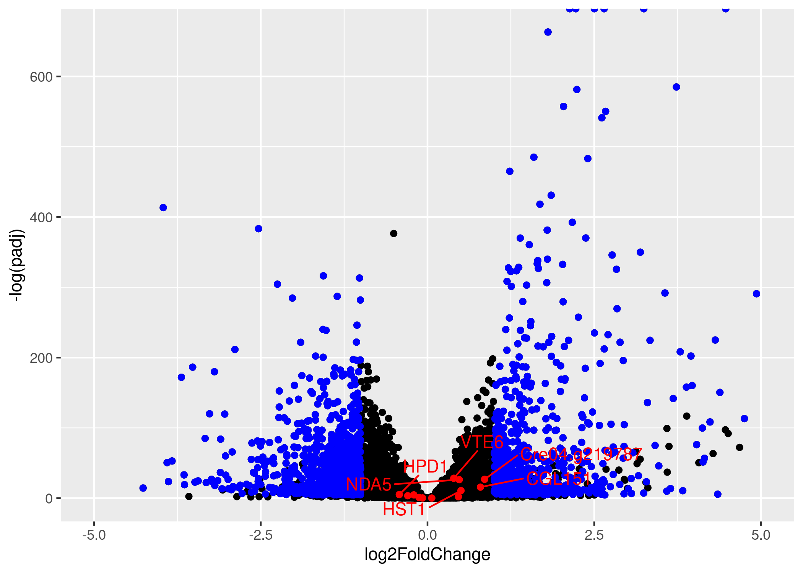

    # ggsave("graphs3/Vulcano COQs-2.pdf",
    #        width = 10,
    #        height = 6)

## Heatmap

    library("pheatmap")
    ntd <- normTransform(dds)

    # select top 100 highest expressed genes
    select <- order(rowMeans(counts(dds,normalized=TRUE)),
                    decreasing=TRUE)[1:100]
    df <- as.data.frame(colData(dds)[,c("condition","media","genotype")])
    pheatmap(assay(ntd)[select,], cluster_rows=TRUE, show_rownames=FALSE,
             cluster_cols=TRUE, annotation_col=df)

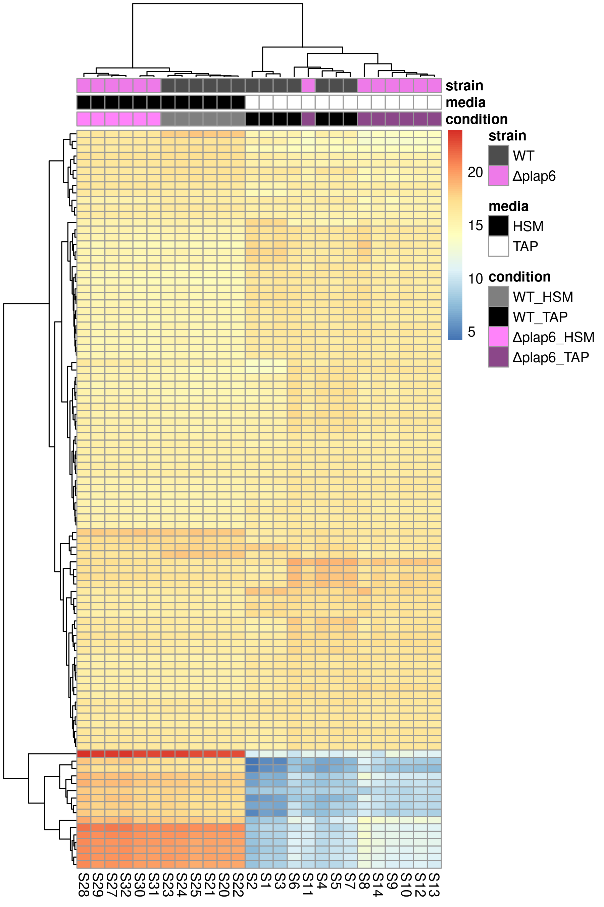

    # all top genes
    select <- unique(
      rownames(top_res1),
      rownames(top_res2)) %>% 
      unique(rownames(top_res3)) %>%
      unique(rownames(top_res4)) %>%
      unique(rownames(goi))

    length(select)

    ## [1] 1563

    df <- assay(ntd)[select,]
    rownames(df) <- mcols(dds)[select,"id.symbol"]

    anno_col <- as.data.frame(colData(dds)[,c("condition","media","genotype")])
    xx <- pheatmap(df, cluster_rows=TRUE, show_rownames=TRUE,
                   cluster_cols=TRUE, annotation_col=anno_col)

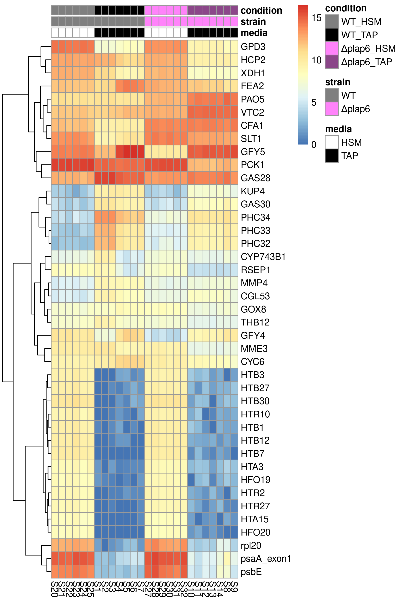

    # ggsave("graphs3/Heatmap_top.pdf",plot=xx,
    #        width = 10,
    #        height = 30)

    # all fib genes
    select <- unique(c(
      rownames(top_res1),
      rownames(top_res2),
      rownames(goi)))

    select <- unique(c(head(rownames(top_res1),n=50),
                       tail(rownames(top_res1),n=50),
                       head(rownames(top_res2),n=50),
                       tail(rownames(top_res2),n=50),
                       rownames(goi)))

    length(select)

    ## [1] 182

    df <- assay(ntd)[select,]
    rownames(df) <- mcols(dds)[select,"id.symbol"]

    anno_col <- as.data.frame(colData(dds)[,c("condition","media","genotype")])
    xx <- pheatmap(df, cluster_rows=TRUE, show_rownames=TRUE,
                   cluster_cols=TRUE, annotation_col=anno_col)

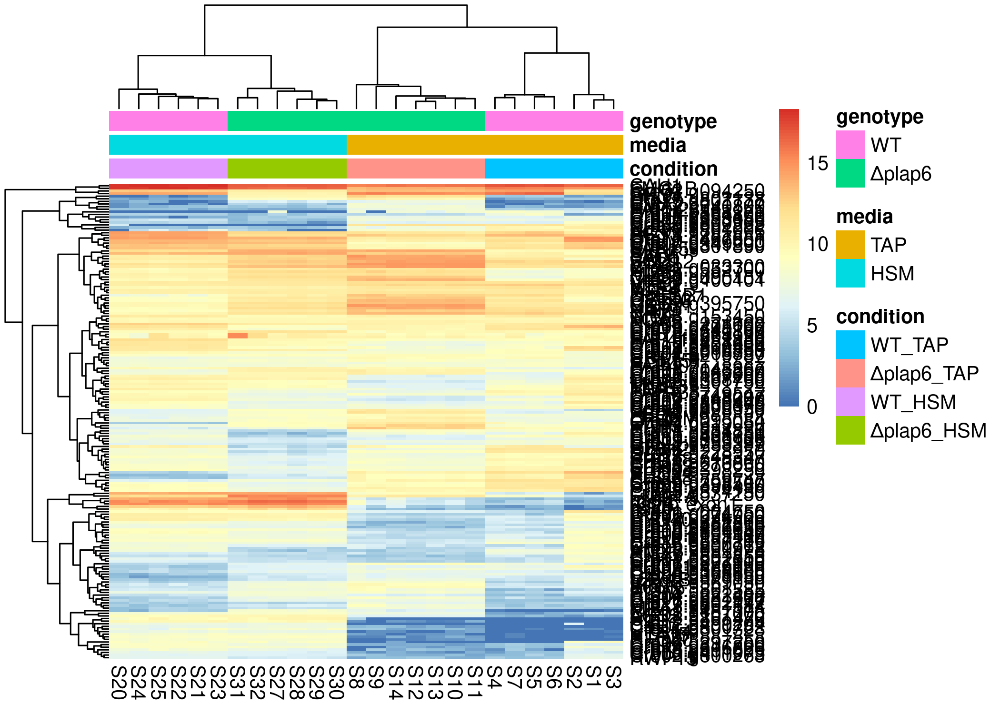

    # ggsave("graphs3/Heatmap_Δplap6.vs.WT.pdf",plot=xx,
    #        width = 10,
    #        height = 30)

### HM PQs

    library("pheatmap")
    ntd <- normTransform(dds)

    df <- assay(ntd)[goi$gene_id,]
    rownames(df) <- mcols(dds)[goi$gene_id,"id.symbol"]

    anno_col <- as.data.frame(colData(dds)[,c("condition","media","genotype")])
    xx <- pheatmap(df, cluster_rows=TRUE, show_rownames=TRUE,
                   cluster_cols=TRUE, annotation_col=anno_col)

    # ggsave("graphs3/Heatmap_YYK.pdf",plot=xx,
    #        width = 10,
    #        height = 10)

# Export

    library(writexl)

    # combine results

    colnames(anno)

    res_exp <- data.frame(
      # general
      "gene_id" = rownames(dds),
      "gene_name" = anno[rownames(dds),"geneSymbol"],
      "Alias" = anno[rownames(dds),"prev.symbols"],
      "id.symbol" = anno[rownames(dds),"id.symbol"],
      "Description" = anno[rownames(dds),"Description"],
      "Comments" = anno[rownames(dds),"Comments"],
      "TargetP" = anno[rownames(dds),"TargetP"],
      "Predalgo" = anno[rownames(dds),"Predalgo"],
      "baseMean" = res1$baseMean,
      # results 1
      "L2FC.Δplap6_TAP.vs.WT_TAP" = res1$log2FoldChange,
      "pvalue.Δplap6_TAP.vs.WT_TAP" = res1$pvalue,
      "padj.Δplap6_TAP.vs.WT_TAP" = res1$padj,
      # results 2
      "L2FC.Δplap6_HSM.vs.WT_HSM" = res2$log2FoldChange,
      "pvalue.Δplap6_HSM.vs.WT_HSM" = res2$pvalue,
      "padj.Δplap6_HSM.vs.WT_HSM" = res2$padj,
      # results 3
      "L2FC.WT_HSM.vs.WT_TAP" = res3$log2FoldChange,
      "pvalue.WT_HSM.vs.WT_TAP" = res3$pvalue,
      "padj.WT_HSM.vs.WT_TAP" = res3$padj,
      # results 4
      "L2FC.Δplap6_HSM.vs.Δplap6_TAP" = res4$log2FoldChange,
      "pvalue.Δplap6_HSM.vs.Δplap6_TAP" = res4$pvalue,
      "padj.Δplap6_HSM.vs.Δplap6_TAP" = res4$padj,
      counts(dds, normalized = TRUE))
    res_exp %>% head() %>% kable() %>% kable_styling("striped", full_width = T) %>% scroll_box(height = "400px")

    write_xlsx(data.frame(res_exp),
               paste(outdir,"2023_08 P3043 results.xlsx",sep="/"))

    write_xlsx(data.frame(colData(dds)),
               paste(outdir,"2023_08 P3043 samples.xlsx",sep="/"))

# End
