# 0. Start

## Load System

    library(stringr)
    library(R.utils)
    library(RColorBrewer)
    library(sessioninfo)
    library(data.table)
    library(plyr)
    library(tidyverse)
    library(tximeta)
    library(tximport)
    library(curl)
    library(AnnotationHub)
    library(DESeq2)
    library(EnhancedVolcano)
    library(pheatmap)
    library(writexl)
    library(readxl)
    library(biomaRt)
    library(ape)
    library(kableExtra)
    library(knitr)

    library(stringr)
    library(R.utils)
    library(RColorBrewer)

    library(sessioninfo)
    library(data.table)
    library(plyr)
    library(tidyverse)
    library(tximeta)
    library(tximport)
    library(curl)

    library(SummarizedExperiment)
    library(GenomicRanges)
    library(ape)

    library(viridis)
    library(patchwork)
    library("ggpubr")
    library(vsn)

    library(PCAtools)
    library(aplot)
    library(ggExtra)

    library(topGO)
    # library(wget)

### R folders

    ifelse(Sys.info()["sysname"]== "Linux",
           s <- "/mnt/s",
           s <- "S:")

    ##  sysname 
    ## "/mnt/s"

    dir <- paste(s,"AG/AG-Scholz-NGS/Daten/Simon/P3043",sep="/")
    gitdir <- paste(dir,"git_Chlamy_RNAseq_plap6",sep="/")
    datadir <- paste(dir,"data",sep="/")
    outdir <- gitdir
    pubdir <- paste(gitdir,"pub_figures",sep="/")
    quantdir <- paste(dirname(datadir),"quants2",sep="/")

    dir1 <- paste(dirname(dir),"linux-ngs/salmon/salmon_index_chlamy",sep="/")

    indexDir <- file.path(dirname(dir),"linux-ngs/salmon/salmon_index_chlamy/chlamy_index_v6.1")
    fastaPath <- file.path(dir1,"Phytozone_v6.1/CreinhardtiiCC_4532_707_v6.0.hardmasked.fa.gz")
    # list.files(dirname(fastaPath))
    # head(readLines(fastaPath,n=50))
    gtfPath <- file.path(dir1,"Phytozone_v6.1/CreinhardtiiCC_4532_707_v6.1.repeatmasked_assembly_v6.0.gff3.gz")
    # readLines(gtfPath,n=20)
    gtfPath <- file.path(dir1,"Phytozone_v6.1/CreinhardtiiCC_4532_707_v6.1.gene_exons.gff3.gz")
    # readLines(gtfPath,n=20)
    gtfPath <- file.path(dir1,"Phytozone_v6.1/CreinhardtiiCC_4532_707_v6.1.gene.gff3.gz")
    # readLines(gtfPath,n=20)

    file.exists(indexDir, fastaPath, gtfPath)

    ## [1] TRUE TRUE TRUE

### R functions

    getresults_SK <- function(contrast,nres){
      r1 <- results(dds, contrast = contrast)
      r1$symbol <- mcols(dds)$symbol
      assign(paste("res",nres,sep="."),r1)
      r1 <- list(r1)
      names(r1) <- nres
      r1
    }

    topgenes_f <- function(res,p=0.05,bM=10,l2FC=1){
      a <- subset(res, padj < p & baseMean > bM & abs(log2FoldChange) > l2FC)
      if(nrow(a)>0) {
        a <- a[order(a$baseMean, decreasing = T),]
        a$rank.bm <- seq(1:length(rownames(a)))
        a <- a[order(a$padj, decreasing = F),]
        a$rank.padj <- seq(1:length(rownames(a)))
        a <- a[order(abs(a$log2FoldChange), decreasing = T),]
        a$rank.l2FC <- seq(1:length(rownames(a)))
        a$rank.sum <- a$rank.l2FC+a$rank.bm+a$rank.padj
        a <- a[order(a$rank.sum),]
      }
      a
    }

## Load dds

    dds <- readRDS(paste(datadir,"dds2.RDS",sep="/"))
    anno <- readRDS(paste(datadir,"anno.RDS",sep="/"))

    # load(paste(datadir,"dds.RDS",sep="/"))

## Make results

    resultsNames(dds)

    # TAP = Δplap6_TAP - WT_TAP
    # HSM = Δplap6_HSM - WT_HSM
    # Δplap6 = Δplap6_HSM - Δplap6_TAP
    # WT = WT_HSM - WT_TAP

    res_Δplap6.TAP.vs.WT.TAP <-
      results(dds, contrast = c("condition","Δplap6_TAP","WT_TAP"))
    res_Δplap6.TAP.vs.WT.TAP$Symbol <- mcols(dds)$id.symbol

    res_Δplap6.HSM.vs.WT.HSM <-
      results(dds, contrast = c("condition","Δplap6_HSM","WT_HSM"))
    res_Δplap6.HSM.vs.WT.HSM$Symbol <- mcols(dds)$id.symbol

    res_Δplap6.HSM.vs.Δplap6.TAP <-
      results(dds, contrast = c("condition","Δplap6_HSM","Δplap6_TAP"))
    res_Δplap6.HSM.vs.Δplap6.TAP$Symbol <- mcols(dds)$id.symbol

    res_WT.HSM.vs.WT.TAP <-
      results(dds, contrast = c("condition","WT_HSM","WT_TAP"))
    res_WT.HSM.vs.WT.TAP$Symbol <- mcols(dds)$id.symbol

    res1 <- res_Δplap6.TAP.vs.WT.TAP
    res2 <- res_Δplap6.HSM.vs.WT.HSM
    res3 <- res_Δplap6.HSM.vs.Δplap6.TAP
    res4 <- res_WT.HSM.vs.WT.TAP

    summary(res1)
    top_res1 <- subset(res1, padj < 0.01 & baseMean > 50 &
                         (log2FoldChange < -1 | log2FoldChange > 1))
    top_res1 <- top_res1[order(top_res1$log2FoldChange, decreasing = T),]
    dim(top_res1)

    summary(res2)
    top_res2 <- subset(res2, padj < 0.01 & baseMean > 50 &
                         (log2FoldChange < -1 | log2FoldChange > 1))
    top_res2 <- top_res2[order(top_res2$log2FoldChange, decreasing = T),]
    dim(top_res2)

    summary(res3)
    top_res3 <- subset(res3, padj < 0.01 & baseMean > 50 &
                         (log2FoldChange < -2 | log2FoldChange > 2))
    top_res3 <- top_res3[order(top_res3$log2FoldChange, decreasing = T),]
    dim(top_res3)

    summary(res4)
    top_res4 <- subset(res4, padj < 0.01 & baseMean > 50 &
                         (log2FoldChange < -2 | log2FoldChange > 2))
    top_res4 <- top_res4[order(top_res4$log2FoldChange, decreasing = T),]
    dim(top_res4)

    resLFC_TAP <- lfcShrink(dds, contrast = c("condition","Δplap6_TAP","WT_TAP"), type="ashr")
    resLFC_TAP$Symbol <- mcols(dds)$id.symbol
    resLFC_HSM <- lfcShrink(dds, contrast = c("condition","Δplap6_HSM","WT_HSM"), type="ashr")
    resLFC_HSM$Symbol <- mcols(dds)$id.symbol
    resLFC_Δplap6 <- lfcShrink(dds, contrast = c("condition","Δplap6_HSM","Δplap6_TAP"), type="ashr")
    resLFC_Δplap6$Symbol <- mcols(dds)$id.symbol
    resLFC_WT <- lfcShrink(dds, contrast = c("condition","WT_HSM","WT_TAP"), type="ashr")
    resLFC_WT$Symbol <- mcols(dds)$id.symbol

    res1["Cre01.g000150",]
    plotMA(res1, main = "Δplap6 vs. WT in TAP", ylim=c(-4,4))
    plotMA(resLFC_TAP, main = "Δplap6 vs. WT in TAP", ylim=c(-4,4))
    summary(res1)

## Make results NEW

    resultsNames(dds)

    ## [1] "Intercept"             "strain_Δplap6_vs_WT"   "media_TAP_vs_HSM"     
    ## [4] "strainΔplap6.mediaTAP"

    #  "strain_Δplap6_vs_WT"   "media_TAP_vs_HSM"      "strainΔplap6.mediaTAP"
    colData(dds)$media

    ##  [1] TAP TAP TAP TAP TAP TAP TAP HSM HSM HSM HSM HSM HSM HSM HSM HSM TAP HSM HSM
    ## [20] HSM TAP TAP TAP TAP TAP TAP
    ## Levels: HSM TAP

    colData(dds)$strain

    ##  [1] WT     Δplap6 Δplap6 Δplap6 Δplap6 Δplap6 WT     WT     WT     WT    
    ## [11] WT     WT     WT     Δplap6 Δplap6 Δplap6 WT     Δplap6 Δplap6 Δplap6
    ## [21] WT     WT     WT     WT     Δplap6 Δplap6
    ## Levels: WT Δplap6

    res_l <- list()

    # Media-Effekt für jeden Genotyp
    nres <- "WT_TAP.vs.HSM"
    contrast <- list(c("media_TAP_vs_HSM"))
    res_l[nres] <- getresults_SK(contrast = contrast, nres = nres)

    nres <- "plap6_TAP.vs.HSM"
    contrast <- list(c("media_TAP_vs_HSM","strainΔplap6.mediaTAP"))
    res_l[nres] <- getresults_SK(contrast = contrast, nres = nres)

    # Unterschiede zwischen WT und ko bei gleichem Medium
    nres <- "HSM_plap6.vs.WT"
    contrast <- list(c("strain_Δplap6_vs_WT"))
    res_l[nres] <- getresults_SK(contrast = contrast, nres = nres)

    nres <- "TAP_plap6.vs.WT"
    contrast <- list(c("strain_Δplap6_vs_WT","strainΔplap6.mediaTAP"))
    res_l[nres] <- getresults_SK(contrast = contrast, nres = nres)

    # Unterschiede im Medien-Effekt (interaction term)
    nres <- "plap6_TAPvHSM.vs.WT_TAPvHSM"
    contrast <- list(c("strainΔplap6.mediaTAP"))
    res_l[nres] <- getresults_SK(contrast = contrast, nres = nres)

    print(length(res_l))

    ## [1] 5

    print(names(res_l))

    ## [1] "WT_TAP.vs.HSM"               "plap6_TAP.vs.HSM"           
    ## [3] "HSM_plap6.vs.WT"             "TAP_plap6.vs.WT"            
    ## [5] "plap6_TAPvHSM.vs.WT_TAPvHSM"

    ## Make deg & top lists:
    deg_list <- lapply(res_l,topgenes_f)
    deg_genes_l <- lapply(res_l,topgenes_f) %>%  lapply(.,rownames) 

    top_list <- lapply(res_l,topgenes_f,p=0.01, bM=100, l2FC=2)
    top_genes_l <- lapply(res_l,topgenes_f,p=0.01, bM=100, l2FC=2) %>%  lapply(.,rownames) 

    ## Make shrinkage
    res_ashr_list <- list()

    l <- length(res_l)
    for (j in 1:l){
      res_ashr_list[[names(res_l)[j]]] <- lfcShrink(res=res_l[[j]], dds=dds, type="ashr")
    }

    res_l$plap6_TAPvHSM.vs.WT_TAPvHSM["Cre01.g000150",]

    ## log2 fold change (MLE): strainΔplap6.mediaTAP effect 
    ## Wald test p-value: strainΔplap6.mediaTAP effect 
    ## DataFrame with 1 row and 7 columns
    ##                baseMean log2FoldChange     lfcSE      stat    pvalue      padj
    ##               <numeric>      <numeric> <numeric> <numeric> <numeric> <numeric>
    ## Cre01.g000150   1533.44      -0.154884 0.0993396  -1.55914  0.118964  0.261685
    ##                    symbol
    ##               <character>
    ## Cre01.g000150        ZRT2

    plotMA(res_l$plap6_TAPvHSM.vs.WT_TAPvHSM, main = "Δplap6 vs. WT in TAP", ylim=c(-4,4))

    plotMA(res_ashr_list$plap6_TAPvHSM.vs.WT_TAPvHSM, main = "Δplap6 vs. WT in TAP", ylim=c(-4,4))

    summary(res_l$plap6_TAPvHSM.vs.WT_TAPvHSM)

    ## 
    ## out of 14617 with nonzero total read count
    ## adjusted p-value < 0.1
    ## LFC > 0 (up)       : 2096, 14%
    ## LFC < 0 (down)     : 2742, 19%
    ## outliers [1]       : 0, 0%
    ## low counts [2]     : 0, 0%
    ## (mean count < 48)
    ## [1] see 'cooksCutoff' argument of ?results
    ## [2] see 'independentFiltering' argument of ?results

    res <- res_l$plap6_TAPvHSM.vs.WT_TAPvHSM

# 2.) Data Dive

## Get gene names

    # Load data
    COQ3 <- "Cre10.g423750"
    PHO1 <- "Cre08.g359300"

    # search genes
    anno[str_detect(anno[["geneSymbol"]],"COQ3"),1:9] %>% head() %>% kable() %>% kable_styling("striped", full_width = T) %>% scroll_box(height = "400px")

<table class="table table-striped" style="margin-left: auto; margin-right: auto;">
<thead>
<tr>
<th style="text-align:left;position: sticky; top:0; background-color: #FFFFFF;">
</th>
<th style="text-align:left;position: sticky; top:0; background-color: #FFFFFF;">
locusName\_4532
</th>
<th style="text-align:left;position: sticky; top:0; background-color: #FFFFFF;">
initial\_v6\_locus\_ID
</th>
<th style="text-align:left;position: sticky; top:0; background-color: #FFFFFF;">
action
</th>
<th style="text-align:left;position: sticky; top:0; background-color: #FFFFFF;">
Replacement\_v5.v6.\_model
</th>
<th style="text-align:left;position: sticky; top:0; background-color: #FFFFFF;">
geneSymbol
</th>
<th style="text-align:left;position: sticky; top:0; background-color: #FFFFFF;">
strainLocusId
</th>
<th style="text-align:left;position: sticky; top:0; background-color: #FFFFFF;">
PMID
</th>
<th style="text-align:left;position: sticky; top:0; background-color: #FFFFFF;">
previousIdentifiers
</th>
<th style="text-align:left;position: sticky; top:0; background-color: #FFFFFF;">
Description
</th>
</tr>
</thead>
<tbody>
<tr>
<td style="text-align:left;">
Cre10.g423750
</td>
<td style="text-align:left;">
Cre10.g423750\_4532
</td>
<td style="text-align:left;">
Cr\_10\_46047
</td>
<td style="text-align:left;">
</td>
<td style="text-align:left;">
</td>
<td style="text-align:left;">
COQ3
</td>
<td style="text-align:left;">
4532\_10\_50891
</td>
<td style="text-align:left;">
</td>
<td style="text-align:left;">
COQ3#g10480.t1#
</td>
<td style="text-align:left;">
Hexaprenyldihydroxybenzoate methyltransferase
</td>
</tr>
</tbody>
</table>

    # get only gene IDs
    anno[str_detect(anno[["geneSymbol"]],"CRY"),"gene_id"] %>% head() %>% kable() %>% kable_styling("striped", full_width = T) %>% scroll_box(height = "400px")

<table class="table table-striped" style="margin-left: auto; margin-right: auto;">
<thead>
<tr>
<th style="text-align:left;position: sticky; top:0; background-color: #FFFFFF;">
x
</th>
</tr>
</thead>
<tbody>
<tr>
<td style="text-align:left;">
Cre01.g030650
</td>
</tr>
<tr>
<td style="text-align:left;">
Cre02.g078939
</td>
</tr>
<tr>
<td style="text-align:left;">
Cre06.g278251
</td>
</tr>
<tr>
<td style="text-align:left;">
Cre06.g295200
</td>
</tr>
</tbody>
</table>

    # gene ID
    # g245450
    anno[str_detect(anno[["gene_id"]],"g245450"),1:9] %>% head() %>% kable() %>% kable_styling("striped", full_width = T) %>% scroll_box(height = "400px")

<table class="table table-striped" style="margin-left: auto; margin-right: auto;">
<thead>
<tr>
<th style="text-align:left;position: sticky; top:0; background-color: #FFFFFF;">
</th>
<th style="text-align:left;position: sticky; top:0; background-color: #FFFFFF;">
locusName\_4532
</th>
<th style="text-align:left;position: sticky; top:0; background-color: #FFFFFF;">
initial\_v6\_locus\_ID
</th>
<th style="text-align:left;position: sticky; top:0; background-color: #FFFFFF;">
action
</th>
<th style="text-align:left;position: sticky; top:0; background-color: #FFFFFF;">
Replacement\_v5.v6.\_model
</th>
<th style="text-align:left;position: sticky; top:0; background-color: #FFFFFF;">
geneSymbol
</th>
<th style="text-align:left;position: sticky; top:0; background-color: #FFFFFF;">
strainLocusId
</th>
<th style="text-align:left;position: sticky; top:0; background-color: #FFFFFF;">
PMID
</th>
<th style="text-align:left;position: sticky; top:0; background-color: #FFFFFF;">
previousIdentifiers
</th>
<th style="text-align:left;position: sticky; top:0; background-color: #FFFFFF;">
Description
</th>
</tr>
</thead>
<tbody>
<tr>
<td style="text-align:left;">
Cre05.g245450
</td>
<td style="text-align:left;">
Cre05.g245450\_4532
</td>
<td style="text-align:left;">
Cr\_05\_23506
</td>
<td style="text-align:left;">
</td>
<td style="text-align:left;">
</td>
<td style="text-align:left;">
COQ5A
</td>
<td style="text-align:left;">
4532\_05\_25995
</td>
<td style="text-align:left;">
</td>
<td style="text-align:left;">
UMM4#COQ5A#g5224.t1#
</td>
<td style="text-align:left;">
Ubiquinone/menaquinone biosynthesis methyltransferase
</td>
</tr>
</tbody>
</table>

    # More searches:
    anno[str_detect(anno[["geneSymbol"]],"ROC"),1:9] %>% head() %>% kable() %>% kable_styling("striped", full_width = T) %>% scroll_box(height = "400px")

<table class="table table-striped" style="margin-left: auto; margin-right: auto;">
<thead>
<tr>
<th style="text-align:left;position: sticky; top:0; background-color: #FFFFFF;">
</th>
<th style="text-align:left;position: sticky; top:0; background-color: #FFFFFF;">
locusName\_4532
</th>
<th style="text-align:left;position: sticky; top:0; background-color: #FFFFFF;">
initial\_v6\_locus\_ID
</th>
<th style="text-align:left;position: sticky; top:0; background-color: #FFFFFF;">
action
</th>
<th style="text-align:left;position: sticky; top:0; background-color: #FFFFFF;">
Replacement\_v5.v6.\_model
</th>
<th style="text-align:left;position: sticky; top:0; background-color: #FFFFFF;">
geneSymbol
</th>
<th style="text-align:left;position: sticky; top:0; background-color: #FFFFFF;">
strainLocusId
</th>
<th style="text-align:left;position: sticky; top:0; background-color: #FFFFFF;">
PMID
</th>
<th style="text-align:left;position: sticky; top:0; background-color: #FFFFFF;">
previousIdentifiers
</th>
<th style="text-align:left;position: sticky; top:0; background-color: #FFFFFF;">
Description
</th>
</tr>
</thead>
<tbody>
<tr>
<td style="text-align:left;">
Cre02.g083750
</td>
<td style="text-align:left;">
Cre02.g083750\_4532
</td>
<td style="text-align:left;">
Cr\_02\_07241
</td>
<td style="text-align:left;">
</td>
<td style="text-align:left;">
</td>
<td style="text-align:left;">
ROC75
</td>
<td style="text-align:left;">
4532\_02\_07991
</td>
<td style="text-align:left;">
18334618#32555650
</td>
<td style="text-align:left;">
ROC75#g1542.t2
</td>
<td style="text-align:left;">
Rhythm Of Chloroplast 75
</td>
</tr>
<tr>
<td style="text-align:left;">
Cre02.g095900
</td>
<td style="text-align:left;">
Cre02.g095900\_4532
</td>
<td style="text-align:left;">
Cr\_02\_08481
</td>
<td style="text-align:left;">
</td>
<td style="text-align:left;">
</td>
<td style="text-align:left;">
ROC114
</td>
<td style="text-align:left;">
4532\_02\_09366
</td>
<td style="text-align:left;">
18334618#23898163
</td>
<td style="text-align:left;">
ROC108#ROC114#g1947.t1
</td>
<td style="text-align:left;">
Rhythm Of Chloroplast 114
</td>
</tr>
<tr>
<td style="text-align:left;">
Cre06.g275350
</td>
<td style="text-align:left;">
Cre06.g275350\_4532
</td>
<td style="text-align:left;">
Cr\_06\_27878
</td>
<td style="text-align:left;">
</td>
<td style="text-align:left;">
</td>
<td style="text-align:left;">
ROC40
</td>
<td style="text-align:left;">
4532\_06\_30821
</td>
<td style="text-align:left;">
18334618#26920093
</td>
<td style="text-align:left;">
ROC40#g6174.t1
</td>
<td style="text-align:left;">
Rhythm Of Chloroplast 40
</td>
</tr>
<tr>
<td style="text-align:left;">
Cre06.g278200
</td>
<td style="text-align:left;">
Cre06.g278200\_4532
</td>
<td style="text-align:left;">
Cr\_06\_29242
</td>
<td style="text-align:left;">
</td>
<td style="text-align:left;">
</td>
<td style="text-align:left;">
ROC66
</td>
<td style="text-align:left;">
4532\_06\_32316
</td>
<td style="text-align:left;">
18334618
</td>
<td style="text-align:left;">
ROC66#g6470.t1
</td>
<td style="text-align:left;">
Rhythm Of Chloroplast 66
</td>
</tr>
<tr>
<td style="text-align:left;">
Cre09.g410450
</td>
<td style="text-align:left;">
Cre09.g410450\_4532
</td>
<td style="text-align:left;">
Cr\_09\_44703
</td>
<td style="text-align:left;">
</td>
<td style="text-align:left;">
</td>
<td style="text-align:left;">
ROC15
</td>
<td style="text-align:left;">
4532\_09\_49415
</td>
<td style="text-align:left;">
18334618#23898163
</td>
<td style="text-align:left;">
ROC74#g10169.t1
</td>
<td style="text-align:left;">
Rhythm Of Chloroplast 15
</td>
</tr>
<tr>
<td style="text-align:left;">
Cre10.g425050
</td>
<td style="text-align:left;">
Cre10.g425050\_4532
</td>
<td style="text-align:left;">
Cr\_10\_46166
</td>
<td style="text-align:left;">
</td>
<td style="text-align:left;">
</td>
<td style="text-align:left;">
ROC59
</td>
<td style="text-align:left;">
4532\_10\_51020
</td>
<td style="text-align:left;">
32555650
</td>
<td style="text-align:left;">
ROC28#g10507.t1#ROC59
</td>
<td style="text-align:left;">
Rhythm Of Chloroplast 59
</td>
</tr>
</tbody>
</table>

    anno[str_detect(anno[["prev.symbols"]],"CRY"),1:9] %>% head() %>% kable() %>% kable_styling("striped", full_width = T) %>% scroll_box(height = "400px")

<table class="table table-striped" style="margin-left: auto; margin-right: auto;">
<thead>
<tr>
<th style="text-align:left;position: sticky; top:0; background-color: #FFFFFF;">
</th>
<th style="text-align:left;position: sticky; top:0; background-color: #FFFFFF;">
locusName\_4532
</th>
<th style="text-align:left;position: sticky; top:0; background-color: #FFFFFF;">
initial\_v6\_locus\_ID
</th>
<th style="text-align:left;position: sticky; top:0; background-color: #FFFFFF;">
action
</th>
<th style="text-align:left;position: sticky; top:0; background-color: #FFFFFF;">
Replacement\_v5.v6.\_model
</th>
<th style="text-align:left;position: sticky; top:0; background-color: #FFFFFF;">
geneSymbol
</th>
<th style="text-align:left;position: sticky; top:0; background-color: #FFFFFF;">
strainLocusId
</th>
<th style="text-align:left;position: sticky; top:0; background-color: #FFFFFF;">
PMID
</th>
<th style="text-align:left;position: sticky; top:0; background-color: #FFFFFF;">
previousIdentifiers
</th>
<th style="text-align:left;position: sticky; top:0; background-color: #FFFFFF;">
Description
</th>
</tr>
</thead>
<tbody>
<tr>
<td style="text-align:left;">
Cre01.g030650
</td>
<td style="text-align:left;">
Cre01.g030650\_4532
</td>
<td style="text-align:left;">
Cr\_01\_03270
</td>
<td style="text-align:left;">
</td>
<td style="text-align:left;">
</td>
<td style="text-align:left;">
DCRY2
</td>
<td style="text-align:left;">
4532\_01\_03610
</td>
<td style="text-align:left;">
12535521# 1617454
</td>
<td style="text-align:left;">
PHR5#CRY-DASH2#g694.t1
</td>
<td style="text-align:left;">
DASH-type Cryptochrome 2
</td>
</tr>
<tr>
<td style="text-align:left;">
Cre02.g078939
</td>
<td style="text-align:left;">
Cre02.g078939\_4532
</td>
<td style="text-align:left;">
Cr\_02\_06774
</td>
<td style="text-align:left;">
</td>
<td style="text-align:left;">
</td>
<td style="text-align:left;">
DCRY1
</td>
<td style="text-align:left;">
4532\_02\_07480
</td>
<td style="text-align:left;">
</td>
<td style="text-align:left;">
CRY-DASH1#Cre64.g793000.t1.2#Cre64.g793000.t1.1#g1436.t1
</td>
<td style="text-align:left;">
DASH-type Cryptochrome 1
</td>
</tr>
<tr>
<td style="text-align:left;">
Cre06.g278251
</td>
<td style="text-align:left;">
Cre06.g278251\_4532
</td>
<td style="text-align:left;">
Cr\_06\_28988
</td>
<td style="text-align:left;">
</td>
<td style="text-align:left;">
</td>
<td style="text-align:left;">
ACRY1
</td>
<td style="text-align:left;">
4532\_06\_32035
</td>
<td style="text-align:left;">
</td>
<td style="text-align:left;">
aCRY#Cre13.g600850.t1.1#g6392.t1
</td>
<td style="text-align:left;">
Animal-like Cryptochrome
</td>
</tr>
<tr>
<td style="text-align:left;">
Cre06.g295200
</td>
<td style="text-align:left;">
Cre06.g295200\_4532
</td>
<td style="text-align:left;">
Cr\_06\_31035
</td>
<td style="text-align:left;">
</td>
<td style="text-align:left;">
</td>
<td style="text-align:left;">
PCRY1
</td>
<td style="text-align:left;">
4532\_06\_34296
</td>
<td style="text-align:left;">
7632915# 15064387
</td>
<td style="text-align:left;">
CPH1#pCRY#g6833.t1#
</td>
<td style="text-align:left;">
Plant-like Cryptochrome photoreceptor
</td>
</tr>
</tbody>
</table>

    anno[str_detect(anno[["Description"]],paste(c('Opsin', 'opsin','photoreceptor'), collapse="|")),1:9] %>% head() %>% kable() %>% kable_styling("striped", full_width = T) %>% scroll_box(height = "400px")

<table class="table table-striped" style="margin-left: auto; margin-right: auto;">
<thead>
<tr>
<th style="text-align:left;position: sticky; top:0; background-color: #FFFFFF;">
</th>
<th style="text-align:left;position: sticky; top:0; background-color: #FFFFFF;">
locusName\_4532
</th>
<th style="text-align:left;position: sticky; top:0; background-color: #FFFFFF;">
initial\_v6\_locus\_ID
</th>
<th style="text-align:left;position: sticky; top:0; background-color: #FFFFFF;">
action
</th>
<th style="text-align:left;position: sticky; top:0; background-color: #FFFFFF;">
Replacement\_v5.v6.\_model
</th>
<th style="text-align:left;position: sticky; top:0; background-color: #FFFFFF;">
geneSymbol
</th>
<th style="text-align:left;position: sticky; top:0; background-color: #FFFFFF;">
strainLocusId
</th>
<th style="text-align:left;position: sticky; top:0; background-color: #FFFFFF;">
PMID
</th>
<th style="text-align:left;position: sticky; top:0; background-color: #FFFFFF;">
previousIdentifiers
</th>
<th style="text-align:left;position: sticky; top:0; background-color: #FFFFFF;">
Description
</th>
</tr>
</thead>
<tbody>
<tr>
<td style="text-align:left;">
Cre01.g002500
</td>
<td style="text-align:left;">
Cre01.g002500\_4532
</td>
<td style="text-align:left;">
Cr\_01\_00253
</td>
<td style="text-align:left;">
</td>
<td style="text-align:left;">
</td>
<td style="text-align:left;">
COP21
</td>
<td style="text-align:left;">
4532\_01\_00280
</td>
<td style="text-align:left;">
8846778#28978758
</td>
<td style="text-align:left;">
COP2#COP1#g60.t1
</td>
<td style="text-align:left;">
Chlamyopsin 2/1
</td>
</tr>
<tr>
<td style="text-align:left;">
Cre01.g038050
</td>
<td style="text-align:left;">
Cre01.g038050\_4532
</td>
<td style="text-align:left;">
Cr\_01\_04014
</td>
<td style="text-align:left;">
</td>
<td style="text-align:left;">
</td>
<td style="text-align:left;">
HKR3
</td>
<td style="text-align:left;">
4532\_01\_04425
</td>
<td style="text-align:left;">
23027869#15143209
</td>
<td style="text-align:left;">
COP7#COP#g852.t1
</td>
<td style="text-align:left;">
Histidine kinase rhodopsin 3
</td>
</tr>
<tr>
<td style="text-align:left;">
Cre02.g074150
</td>
<td style="text-align:left;">
Cre02.g074150\_4532
</td>
<td style="text-align:left;">
Cr\_02\_06164
</td>
<td style="text-align:left;">
</td>
<td style="text-align:left;">
</td>
<td style="text-align:left;">
HKR1
</td>
<td style="text-align:left;">
4532\_02\_06801
</td>
<td style="text-align:left;">
23027869#15143209
</td>
<td style="text-align:left;">
COP5#g1315.t2
</td>
<td style="text-align:left;">
Histidine kinase rhodopsin 1
</td>
</tr>
<tr>
<td style="text-align:left;">
Cre02.g085257
</td>
<td style="text-align:left;">
Cre02.g085257\_4532
</td>
<td style="text-align:left;">
Cr\_02\_07395
</td>
<td style="text-align:left;">
</td>
<td style="text-align:left;">
</td>
<td style="text-align:left;">
CHR2
</td>
<td style="text-align:left;">
4532\_02\_08161
</td>
<td style="text-align:left;">
14615590#27694882
</td>
<td style="text-align:left;">
COP4#CSOB#g1575.t1
</td>
<td style="text-align:left;">
Channelrhodopsin 2
</td>
</tr>
<tr>
<td style="text-align:left;">
Cre06.g295200
</td>
<td style="text-align:left;">
Cre06.g295200\_4532
</td>
<td style="text-align:left;">
Cr\_06\_31035
</td>
<td style="text-align:left;">
</td>
<td style="text-align:left;">
</td>
<td style="text-align:left;">
PCRY1
</td>
<td style="text-align:left;">
4532\_06\_34296
</td>
<td style="text-align:left;">
7632915# 15064387
</td>
<td style="text-align:left;">
CPH1#pCRY#g6833.t1#
</td>
<td style="text-align:left;">
Plant-like Cryptochrome photoreceptor
</td>
</tr>
<tr>
<td style="text-align:left;">
Cre07.g329900
</td>
<td style="text-align:left;">
Cre07.g329900\_4532
</td>
<td style="text-align:left;">
Cr\_07\_34704
</td>
<td style="text-align:left;">
</td>
<td style="text-align:left;">
</td>
<td style="text-align:left;">
HKR4
</td>
<td style="text-align:left;">
4532\_07\_38341
</td>
<td style="text-align:left;">
23027869#15143209
</td>
<td style="text-align:left;">
COP8#g7678.t1#COP
</td>
<td style="text-align:left;">
Histidine kinase rhodopsin 4
</td>
</tr>
</tbody>
</table>

    anno[str_detect(anno[["Comments"]],paste(c('phototaxis'), collapse="|")),1:9] %>% head() %>% kable() %>% kable_styling("striped", full_width = T) %>% scroll_box(height = "400px")

<table class="table table-striped" style="margin-left: auto; margin-right: auto;">
<thead>
<tr>
<th style="text-align:left;position: sticky; top:0; background-color: #FFFFFF;">
</th>
<th style="text-align:left;position: sticky; top:0; background-color: #FFFFFF;">
locusName\_4532
</th>
<th style="text-align:left;position: sticky; top:0; background-color: #FFFFFF;">
initial\_v6\_locus\_ID
</th>
<th style="text-align:left;position: sticky; top:0; background-color: #FFFFFF;">
action
</th>
<th style="text-align:left;position: sticky; top:0; background-color: #FFFFFF;">
Replacement\_v5.v6.\_model
</th>
<th style="text-align:left;position: sticky; top:0; background-color: #FFFFFF;">
geneSymbol
</th>
<th style="text-align:left;position: sticky; top:0; background-color: #FFFFFF;">
strainLocusId
</th>
<th style="text-align:left;position: sticky; top:0; background-color: #FFFFFF;">
PMID
</th>
<th style="text-align:left;position: sticky; top:0; background-color: #FFFFFF;">
previousIdentifiers
</th>
<th style="text-align:left;position: sticky; top:0; background-color: #FFFFFF;">
Description
</th>
</tr>
</thead>
<tbody>
<tr>
<td style="text-align:left;">
Cre02.g083700
</td>
<td style="text-align:left;">
Cre02.g083700\_4532
</td>
<td style="text-align:left;">
Cr\_02\_07237\_EX
</td>
<td style="text-align:left;">
</td>
<td style="text-align:left;">
</td>
<td style="text-align:left;">
LSP1
</td>
<td style="text-align:left;">
4532\_02\_07985\_EX
</td>
<td style="text-align:left;">
</td>
<td style="text-align:left;">
g1541.t1#LSP1
</td>
<td style="text-align:left;">
Signal transducer for phototaxis
</td>
</tr>
<tr>
<td style="text-align:left;">
Cre02.g085257
</td>
<td style="text-align:left;">
Cre02.g085257\_4532
</td>
<td style="text-align:left;">
Cr\_02\_07395
</td>
<td style="text-align:left;">
</td>
<td style="text-align:left;">
</td>
<td style="text-align:left;">
CHR2
</td>
<td style="text-align:left;">
4532\_02\_08161
</td>
<td style="text-align:left;">
14615590#27694882
</td>
<td style="text-align:left;">
COP4#CSOB#g1575.t1
</td>
<td style="text-align:left;">
Channelrhodopsin 2
</td>
</tr>
<tr>
<td style="text-align:left;">
Cre03.g188450
</td>
<td style="text-align:left;">
Cre03.g188450\_4532
</td>
<td style="text-align:left;">
Cr\_03\_17625
</td>
<td style="text-align:left;">
</td>
<td style="text-align:left;">
</td>
<td style="text-align:left;">
PTX2
</td>
<td style="text-align:left;">
4532\_03\_19436
</td>
<td style="text-align:left;">
</td>
<td style="text-align:left;">
PTX2#g3903.t1
</td>
<td style="text-align:left;">
Phototaxis regulator
</td>
</tr>
<tr>
<td style="text-align:left;">
Cre10.g456100
</td>
<td style="text-align:left;">
Cre10.g456100\_4532
</td>
<td style="text-align:left;">
Cr\_10\_49341
</td>
<td style="text-align:left;">
</td>
<td style="text-align:left;">
</td>
<td style="text-align:left;">
AGG3
</td>
<td style="text-align:left;">
4532\_10\_54526
</td>
<td style="text-align:left;">
16753570#15998802#28781053
</td>
<td style="text-align:left;">
POC21#FAP142#AGG3#g11191.t1
</td>
<td style="text-align:left;">
Aggregation 3
</td>
</tr>
</tbody>
</table>

    # all Chloroplast
    anno %>% filter_at(.vars = vars(Predalgo, TargetP),
                       .vars_predicate = any_vars(str_detect
                                                  (. , paste0("^(", paste("Chloroplast", collapse = "|"), ")")))) %>% head() %>% kable() %>% kable_styling("striped", full_width = T) %>% scroll_box(height = "400px")

<table class="table table-striped" style="margin-left: auto; margin-right: auto;">
<thead>
<tr>
<th style="text-align:left;position: sticky; top:0; background-color: #FFFFFF;">
</th>
<th style="text-align:left;position: sticky; top:0; background-color: #FFFFFF;">
locusName\_4532
</th>
<th style="text-align:left;position: sticky; top:0; background-color: #FFFFFF;">
initial\_v6\_locus\_ID
</th>
<th style="text-align:left;position: sticky; top:0; background-color: #FFFFFF;">
action
</th>
<th style="text-align:left;position: sticky; top:0; background-color: #FFFFFF;">
Replacement\_v5.v6.\_model
</th>
<th style="text-align:left;position: sticky; top:0; background-color: #FFFFFF;">
geneSymbol
</th>
<th style="text-align:left;position: sticky; top:0; background-color: #FFFFFF;">
strainLocusId
</th>
<th style="text-align:left;position: sticky; top:0; background-color: #FFFFFF;">
PMID
</th>
<th style="text-align:left;position: sticky; top:0; background-color: #FFFFFF;">
previousIdentifiers
</th>
<th style="text-align:left;position: sticky; top:0; background-color: #FFFFFF;">
Description
</th>
<th style="text-align:left;position: sticky; top:0; background-color: #FFFFFF;">
Comments
</th>
<th style="text-align:left;position: sticky; top:0; background-color: #FFFFFF;">
Polycistronic
</th>
<th style="text-align:left;position: sticky; top:0; background-color: #FFFFFF;">
TMHMM\_transmembrane
</th>
<th style="text-align:left;position: sticky; top:0; background-color: #FFFFFF;">
TargetP
</th>
<th style="text-align:left;position: sticky; top:0; background-color: #FFFFFF;">
Predalgo
</th>
<th style="text-align:left;position: sticky; top:0; background-color: #FFFFFF;">
interactions
</th>
<th style="text-align:left;position: sticky; top:0; background-color: #FFFFFF;">
experimental\_localization
</th>
<th style="text-align:left;position: sticky; top:0; background-color: #FFFFFF;">
CLiP\_library
</th>
<th style="text-align:left;position: sticky; top:0; background-color: #FFFFFF;">
mutant\_phenotypes
</th>
<th style="text-align:left;position: sticky; top:0; background-color: #FFFFFF;">
Plastid.ribosome\_pulldown
</th>
<th style="text-align:left;position: sticky; top:0; background-color: #FFFFFF;">
TF\_database..PMID.27067009.
</th>
<th style="text-align:left;position: sticky; top:0; background-color: #FFFFFF;">
Flagellar\_Proteome
</th>
<th style="text-align:left;position: sticky; top:0; background-color: #FFFFFF;">
Co.expression.cluster..PMID.28710131.
</th>
<th style="text-align:left;position: sticky; top:0; background-color: #FFFFFF;">
GEnome.scale.Metabolic.Model
</th>
<th style="text-align:left;position: sticky; top:0; background-color: #FFFFFF;">
gene\_id
</th>
<th style="text-align:left;position: sticky; top:0; background-color: #FFFFFF;">
previousIdentifiers\_list
</th>
<th style="text-align:left;position: sticky; top:0; background-color: #FFFFFF;">
prev.symbols
</th>
<th style="text-align:left;position: sticky; top:0; background-color: #FFFFFF;">
id.symbol
</th>
</tr>
</thead>
<tbody>
<tr>
<td style="text-align:left;">
Cre01.g000050
</td>
<td style="text-align:left;">
Cre01.g000050\_4532
</td>
<td style="text-align:left;">
Cr\_01\_00004
</td>
<td style="text-align:left;">
</td>
<td style="text-align:left;">
</td>
<td style="text-align:left;">
RWP14
</td>
<td style="text-align:left;">
4532\_01\_00005
</td>
<td style="text-align:left;">
15785851#24987011
</td>
<td style="text-align:left;">
g4.t1#RWP14
</td>
<td style="text-align:left;">
RWP-RK transcription factor
</td>
<td style="text-align:left;">
putative RWP-RK domain transcription factor, however the domain is
non-canonical (RWPaqk)
</td>
<td style="text-align:left;">
</td>
<td style="text-align:left;">
TMHMM: 0 helices
</td>
<td style="text-align:left;">
Chloroplast (RC 5 score: 0.458 on \#1 protein)
</td>
<td style="text-align:left;">
Chloroplast (score 1.646 on \#1 protein)
</td>
<td style="text-align:left;">
</td>
<td style="text-align:left;">
</td>
<td style="text-align:left;">
<https://www.chlamylibrary.org/showGene?geneIdentifier=Cre01.g000050>
</td>
<td style="text-align:left;">
no phenotype detected
</td>
<td style="text-align:left;">
</td>
<td style="text-align:left;">
bZIP transcription factor (PMID 27067009)
</td>
<td style="text-align:left;">
</td>
<td style="text-align:left;">
cluster 42
</td>
<td style="text-align:left;">
</td>
<td style="text-align:left;">
Cre01.g000050
</td>
<td style="text-align:left;">
g4.t1, RWP14
</td>
<td style="text-align:left;">
RWP14
</td>
<td style="text-align:left;">
RWP14
</td>
</tr>
<tr>
<td style="text-align:left;">
Cre01.g000150
</td>
<td style="text-align:left;">
Cre01.g000150\_4532
</td>
<td style="text-align:left;">
Cr\_01\_00012
</td>
<td style="text-align:left;">
</td>
<td style="text-align:left;">
</td>
<td style="text-align:left;">
ZRT2
</td>
<td style="text-align:left;">
4532\_01\_00015
</td>
<td style="text-align:left;">
15710683#16766055#22569643#21131558#21498682
</td>
<td style="text-align:left;">
CrZIP2#g6.t1
</td>
<td style="text-align:left;">
Zinc-nutrition responsive permease transporter
</td>
<td style="text-align:left;">
Similarity to ZIP Subfamily I# expression specific to Zn deficiency#
constitutive expression in a CRR1\_cys mutant coincident with zinc
accumulation#
</td>
<td style="text-align:left;">
</td>
<td style="text-align:left;">
TMHMM: 9 helices Topology:
o351-373i380-402o522-544i627-649o659-681i686-708o718-740i753-775o813-830i
</td>
<td style="text-align:left;">
Mitochondrion (RC 4 score: 0.741 TPlen: 39 on \#1 protein)
</td>
<td style="text-align:left;">
Chloroplast (score 0.681 on \#1 protein)
</td>
<td style="text-align:left;">
</td>
<td style="text-align:left;">
</td>
<td style="text-align:left;">
</td>
<td style="text-align:left;">
no mutant mapped
</td>
<td style="text-align:left;">
</td>
<td style="text-align:left;">
</td>
<td style="text-align:left;">
</td>
<td style="text-align:left;">
cluster 27
</td>
<td style="text-align:left;">
</td>
<td style="text-align:left;">
Cre01.g000150
</td>
<td style="text-align:left;">
CrZIP2, ….
</td>
<td style="text-align:left;">
CrZIP2
</td>
<td style="text-align:left;">
ZRT2
</td>
</tr>
<tr>
<td style="text-align:left;">
Cre01.g000800
</td>
<td style="text-align:left;">
Cre01.g000800\_4532
</td>
<td style="text-align:left;">
Cr\_01\_00071
</td>
<td style="text-align:left;">
</td>
<td style="text-align:left;">
</td>
<td style="text-align:left;">
CGL136
</td>
<td style="text-align:left;">
4532\_01\_00080
</td>
<td style="text-align:left;">
21515685
</td>
<td style="text-align:left;">
\#g19.t1
</td>
<td style="text-align:left;">
Conserved in the Green Lineage
</td>
<td style="text-align:left;">
</td>
<td style="text-align:left;">
</td>
<td style="text-align:left;">
TMHMM: 0 helices
</td>
<td style="text-align:left;">
Chloroplast (RC 1 score: 0.854 on \#1 protein)
</td>
<td style="text-align:left;">
Mitochondrion (score 1.645 on \#1 protein)
</td>
<td style="text-align:left;">
</td>
<td style="text-align:left;">
</td>
<td style="text-align:left;">
<https://www.chlamylibrary.org/showGene?geneIdentifier=Cre01.g000800>
</td>
<td style="text-align:left;">
no phenotype detected
</td>
<td style="text-align:left;">
</td>
<td style="text-align:left;">
</td>
<td style="text-align:left;">
</td>
<td style="text-align:left;">
cluster 6
</td>
<td style="text-align:left;">
</td>
<td style="text-align:left;">
Cre01.g000800
</td>
<td style="text-align:left;">
, g19.t1
</td>
<td style="text-align:left;">
</td>
<td style="text-align:left;">
CGL136
</td>
</tr>
<tr>
<td style="text-align:left;">
Cre01.g000850
</td>
<td style="text-align:left;">
Cre01.g000850\_4532
</td>
<td style="text-align:left;">
Cr\_01\_00075
</td>
<td style="text-align:left;">
</td>
<td style="text-align:left;">
</td>
<td style="text-align:left;">
CPLD38
</td>
<td style="text-align:left;">
4532\_01\_00086
</td>
<td style="text-align:left;">
23303190#29602195
</td>
<td style="text-align:left;">
g20.t1#
</td>
<td style="text-align:left;">
cytochrome b6f biogenesis protein
</td>
<td style="text-align:left;">
Conserved in the Plant Lineage and Diatoms# interacts with CPLD49 in the
thylakoid membrane
</td>
<td style="text-align:left;">
</td>
<td style="text-align:left;">
TMHMM: 2 helices Topology: i81-103o113-135i
</td>
<td style="text-align:left;">
Chloroplast (RC 3 score: 0.904 on \#1 protein)
</td>
<td style="text-align:left;">
Chloroplast (score 2.068 on \#1 protein)
</td>
<td style="text-align:left;">
</td>
<td style="text-align:left;">
</td>
<td style="text-align:left;">
<https://www.chlamylibrary.org/showGene?geneIdentifier=Cre01.g000850>
</td>
<td style="text-align:left;">
no phenotype detected
</td>
<td style="text-align:left;">
</td>
<td style="text-align:left;">
</td>
<td style="text-align:left;">
</td>
<td style="text-align:left;">
cluster 6
</td>
<td style="text-align:left;">
</td>
<td style="text-align:left;">
Cre01.g000850
</td>
<td style="text-align:left;">
g20.t1
</td>
<td style="text-align:left;">
</td>
<td style="text-align:left;">
CPLD38
</td>
</tr>
<tr>
<td style="text-align:left;">
Cre01.g000900
</td>
<td style="text-align:left;">
Cre01.g000900\_4532
</td>
<td style="text-align:left;">
Cr\_01\_00080
</td>
<td style="text-align:left;">
</td>
<td style="text-align:left;">
</td>
<td style="text-align:left;">
CPLD20
</td>
<td style="text-align:left;">
4532\_01\_00091
</td>
<td style="text-align:left;">
21515685
</td>
<td style="text-align:left;">
\#g21.t1
</td>
<td style="text-align:left;">
Conserved in the Plant Lineage and Diatoms
</td>
<td style="text-align:left;">
Predicted protein of unknown function containing DUF135 domain#
Conserved expressed protein
</td>
<td style="text-align:left;">
</td>
<td style="text-align:left;">
TMHMM: 0 helices
</td>
<td style="text-align:left;">
Mitochondrion (RC 5 score: 0.612 TPlen: 17 on \#1 protein)
</td>
<td style="text-align:left;">
Chloroplast (score 2.640 on \#1 protein)
</td>
<td style="text-align:left;">
</td>
<td style="text-align:left;">
</td>
<td style="text-align:left;">
<https://www.chlamylibrary.org/showGene?geneIdentifier=Cre01.g000900>
</td>
<td style="text-align:left;">
no phenotype detected
</td>
<td style="text-align:left;">
enriched on 30S plastid ribosomal subunit
</td>
<td style="text-align:left;">
</td>
<td style="text-align:left;">
</td>
<td style="text-align:left;">
cluster 17
</td>
<td style="text-align:left;">
</td>
<td style="text-align:left;">
Cre01.g000900
</td>
<td style="text-align:left;">
, g21.t1
</td>
<td style="text-align:left;">
</td>
<td style="text-align:left;">
CPLD20
</td>
</tr>
<tr>
<td style="text-align:left;">
Cre01.g001100
</td>
<td style="text-align:left;">
Cre01.g001100\_4532
</td>
<td style="text-align:left;">
Cr\_01\_00093
</td>
<td style="text-align:left;">
</td>
<td style="text-align:left;">
</td>
<td style="text-align:left;">
</td>
<td style="text-align:left;">
4532\_01\_00106
</td>
<td style="text-align:left;">
</td>
<td style="text-align:left;">
\#g25.t1
</td>
<td style="text-align:left;">
</td>
<td style="text-align:left;">
</td>
<td style="text-align:left;">
</td>
<td style="text-align:left;">
TMHMM: 0 helices
</td>
<td style="text-align:left;">
Chloroplast (RC 2 score: 0.880 on \#1 protein)
</td>
<td style="text-align:left;">
Other (score - on \#1 protein)
</td>
<td style="text-align:left;">
</td>
<td style="text-align:left;">
</td>
<td style="text-align:left;">
<https://www.chlamylibrary.org/showGene?geneIdentifier=Cre01.g001100>
</td>
<td style="text-align:left;">
no phenotype detected
</td>
<td style="text-align:left;">
</td>
<td style="text-align:left;">
</td>
<td style="text-align:left;">
</td>
<td style="text-align:left;">
cluster 24 (Lysin treatment-specific)
</td>
<td style="text-align:left;">
</td>
<td style="text-align:left;">
Cre01.g001100
</td>
<td style="text-align:left;">
, g25.t1
</td>
<td style="text-align:left;">
</td>
<td style="text-align:left;">
Cre01.g001100
</td>
</tr>
</tbody>
</table>

    # all Flagellar
    anno[str_detect(anno[["Flagellar_Proteome"]],"Total Peptides:"),1:9] %>% head() %>% kable() %>% kable_styling("striped", full_width = T) %>% scroll_box(height = "400px")

<table class="table table-striped" style="margin-left: auto; margin-right: auto;">
<thead>
<tr>
<th style="text-align:left;position: sticky; top:0; background-color: #FFFFFF;">
</th>
<th style="text-align:left;position: sticky; top:0; background-color: #FFFFFF;">
locusName\_4532
</th>
<th style="text-align:left;position: sticky; top:0; background-color: #FFFFFF;">
initial\_v6\_locus\_ID
</th>
<th style="text-align:left;position: sticky; top:0; background-color: #FFFFFF;">
action
</th>
<th style="text-align:left;position: sticky; top:0; background-color: #FFFFFF;">
Replacement\_v5.v6.\_model
</th>
<th style="text-align:left;position: sticky; top:0; background-color: #FFFFFF;">
geneSymbol
</th>
<th style="text-align:left;position: sticky; top:0; background-color: #FFFFFF;">
strainLocusId
</th>
<th style="text-align:left;position: sticky; top:0; background-color: #FFFFFF;">
PMID
</th>
<th style="text-align:left;position: sticky; top:0; background-color: #FFFFFF;">
previousIdentifiers
</th>
<th style="text-align:left;position: sticky; top:0; background-color: #FFFFFF;">
Description
</th>
</tr>
</thead>
<tbody>
<tr>
<td style="text-align:left;">
Cre01.g000350
</td>
<td style="text-align:left;">
Cre01.g000350\_4532
</td>
<td style="text-align:left;">
Cr\_01\_00031
</td>
<td style="text-align:left;">
</td>
<td style="text-align:left;">
</td>
<td style="text-align:left;">
</td>
<td style="text-align:left;">
4532\_01\_00036
</td>
<td style="text-align:left;">
</td>
<td style="text-align:left;">
g10.t1#OXR1
</td>
<td style="text-align:left;">
possible oxidoreductase
</td>
</tr>
<tr>
<td style="text-align:left;">
Cre01.g001150
</td>
<td style="text-align:left;">
Cre01.g001150\_4532
</td>
<td style="text-align:left;">
Cr\_01\_00098\_EX
</td>
<td style="text-align:left;">
</td>
<td style="text-align:left;">
</td>
<td style="text-align:left;">
</td>
<td style="text-align:left;">
4532\_01\_00111\_EX
</td>
<td style="text-align:left;">
</td>
<td style="text-align:left;">
g26.t1
</td>
<td style="text-align:left;">
</td>
</tr>
<tr>
<td style="text-align:left;">
Cre01.g001800
</td>
<td style="text-align:left;">
Cre01.g001800\_4532
</td>
<td style="text-align:left;">
Cr\_01\_00180
</td>
<td style="text-align:left;">
</td>
<td style="text-align:left;">
</td>
<td style="text-align:left;">
FAP403
</td>
<td style="text-align:left;">
4532\_01\_00201
</td>
<td style="text-align:left;">
</td>
<td style="text-align:left;">
g44.t1#MLCK1
</td>
<td style="text-align:left;">
Flagellar Associated Protein 403
</td>
</tr>
<tr>
<td style="text-align:left;">
Cre01.g002300
</td>
<td style="text-align:left;">
Cre01.g002300\_4532
</td>
<td style="text-align:left;">
Cr\_01\_00239
</td>
<td style="text-align:left;">
</td>
<td style="text-align:left;">
</td>
<td style="text-align:left;">
CYN19B
</td>
<td style="text-align:left;">
4532\_01\_00266
</td>
<td style="text-align:left;">
15051864#15047905#10527429#15998802
</td>
<td style="text-align:left;">
CYN19-2#ROC1#CYN4#g56.t1#
</td>
<td style="text-align:left;">
Cyclophilin 19-2
</td>
</tr>
<tr>
<td style="text-align:left;">
Cre01.g002550
</td>
<td style="text-align:left;">
Cre01.g002550\_4532
</td>
<td style="text-align:left;">
Cr\_01\_00258
</td>
<td style="text-align:left;">
</td>
<td style="text-align:left;">
</td>
<td style="text-align:left;">
FAP335
</td>
<td style="text-align:left;">
4532\_01\_00285
</td>
<td style="text-align:left;">
</td>
<td style="text-align:left;">
g61.t1
</td>
<td style="text-align:left;">
Kinase-like Flagellar Associated Protein 335
</td>
</tr>
<tr>
<td style="text-align:left;">
Cre01.g003050
</td>
<td style="text-align:left;">
Cre01.g003050\_4532
</td>
<td style="text-align:left;">
Cr\_01\_00301
</td>
<td style="text-align:left;">
</td>
<td style="text-align:left;">
</td>
<td style="text-align:left;">
SEC8
</td>
<td style="text-align:left;">
4532\_01\_00336
</td>
<td style="text-align:left;">
</td>
<td style="text-align:left;">
\#g72.t1
</td>
<td style="text-align:left;">
Component of the Exocyst Complex
</td>
</tr>
</tbody>
</table>

    # all transmembrane with 7 helices
    anno[str_detect(anno[["TMHMM_transmembrane"]],"TMHMM: 7 helices"),1:9] %>% head() %>% kable() %>% kable_styling("striped", full_width = T) %>% scroll_box(height = "400px")

<table class="table table-striped" style="margin-left: auto; margin-right: auto;">
<thead>
<tr>
<th style="text-align:left;position: sticky; top:0; background-color: #FFFFFF;">
</th>
<th style="text-align:left;position: sticky; top:0; background-color: #FFFFFF;">
locusName\_4532
</th>
<th style="text-align:left;position: sticky; top:0; background-color: #FFFFFF;">
initial\_v6\_locus\_ID
</th>
<th style="text-align:left;position: sticky; top:0; background-color: #FFFFFF;">
action
</th>
<th style="text-align:left;position: sticky; top:0; background-color: #FFFFFF;">
Replacement\_v5.v6.\_model
</th>
<th style="text-align:left;position: sticky; top:0; background-color: #FFFFFF;">
geneSymbol
</th>
<th style="text-align:left;position: sticky; top:0; background-color: #FFFFFF;">
strainLocusId
</th>
<th style="text-align:left;position: sticky; top:0; background-color: #FFFFFF;">
PMID
</th>
<th style="text-align:left;position: sticky; top:0; background-color: #FFFFFF;">
previousIdentifiers
</th>
<th style="text-align:left;position: sticky; top:0; background-color: #FFFFFF;">
Description
</th>
</tr>
</thead>
<tbody>
<tr>
<td style="text-align:left;">
Cre01.g000250
</td>
<td style="text-align:left;">
Cre01.g000250\_4532
</td>
<td style="text-align:left;">
Cr\_01\_00021
</td>
<td style="text-align:left;">
</td>
<td style="text-align:left;">
</td>
<td style="text-align:left;">
</td>
<td style="text-align:left;">
4532\_01\_00026
</td>
<td style="text-align:left;">
</td>
<td style="text-align:left;">
SNR1#g8.t1#
</td>
<td style="text-align:left;">
Predicted SNARE-associated Golgi protein
</td>
</tr>
<tr>
<td style="text-align:left;">
Cre01.g026700
</td>
<td style="text-align:left;">
Cre01.g026700\_4532
</td>
<td style="text-align:left;">
Cr\_01\_02874
</td>
<td style="text-align:left;">
</td>
<td style="text-align:left;">
</td>
<td style="text-align:left;">
</td>
<td style="text-align:left;">
4532\_01\_03176
</td>
<td style="text-align:left;">
29743196
</td>
<td style="text-align:left;">
g612.t1
</td>
<td style="text-align:left;">
</td>
</tr>
<tr>
<td style="text-align:left;">
Cre01.g026750
</td>
<td style="text-align:left;">
Cre01.g026750\_4532
</td>
<td style="text-align:left;">
Cr\_01\_02878
</td>
<td style="text-align:left;">
</td>
<td style="text-align:left;">
</td>
<td style="text-align:left;">
</td>
<td style="text-align:left;">
4532\_01\_03180
</td>
<td style="text-align:left;">
</td>
<td style="text-align:left;">
g613.t1
</td>
<td style="text-align:left;">
</td>
</tr>
<tr>
<td style="text-align:left;">
Cre01.g029900
</td>
<td style="text-align:left;">
Cre01.g029900\_4532
</td>
<td style="text-align:left;">
Cr\_01\_03191
</td>
<td style="text-align:left;">
</td>
<td style="text-align:left;">
</td>
<td style="text-align:left;">
</td>
<td style="text-align:left;">
4532\_01\_03521
</td>
<td style="text-align:left;">
</td>
<td style="text-align:left;">
\#g679.t1
</td>
<td style="text-align:left;">
</td>
</tr>
<tr>
<td style="text-align:left;">
Cre01.g031800
</td>
<td style="text-align:left;">
Cre01.g031800\_4532
</td>
<td style="text-align:left;">
Cr\_01\_03379
</td>
<td style="text-align:left;">
</td>
<td style="text-align:left;">
</td>
<td style="text-align:left;">
</td>
<td style="text-align:left;">
4532\_01\_03731
</td>
<td style="text-align:left;">
</td>
<td style="text-align:left;">
g719.t1
</td>
<td style="text-align:left;">
</td>
</tr>
<tr>
<td style="text-align:left;">
Cre01.g035450
</td>
<td style="text-align:left;">
Cre01.g035450\_4532
</td>
<td style="text-align:left;">
Cr\_01\_03765
</td>
<td style="text-align:left;">
</td>
<td style="text-align:left;">
</td>
<td style="text-align:left;">
</td>
<td style="text-align:left;">
4532\_01\_04156
</td>
<td style="text-align:left;">
</td>
<td style="text-align:left;">
\#g799.t1
</td>
<td style="text-align:left;">
</td>
</tr>
</tbody>
</table>

    # fibrillin related
    coqs <- anno[str_detect(anno[["geneSymbol"]],"COQ"),]
    anno[str_detect(anno[["Comments"]],paste(c('Coenzyme Q'), collapse="|")),1:9] %>% head() %>% kable() %>% kable_styling("striped", full_width = T) %>% scroll_box(height = "400px")

<table class="table table-striped" style="margin-left: auto; margin-right: auto;">
<thead>
<tr>
<th style="text-align:left;position: sticky; top:0; background-color: #FFFFFF;">
</th>
<th style="text-align:left;position: sticky; top:0; background-color: #FFFFFF;">
locusName\_4532
</th>
<th style="text-align:left;position: sticky; top:0; background-color: #FFFFFF;">
initial\_v6\_locus\_ID
</th>
<th style="text-align:left;position: sticky; top:0; background-color: #FFFFFF;">
action
</th>
<th style="text-align:left;position: sticky; top:0; background-color: #FFFFFF;">
Replacement\_v5.v6.\_model
</th>
<th style="text-align:left;position: sticky; top:0; background-color: #FFFFFF;">
geneSymbol
</th>
<th style="text-align:left;position: sticky; top:0; background-color: #FFFFFF;">
strainLocusId
</th>
<th style="text-align:left;position: sticky; top:0; background-color: #FFFFFF;">
PMID
</th>
<th style="text-align:left;position: sticky; top:0; background-color: #FFFFFF;">
previousIdentifiers
</th>
<th style="text-align:left;position: sticky; top:0; background-color: #FFFFFF;">
Description
</th>
</tr>
</thead>
<tbody>
<tr>
<td style="text-align:left;">
Cre07.g345700
</td>
<td style="text-align:left;">
Cre07.g345700\_4532
</td>
<td style="text-align:left;">
Cr\_07\_36374
</td>
<td style="text-align:left;">
</td>
<td style="text-align:left;">
</td>
<td style="text-align:left;">
COQ10
</td>
<td style="text-align:left;">
4532\_07\_40190
</td>
<td style="text-align:left;">
</td>
<td style="text-align:left;">
\#COQ10#g8044.t1
</td>
<td style="text-align:left;">
Coenzyme Q-binding protein
</td>
</tr>
<tr>
<td style="text-align:left;">
Cre10.g423750
</td>
<td style="text-align:left;">
Cre10.g423750\_4532
</td>
<td style="text-align:left;">
Cr\_10\_46047
</td>
<td style="text-align:left;">
</td>
<td style="text-align:left;">
</td>
<td style="text-align:left;">
COQ3
</td>
<td style="text-align:left;">
4532\_10\_50891
</td>
<td style="text-align:left;">
</td>
<td style="text-align:left;">
COQ3#g10480.t1#
</td>
<td style="text-align:left;">
Hexaprenyldihydroxybenzoate methyltransferase
</td>
</tr>
</tbody>
</table>

    goi <- anno[c(PHO1,coqs[,"gene_id"]),]

### Genes Yousef

    #
    tocopherol <- c("Cre09.g414000", "Cre01.g013801", "Cre14.g624350", "Cre09.g393400")
    plastoquinone <- c("Cre09.g398993", "Cre06.g283750", "Cre14.g625450", "Cre12.g503550")
    phylloquinone <- c("Cre10.g455950", "Cre16.g671000", "Cre04.g219787", "Cre09.g416500")
    goi_y <- c(tocopherol,plastoquinone, phylloquinone)
    goi_y

    ##  [1] "Cre09.g414000" "Cre01.g013801" "Cre14.g624350" "Cre09.g393400"
    ##  [5] "Cre09.g398993" "Cre06.g283750" "Cre14.g625450" "Cre12.g503550"
    ##  [9] "Cre10.g455950" "Cre16.g671000" "Cre04.g219787" "Cre09.g416500"

## Plot Counts

### Examples

    head(mcols(dds)$symbol)

    ## [1] "RWP14" NA      "ZRT2"  NA      NA      "CGI58"

    anno[str_detect(anno[["geneSymbol"]],"CRY-DASH"),]

    ##  [1] locusName_4532                        initial_v6_locus_ID                  
    ##  [3] action                                Replacement_v5.v6._model             
    ##  [5] geneSymbol                            strainLocusId                        
    ##  [7] PMID                                  previousIdentifiers                  
    ##  [9] Description                           Comments                             
    ## [11] Polycistronic                         TMHMM_transmembrane                  
    ## [13] TargetP                               Predalgo                             
    ## [15] interactions                          experimental_localization            
    ## [17] CLiP_library                          mutant_phenotypes                    
    ## [19] Plastid.ribosome_pulldown             TF_database..PMID.27067009.          
    ## [21] Flagellar_Proteome                    Co.expression.cluster..PMID.28710131.
    ## [23] GEnome.scale.Metabolic.Model          gene_id                              
    ## [25] previousIdentifiers_list              prev.symbols                         
    ## [27] id.symbol                            
    ## <0 Zeilen> (oder row.names mit Länge 0)

    # no hit
    g <- anno[str_detect(anno[["previousIdentifiers"]],"CRY-DASH1"),"gene_id"]
    g

    ## [1] "Cre02.g078939"

    plotCounts(dds, gene = g, intgroup = "condition")

    g <- anno[str_detect(anno[["geneSymbol"]],"PCRY1"),"gene_id"]
    plotCounts(dds, gene = g, intgroup = "condition", col=colData(dds)$genotype, main =anno[g,"geneSymbol"])

    g <- anno[str_detect(anno[["geneSymbol"]],"ACRY"),"gene_id"]
    plotCounts(dds, gene = g, intgroup = "condition", col=colData(dds)$genotype, main =anno[g,"geneSymbol"])

    g <- anno[str_detect(anno[["geneSymbol"]],"ROC15"),"gene_id"]
    plotCounts(dds, gene = g, intgroup = "condition", col=colData(dds)$genotype, main =anno[g,"geneSymbol"])

    g <- anno[str_detect(anno[["geneSymbol"]],"ROC40"),"gene_id"]
    # plotCounts(dds, gene = g, intgroup = "condition", col=colData(dds)$genotype, main =anno[g,"geneSymbol"])
    # ROC40 too low counts

    # search genes
    anno[str_detect(anno[["geneSymbol"]],"CRY"),1:9] %>% head() %>% kable() %>% kable_styling("striped", full_width = T) %>% scroll_box(height = "400px")

<table class="table table-striped" style="margin-left: auto; margin-right: auto;">
<thead>
<tr>
<th style="text-align:left;position: sticky; top:0; background-color: #FFFFFF;">
</th>
<th style="text-align:left;position: sticky; top:0; background-color: #FFFFFF;">
locusName\_4532
</th>
<th style="text-align:left;position: sticky; top:0; background-color: #FFFFFF;">
initial\_v6\_locus\_ID
</th>
<th style="text-align:left;position: sticky; top:0; background-color: #FFFFFF;">
action
</th>
<th style="text-align:left;position: sticky; top:0; background-color: #FFFFFF;">
Replacement\_v5.v6.\_model
</th>
<th style="text-align:left;position: sticky; top:0; background-color: #FFFFFF;">
geneSymbol
</th>
<th style="text-align:left;position: sticky; top:0; background-color: #FFFFFF;">
strainLocusId
</th>
<th style="text-align:left;position: sticky; top:0; background-color: #FFFFFF;">
PMID
</th>
<th style="text-align:left;position: sticky; top:0; background-color: #FFFFFF;">
previousIdentifiers
</th>
<th style="text-align:left;position: sticky; top:0; background-color: #FFFFFF;">
Description
</th>
</tr>
</thead>
<tbody>
<tr>
<td style="text-align:left;">
Cre01.g030650
</td>
<td style="text-align:left;">
Cre01.g030650\_4532
</td>
<td style="text-align:left;">
Cr\_01\_03270
</td>
<td style="text-align:left;">
</td>
<td style="text-align:left;">
</td>
<td style="text-align:left;">
DCRY2
</td>
<td style="text-align:left;">
4532\_01\_03610
</td>
<td style="text-align:left;">
12535521# 1617454
</td>
<td style="text-align:left;">
PHR5#CRY-DASH2#g694.t1
</td>
<td style="text-align:left;">
DASH-type Cryptochrome 2
</td>
</tr>
<tr>
<td style="text-align:left;">
Cre02.g078939
</td>
<td style="text-align:left;">
Cre02.g078939\_4532
</td>
<td style="text-align:left;">
Cr\_02\_06774
</td>
<td style="text-align:left;">
</td>
<td style="text-align:left;">
</td>
<td style="text-align:left;">
DCRY1
</td>
<td style="text-align:left;">
4532\_02\_07480
</td>
<td style="text-align:left;">
</td>
<td style="text-align:left;">
CRY-DASH1#Cre64.g793000.t1.2#Cre64.g793000.t1.1#g1436.t1
</td>
<td style="text-align:left;">
DASH-type Cryptochrome 1
</td>
</tr>
<tr>
<td style="text-align:left;">
Cre06.g278251
</td>
<td style="text-align:left;">
Cre06.g278251\_4532
</td>
<td style="text-align:left;">
Cr\_06\_28988
</td>
<td style="text-align:left;">
</td>
<td style="text-align:left;">
</td>
<td style="text-align:left;">
ACRY1
</td>
<td style="text-align:left;">
4532\_06\_32035
</td>
<td style="text-align:left;">
</td>
<td style="text-align:left;">
aCRY#Cre13.g600850.t1.1#g6392.t1
</td>
<td style="text-align:left;">
Animal-like Cryptochrome
</td>
</tr>
<tr>
<td style="text-align:left;">
Cre06.g295200
</td>
<td style="text-align:left;">
Cre06.g295200\_4532
</td>
<td style="text-align:left;">
Cr\_06\_31035
</td>
<td style="text-align:left;">
</td>
<td style="text-align:left;">
</td>
<td style="text-align:left;">
PCRY1
</td>
<td style="text-align:left;">
4532\_06\_34296
</td>
<td style="text-align:left;">
7632915# 15064387
</td>
<td style="text-align:left;">
CPH1#pCRY#g6833.t1#
</td>
<td style="text-align:left;">
Plant-like Cryptochrome photoreceptor
</td>
</tr>
</tbody>
</table>

    anno[str_detect(anno[["geneSymbol"]],"ROC"),1:9] %>% head() %>% kable() %>% kable_styling("striped", full_width = T) %>% scroll_box(height = "400px")

<table class="table table-striped" style="margin-left: auto; margin-right: auto;">
<thead>
<tr>
<th style="text-align:left;position: sticky; top:0; background-color: #FFFFFF;">
</th>
<th style="text-align:left;position: sticky; top:0; background-color: #FFFFFF;">
locusName\_4532
</th>
<th style="text-align:left;position: sticky; top:0; background-color: #FFFFFF;">
initial\_v6\_locus\_ID
</th>
<th style="text-align:left;position: sticky; top:0; background-color: #FFFFFF;">
action
</th>
<th style="text-align:left;position: sticky; top:0; background-color: #FFFFFF;">
Replacement\_v5.v6.\_model
</th>
<th style="text-align:left;position: sticky; top:0; background-color: #FFFFFF;">
geneSymbol
</th>
<th style="text-align:left;position: sticky; top:0; background-color: #FFFFFF;">
strainLocusId
</th>
<th style="text-align:left;position: sticky; top:0; background-color: #FFFFFF;">
PMID
</th>
<th style="text-align:left;position: sticky; top:0; background-color: #FFFFFF;">
previousIdentifiers
</th>
<th style="text-align:left;position: sticky; top:0; background-color: #FFFFFF;">
Description
</th>
</tr>
</thead>
<tbody>
<tr>
<td style="text-align:left;">
Cre02.g083750
</td>
<td style="text-align:left;">
Cre02.g083750\_4532
</td>
<td style="text-align:left;">
Cr\_02\_07241
</td>
<td style="text-align:left;">
</td>
<td style="text-align:left;">
</td>
<td style="text-align:left;">
ROC75
</td>
<td style="text-align:left;">
4532\_02\_07991
</td>
<td style="text-align:left;">
18334618#32555650
</td>
<td style="text-align:left;">
ROC75#g1542.t2
</td>
<td style="text-align:left;">
Rhythm Of Chloroplast 75
</td>
</tr>
<tr>
<td style="text-align:left;">
Cre02.g095900
</td>
<td style="text-align:left;">
Cre02.g095900\_4532
</td>
<td style="text-align:left;">
Cr\_02\_08481
</td>
<td style="text-align:left;">
</td>
<td style="text-align:left;">
</td>
<td style="text-align:left;">
ROC114
</td>
<td style="text-align:left;">
4532\_02\_09366
</td>
<td style="text-align:left;">
18334618#23898163
</td>
<td style="text-align:left;">
ROC108#ROC114#g1947.t1
</td>
<td style="text-align:left;">
Rhythm Of Chloroplast 114
</td>
</tr>
<tr>
<td style="text-align:left;">
Cre06.g275350
</td>
<td style="text-align:left;">
Cre06.g275350\_4532
</td>
<td style="text-align:left;">
Cr\_06\_27878
</td>
<td style="text-align:left;">
</td>
<td style="text-align:left;">
</td>
<td style="text-align:left;">
ROC40
</td>
<td style="text-align:left;">
4532\_06\_30821
</td>
<td style="text-align:left;">
18334618#26920093
</td>
<td style="text-align:left;">
ROC40#g6174.t1
</td>
<td style="text-align:left;">
Rhythm Of Chloroplast 40
</td>
</tr>
<tr>
<td style="text-align:left;">
Cre06.g278200
</td>
<td style="text-align:left;">
Cre06.g278200\_4532
</td>
<td style="text-align:left;">
Cr\_06\_29242
</td>
<td style="text-align:left;">
</td>
<td style="text-align:left;">
</td>
<td style="text-align:left;">
ROC66
</td>
<td style="text-align:left;">
4532\_06\_32316
</td>
<td style="text-align:left;">
18334618
</td>
<td style="text-align:left;">
ROC66#g6470.t1
</td>
<td style="text-align:left;">
Rhythm Of Chloroplast 66
</td>
</tr>
<tr>
<td style="text-align:left;">
Cre09.g410450
</td>
<td style="text-align:left;">
Cre09.g410450\_4532
</td>
<td style="text-align:left;">
Cr\_09\_44703
</td>
<td style="text-align:left;">
</td>
<td style="text-align:left;">
</td>
<td style="text-align:left;">
ROC15
</td>
<td style="text-align:left;">
4532\_09\_49415
</td>
<td style="text-align:left;">
18334618#23898163
</td>
<td style="text-align:left;">
ROC74#g10169.t1
</td>
<td style="text-align:left;">
Rhythm Of Chloroplast 15
</td>
</tr>
<tr>
<td style="text-align:left;">
Cre10.g425050
</td>
<td style="text-align:left;">
Cre10.g425050\_4532
</td>
<td style="text-align:left;">
Cr\_10\_46166
</td>
<td style="text-align:left;">
</td>
<td style="text-align:left;">
</td>
<td style="text-align:left;">
ROC59
</td>
<td style="text-align:left;">
4532\_10\_51020
</td>
<td style="text-align:left;">
32555650
</td>
<td style="text-align:left;">
ROC28#g10507.t1#ROC59
</td>
<td style="text-align:left;">
Rhythm Of Chloroplast 59
</td>
</tr>
</tbody>
</table>

    anno[str_detect(anno[["previousIdentifiers"]],"CRY"),1:9] %>% head() %>% kable() %>% kable_styling("striped", full_width = T) %>% scroll_box(height = "400px")

<table class="table table-striped" style="margin-left: auto; margin-right: auto;">
<thead>
<tr>
<th style="text-align:left;position: sticky; top:0; background-color: #FFFFFF;">
</th>
<th style="text-align:left;position: sticky; top:0; background-color: #FFFFFF;">
locusName\_4532
</th>
<th style="text-align:left;position: sticky; top:0; background-color: #FFFFFF;">
initial\_v6\_locus\_ID
</th>
<th style="text-align:left;position: sticky; top:0; background-color: #FFFFFF;">
action
</th>
<th style="text-align:left;position: sticky; top:0; background-color: #FFFFFF;">
Replacement\_v5.v6.\_model
</th>
<th style="text-align:left;position: sticky; top:0; background-color: #FFFFFF;">
geneSymbol
</th>
<th style="text-align:left;position: sticky; top:0; background-color: #FFFFFF;">
strainLocusId
</th>
<th style="text-align:left;position: sticky; top:0; background-color: #FFFFFF;">
PMID
</th>
<th style="text-align:left;position: sticky; top:0; background-color: #FFFFFF;">
previousIdentifiers
</th>
<th style="text-align:left;position: sticky; top:0; background-color: #FFFFFF;">
Description
</th>
</tr>
</thead>
<tbody>
<tr>
<td style="text-align:left;">
Cre01.g030650
</td>
<td style="text-align:left;">
Cre01.g030650\_4532
</td>
<td style="text-align:left;">
Cr\_01\_03270
</td>
<td style="text-align:left;">
</td>
<td style="text-align:left;">
</td>
<td style="text-align:left;">
DCRY2
</td>
<td style="text-align:left;">
4532\_01\_03610
</td>
<td style="text-align:left;">
12535521# 1617454
</td>
<td style="text-align:left;">
PHR5#CRY-DASH2#g694.t1
</td>
<td style="text-align:left;">
DASH-type Cryptochrome 2
</td>
</tr>
<tr>
<td style="text-align:left;">
Cre02.g078939
</td>
<td style="text-align:left;">
Cre02.g078939\_4532
</td>
<td style="text-align:left;">
Cr\_02\_06774
</td>
<td style="text-align:left;">
</td>
<td style="text-align:left;">
</td>
<td style="text-align:left;">
DCRY1
</td>
<td style="text-align:left;">
4532\_02\_07480
</td>
<td style="text-align:left;">
</td>
<td style="text-align:left;">
CRY-DASH1#Cre64.g793000.t1.2#Cre64.g793000.t1.1#g1436.t1
</td>
<td style="text-align:left;">
DASH-type Cryptochrome 1
</td>
</tr>
<tr>
<td style="text-align:left;">
Cre06.g278251
</td>
<td style="text-align:left;">
Cre06.g278251\_4532
</td>
<td style="text-align:left;">
Cr\_06\_28988
</td>
<td style="text-align:left;">
</td>
<td style="text-align:left;">
</td>
<td style="text-align:left;">
ACRY1
</td>
<td style="text-align:left;">
4532\_06\_32035
</td>
<td style="text-align:left;">
</td>
<td style="text-align:left;">
aCRY#Cre13.g600850.t1.1#g6392.t1
</td>
<td style="text-align:left;">
Animal-like Cryptochrome
</td>
</tr>
<tr>
<td style="text-align:left;">
Cre06.g295200
</td>
<td style="text-align:left;">
Cre06.g295200\_4532
</td>
<td style="text-align:left;">
Cr\_06\_31035
</td>
<td style="text-align:left;">
</td>
<td style="text-align:left;">
</td>
<td style="text-align:left;">
PCRY1
</td>
<td style="text-align:left;">
4532\_06\_34296
</td>
<td style="text-align:left;">
7632915# 15064387
</td>
<td style="text-align:left;">
CPH1#pCRY#g6833.t1#
</td>
<td style="text-align:left;">
Plant-like Cryptochrome photoreceptor
</td>
</tr>
</tbody>
</table>

    gene <- COQ3
    plotCounts(dds, gene = gene, intgroup = "condition", col=colData(dds)$genotype, main =anno[gene,"geneSymbol"])

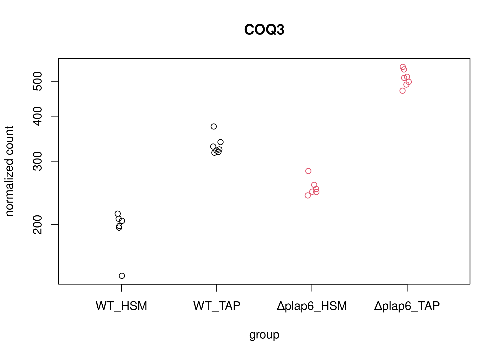

    # with ggplot
    d <- plotCounts(dds, gene = gene, intgroup = c("condition","media","genotype"), col=colData(dds)$genotype, main =anno[gene,"geneSymbol"], returnData=TRUE)
    d %>% head() %>% kable() %>% kable_styling("striped", full_width = T) %>% scroll_box(height = "400px")

<table class="table table-striped" style="margin-left: auto; margin-right: auto;">
<thead>
<tr>
<th style="text-align:left;position: sticky; top:0; background-color: #FFFFFF;">
</th>
<th style="text-align:right;position: sticky; top:0; background-color: #FFFFFF;">
count
</th>
<th style="text-align:left;position: sticky; top:0; background-color: #FFFFFF;">
condition
</th>
<th style="text-align:left;position: sticky; top:0; background-color: #FFFFFF;">
media
</th>
<th style="text-align:left;position: sticky; top:0; background-color: #FFFFFF;">
genotype
</th>
</tr>
</thead>
<tbody>
<tr>
<td style="text-align:left;">
S1
</td>
<td style="text-align:right;">
318.3623
</td>
<td style="text-align:left;">
WT\_TAP
</td>
<td style="text-align:left;">
TAP
</td>
<td style="text-align:left;">
WT
</td>
</tr>
<tr>
<td style="text-align:left;">
S10
</td>
<td style="text-align:right;">
547.8516
</td>
<td style="text-align:left;">
Δplap6\_TAP
</td>
<td style="text-align:left;">
TAP
</td>
<td style="text-align:left;">
Δplap6
</td>
</tr>
<tr>
<td style="text-align:left;">
S11
</td>
<td style="text-align:right;">
470.6446
</td>
<td style="text-align:left;">
Δplap6\_TAP
</td>
<td style="text-align:left;">
TAP
</td>
<td style="text-align:left;">
Δplap6
</td>
</tr>
<tr>
<td style="text-align:left;">
S12
</td>
<td style="text-align:right;">
489.4928
</td>
<td style="text-align:left;">
Δplap6\_TAP
</td>
<td style="text-align:left;">
TAP
</td>
<td style="text-align:left;">
Δplap6
</td>
</tr>
<tr>
<td style="text-align:left;">
S13
</td>
<td style="text-align:right;">
514.3026
</td>
<td style="text-align:left;">
Δplap6\_TAP
</td>
<td style="text-align:left;">
TAP
</td>
<td style="text-align:left;">
Δplap6
</td>
</tr>
<tr>
<td style="text-align:left;">
S14
</td>
<td style="text-align:right;">
510.6331
</td>
<td style="text-align:left;">
Δplap6\_TAP
</td>
<td style="text-align:left;">
TAP
</td>
<td style="text-align:left;">
Δplap6
</td>
</tr>
</tbody>
</table>

    # extract data and save as table

    g1 <- ggplot(d, aes(x = condition, y = count, color = genotype)) + 
      geom_point() +
      ggtitle(anno[gene,"geneSymbol"])
    plot(g1)

    # more advanced:
    g1 <- ggplot(d, aes(x = media, y = count, color = genotype)) + 
      geom_boxplot(aes(group = condition, colour = genotype)) +
      geom_point(position=position_jitter(w = 0.1,h = 0)) +
      # geom_text_repel(aes(label = rownames(d))) +
      scale_y_continuous(trans = "log2") +
      theme_bw() +
      ggtitle(anno[gene,"geneSymbol"]) +
      theme(plot.title = element_text(hjust = 0.5))
    plot(g1)

### COQs

    # all COQ genes
    goi <- anno[c(PHO1,coqs[,"gene_id"]),]
    goi %>% kable()

<table>
<colgroup>
<col style="width: 1%" />
<col style="width: 1%" />
<col style="width: 1%" />
<col style="width: 0%" />
<col style="width: 2%" />
<col style="width: 0%" />
<col style="width: 1%" />
<col style="width: 0%" />
<col style="width: 2%" />
<col style="width: 4%" />
<col style="width: 19%" />
<col style="width: 1%" />
<col style="width: 6%" />
<col style="width: 5%" />
<col style="width: 4%" />
<col style="width: 1%" />
<col style="width: 2%" />
<col style="width: 5%" />
<col style="width: 1%" />
<col style="width: 2%" />
<col style="width: 2%" />
<col style="width: 1%" />
<col style="width: 3%" />
<col style="width: 18%" />
<col style="width: 1%" />
<col style="width: 2%" />
<col style="width: 1%" />
<col style="width: 0%" />
</colgroup>
<thead>
<tr class="header">
<th style="text-align: left;"></th>
<th style="text-align: left;">locusName_4532</th>
<th style="text-align: left;">initial_v6_locus_ID</th>
<th style="text-align: left;">action</th>
<th style="text-align: left;">Replacement_v5.v6._model</th>
<th style="text-align: left;">geneSymbol</th>
<th style="text-align: left;">strainLocusId</th>
<th style="text-align: left;">PMID</th>
<th style="text-align: left;">previousIdentifiers</th>
<th style="text-align: left;">Description</th>
<th style="text-align: left;">Comments</th>
<th style="text-align: left;">Polycistronic</th>
<th style="text-align: left;">TMHMM_transmembrane</th>
<th style="text-align: left;">TargetP</th>
<th style="text-align: left;">Predalgo</th>
<th style="text-align: left;">interactions</th>
<th style="text-align: left;">experimental_localization</th>
<th style="text-align: left;">CLiP_library</th>
<th style="text-align: left;">mutant_phenotypes</th>
<th style="text-align: left;">Plastid.ribosome_pulldown</th>
<th style="text-align: left;">TF_database..PMID.27067009.</th>
<th style="text-align: left;">Flagellar_Proteome</th>
<th style="text-align: left;">Co.expression.cluster..PMID.28710131.</th>
<th style="text-align: left;">GEnome.scale.Metabolic.Model</th>
<th style="text-align: left;">gene_id</th>
<th style="text-align: left;">previousIdentifiers_list</th>
<th style="text-align: left;">prev.symbols</th>
<th style="text-align: left;">id.symbol</th>
</tr>
</thead>
<tbody>
<tr class="odd">
<td style="text-align: left;">Cre08.g359300</td>
<td style="text-align: left;">Cre08.g359300_4532</td>
<td style="text-align: left;">Cr_08_38152</td>
<td style="text-align: left;"></td>
<td style="text-align: left;"></td>
<td style="text-align: left;">PHO1</td>
<td style="text-align: left;">4532_08_42146</td>
<td style="text-align: left;"></td>
<td style="text-align: left;">g8416.t1#PHO1</td>
<td style="text-align: left;">Alkaline phosphatase</td>
<td style="text-align: left;">Similar to C-terminal half of 145 kDa,
phosphate-deficiency inducible alkaline phosphatase, encoded by phoA,
from Synechococcus sp. PCC 7942.</td>
<td style="text-align: left;"></td>
<td style="text-align: left;">TMHMM: 1 helices (SP) Topology:
i13-35o</td>
<td style="text-align: left;">Secretory_pathway (RC 5 score: 0.227 on #1
protein)</td>
<td style="text-align: left;">Secretory_pathway (score 2.414 on #1
protein)</td>
<td style="text-align: left;"></td>
<td style="text-align: left;"></td>
<td style="text-align: left;"><a
href="https://www.chlamylibrary.org/showGene?geneIdentifier=Cre08.g359300"
class="uri">https://www.chlamylibrary.org/showGene?geneIdentifier=Cre08.g359300</a></td>
<td style="text-align: left;">no phenotype detected</td>
<td style="text-align: left;"></td>
<td style="text-align: left;"></td>
<td style="text-align: left;"></td>
<td style="text-align: left;">cluster 28</td>
<td style="text-align: left;"></td>
<td style="text-align: left;">Cre08.g359300</td>
<td style="text-align: left;">g8416.t1….</td>
<td style="text-align: left;">PHO1</td>
<td style="text-align: left;">PHO1</td>
</tr>
<tr class="even">
<td style="text-align: left;">Cre01.g029000</td>
<td style="text-align: left;">Cre01.g029000_4532</td>
<td style="text-align: left;">Cr_01_03107</td>
<td style="text-align: left;"></td>
<td style="text-align: left;"></td>
<td style="text-align: left;">COQD2</td>
<td style="text-align: left;">4532_01_03431</td>
<td style="text-align: left;"></td>
<td style="text-align: left;">UMM1#COQ5D#g661.t1#</td>
<td style="text-align: left;">Ubiquinone/menaquinone biosynthesis
methyltransferase</td>
<td style="text-align: left;">UbiE/COQ5 methyltransferase family#
possibly functioning in chloroplast</td>
<td style="text-align: left;"></td>
<td style="text-align: left;">TMHMM: 0 helices</td>
<td style="text-align: left;">Mitochondrion (RC 3 score: 0.670 TPlen: 12
on #1 protein)</td>
<td style="text-align: left;">Chloroplast (score 2.179 on #1
protein)</td>
<td style="text-align: left;"></td>
<td style="text-align: left;"></td>
<td style="text-align: left;"><a
href="https://www.chlamylibrary.org/showGene?geneIdentifier=Cre01.g029000"
class="uri">https://www.chlamylibrary.org/showGene?geneIdentifier=Cre01.g029000</a></td>
<td style="text-align: left;">no phenotype detected</td>
<td style="text-align: left;"></td>
<td style="text-align: left;"></td>
<td style="text-align: left;"></td>
<td style="text-align: left;">cluster 46</td>
<td style="text-align: left;"></td>
<td style="text-align: left;">Cre01.g029000</td>
<td style="text-align: left;">UMM1, CO….</td>
<td style="text-align: left;">UMM1#COQ5D</td>
<td style="text-align: left;">COQD2</td>
</tr>
<tr class="odd">
<td style="text-align: left;">Cre02.g084300</td>
<td style="text-align: left;">Cre02.g084300_4532</td>
<td style="text-align: left;">Cr_02_07298</td>
<td style="text-align: left;"></td>
<td style="text-align: left;"></td>
<td style="text-align: left;">COQ5</td>
<td style="text-align: left;">4532_02_08056</td>
<td style="text-align: left;"></td>
<td style="text-align: left;">COQ5C#UMM2#MENG#g1555.t1#</td>
<td style="text-align: left;">Phylloquinone biosynthesis
methyltransferase</td>
<td style="text-align: left;">UbiE/COQ5 methyltransferase family#
ortholog of AT1G23360, a 2-phytyl-1,4-naphthoquinone methyltransferase
that catalyzes the final step in phylloquinone (vitamin K1)
biosynthesis</td>
<td style="text-align: left;"></td>
<td style="text-align: left;">TMHMM: 0 helices</td>
<td style="text-align: left;">Mitochondrion (RC 2 score: 0.798 TPlen: 24
on #1 protein)</td>
<td style="text-align: left;">Chloroplast (score 2.589 on #1
protein)</td>
<td style="text-align: left;"></td>
<td style="text-align: left;"></td>
<td style="text-align: left;"><a
href="https://www.chlamylibrary.org/showGene?geneIdentifier=Cre02.g084300"
class="uri">https://www.chlamylibrary.org/showGene?geneIdentifier=Cre02.g084300</a></td>
<td style="text-align: left;">no phenotype detected</td>
<td style="text-align: left;"></td>
<td style="text-align: left;"></td>
<td style="text-align: left;"></td>
<td style="text-align: left;">cluster 26 (Mating
activation-specific)</td>
<td style="text-align: left;"></td>
<td style="text-align: left;">Cre02.g084300</td>
<td style="text-align: left;">COQ5C, U….</td>
<td style="text-align: left;">COQ5C#UMM2#MENG</td>
<td style="text-align: left;">COQ5</td>
</tr>
<tr class="even">
<td style="text-align: left;">Cre02.g112850</td>
<td style="text-align: left;">Cre02.g112850_4532</td>
<td style="text-align: left;">Cr_02_10181</td>
<td style="text-align: left;"></td>
<td style="text-align: left;"></td>
<td style="text-align: left;">COQ6</td>
<td style="text-align: left;">4532_02_11235</td>
<td style="text-align: left;"></td>
<td style="text-align: left;">COQ6#g2324.t1</td>
<td style="text-align: left;">Flavin-dependent monoxygenase</td>
<td style="text-align: left;">putative mitochondrial flavin-dependent
monoxygenase required for coenzyme Q biosynthesis [PMID: 12721307]
(UbiH)</td>
<td style="text-align: left;"></td>
<td style="text-align: left;">TMHMM: 0 helices</td>
<td style="text-align: left;">Mitochondrion (RC 2 score: 0.865 TPlen: 6
on #1 protein)</td>
<td style="text-align: left;">Mitochondrion (score 1.029 on #1
protein)</td>
<td style="text-align: left;"></td>
<td style="text-align: left;"></td>
<td style="text-align: left;"></td>
<td style="text-align: left;">no mutant mapped</td>
<td style="text-align: left;"></td>
<td style="text-align: left;"></td>
<td style="text-align: left;"></td>
<td style="text-align: left;">cluster 23</td>
<td style="text-align: left;">Name= beta-carotene
hydroxylase;beta-Cryptoxanthin hydroxylase;alpha-carotene hydroxylase
(zeinoxanthin forming)# KEGG= R07558;R07559;R07530# E.C.= 1.14.13.- #
[Stern 2009, Niyogi 1997];[Lohr 2005] # (<a href="PMID:30202653"
class="uri">PMID:30202653</a>)</td>
<td style="text-align: left;">Cre02.g112850</td>
<td style="text-align: left;">COQ6, g2….</td>
<td style="text-align: left;">COQ6</td>
<td style="text-align: left;">COQ6</td>
</tr>
<tr class="odd">
<td style="text-align: left;">Cre03.g154850</td>
<td style="text-align: left;">Cre03.g154850_4532</td>
<td style="text-align: left;">Cr_03_14287</td>
<td style="text-align: left;"></td>
<td style="text-align: left;"></td>
<td style="text-align: left;">COQ4</td>
<td style="text-align: left;">4532_03_15776</td>
<td style="text-align: left;"></td>
<td style="text-align: left;">g3157.t1#COQ4</td>
<td style="text-align: left;">Ubiquinone biosynthesis protein</td>
<td style="text-align: left;">ubiquinone biosynthesis protein COQ4
homolog</td>
<td style="text-align: left;"></td>
<td style="text-align: left;">TMHMM: 0 helices</td>
<td style="text-align: left;">Mitochondrion (RC 1 score: 0.912 TPlen:
120 on #1 protein)</td>
<td style="text-align: left;">Other (score - on #1 protein)</td>
<td style="text-align: left;"></td>
<td style="text-align: left;"></td>
<td style="text-align: left;"><a
href="https://www.chlamylibrary.org/showGene?geneIdentifier=Cre03.g154850"
class="uri">https://www.chlamylibrary.org/showGene?geneIdentifier=Cre03.g154850</a></td>
<td style="text-align: left;">no phenotype detected</td>
<td style="text-align: left;"></td>
<td style="text-align: left;"></td>
<td style="text-align: left;"></td>
<td style="text-align: left;">cluster 11</td>
<td style="text-align: left;"></td>
<td style="text-align: left;">Cre03.g154850</td>
<td style="text-align: left;">g3157.t1….</td>
<td style="text-align: left;">COQ4</td>
<td style="text-align: left;">COQ4</td>
</tr>
<tr class="even">
<td style="text-align: left;">Cre05.g245450</td>
<td style="text-align: left;">Cre05.g245450_4532</td>
<td style="text-align: left;">Cr_05_23506</td>
<td style="text-align: left;"></td>
<td style="text-align: left;"></td>
<td style="text-align: left;">COQ5A</td>
<td style="text-align: left;">4532_05_25995</td>
<td style="text-align: left;"></td>
<td style="text-align: left;">UMM4#COQ5A#g5224.t1#</td>
<td style="text-align: left;">Ubiquinone/menaquinone biosynthesis
methyltransferase</td>
<td style="text-align: left;"></td>
<td style="text-align: left;"></td>
<td style="text-align: left;">TMHMM: 0 helices</td>
<td style="text-align: left;">Mitochondrion (RC 2 score: 0.817 TPlen: 52
on #1 protein)</td>
<td style="text-align: left;">Mitochondrion (score 1.744 on #1
protein)</td>
<td style="text-align: left;"></td>
<td style="text-align: left;"></td>
<td style="text-align: left;"></td>
<td style="text-align: left;">no mutant mapped</td>
<td style="text-align: left;"></td>
<td style="text-align: left;"></td>
<td style="text-align: left;"></td>
<td style="text-align: left;">cluster 40</td>
<td style="text-align: left;"></td>
<td style="text-align: left;">Cre05.g245450</td>
<td style="text-align: left;">UMM4, CO….</td>
<td style="text-align: left;">UMM4#COQ5A</td>
<td style="text-align: left;">COQ5A</td>
</tr>
<tr class="odd">
<td style="text-align: left;">Cre06.g269550</td>
<td style="text-align: left;">Cre06.g269550_4532</td>
<td style="text-align: left;">Cr_06_27298</td>
<td style="text-align: left;"></td>
<td style="text-align: left;"></td>
<td style="text-align: left;">COQ9</td>
<td style="text-align: left;">4532_06_30185</td>
<td style="text-align: left;"></td>
<td style="text-align: left;">COQ9#g6048.t1</td>
<td style="text-align: left;">Ubiquinone biosynthesis protein</td>
<td style="text-align: left;">Putative ubiquinone biosynthesis protein,
mitochondrial precursor# similar to yeast ubiquinone biosynthesis
protein COQ9(gi 74644909)</td>
<td style="text-align: left;"></td>
<td style="text-align: left;">TMHMM: 0 helices</td>
<td style="text-align: left;">Mitochondrion (RC 2 score: 0.840 TPlen: 46
on #1 protein)</td>
<td style="text-align: left;">Chloroplast (score 1.005 on #1
protein)</td>
<td style="text-align: left;"></td>
<td style="text-align: left;"></td>
<td style="text-align: left;"><a
href="https://www.chlamylibrary.org/showGene?geneIdentifier=Cre06.g269550"
class="uri">https://www.chlamylibrary.org/showGene?geneIdentifier=Cre06.g269550</a></td>
<td style="text-align: left;">no phenotype detected</td>
<td style="text-align: left;"></td>
<td style="text-align: left;"></td>
<td style="text-align: left;"></td>
<td style="text-align: left;">cluster 14</td>
<td style="text-align: left;"></td>
<td style="text-align: left;">Cre06.g269550</td>
<td style="text-align: left;">COQ9, g6….</td>
<td style="text-align: left;">COQ9</td>
<td style="text-align: left;">COQ9</td>
</tr>
<tr class="even">
<td style="text-align: left;">Cre06.g286300</td>
<td style="text-align: left;">Cre06.g286300_4532</td>
<td style="text-align: left;">Cr_06_30048</td>
<td style="text-align: left;"></td>
<td style="text-align: left;"></td>
<td style="text-align: left;">COQ5B</td>
<td style="text-align: left;">4532_06_33210</td>
<td style="text-align: left;"></td>
<td style="text-align: left;">UMM5#COQ5B#g6653.t1#</td>
<td style="text-align: left;">Ubiquinone/menaquinone biosynthesis
methyltransferase</td>
<td style="text-align: left;"></td>
<td style="text-align: left;"></td>
<td style="text-align: left;">TMHMM: 0 helices</td>
<td style="text-align: left;">Mitochondrion (RC 4 score: 0.396 TPlen: 25
on #1 protein)</td>
<td style="text-align: left;">Chloroplast (score 1.218 on #1
protein)</td>
<td style="text-align: left;"></td>
<td style="text-align: left;"></td>
<td style="text-align: left;"><a
href="https://www.chlamylibrary.org/showGene?geneIdentifier=Cre06.g286300"
class="uri">https://www.chlamylibrary.org/showGene?geneIdentifier=Cre06.g286300</a></td>
<td style="text-align: left;">no phenotype detected</td>
<td style="text-align: left;"></td>
<td style="text-align: left;"></td>
<td style="text-align: left;"></td>
<td style="text-align: left;">cluster 19</td>
<td style="text-align: left;"></td>
<td style="text-align: left;">Cre06.g286300</td>
<td style="text-align: left;">UMM5, CO….</td>
<td style="text-align: left;">UMM5#COQ5B</td>
<td style="text-align: left;">COQ5B</td>
</tr>
<tr class="odd">
<td style="text-align: left;">Cre06.g291800</td>
<td style="text-align: left;">Cre06.g291800_4532</td>
<td style="text-align: left;">Cr_06_30659</td>
<td style="text-align: left;"></td>
<td style="text-align: left;"></td>
<td style="text-align: left;">COQ2</td>
<td style="text-align: left;">4532_06_33881</td>
<td style="text-align: left;"></td>
<td style="text-align: left;">#g6761.t1#COQ2</td>
<td
style="text-align: left;">Para-hydroxybenzoate-polyprenyltransferase</td>
<td
style="text-align: left;">para-hydroxybenzoate-polyprenyltransferase,
mitochondrial precursor# UbiA homolog</td>
<td style="text-align: left;"></td>
<td style="text-align: left;">TMHMM: 6 helices Topology:
i194-213o218-240i273-290o314-336i343-365o391-413i</td>
<td style="text-align: left;">Mitochondrion (RC 3 score: 0.826 TPlen: 90
on #1 protein)</td>
<td style="text-align: left;">Chloroplast (score 0.663 on #1
protein)</td>
<td style="text-align: left;"></td>
<td style="text-align: left;"></td>
<td style="text-align: left;"><a
href="https://www.chlamylibrary.org/showGene?geneIdentifier=Cre06.g291800"
class="uri">https://www.chlamylibrary.org/showGene?geneIdentifier=Cre06.g291800</a></td>
<td style="text-align: left;">no phenotype detected</td>
<td style="text-align: left;"></td>
<td style="text-align: left;"></td>
<td style="text-align: left;"></td>
<td style="text-align: left;">cluster 8 (Lysin-treatment induced)</td>
<td style="text-align: left;"></td>
<td style="text-align: left;">Cre06.g291800</td>
<td style="text-align: left;">, g6761…..</td>
<td style="text-align: left;">COQ2</td>
<td style="text-align: left;">COQ2</td>
</tr>
<tr class="even">
<td style="text-align: left;">Cre07.g345700</td>
<td style="text-align: left;">Cre07.g345700_4532</td>
<td style="text-align: left;">Cr_07_36374</td>
<td style="text-align: left;"></td>
<td style="text-align: left;"></td>
<td style="text-align: left;">COQ10</td>
<td style="text-align: left;">4532_07_40190</td>
<td style="text-align: left;"></td>
<td style="text-align: left;">#COQ10#g8044.t1</td>
<td style="text-align: left;">Coenzyme Q-binding protein</td>
<td style="text-align: left;">Putative coenzyme Q-binding protein COQ10,
mitochondrial precursor# similiar to COQ10_YEAST Coenzyme Q-binding
protein COQ10, mitochondrial precursor (gi 74676458)</td>
<td style="text-align: left;"></td>
<td style="text-align: left;">TMHMM: 0 helices</td>
<td style="text-align: left;">Mitochondrion (RC 3 score: 0.598 TPlen: 71
on #1 protein)</td>
<td style="text-align: left;">Chloroplast (score 1.100 on #1
protein)</td>
<td style="text-align: left;"></td>
<td style="text-align: left;"></td>
<td style="text-align: left;"><a
href="https://www.chlamylibrary.org/showGene?geneIdentifier=Cre07.g345700"
class="uri">https://www.chlamylibrary.org/showGene?geneIdentifier=Cre07.g345700</a></td>
<td style="text-align: left;">no phenotype detected</td>
<td style="text-align: left;"></td>
<td style="text-align: left;"></td>
<td style="text-align: left;"></td>
<td style="text-align: left;">cluster 1</td>
<td style="text-align: left;"></td>
<td style="text-align: left;">Cre07.g345700</td>
<td style="text-align: left;">, COQ10,….</td>
<td style="text-align: left;">COQ10</td>
<td style="text-align: left;">COQ10</td>
</tr>
<tr class="odd">
<td style="text-align: left;">Cre10.g423750</td>
<td style="text-align: left;">Cre10.g423750_4532</td>
<td style="text-align: left;">Cr_10_46047</td>
<td style="text-align: left;"></td>
<td style="text-align: left;"></td>
<td style="text-align: left;">COQ3</td>
<td style="text-align: left;">4532_10_50891</td>
<td style="text-align: left;"></td>
<td style="text-align: left;">COQ3#g10480.t1#</td>
<td style="text-align: left;">Hexaprenyldihydroxybenzoate
methyltransferase</td>
<td style="text-align: left;">Similar to yeast
hexaprenyldihydroxybenzoate methyltransferase (GI:92090588), involved in
Coenzyme Q biosynthesis</td>
<td style="text-align: left;"></td>
<td style="text-align: left;">TMHMM: 0 helices</td>
<td style="text-align: left;">Mitochondrion (RC 5 score: 0.771 TPlen: 30
on #1 protein)</td>
<td style="text-align: left;">Chloroplast (score 1.139 on #1
protein)</td>
<td style="text-align: left;"></td>
<td style="text-align: left;"></td>
<td style="text-align: left;"><a
href="https://www.chlamylibrary.org/showGene?geneIdentifier=Cre10.g423750"
class="uri">https://www.chlamylibrary.org/showGene?geneIdentifier=Cre10.g423750</a></td>
<td style="text-align: left;">no phenotype detected</td>
<td style="text-align: left;"></td>
<td style="text-align: left;"></td>
<td style="text-align: left;"></td>
<td style="text-align: left;">cluster 7</td>
<td style="text-align: left;"></td>
<td style="text-align: left;">Cre10.g423750</td>
<td style="text-align: left;">COQ3, g1….</td>
<td style="text-align: left;">COQ3</td>
<td style="text-align: left;">COQ3</td>
</tr>
<tr class="even">
<td style="text-align: left;">Cre10.g429800</td>
<td style="text-align: left;">Cre10.g429800_4532</td>
<td style="text-align: left;">Cr_10_46685</td>
<td style="text-align: left;"></td>
<td style="text-align: left;"></td>
<td style="text-align: left;">COQ8</td>
<td style="text-align: left;">4532_10_51596</td>
<td style="text-align: left;"></td>
<td style="text-align: left;">ABC1#COQ8#g10617.t1</td>
<td style="text-align: left;">Ubiquinone biosynthesis protein</td>
<td style="text-align: left;">70 kDa protein similar to yeast COQ8
protein involved in ubiquinone-10 biosynthesis (PMID: 11279158)#
previously called ABC1 (for Activity of bc1 complex) (PMID: 14695938)#
similar to At4g01660 gene product (PMID: 15710684)</td>
<td style="text-align: left;"></td>
<td style="text-align: left;">TMHMM: 0 helices</td>
<td style="text-align: left;">Other (RC 5 on #1 protein)</td>
<td style="text-align: left;">Other (score - on #1 protein)</td>
<td style="text-align: left;"></td>
<td style="text-align: left;"></td>
<td style="text-align: left;"><a
href="https://www.chlamylibrary.org/showGene?geneIdentifier=Cre10.g429800"
class="uri">https://www.chlamylibrary.org/showGene?geneIdentifier=Cre10.g429800</a></td>
<td style="text-align: left;">no phenotype detected</td>
<td style="text-align: left;"></td>
<td style="text-align: left;"></td>
<td style="text-align: left;"></td>
<td style="text-align: left;">cluster 31</td>
<td style="text-align: left;"></td>
<td style="text-align: left;">Cre10.g429800</td>
<td style="text-align: left;">ABC1, CO….</td>
<td style="text-align: left;">ABC1#COQ8</td>
<td style="text-align: left;">COQ8</td>
</tr>
</tbody>
</table>

    n <- {0}
    for (i in goi$gene_id){
      n <- n+1
      print(n)
      print(i)
      s <- print(anno[i,"geneSymbol"])
      d <-  plotCounts(dds, gene=i, intgroup=c("condition","media","genotype"),main=s,returnData=TRUE)
      g <- ggplot(d, aes(x = media, y = count, color = genotype)) + 
        geom_boxplot(aes(fill=genotype), alpha=0.5) +
        geom_point(position=position_dodge(width=0.75)) +
        scale_y_continuous(trans = "log2",limits = c(250,2100)) +
        # coord_cartesian(ylim = c(0,2500)) +
        scale_color_manual(values=c("grey30","orchid1")) +
        scale_fill_manual(values=c("grey30","orchid1")) +
        theme_bw() +
        ggtitle(s) +
        theme(plot.title = element_text(hjust = 0.5)) +
        ylab("Normalized RNA counts [log2])")
      assign(x = paste("g",n, sep=""),g)
      plot(g)
    }

    ## [1] 1
    ## [1] "Cre08.g359300"
    ## [1] "PHO1"

    ## [1] 2
    ## [1] "Cre01.g029000"
    ## [1] "COQD2"

    ## [1] 3
    ## [1] "Cre02.g084300"
    ## [1] "COQ5"

    ## [1] 4
    ## [1] "Cre02.g112850"
    ## [1] "COQ6"

    ## [1] 5
    ## [1] "Cre03.g154850"
    ## [1] "COQ4"

    ## [1] 6
    ## [1] "Cre05.g245450"
    ## [1] "COQ5A"

    ## [1] 7
    ## [1] "Cre06.g269550"
    ## [1] "COQ9"

    ## [1] 8
    ## [1] "Cre06.g286300"
    ## [1] "COQ5B"

    ## [1] 9
    ## [1] "Cre06.g291800"
    ## [1] "COQ2"

    ## [1] 10
    ## [1] "Cre07.g345700"
    ## [1] "COQ10"

    ## [1] 11
    ## [1] "Cre10.g423750"
    ## [1] "COQ3"

    ## [1] 12
    ## [1] "Cre10.g429800"
    ## [1] "COQ8"

    length(goi)

    ## [1] 27

    p <- g9+g2+g11+g6+g8+g12+ plot_layout(guides = "collect", axis_titles="collect", axes = 'collect_y') & theme(legend.position = 'right')
    p

    # ga <- ggarrange(g1,g2,g3,g4,g5,g6,g7,g8,g9,g10,g11,g12,ncol = 3, nrow = 4)
    # ga1 <- ggarrange(g2+rremove("xlab"),
    #                 g8+rremove("xlab")+rremove("ylab"),
    #                 g6+rremove("xlab")+rremove("ylab"),
    #                 g12+rremove("xlab"),
    #                 g11+rremove("xlab")+rremove("ylab"),
    #                 g9+rremove("xlab")+rremove("ylab"),
    #                 common.legend = TRUE, legend = "right",
    #                 widths = c(1.05,1,1), heights = c(1,1),
    #                 ncol = 3, nrow = 2)
    # ga1
    # ggexport(ga1, filename = "pub_figures/Counts_COQs.pdf",width = 8.2, height = 4.7)
    # ggsave(ga1, filename = "pub_figures/Counts_COQs.png",width = 8.2, height = 4.7)

    # ((g2+g8+g6)/(g12+g11+g9)) + plot_layout(guides = "collect", axes = "collect", axis_titles="collect")

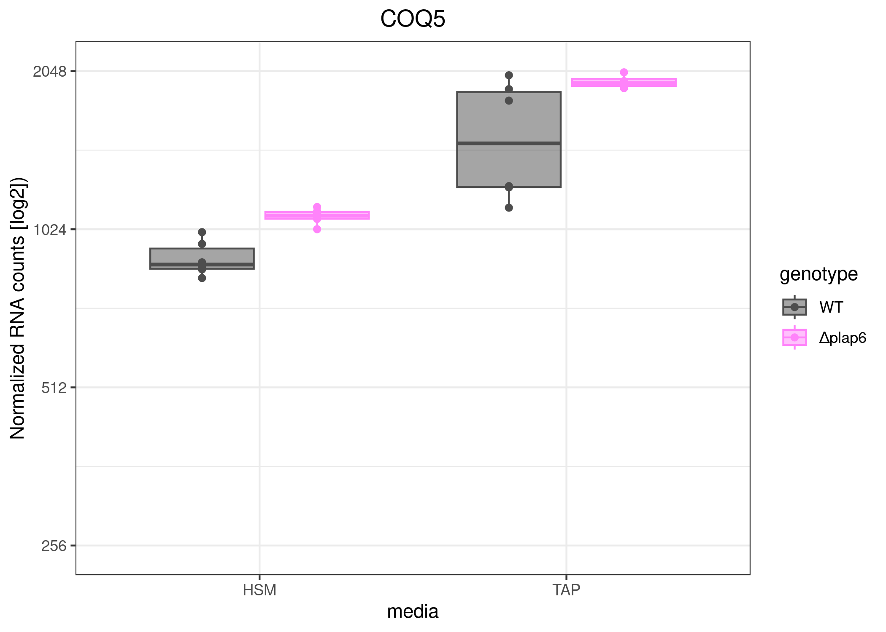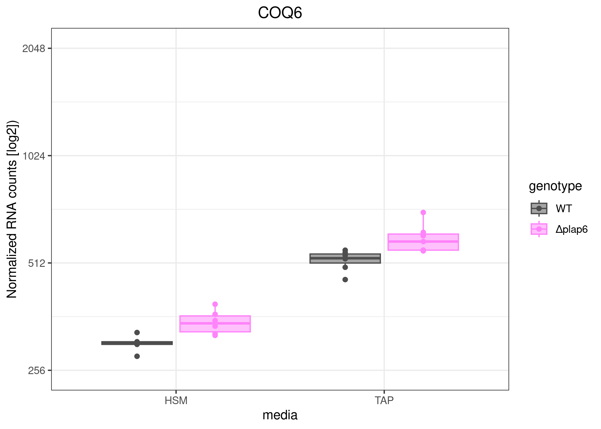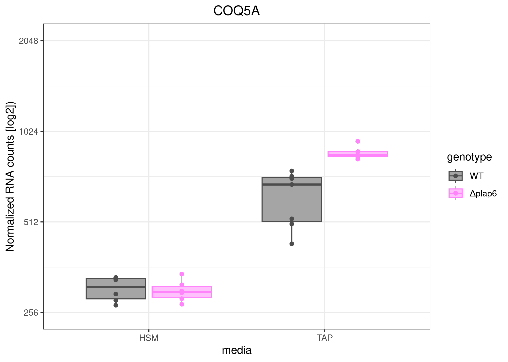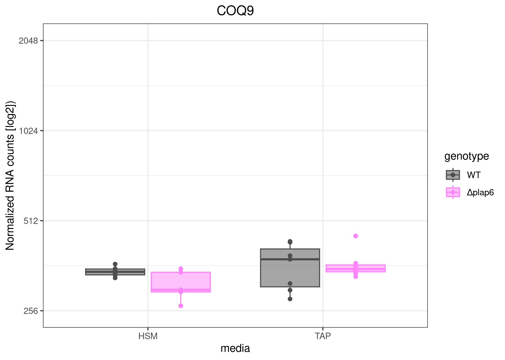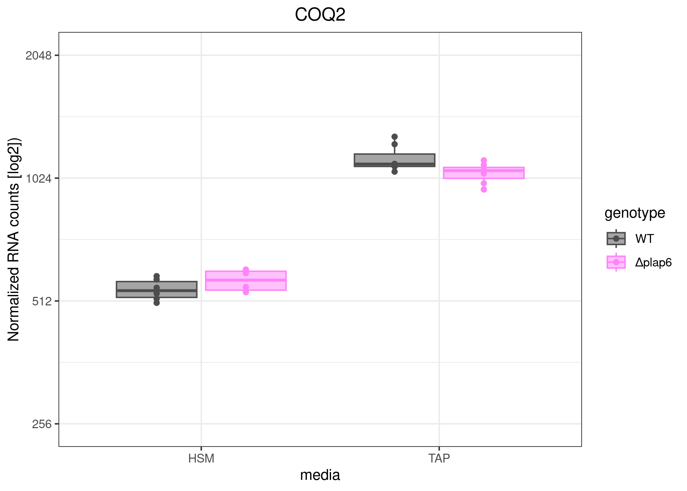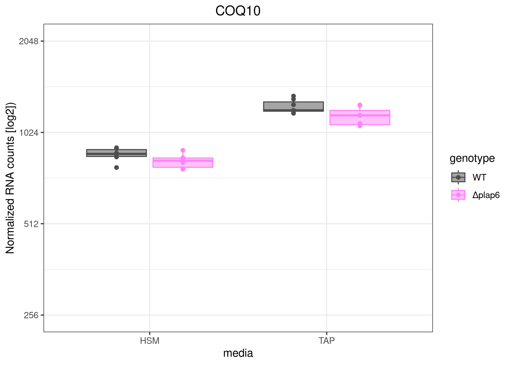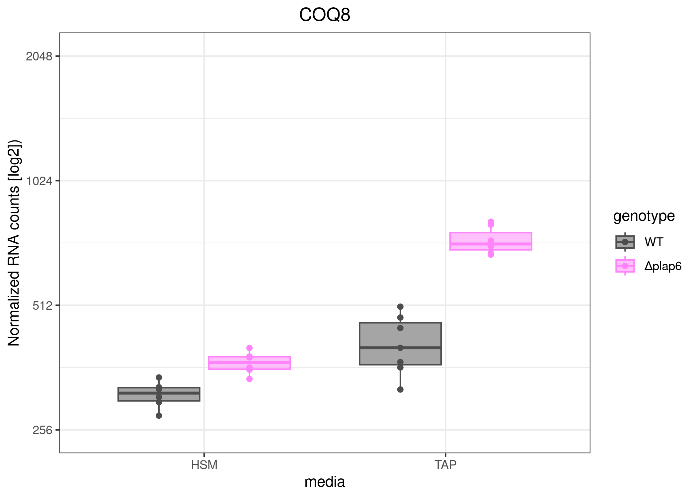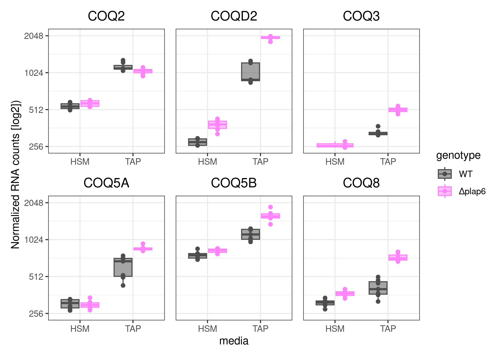

#### -export COQs

    ggexport(p, filename = paste(pubdir,"Counts_plap6_COQs.pdf",sep="/"),width = 8.2, height = 4.7)
    ggsave(p, filename = paste(pubdir,"Counts_plap6_COQs.tiff",sep="/"),width = 8.2, height = 4.7)

### CIA5, rbcl, LHCSR3, LHCSR1, PSBS

    anno[str_detect(anno[["geneSymbol"]],"CCM1"),1:9]

    ##                   locusName_4532 initial_v6_locus_ID action
    ## Cre02.g096300 Cre02.g096300_4532         Cr_02_08521       
    ##               Replacement_v5.v6._model geneSymbol strainLocusId
    ## Cre02.g096300                                CCM1 4532_02_09410
    ##                                                       PMID previousIdentifiers
    ## Cre02.g096300 11287669#15235119#11309511#18202004#21253860  CIA5#CCM1#g1955.t1
    ##                                     Description
    ## Cre02.g096300 Regulator of CO2-responsive genes

    anno[str_detect(anno[["previousIdentifiers"]],"CIA5"),1:9]

    ##                   locusName_4532 initial_v6_locus_ID action
    ## Cre02.g096300 Cre02.g096300_4532         Cr_02_08521       
    ##               Replacement_v5.v6._model geneSymbol strainLocusId
    ## Cre02.g096300                                CCM1 4532_02_09410
    ##                                                       PMID previousIdentifiers
    ## Cre02.g096300 11287669#15235119#11309511#18202004#21253860  CIA5#CCM1#g1955.t1
    ##                                     Description
    ## Cre02.g096300 Regulator of CO2-responsive genes

    anno[str_detect(anno[["geneSymbol"]],"PSBS"),1:9]

    ##                   locusName_4532 initial_v6_locus_ID action
    ## Cre01.g016600 Cre01.g016600_4532         Cr_01_01885       
    ## Cre01.g016750 Cre01.g016750_4532         Cr_01_01900       
    ##               Replacement_v5.v6._model geneSymbol strainLocusId
    ## Cre01.g016600                               PSBS1 4532_01_02081
    ## Cre01.g016750                               PSBS2 4532_01_02096
    ##                                                                PMID
    ## Cre01.g016600 16143839#27329221#27930292#20673336#10667783#15222740
    ## Cre01.g016750                   16143839#27329221#27930292#20673336
    ##               previousIdentifiers
    ## Cre01.g016600            #g397.t1
    ## Cre01.g016750            #g400.t1
    ##                                                        Description
    ## Cre01.g016600 chloroplast Photosystem II-associated 22 kDa protein
    ## Cre01.g016750 chloroplast Photosystem II-associated 22 kDa protein

    PLAP6 <- "Cre03.g188700"
    CIA5 <- "Cre02.g096300"
    rbcl <- "CreCp.g802313"
    LHCSR3 <- c("Cre08.g367500","Cre08.g367400")
    LHCSR1 <- "Cre08.g365900"
    PSBS <- c("Cre01.g016600","Cre01.g016750")

    ## multiple genes
    # all COQ genes
    goi <- anno[c(CIA5,PSBS,LHCSR1,LHCSR3),]  # ,rbcl
    goi[,c("geneSymbol","Description")]

    ##               geneSymbol                                          Description
    ## Cre02.g096300       CCM1                    Regulator of CO2-responsive genes
    ## Cre01.g016600      PSBS1 chloroplast Photosystem II-associated 22 kDa protein
    ## Cre01.g016750      PSBS2 chloroplast Photosystem II-associated 22 kDa protein
    ## Cre08.g365900     LHCSR1     Stress-related chlorophyll a/b binding protein 1
    ## Cre08.g367500    LHCSR3A     Stress-related chlorophyll a/b binding protein 2
    ## Cre08.g367400    LHCSR3B     Stress-related chlorophyll a/b binding protein 3

    goi$geneSymbol[1] <- "CIA5"

    n <- {0}
    g_list <- list()
    for (i in goi$gene_id){
      n <- n+1
      print(n)
      print(i)
      s <- print(goi[i,"geneSymbol"])
      d <-  plotCounts(dds, gene=i, intgroup=c("condition","media","genotype"),main=s,returnData=TRUE)
      g <- ggplot(d, aes(x = media, y = count, color = genotype)) + 
        geom_boxplot(aes(fill=genotype), alpha=0.5) +
        geom_point(position=position_dodge(width=0.75)) +
        scale_y_continuous(trans = "log2") +
        # coord_cartesian(ylim = c(0,2500)) +
        scale_color_manual(values=c("grey30","orchid1")) +
        scale_fill_manual(values=c("grey30","orchid1")) +
        theme_bw() +
        #    ggtitle(paste0(s," (",goi[i,"gene_id"],")")) +
        ggtitle(s) +
        theme(plot.title = element_text(hjust = 0.5)) + 
        ylab("Normalized RNA counts [log2])")
      g_list[[s]] <- g
      assign(x = paste("g",n, sep=""),g)
      plot(g)
    }

    ## [1] 1
    ## [1] "Cre02.g096300"
    ## [1] "CIA5"

    ## [1] 2
    ## [1] "Cre01.g016600"
    ## [1] "PSBS1"

    ## [1] 3
    ## [1] "Cre01.g016750"
    ## [1] "PSBS2"

    ## [1] 4
    ## [1] "Cre08.g365900"
    ## [1] "LHCSR1"

    ## [1] 5
    ## [1] "Cre08.g367500"
    ## [1] "LHCSR3A"

    ## [1] 6
    ## [1] "Cre08.g367400"
    ## [1] "LHCSR3B"

    length(goi)

    ## [1] 27

    g_list

    ## $CIA5

    ## 
    ## $PSBS1

    ## 
    ## $PSBS2

    ## 
    ## $LHCSR1

    ## 
    ## $LHCSR3A

    ## 
    ## $LHCSR3B

    p <- patchwork::wrap_plots(g_list) + plot_layout(guides = "collect", axis_titles="collect", axes='collect_y')
    p

    # p <- g1 + g2 + plot_layout(guides = "collect", axis_titles="collect", axes='collect')
    # p

    # only rbcl in TAP
    i <- goi$gene_id[2]
    d <-  plotCounts(dds, gene=i, intgroup=c("condition","media","genotype"),main=s,returnData=TRUE)

    gt <- ggplot(d[d$media == "TAP",], aes(x = media, y = count, color = genotype)) + 
      geom_boxplot(aes(fill=genotype), alpha=0.5) +
      geom_point(position=position_dodge(width=0.75)) +
      scale_y_continuous(trans = "log2") +
      # coord_cartesian(ylim = c(0,2500)) +
      scale_color_manual(values=c("grey30","orchid1")) +
      scale_fill_manual(values=c("grey30","orchid1")) +
      theme_bw() +
      ggtitle(s) +
      theme(plot.title = element_text(hjust = 0.5))
    plot(gt)

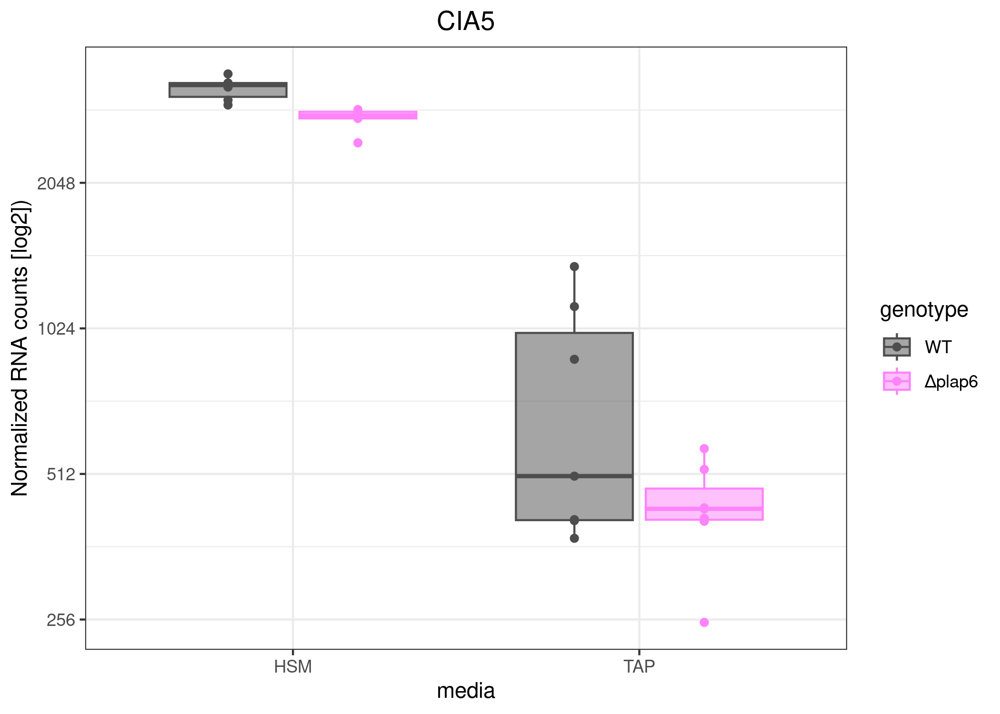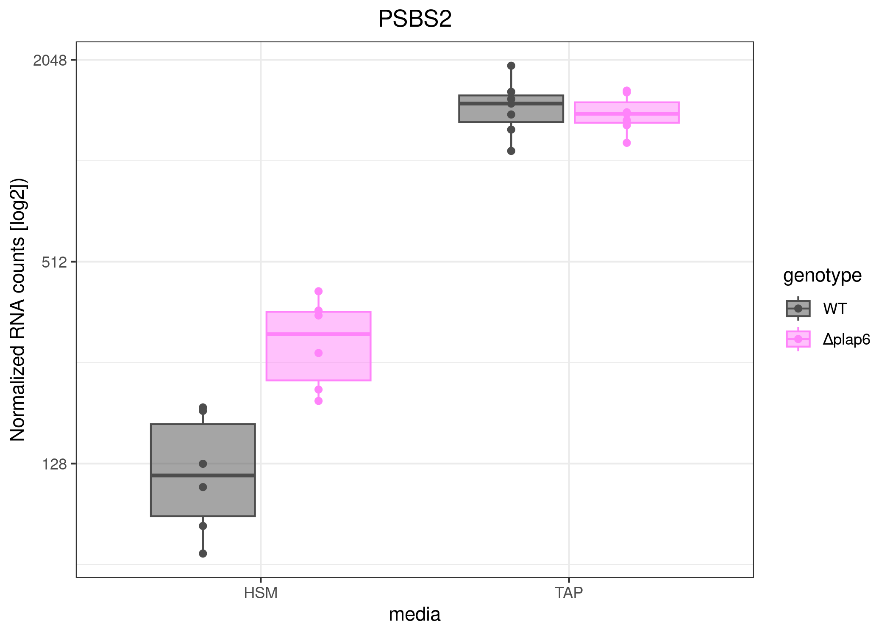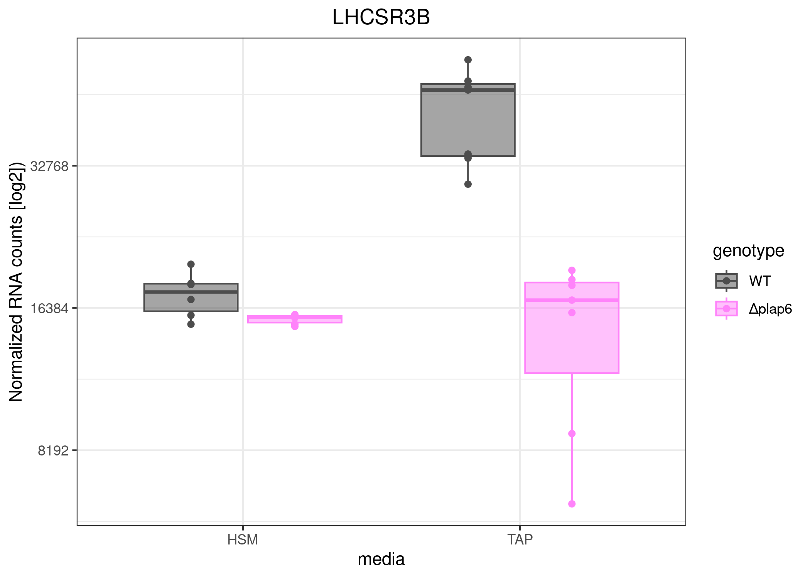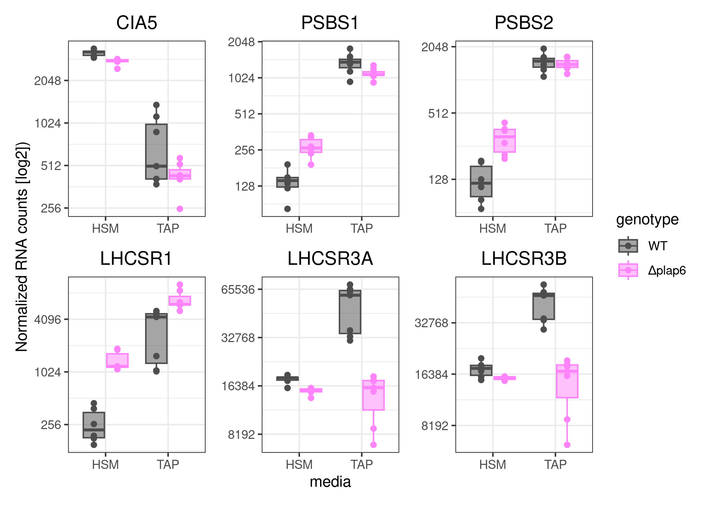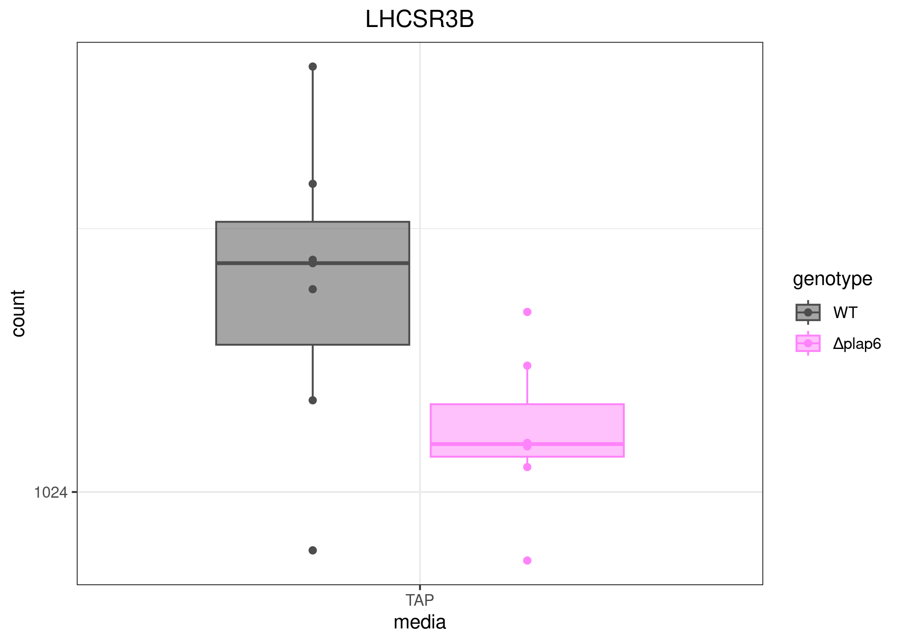

#### -export CIA5

    # ggexport(g1, filename = paste(pubdir,"Counts_plap6_CIA5.pdf",sep="/"),width = 8.2, height = 4.7)
    # ggsave(g1, filename = paste(pubdir,"Counts_plap6_CIA5.tiff",sep="/"),width = 8.2, height = 4.7)
    # 
    # ggexport(gt, filename = paste(pubdir,"Counts_plap6_rbcl.pdf",sep="/"),width = 8.2, height = 4.7)
    # ggsave(gt, filename = paste(pubdir,"Counts_plap6_rbcl.tiff",sep="/"),width = 8.2, height = 4.7)

    ggexport(p, filename = paste(pubdir,"Counts_plap6_CIA5+LHCSR+PSBS.pdf",sep="/"),width = 8.2, height = 4.7)
    ggsave(p, filename = paste(pubdir,"Counts_plap6_CIA5+LHCSR+PSBS.tiff",sep="/"),width = 8.2, height = 4.7)

### PQs

    library("ggpubr")

    ## multiple genes
    goi <- anno[goi_y,]
    dim(goi)

    ## [1] 12 27

    n <- {0}
    for (i in goi$gene_id){
      n <- n+1
      print(n)
      print(i)
      s <- print(anno[i,"id.symbol"])
      print
      d <-  plotCounts(dds, gene=i, intgroup=c("condition","media","genotype"),main=s,returnData=TRUE)
      g <- ggplot(d, aes(x = condition, y = count, color = genotype)) + 
        geom_boxplot(aes(group = condition, colour = genotype)) +
        geom_point() + #position=position_jitter(w = 0.1,h = 0)
        # geom_text_repel(aes(label = rownames(d))) + 
        theme_bw() +
        ggtitle(s) +
        theme(plot.title = element_text(hjust = 0.5))
      assign(x = paste("g",n, sep=""),g)
      plot(g)
    }

    ## [1] 1
    ## [1] "Cre09.g414000"
    ## [1] "HPT1"

    ## [1] 2
    ## [1] "Cre01.g013801"
    ## [1] "TCY1"

    ## [1] 3
    ## [1] "Cre14.g624350"
    ## [1] "VTE6"

    ## [1] 4
    ## [1] "Cre09.g393400"
    ## [1] "VTE4"

    ## [1] 5
    ## [1] "Cre09.g398993"
    ## [1] "HPD1"

    ## [1] 6
    ## [1] "Cre06.g283750"
    ## [1] "HST1"

    ## [1] 7
    ## [1] "Cre14.g625450"
    ## [1] "VTE3"

    ## [1] 8
    ## [1] "Cre12.g503550"
    ## [1] "MEC1"

    ## [1] 9
    ## [1] "Cre10.g455950"
    ## [1] "FAP407"

    ## [1] 10
    ## [1] "Cre16.g671000"
    ## [1] "NDA5"

    ## [1] 11
    ## [1] "Cre04.g219787"
    ## [1] "Cre04.g219787"

    ## [1] 12
    ## [1] "Cre09.g416500"
    ## [1] "CGL151"

    length(goi)

    ## [1] 27

    ga2 <- cowplot::plot_grid(g1,g2,g3,g4,g5,g6,g7,g8,g9,g10,g11,g12, byrow = FALSE, nrow = 4, ncol = 3)
    ga2

    # ggexport(ga, filename = "graphs3/Counts_YYK.pdf",width = 12, height = 12)

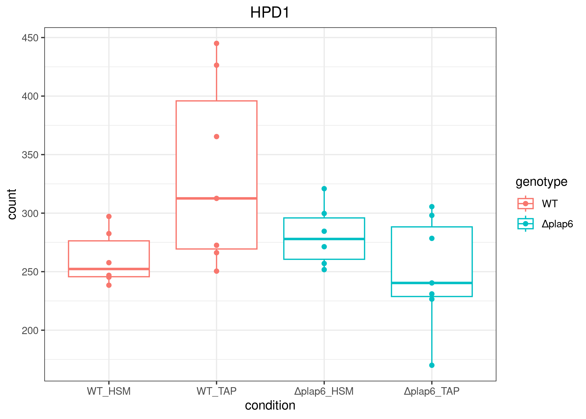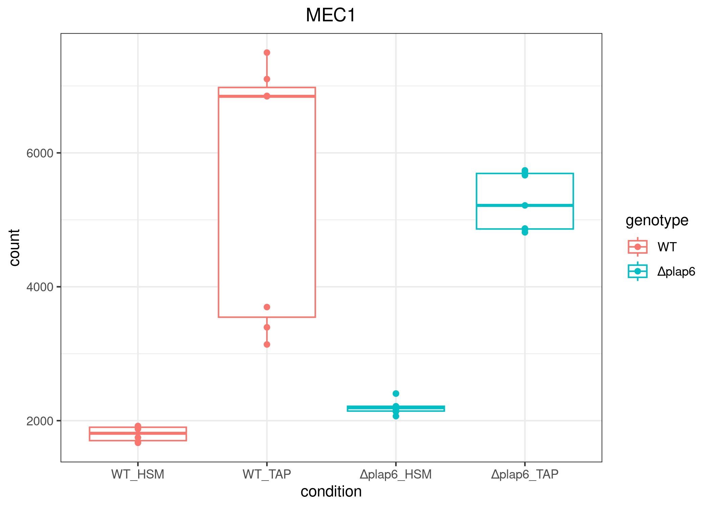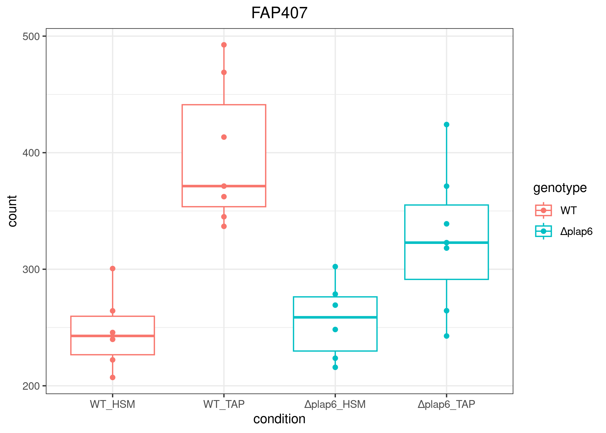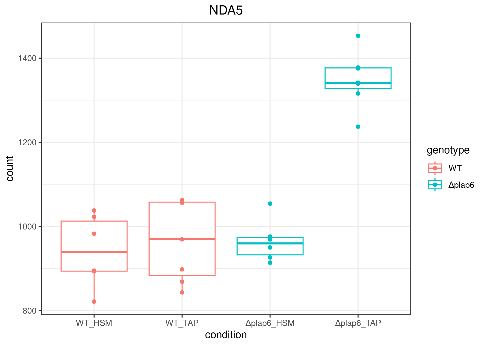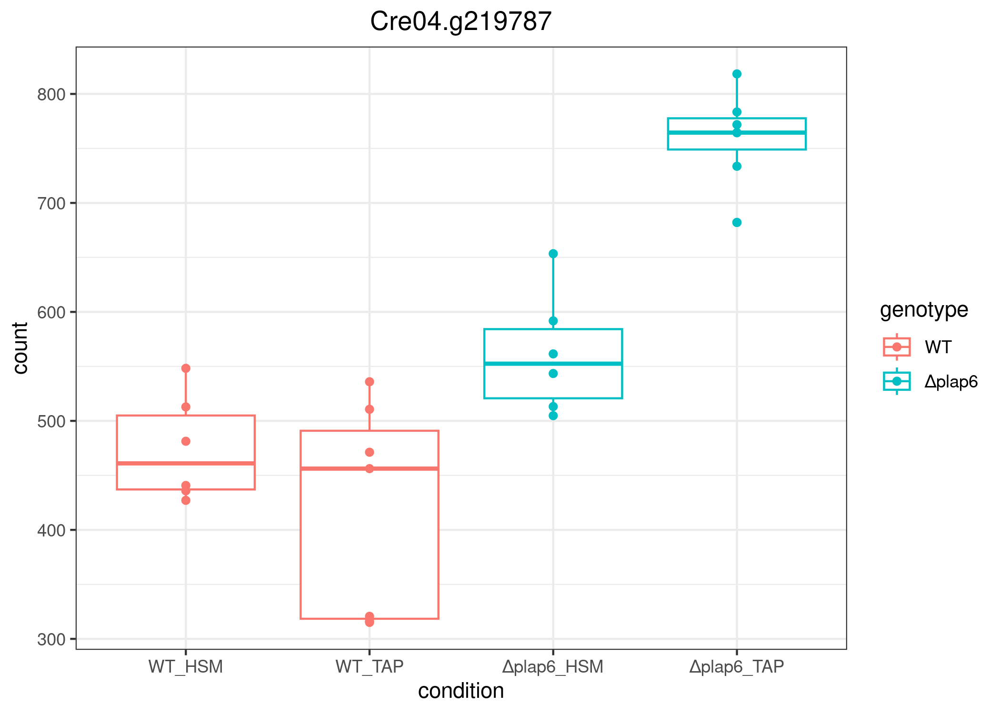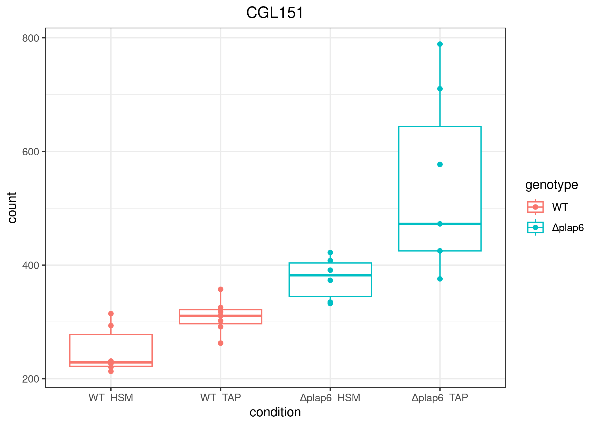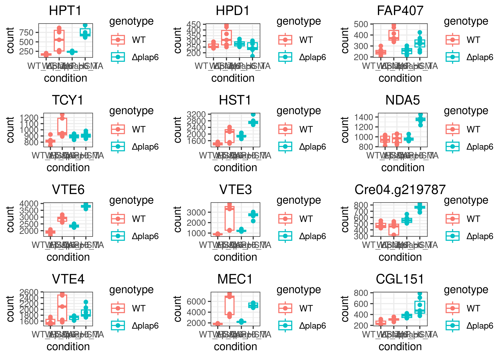

## Plot Counts v2

    # "WT_TAP"     "Δplap6_TAP" "WT_HSM"     "Δplap6_HSM"
    group.colors <- c("grey50","black","orchid1","orchid4")

    goi <- anno[c(PHO1,coqs[,"gene_id"]),]

    # coqs6 <- c("COQ2","COQD2","COQ3","COQ5A","COQ5B","COQ8")
    # goi <- anno[coqs6,"gene_id"]

    l <- nrow(goi)
    all_counts <- {}
    for (i in 1:l){
      d <-  plotCounts(dds, gene=goi[i,"gene_id"], intgroup=c("condition","strain","media"), col=col,main=res$symbol[i],returnData=TRUE)
      d$Gene <- rep(goi[i,"geneSymbol"],length(rownames(d)))
      d$sample <- rownames(d)
      rownames(d) <- {}
      all_counts <- bind_rows(all_counts,d)
    }

    all_counts$condition <- factor(all_counts$condition, levels = c("WT_TAP","WT_HSM","Δplap6_TAP","Δplap6_HSM"))

    all_counts$Gene <- factor(all_counts$Gene)
    levels(all_counts$Gene)

    ##  [1] "COQ10" "COQ2"  "COQ3"  "COQ4"  "COQ5"  "COQ5A" "COQ5B" "COQ6"  "COQ8" 
    ## [10] "COQ9"  "COQD2" "PHO1"

    max_val <- 1.0*max(all_counts$count)

    # Plot
    # all_counts$Gene
    gcounts_coqs <- ggplot(all_counts, aes(x = Gene, y = count, col=condition)) +
      geom_boxplot(fatten = 1) +
      scale_fill_manual(values = "grey") +
      scale_color_manual(values = "black") +
      geom_point(position = position_dodge(width = 0.75)) + 
      scale_color_manual(values = group.colors) +
      labs(title = "COQ genes all") + 
      theme_bw() +
      removeGrid(x=T, y=T) +
      theme(axis.text.x = element_text(angle = 90)) +
      geom_vline(xintercept=seq(1,length(levels(all_counts$Gene))-1,1)+.5,color="grey") +
      scale_y_continuous(trans = "log2") & plot_annotation(title = colData(dds)$experiment[1])
    gcounts_coqs %>% print()

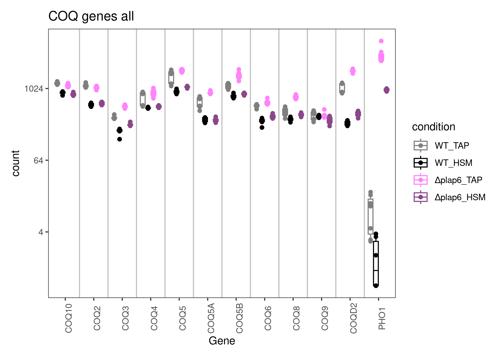

    ggexport(gcounts_coqs, filename = paste(pubdir,"Counts_plap6_COQs_aio_all.pdf",sep="/"),width = 8.2, height = 4.7)
    ggsave(gcounts_coqs, filename = paste(pubdir,"Counts_plap6_COQs_aoi_all.tiff",sep="/"),width = 8.2, height = 4.7)

    coqs6 <- c("COQ2","COQD2","COQ3","COQ5A","COQ5B","COQ8")
    goi <- anno[anno$geneSymbol %in% coqs6,]

    l <- nrow(goi)
    all_counts <- {}
    for (i in 1:l){
      d <-  plotCounts(dds, gene=goi[i,"gene_id"], intgroup=c("condition","strain","media"), col=col,main=res$symbol[i],returnData=TRUE)
      d$Gene <- rep(goi[i,"geneSymbol"],length(rownames(d)))
      d$sample <- rownames(d)
      rownames(d) <- {}
      all_counts <- bind_rows(all_counts,d)
    }

    # all_counts$Gene
    levels(all_counts$condition)

    ## [1] "WT_HSM"     "WT_TAP"     "Δplap6_HSM" "Δplap6_TAP"

    all_counts$Gene <- factor(all_counts$Gene, levels = coqs6)
    levels(all_counts$Gene)

    ## [1] "COQ2"  "COQD2" "COQ3"  "COQ5A" "COQ5B" "COQ8"

    max_val <- 1.0*max(all_counts$count)

    # Plot
    # all_counts$Gene
    gcounts_coqs <- ggplot(all_counts, aes(x = Gene, y = count, col=condition)) +
      geom_boxplot(fatten = 1) +
      scale_fill_manual(values = "grey") +
      scale_color_manual(values = "black") +
      geom_point(position = position_dodge(width = 0.75)) + 
      scale_color_manual(values = group.colors) +
      labs(title = "COQ genes (core)") + 
      theme_bw() +
      removeGrid(x=T, y=T) +
      geom_vline(xintercept=seq(1,length(levels(all_counts$Gene))-1,1)+.5,color="grey") +
      scale_y_continuous(trans = "log2", limits = c(2,NA)) & plot_annotation(title = colData(dds)$experiment[1])
    gcounts_coqs %>% print()

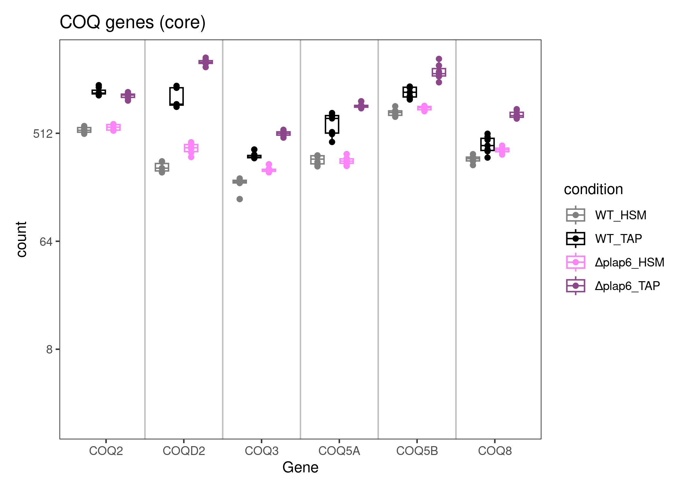

    ggexport(gcounts_coqs, filename = paste(pubdir,"Counts_plap6_COQs_aio.pdf",sep="/"),width = 8.2, height = 4.7)
    ggsave(gcounts_coqs, filename = paste(pubdir,"Counts_plap6_COQs_aoi.tiff",sep="/"),width = 8.2, height = 4.7)

## Volcano Plot

    library(EnhancedVolcano)

    plot(res_ashr_list $log2FoldChange,res1$baseMean )

    # colnames(mcols(dds))
    # mcols(dds) <- left_join(as.data.frame(mcols(dds)),anno[,c("gene_id","prev.symbols","id.symbol")],by = "gene_id")

    summary(res1)

    EnhancedVolcano(res1,
                    x = 'log2FoldChange',
                    y = 'pvalue',
                    lab = mcols(dds)$id.symbol,
                    # boxedLabels = TRUE,
                    labSize = 2.0,
                    drawConnectors = TRUE,
                    max.overlaps = 20,
                    # xlim = c(-10, 10),
                    # ylim = c(0, 50),
                    ylab = "Padj (-log10)",
                    title = 'Δplap6 vs. WT in TAP',
                    subtitle = "DE genes: ?? (red)",
                    # sub = "SVF",
                    pCutoff = 0.01,
                    FCcutoff = 2,
                    pointSize = 2.0,
                    legendLabels=c('Not sig.','|L2F| > 2','p-adj < 0.01',
                                   'p-adj & L2F'),
                    legendPosition = 'right',
    )

    # ggsave("graphs3/EnhancedVolcano.pdf",
    #        width = 12,
    #        height = 10)

    # with ggplot
    ggplot(as.data.frame(res1),aes(log2FoldChange,-log(padj))) +
      geom_point() +
      geom_point(data = as.data.frame(res1[rownames(top_res1),]), colour = "blue") + 
      geom_point(data = as.data.frame(res1[goi$gene_id,]), colour = "red") +
      geom_text_repel(data = as.data.frame(res1[goi$gene_id,]), aes(label=anno[goi$gene_id,"id.symbol"]),colour = "red",hjust=-0.5, vjust=-1) + xlim(-5,5)

    # ggsave("graphs3/Vulcano COQs-2.pdf",
    #        width = 10,
    #        height = 6)

## Volcano Plot v2

    res_ashr_list %>% names()

    ## [1] "WT_TAP.vs.HSM"               "plap6_TAP.vs.HSM"           
    ## [3] "HSM_plap6.vs.WT"             "TAP_plap6.vs.WT"            
    ## [5] "plap6_TAPvHSM.vs.WT_TAPvHSM"

    res <- res_ashr_list$plap6_TAPvHSM.vs.WT_TAPvHSM
    res_n <- res_l$plap6_TAPvHSM.vs.WT_TAPvHSM

    # of shrinked results
    total <- subset(res, padj< 0.05 & (log2FoldChange > 1 | log2FoldChange < -1 )) %>% nrow()
    up <- subset(res, padj< 0.05 & log2FoldChange > 1) %>% nrow()
    down <- subset(res, padj< 0.05 & log2FoldChange < -1) %>% nrow()

    # of "true" results
    total <- subset(res_n, padj< 0.05 & (log2FoldChange > 1 | log2FoldChange < -1 )) %>% nrow()
    up <- subset(res_n, padj< 0.05 & log2FoldChange > 1) %>% nrow()
    down <- subset(res_n, padj< 0.05 & log2FoldChange < -1) %>% nrow()

    # points outside the grid

    pmax <- 10^-50
    l2FCmax <- 6
    subset(res, padj < pmax | log2FoldChange > l2FCmax | log2FoldChange < -l2FCmax)

    ## log2 fold change (MMSE): strainΔplap6.mediaTAP effect 
    ## Wald test p-value: strainΔplap6.mediaTAP effect 
    ## DataFrame with 8 rows and 5 columns
    ##                baseMean log2FoldChange     lfcSE       pvalue         padj
    ##               <numeric>      <numeric> <numeric>    <numeric>    <numeric>
    ## Cre02.g090850  6905.479        1.12654 0.0596759  3.12764e-82  9.14333e-79
    ## Cre02.g095076  2913.021        1.97627 0.0844564 1.01453e-122 7.41469e-119
    ## Cre02.g141400 34268.536       -2.13699 0.1370365  9.99893e-57  1.82693e-53
    ## Cre04.g224500  5224.837        1.45701 0.0711136  4.52110e-95  1.65212e-91
    ## Cre06.g281250  9340.125        2.55789 0.1061751 6.77849e-131 9.90811e-127
    ## Cre12.g553700  3011.576        1.62132 0.0730825 1.84374e-110 8.98333e-107
    ## Cre13.g575500  1303.270        1.70389 0.0976397  1.33455e-69  3.25117e-66
    ## Cre14.g609202   409.184       -2.07614 0.1228248  6.82954e-66  1.42611e-62

    res[res$padj < pmax,]$padj <- pmax
    # res[res$log2FoldChange < -l2FCmax,]$log2FoldChange <- -l2FCmax

    subset(res, padj < pmax | log2FoldChange > l2FCmax | log2FoldChange < -l2FCmax)

    ## log2 fold change (MMSE): strainΔplap6.mediaTAP effect 
    ## Wald test p-value: strainΔplap6.mediaTAP effect 
    ## DataFrame with 0 rows and 5 columns

    mcols(dds) %>% nrow()

    ## [1] 14617

    res %>% nrow()

    ## [1] 14617

    volcano_dd <- EnhancedVolcano(res,
                                  lab = mcols(dds)[,"geneSymbol"],
                                  selectLab = top_list$plap6_TAPvHSM.vs.WT_TAPvHSM[1:101,"symbol"],
                                  x = 'log2FoldChange',
                                  y = 'padj',
                                  col=c("grey","grey","grey","orchid2"),
                                  title = "Differences in media effect between plap6 and WT",
                                  titleLabSize = 12,
                                  subtitle = paste0("upregulated: ",up,", downregulated: ",down,"\n(total: ",total,")"),
                                  #    subtitle = {},
                                  subtitleLabSize = 10,
                                  caption = NULL,
                                  # xlim = c(-7,7),
                                  ylim = c(0,50),
                                  pCutoff = 0.05,
                                  FCcutoff = 1,
                                  maxoverlapsConnectors = 20,
                                  drawConnectors = TRUE,
                                  widthConnectors = 0.5,
                                  colConnectors = "grey70",
                                  legendLabels=c('ns','ns','ns',
                                                 'padj < 0.05 & Log2FC > 1'),
                                  labSize = 4,
                                  axisLabSize = 12,
                                  legendLabSize = 12,
                                  legendIconSize = 3,
                                  gridlines.major = FALSE,
                                  gridlines.minor = FALSE,
                                  pointSize = 3
    )
    volcano_dd

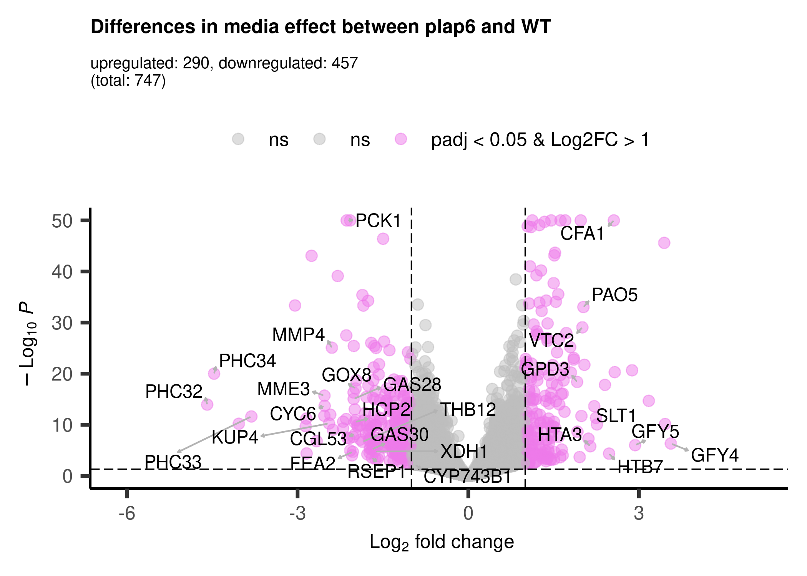

    top <- top_list$plap6_TAPvHSM.vs.WT_TAPvHSM[1:101,"symbol"] %>% .[!is.na(.)]

    # List TOP genes (with Symbol)
    anno[anno[anno$geneSymbol %in% top,"gene_id"],c("geneSymbol","previousIdentifiers","Description","previousIdentifiers","Description","Comments","TMHMM_transmembrane","TargetP","Predalgo","Flagellar_Proteome")] %>% kable() %>% kable_styling("striped", full_width = T) %>% scroll_box(height = "400px")

<table class="table table-striped" style="margin-left: auto; margin-right: auto;">
<thead>
<tr>
<th style="text-align:left;position: sticky; top:0; background-color: #FFFFFF;">
</th>
<th style="text-align:left;position: sticky; top:0; background-color: #FFFFFF;">
geneSymbol
</th>
<th style="text-align:left;position: sticky; top:0; background-color: #FFFFFF;">
previousIdentifiers
</th>
<th style="text-align:left;position: sticky; top:0; background-color: #FFFFFF;">
Description
</th>
<th style="text-align:left;position: sticky; top:0; background-color: #FFFFFF;">
previousIdentifiers.1
</th>
<th style="text-align:left;position: sticky; top:0; background-color: #FFFFFF;">
Description.1
</th>
<th style="text-align:left;position: sticky; top:0; background-color: #FFFFFF;">
Comments
</th>
<th style="text-align:left;position: sticky; top:0; background-color: #FFFFFF;">
TMHMM\_transmembrane
</th>
<th style="text-align:left;position: sticky; top:0; background-color: #FFFFFF;">
TargetP
</th>
<th style="text-align:left;position: sticky; top:0; background-color: #FFFFFF;">
Predalgo
</th>
<th style="text-align:left;position: sticky; top:0; background-color: #FFFFFF;">
Flagellar\_Proteome
</th>
</tr>
</thead>
<tbody>
<tr>
<td style="text-align:left;">
Cre01.g025200
</td>
<td style="text-align:left;">
MMP4
</td>
<td style="text-align:left;">
MMP4#g579.t1
</td>
<td style="text-align:left;">
Metalloproteinase of VMP family
</td>
<td style="text-align:left;">
MMP4#g579.t1
</td>
<td style="text-align:left;">
Metalloproteinase of VMP family
</td>
<td style="text-align:left;">
Conserved organelle protein with lipase active site
</td>
<td style="text-align:left;">
TMHMM: 0 helices
</td>
<td style="text-align:left;">
Secretory\_pathway (RC 3 score: 0.723 on \#1 protein)
</td>
<td style="text-align:left;">
Secretory\_pathway (score 0.591 on \#1 protein)
</td>
<td style="text-align:left;">
</td>
</tr>
<tr>
<td style="text-align:left;">
Cre01.g048350
</td>
<td style="text-align:left;">
CGL53
</td>
<td style="text-align:left;">
EBM1#g1074.t1
</td>
<td style="text-align:left;">
conserved protein with glycosyl hydrolase family 5 domain
</td>
<td style="text-align:left;">
EBM1#g1074.t1
</td>
<td style="text-align:left;">
conserved protein with glycosyl hydrolase family 5 domain
</td>
<td style="text-align:left;">
Conserved in the Green Lineage
</td>
<td style="text-align:left;">
TMHMM: 0 helices
</td>
<td style="text-align:left;">
Secretory\_pathway (RC 5 score: 0.511 on \#1 protein)
</td>
<td style="text-align:left;">
Other (score - on \#1 protein)
</td>
<td style="text-align:left;">
</td>
</tr>
<tr>
<td style="text-align:left;">
Cre01.g053150
</td>
<td style="text-align:left;">
GPD3
</td>
<td style="text-align:left;">
GPDH3#g1174.t2
</td>
<td style="text-align:left;">
Glycerol-3-phosphate dehydrogenase/dihydroxyacetone-3-phosphate
reductase
</td>
<td style="text-align:left;">
GPDH3#g1174.t2
</td>
<td style="text-align:left;">
Glycerol-3-phosphate dehydrogenase/dihydroxyacetone-3-phosphate
reductase
</td>
<td style="text-align:left;">
Identified as GPDH3 (PMID 22358185)# Closely related to nearby GPDH2
</td>
<td style="text-align:left;">
TMHMM: 0 helices
</td>
<td style="text-align:left;">
Mitochondrion (RC 3 score: 0.898 TPlen: 42 on \#1 protein)
</td>
<td style="text-align:left;">
Chloroplast (score 3.157 on \#1 protein)
</td>
<td style="text-align:left;">
</td>
</tr>
<tr>
<td style="text-align:left;">
Cre09.g388355
</td>
<td style="text-align:left;">
PHC33
</td>
<td style="text-align:left;">
PHC20#g9538.t1
</td>
<td style="text-align:left;">
Pherophorin-chlamydomonas homolog 33
</td>
<td style="text-align:left;">
PHC20#g9538.t1
</td>
<td style="text-align:left;">
Pherophorin-chlamydomonas homolog 33
</td>
<td style="text-align:left;">
Belongs to the large pherophorin-family, a family of glycoproteins with
a central hydroxyproline-rich (HR) domain#
</td>
<td style="text-align:left;">
TMHMM: 0 helices
</td>
<td style="text-align:left;">
Mitochondrion (RC 4 score: 0.575 TPlen: 37 on \#1 protein)
</td>
<td style="text-align:left;">
Secretory\_pathway (score 1.087 on \#1 protein)
</td>
<td style="text-align:left;">
Total Peptides:1 (Axoneme:1; M+M:0; KCl extract:0; Tergitol:0)
</td>
</tr>
<tr>
<td style="text-align:left;">
Cre09.g388353
</td>
<td style="text-align:left;">
PHC34
</td>
<td style="text-align:left;">
g9537.t1
</td>
<td style="text-align:left;">
Pherophorin-chlamydomonas homolog 34
</td>
<td style="text-align:left;">
g9537.t1
</td>
<td style="text-align:left;">
Pherophorin-chlamydomonas homolog 34
</td>
<td style="text-align:left;">
Belongs to the large pherophorin-family, a family of glycoproteins with
a central hydroxyproline-rich (HR) domain#
</td>
<td style="text-align:left;">
TMHMM: 0 helices
</td>
<td style="text-align:left;">
Secretory\_pathway (RC 4 score: 0.625 on \#1 protein)
</td>
<td style="text-align:left;">
Secretory\_pathway (score 1.505 on \#1 protein)
</td>
<td style="text-align:left;">
Total Peptides:1 (Axoneme:1; M+M:0; KCl extract:0; Tergitol:0)
</td>
</tr>
<tr>
<td style="text-align:left;">
Cre09.g388351
</td>
<td style="text-align:left;">
PHC32
</td>
<td style="text-align:left;">
g9535.t1
</td>
<td style="text-align:left;">
Pherophorin-chlamydomonas homolog 32
</td>
<td style="text-align:left;">
g9535.t1
</td>
<td style="text-align:left;">
Pherophorin-chlamydomonas homolog 32
</td>
<td style="text-align:left;">
Belongs to the large pherophorin-family, a family of glycoproteins with
a central hydroxyproline-rich (HR) domain#
</td>
<td style="text-align:left;">
TMHMM: 0 helices
</td>
<td style="text-align:left;">
Secretory\_pathway (RC 2 score: 0.766 on \#1 protein)
</td>
<td style="text-align:left;">
Secretory\_pathway (score 1.885 on \#1 protein)
</td>
<td style="text-align:left;">
Total Peptides:1 (Axoneme:1; M+M:0; KCl extract:0; Tergitol:0)
</td>
</tr>
<tr>
<td style="text-align:left;">
Cre02.g141400
</td>
<td style="text-align:left;">
PCK1
</td>
<td style="text-align:left;">
g2662.t1#PCK1#
</td>
<td style="text-align:left;">
Phosphoenolpyruvate carboxykinase
</td>
<td style="text-align:left;">
g2662.t1#PCK1#
</td>
<td style="text-align:left;">
Phosphoenolpyruvate carboxykinase
</td>
<td style="text-align:left;">
phosphoenolpyruvate carboxykinase# PEP carboxykinase (EC 4.1.1.49)#
based on high similarity to PEPCK from Panicum maximum (GenBank
AAQ10076) and many other plants# Target-P predicts no organelle
targeting, so probably cytosolic form# may represent a minor splice
variant of PCK1a
</td>
<td style="text-align:left;">
TMHMM: 0 helices
</td>
<td style="text-align:left;">
Chloroplast (RC 5 score: 0.704 on \#1 protein)
</td>
<td style="text-align:left;">
Chloroplast (score 3.609 on \#1 protein)
</td>
<td style="text-align:left;">
</td>
</tr>
<tr>
<td style="text-align:left;">
Cre04.g217350
</td>
<td style="text-align:left;">
KUP4
</td>
<td style="text-align:left;">
KUP4#g4525.t1#
</td>
<td style="text-align:left;">
Potassium ion uptake transporter
</td>
<td style="text-align:left;">
KUP4#g4525.t1#
</td>
<td style="text-align:left;">
Potassium ion uptake transporter
</td>
<td style="text-align:left;">
Potassium ion uptake transporter, distantly linked to KUP5 gene encoding
a similar protein
</td>
<td style="text-align:left;">
TMHMM: 11 helices (SP) Topology:
i29-51o66-88i228-250o265-284i296-318o343-365i372-394o414-436i497-519o523-545i552-571o
</td>
<td style="text-align:left;">
Other (RC 3 on \#1 protein)
</td>
<td style="text-align:left;">
Other (score - on \#1 protein)
</td>
<td style="text-align:left;">
</td>
</tr>
<tr>
<td style="text-align:left;">
Cre06.g265400
</td>
<td style="text-align:left;">
HTB12
</td>
<td style="text-align:left;">
HTB11#HTB42#g5960.t1#HTB12
</td>
<td style="text-align:left;">
Histone H2B
</td>
<td style="text-align:left;">
HTB11#HTB42#g5960.t1#HTB12
</td>
<td style="text-align:left;">
Histone H2B
</td>
<td style="text-align:left;">
replication linked H2B# histone gene cluster XII (type 34BA)
</td>
<td style="text-align:left;">
TMHMM: 0 helices
</td>
<td style="text-align:left;">
Other (RC 2 on \#1 protein)
</td>
<td style="text-align:left;">
Other (score - on \#1 protein)
</td>
<td style="text-align:left;">
</td>
</tr>
<tr>
<td style="text-align:left;">
Cre06.g267950
</td>
<td style="text-align:left;">
HTR10
</td>
<td style="text-align:left;">
HTR10#g6012.t1
</td>
<td style="text-align:left;">
Histone H3
</td>
<td style="text-align:left;">
HTR10#g6012.t1
</td>
<td style="text-align:left;">
Histone H3
</td>
<td style="text-align:left;">
replication linked H3# histone gene cluster X (type 34AB)
</td>
<td style="text-align:left;">
TMHMM: 0 helices Topology: i
</td>
<td style="text-align:left;">
Chloroplast (RC 5 score: 0.605 on \#1 protein)
</td>
<td style="text-align:left;">
Chloroplast (score 1.353 on \#1 protein)
</td>
<td style="text-align:left;">
</td>
</tr>
<tr>
<td style="text-align:left;">
Cre06.g273850
</td>
<td style="text-align:left;">
HTB7
</td>
<td style="text-align:left;">
\#HTB7#g6143.t1
</td>
<td style="text-align:left;">
Histone H2B
</td>
<td style="text-align:left;">
\#HTB7#g6143.t1
</td>
<td style="text-align:left;">
Histone H2B
</td>
<td style="text-align:left;">
replication linked H2B# histone gene cluster VII (type 34AB)
</td>
<td style="text-align:left;">
TMHMM: 0 helices
</td>
<td style="text-align:left;">
Other (RC 2 on \#1 protein)
</td>
<td style="text-align:left;">
Other (score - on \#1 protein)
</td>
<td style="text-align:left;">
</td>
</tr>
<tr>
<td style="text-align:left;">
Cre06.g275800
</td>
<td style="text-align:left;">
HTB3
</td>
<td style="text-align:left;">
HTB31#HTB4#g6183.t1
</td>
<td style="text-align:left;">
Histone H2B
</td>
<td style="text-align:left;">
HTB31#HTB4#g6183.t1
</td>
<td style="text-align:left;">
Histone H2B
</td>
<td style="text-align:left;">
replication linked H2B# histone gene cluster III (type 34AB)
</td>
<td style="text-align:left;">
TMHMM: 0 helices
</td>
<td style="text-align:left;">
Other (RC 2 on \#1 protein)
</td>
<td style="text-align:left;">
Other (score - on \#1 protein)
</td>
<td style="text-align:left;">
</td>
</tr>
<tr>
<td style="text-align:left;">
Cre06.g275850
</td>
<td style="text-align:left;">
HTA3
</td>
<td style="text-align:left;">
HTA6#g6184.t1#
</td>
<td style="text-align:left;">
Histone H2A
</td>
<td style="text-align:left;">
HTA6#g6184.t1#
</td>
<td style="text-align:left;">
Histone H2A
</td>
<td style="text-align:left;">
replication linked H2A# histone gene cluster III (type 43BA)
</td>
<td style="text-align:left;">
TMHMM: 0 helices
</td>
<td style="text-align:left;">
Other (RC 5 on \#1 protein)
</td>
<td style="text-align:left;">
Chloroplast (score 1.829 on \#1 protein)
</td>
<td style="text-align:left;">
</td>
</tr>
<tr>
<td style="text-align:left;">
Cre06.g276600
</td>
<td style="text-align:left;">
HTR2
</td>
<td style="text-align:left;">
g6200.t1#
</td>
<td style="text-align:left;">
Histone H3
</td>
<td style="text-align:left;">
g6200.t1#
</td>
<td style="text-align:left;">
Histone H3
</td>
<td style="text-align:left;">
replication linked H3# histone gene cluster II (type 43AB)
</td>
<td style="text-align:left;">
TMHMM: 0 helices Topology: i
</td>
<td style="text-align:left;">
Chloroplast (RC 5 score: 0.605 on \#1 protein)
</td>
<td style="text-align:left;">
Chloroplast (score 1.353 on \#1 protein)
</td>
<td style="text-align:left;">
</td>
</tr>
<tr>
<td style="text-align:left;">
Cre06.g276900
</td>
<td style="text-align:left;">
HTB1
</td>
<td style="text-align:left;">
HTB24#g6207.t1
</td>
<td style="text-align:left;">
Histone H2B
</td>
<td style="text-align:left;">
HTB24#g6207.t1
</td>
<td style="text-align:left;">
Histone H2B
</td>
<td style="text-align:left;">
replication linked H2B# histone gene cluster I (type 43BA)
</td>
<td style="text-align:left;">
TMHMM: 0 helices
</td>
<td style="text-align:left;">
Other (RC 1 on \#1 protein)
</td>
<td style="text-align:left;">
Other (score - on \#1 protein)
</td>
<td style="text-align:left;">
</td>
</tr>
<tr>
<td style="text-align:left;">
Cre06.g278245
</td>
<td style="text-align:left;">
PAO5
</td>
<td style="text-align:left;">
PAO9#Cre13.g600650.t1.2#g6387.t1#Cre13.g600650.t1.1
</td>
<td style="text-align:left;">
Pheophorbide a oxygenase-related protein
</td>
<td style="text-align:left;">
PAO9#Cre13.g600650.t1.2#g6387.t1#Cre13.g600650.t1.1
</td>
<td style="text-align:left;">
Pheophorbide a oxygenase-related protein
</td>
<td style="text-align:left;">
Contains Rieske iron-sulfur cluster and PAO domains and transmembrane
domain for attachment to thylakoid membrane# closely related to linked
Cre06.g305650# belongs to the classical family of short chain
dehydrogenases \[PMID: 15180984\]#
</td>
<td style="text-align:left;">
TMHMM: 2 helices Topology: i479-501o524-546i
</td>
<td style="text-align:left;">
Chloroplast (RC 3 score: 0.895 on \#1 protein)
</td>
<td style="text-align:left;">
Chloroplast (score 2.346 on \#1 protein)
</td>
<td style="text-align:left;">
</td>
</tr>
<tr>
<td style="text-align:left;">
Cre06.g281250
</td>
<td style="text-align:left;">
CFA1
</td>
<td style="text-align:left;">
\#CFA1#g6541.t1
</td>
<td style="text-align:left;">
Cyclopropane fatty acid synthase
</td>
<td style="text-align:left;">
\#CFA1#g6541.t1
</td>
<td style="text-align:left;">
Cyclopropane fatty acid synthase
</td>
<td style="text-align:left;">
Uses AdoMet to introduce a methylene group into fatty acids
</td>
<td style="text-align:left;">
TMHMM: 7 helices Topology:
o942-964i984-1006o1021-1040i1047-1069o1073-1092i1113-1135o1145-1167i
</td>
<td style="text-align:left;">
Other (RC 4 on \#1 protein)
</td>
<td style="text-align:left;">
Other (score - on \#1 protein)
</td>
<td style="text-align:left;">
</td>
</tr>
<tr>
<td style="text-align:left;">
Cre07.g354350
</td>
<td style="text-align:left;">
CYP743B1
</td>
<td style="text-align:left;">
CYP20#g8243.t1
</td>
<td style="text-align:left;">
Cytochrome P450, CYP197 superfamily
</td>
<td style="text-align:left;">
CYP20#g8243.t1
</td>
<td style="text-align:left;">
Cytochrome P450, CYP197 superfamily
</td>
<td style="text-align:left;">
cytochrome P450, unknown function, in CYP711 clan. The CYP711 clan
includes CYP711A1 of Arabidopsis (MAX1). This gene product makes a
carotenoid-derived branch inhibiting hormone. The CYP743 family has best
BLAST hits to CYP3 family members (animal sequences). The top 100 BLAST
hits were all animal sequences. The plant CYP711 clan may share a common
ancestor with the animal CYP3/CYP4 clan. Belongs to a cluster of three
highly similar CYP
</td>
<td style="text-align:left;">
TMHMM: 0 helices (SP)
</td>
<td style="text-align:left;">
Secretory\_pathway (RC 5 score: 0.255 on \#1 protein)
</td>
<td style="text-align:left;">
Mitochondrion (score 2.070 on \#1 protein)
</td>
<td style="text-align:left;">
</td>
</tr>
<tr>
<td style="text-align:left;">
Cre09.g393543
</td>
<td style="text-align:left;">
HCP2
</td>
<td style="text-align:left;">
Cre02.g129550.t1.1#Cre02.g129550.t1.2#g9757.t1#HCP2
</td>
<td style="text-align:left;">
Hybrid-cluster protein
</td>
<td style="text-align:left;">
Cre02.g129550.t1.1#Cre02.g129550.t1.2#g9757.t1#HCP2
</td>
<td style="text-align:left;">
Hybrid-cluster protein
</td>
<td style="text-align:left;">
Prismane/CO dehydrogenase family
</td>
<td style="text-align:left;">
TMHMM: 0 helices
</td>
<td style="text-align:left;">
Mitochondrion (RC 3 score: 0.775 TPlen: 58 on \#1 protein)
</td>
<td style="text-align:left;">
Mitochondrion (score 3.410 on \#1 protein)
</td>
<td style="text-align:left;">
</td>
</tr>
<tr>
<td style="text-align:left;">
Cre11.g467538
</td>
<td style="text-align:left;">
GOX8
</td>
<td style="text-align:left;">
GOX10#GOX8#g11468.t1#Cre18.g750800.t1.1
</td>
<td style="text-align:left;">
Glyoxal oxidase 8
</td>
<td style="text-align:left;">
GOX10#GOX8#g11468.t1#Cre18.g750800.t1.1
</td>
<td style="text-align:left;">
Glyoxal oxidase 8
</td>
<td style="text-align:left;">
The substrate of this oxidase is unsure, as the similarity is to both
glyoxal oxidases and galactose oxidases, found in fungi, bacteria,
animals and plants (both use the same Tyr radical / metal mechanism)#
the plant homologues are secreted, but the fate of the Chlamydomonas
isoforms is uncertain# belongs to a family of 20 genes more related to
each other than to their higher plant homologues, contain the kelch
repeat and a C-terminal domain of unknown function (E-set domains of
sugar-utilizing enzymes)# in tandem with GOX6 and GOX7
</td>
<td style="text-align:left;">
TMHMM: 1 helices (SP) Topology: i13-35o
</td>
<td style="text-align:left;">
Mitochondrion (RC 5 score: 0.464 TPlen: 49 on \#1 protein)
</td>
<td style="text-align:left;">
Secretory\_pathway (score 2.398 on \#1 protein)
</td>
<td style="text-align:left;">
</td>
</tr>
<tr>
<td style="text-align:left;">
Cre11.g481600
</td>
<td style="text-align:left;">
GAS28
</td>
<td style="text-align:left;">
GAS28#g11958.t1
</td>
<td style="text-align:left;">
Hydroxyproline-rich glycoprotein, stress-induced
</td>
<td style="text-align:left;">
GAS28#g11958.t1
</td>
<td style="text-align:left;">
Hydroxyproline-rich glycoprotein, stress-induced
</td>
<td style="text-align:left;">
hydroxyproline-rich glycoprotein whose mRNA is up-regulated in gametes,
in zygotes, by agglutination/cAMP treatment, by osmotic stress and by
cell wall removal \[PMID: 16183845\]. Closely linked to GAS30.
Independently sequenced: DQ017908.
</td>
<td style="text-align:left;">
TMHMM: 1 helices (SP) Topology: i7-29o
</td>
<td style="text-align:left;">
Secretory\_pathway (RC 3 score: 0.679 on \#1 protein)
</td>
<td style="text-align:left;">
Secretory\_pathway (score 1.203 on \#1 protein)
</td>
<td style="text-align:left;">
</td>
</tr>
<tr>
<td style="text-align:left;">
Cre11.g481750
</td>
<td style="text-align:left;">
GAS30
</td>
<td style="text-align:left;">
GAS30#g11961.t1#
</td>
<td style="text-align:left;">
Hydroxyproline-rich glycoprotein, stress-induced
</td>
<td style="text-align:left;">
GAS30#g11961.t1#
</td>
<td style="text-align:left;">
Hydroxyproline-rich glycoprotein, stress-induced
</td>
<td style="text-align:left;">
Belongs to the large pherophorin-family, a family of extracellular
matrix glycoproteins (cell wall glycoproteins) with a central
hydroxyproline-rich (HR) domain. The mRNA is up-regulated in gametes, in
zygotes, by agglutination/cAMP treatment, by osmotic stress and by cell
wall removal \[PMID: 16183845\]. Closely linked to GAS28. Independently
sequenced: DQ017907.
</td>
<td style="text-align:left;">
TMHMM: 1 helices Topology: i63-85o
</td>
<td style="text-align:left;">
Chloroplast (RC 2 score: 0.886 on \#1 protein)
</td>
<td style="text-align:left;">
Mitochondrion (score 0.987 on \#1 protein)
</td>
<td style="text-align:left;">
</td>
</tr>
<tr>
<td style="text-align:left;">
Cre12.g506450
</td>
<td style="text-align:left;">
HFO19
</td>
<td style="text-align:left;">
HFO35#g12440.t1#
</td>
<td style="text-align:left;">
Histone H4
</td>
<td style="text-align:left;">
HFO35#g12440.t1#
</td>
<td style="text-align:left;">
Histone H4
</td>
<td style="text-align:left;">
Replication linked H4# histone gene cluster XIX (type 43)
</td>
<td style="text-align:left;">
TMHMM: 0 helices
</td>
<td style="text-align:left;">
Other (RC 5 on \#1 protein)
</td>
<td style="text-align:left;">
Other (score - on \#1 protein)
</td>
<td style="text-align:left;">
</td>
</tr>
<tr>
<td style="text-align:left;">
Cre12.g504500
</td>
<td style="text-align:left;">
HTA15
</td>
<td style="text-align:left;">
HTA16#g12478.t1#HTA15
</td>
<td style="text-align:left;">
Histone H2A
</td>
<td style="text-align:left;">
HTA16#g12478.t1#HTA15
</td>
<td style="text-align:left;">
Histone H2A
</td>
<td style="text-align:left;">
replication linked H2A# histone gene cluster XV (type 34BA)
</td>
<td style="text-align:left;">
TMHMM: 0 helices
</td>
<td style="text-align:left;">
Other (RC 5 on \#1 protein)
</td>
<td style="text-align:left;">
Chloroplast (score 1.829 on \#1 protein)
</td>
<td style="text-align:left;">
</td>
</tr>
<tr>
<td style="text-align:left;">
Cre12.g502600
</td>
<td style="text-align:left;">
SLT1
</td>
<td style="text-align:left;">
\#g12519.t1
</td>
<td style="text-align:left;">
Sodium/sulfate co-transporter
</td>
<td style="text-align:left;">
\#g12519.t1
</td>
<td style="text-align:left;">
Sodium/sulfate co-transporter
</td>
<td style="text-align:left;">
SAC1-like transporter 1, putative sodium/sulfate co-transporter,
transcript is up-regulated during sulfur-deprivation# related to the
SAC1 protein which regulates sulfur-deficiency responses \[PMID:
16307308\]
</td>
<td style="text-align:left;">
TMHMM: 11 helices (SP) Topology:
i5-27o47-69i104-126o146-168i189-211o601-620i625-643o653-672i685-707o774-796i803-825o
</td>
<td style="text-align:left;">
Secretory\_pathway (RC 4 score: 0.916 on \#1 protein)
</td>
<td style="text-align:left;">
Secretory\_pathway (score 0.907 on \#1 protein)
</td>
<td style="text-align:left;">
</td>
</tr>
<tr>
<td style="text-align:left;">
Cre12.g546600
</td>
<td style="text-align:left;">
FEA2
</td>
<td style="text-align:left;">
g13623.t1
</td>
<td style="text-align:left;">
Fe-assimilation protein
</td>
<td style="text-align:left;">
g13623.t1
</td>
<td style="text-align:left;">
Fe-assimilation protein
</td>
<td style="text-align:left;">
Expression induced by Fe deficiency# secreted/ glycosylated# FEA
proteins are lost to the medium in cell-wall less mutants, which makes
them more sensitive to Fe deficiency# Cis-acting regulatory elements
were characterized \[PMID: 19351705\]# High-CO2 inducible#
</td>
<td style="text-align:left;">
TMHMM: 1 helices (SP) Topology: i7-29o
</td>
<td style="text-align:left;">
Secretory\_pathway (RC 1 score: 0.952 on \#1 protein)
</td>
<td style="text-align:left;">
Secretory\_pathway (score 2.223 on \#1 protein)
</td>
<td style="text-align:left;">
</td>
</tr>
<tr>
<td style="text-align:left;">
Cre12.g545101
</td>
<td style="text-align:left;">
XDH1
</td>
<td style="text-align:left;">
XDH1#Cre12.g545050.t1.3#g13658.t1
</td>
<td style="text-align:left;">
Xanthine dehydrogenase/oxidase
</td>
<td style="text-align:left;">
XDH1#Cre12.g545050.t1.3#g13658.t1
</td>
<td style="text-align:left;">
Xanthine dehydrogenase/oxidase
</td>
<td style="text-align:left;">
Includes: Xanthine dehydrogenase (XD)# Xanthine oxidase (XO) (Xanthine
oxidoreductase)
</td>
<td style="text-align:left;">
TMHMM: 0 helices
</td>
<td style="text-align:left;">
Other (RC 2 on \#1 protein)
</td>
<td style="text-align:left;">
Other (score - on \#1 protein)
</td>
<td style="text-align:left;">
</td>
</tr>
<tr>
<td style="text-align:left;">
Cre13.g570000
</td>
<td style="text-align:left;">
HFO20
</td>
<td style="text-align:left;">
HFO2#g14023.t2
</td>
<td style="text-align:left;">
Histone H4
</td>
<td style="text-align:left;">
HFO2#g14023.t2
</td>
<td style="text-align:left;">
Histone H4
</td>
<td style="text-align:left;">
Replication linked H4# histone gene cluster XX (type 34BA)
</td>
<td style="text-align:left;">
TMHMM: 0 helices
</td>
<td style="text-align:left;">
Other (RC 5 on \#1 protein)
</td>
<td style="text-align:left;">
Other (score - on \#1 protein)
</td>
<td style="text-align:left;">
</td>
</tr>
<tr>
<td style="text-align:left;">
Cre13.g588150
</td>
<td style="text-align:left;">
VTC2
</td>
<td style="text-align:left;">
\#g14427.t1
</td>
<td style="text-align:left;">
GDP-L-galactose phosphorylase
</td>
<td style="text-align:left;">
\#g14427.t1
</td>
<td style="text-align:left;">
GDP-L-galactose phosphorylase
</td>
<td style="text-align:left;">
first committed step in vitamin C biosynthesis# mutant shows reduced
vitamin C content, and increased 5mC/decreased 5gmC in its DNA, due to
impairement of TET-mediated 5mC modifications
</td>
<td style="text-align:left;">
TMHMM: 0 helices
</td>
<td style="text-align:left;">
Other (RC 4 on \#1 protein)
</td>
<td style="text-align:left;">
Mitochondrion (score 0.616 on \#1 protein)
</td>
<td style="text-align:left;">
</td>
</tr>
<tr>
<td style="text-align:left;">
Cre14.g629700
</td>
<td style="text-align:left;">
MME3
</td>
<td style="text-align:left;">
g15165.t1
</td>
<td style="text-align:left;">
NADP-dependent malic enzyme 3
</td>
<td style="text-align:left;">
g15165.t1
</td>
<td style="text-align:left;">
NADP-dependent malic enzyme 3
</td>
<td style="text-align:left;">
Malic Enzyme, NADP-dependent# malate dehydrogenase, decarboxylating (EC
1.1.1.40)# direct repeat with MME2# targeting uncertain, but predicted
cytosolic by homology
</td>
<td style="text-align:left;">
TMHMM: 0 helices
</td>
<td style="text-align:left;">
Mitochondrion (RC 2 score: 0.844 TPlen: 42 on \#1 protein)
</td>
<td style="text-align:left;">
Chloroplast (score 0.933 on \#1 protein)
</td>
<td style="text-align:left;">
</td>
</tr>
<tr>
<td style="text-align:left;">
Cre16.g651050
</td>
<td style="text-align:left;">
CYC6
</td>
<td style="text-align:left;">
PETJ#g15750.t1
</td>
<td style="text-align:left;">
Cytochrome c6
</td>
<td style="text-align:left;">
PETJ#g15750.t1
</td>
<td style="text-align:left;">
Cytochrome c6
</td>
<td style="text-align:left;">
cytochrome c6, chloroplast precursor (Cyt c553) (Cyt c552) (PETJ)
\[PMID: 3036842# PMID: 1714451\]
</td>
<td style="text-align:left;">
TMHMM: 0 helices
</td>
<td style="text-align:left;">
Mitochondrion (RC 2 score: 0.783 TPlen: 22 on \#1 protein)
</td>
<td style="text-align:left;">
Chloroplast (score 3.525 on \#1 protein)
</td>
<td style="text-align:left;">
</td>
</tr>
<tr>
<td style="text-align:left;">
Cre16.g663000
</td>
<td style="text-align:left;">
THB12
</td>
<td style="text-align:left;">
PRX#g16007.t1
</td>
<td style="text-align:left;">
Truncated hemoglobin
</td>
<td style="text-align:left;">
PRX#g16007.t1
</td>
<td style="text-align:left;">
Truncated hemoglobin
</td>
<td style="text-align:left;">
oxygen-binding heme protein belonging to group I of truncated 2-on2
hemoglobins (trHbs)# homologs are found in bacteria, plants and
unicellular eukaryotes (Paramecium, Tetrahymena)# there are several
pairs of related and linked genes in this family, this one is not far
from THB11 on Chr\_16# may carry out NO dioxygenation in the presence of
nitrate reductase acting as an electron donnor
</td>
<td style="text-align:left;">
TMHMM: 0 helices
</td>
<td style="text-align:left;">
Other (RC 3 on \#1 protein)
</td>
<td style="text-align:left;">
Other (score - on \#1 protein)
</td>
<td style="text-align:left;">
</td>
</tr>
<tr>
<td style="text-align:left;">
Cre17.g702900
</td>
<td style="text-align:left;">
GFY4
</td>
<td style="text-align:left;">
GFY4#g17039.t1
</td>
<td style="text-align:left;">
Putative acetate transporter
</td>
<td style="text-align:left;">
GFY4#g17039.t1
</td>
<td style="text-align:left;">
Putative acetate transporter
</td>
<td style="text-align:left;">
GPR1/FUN34/YaaH family membrane protein# located in microbodies
</td>
<td style="text-align:left;">
TMHMM: 6 helices (SP) Topology:
i41-63o67-89i96-118o128-150i155-177o183-205i
</td>
<td style="text-align:left;">
Other (RC 2 on \#1 protein)
</td>
<td style="text-align:left;">
Other (score - on \#1 protein)
</td>
<td style="text-align:left;">
</td>
</tr>
<tr>
<td style="text-align:left;">
Cre17.g702950
</td>
<td style="text-align:left;">
GFY5
</td>
<td style="text-align:left;">
GFY5#g17040.t1
</td>
<td style="text-align:left;">
Putative acetate transporter
</td>
<td style="text-align:left;">
GFY5#g17040.t1
</td>
<td style="text-align:left;">
Putative acetate transporter
</td>
<td style="text-align:left;">
GPR1/FUN34/YaaH family membrane protein# located in microbodies
</td>
<td style="text-align:left;">
TMHMM: 6 helices (SP) Topology:
i42-64o68-90i97-119o129-151i156-178o184-206i
</td>
<td style="text-align:left;">
Other (RC 3 on \#1 protein)
</td>
<td style="text-align:left;">
Other (score - on \#1 protein)
</td>
<td style="text-align:left;">
</td>
</tr>
<tr>
<td style="text-align:left;">
Cre17.g708600
</td>
<td style="text-align:left;">
HTB27
</td>
<td style="text-align:left;">
HTB20#g17167.t1#
</td>
<td style="text-align:left;">
Histone H2B
</td>
<td style="text-align:left;">
HTB20#g17167.t1#
</td>
<td style="text-align:left;">
Histone H2B
</td>
<td style="text-align:left;">
replication linked H2B# histone gene cluster XXVII (type 34BA)
</td>
<td style="text-align:left;">
TMHMM: 0 helices
</td>
<td style="text-align:left;">
Other (RC 2 on \#1 protein)
</td>
<td style="text-align:left;">
Other (score - on \#1 protein)
</td>
<td style="text-align:left;">
</td>
</tr>
<tr>
<td style="text-align:left;">
Cre17.g708700
</td>
<td style="text-align:left;">
HTR27
</td>
<td style="text-align:left;">
HTR20#g17169.t1#
</td>
<td style="text-align:left;">
Histone H3
</td>
<td style="text-align:left;">
HTR20#g17169.t1#
</td>
<td style="text-align:left;">
Histone H3
</td>
<td style="text-align:left;">
replication linked H3# histone gene cluster XXVII (type 34BA)
</td>
<td style="text-align:left;">
TMHMM: 0 helices Topology: i
</td>
<td style="text-align:left;">
Chloroplast (RC 5 score: 0.605 on \#1 protein)
</td>
<td style="text-align:left;">
Chloroplast (score 1.353 on \#1 protein)
</td>
<td style="text-align:left;">
</td>
</tr>
<tr>
<td style="text-align:left;">
Cre17.g711750
</td>
<td style="text-align:left;">
HTB30
</td>
<td style="text-align:left;">
HTB22#HTB5#g17237.t1#
</td>
<td style="text-align:left;">
Histone H2B
</td>
<td style="text-align:left;">
HTB22#HTB5#g17237.t1#
</td>
<td style="text-align:left;">
Histone H2B
</td>
<td style="text-align:left;">
replication linked H2B# histone gene cluster XXX (type 34BA)# mapped to
LG XIX - Walther & Hall (NAR 23:3756-3763# 1995)
</td>
<td style="text-align:left;">
TMHMM: 0 helices
</td>
<td style="text-align:left;">
Other (RC 2 on \#1 protein)
</td>
<td style="text-align:left;">
Other (score - on \#1 protein)
</td>
<td style="text-align:left;">
</td>
</tr>
<tr>
<td style="text-align:left;">
Cre17.g730100
</td>
<td style="text-align:left;">
RSEP1
</td>
<td style="text-align:left;">
RSE1#g17644.t1
</td>
<td style="text-align:left;">
Intramembrane metalloprotease
</td>
<td style="text-align:left;">
RSE1#g17644.t1
</td>
<td style="text-align:left;">
Intramembrane metalloprotease
</td>
<td style="text-align:left;">
Intramembrane metalloprotease related to site-2 protease# contains M5
domain, with HExxH motif embedded in transmembrane helix# homologous to
bacterial RseP/YaeL/PsoIVFB involved in transmembrane signaling# could
be organelle-targeted# Target of CRR1
</td>
<td style="text-align:left;">
TMHMM: 0 helices
</td>
<td style="text-align:left;">
Mitochondrion (RC 5 score: 0.237 TPlen: 73 on \#1 protein)
</td>
<td style="text-align:left;">
Mitochondrion (score 2.070 on \#1 protein)
</td>
<td style="text-align:left;">
</td>
</tr>
<tr>
<td style="text-align:left;">
CreCp.g802268
</td>
<td style="text-align:left;">
rpl20
</td>
<td style="text-align:left;">
CreCp.g001200#2717012#ChreCp006
</td>
<td style="text-align:left;">
50S ribosomal protein L20
</td>
<td style="text-align:left;">
CreCp.g001200#2717012#ChreCp006
</td>
<td style="text-align:left;">
50S ribosomal protein L20
</td>
<td style="text-align:left;">
</td>
<td style="text-align:left;">
</td>
<td style="text-align:left;">
</td>
<td style="text-align:left;">
</td>
<td style="text-align:left;">
</td>
</tr>
<tr>
<td style="text-align:left;">
CreCp.g802280
</td>
<td style="text-align:left;">
psaA\_exon1
</td>
<td style="text-align:left;">
CreCp.g002700#2717000#ChreCp019
</td>
<td style="text-align:left;">
photosystem I P700 apoprotein A1 transpliced exon 1 of 3
</td>
<td style="text-align:left;">
CreCp.g002700#2717000#ChreCp019
</td>
<td style="text-align:left;">
photosystem I P700 apoprotein A1 transpliced exon 1 of 3
</td>
<td style="text-align:left;">
Note=transpliced\_with\_CreCp.g802280\_CreCp.g802281\_CreCp.g802282#
</td>
<td style="text-align:left;">
</td>
<td style="text-align:left;">
</td>
<td style="text-align:left;">
</td>
<td style="text-align:left;">
</td>
</tr>
<tr>
<td style="text-align:left;">
CreCp.g802304
</td>
<td style="text-align:left;">
psbE
</td>
<td style="text-align:left;">
CreCp.g005800#2716990#ChreCp040
</td>
<td style="text-align:left;">
cytochrome b559 alpha subunit
</td>
<td style="text-align:left;">
CreCp.g005800#2716990#ChreCp040
</td>
<td style="text-align:left;">
cytochrome b559 alpha subunit
</td>
<td style="text-align:left;">
</td>
<td style="text-align:left;">
</td>
<td style="text-align:left;">
</td>
<td style="text-align:left;">
</td>
<td style="text-align:left;">
</td>
</tr>
</tbody>
</table>

    top9 <- top_list$plap6_TAPvHSM.vs.WT_TAPvHSM[1:101,"symbol"] %>% .[!is.na(.)] %>% .[1:9]

    goi <- anno %>% .[.$geneSymbol %in% top9,]

    # Plot TOP counts
    l <- nrow(goi)
    all_counts <- {}
    for (i in 1:l){
      d <-  plotCounts(dds, gene=goi[i,"gene_id"], intgroup=c("condition","strain","media"), col=col,main=res$symbol[i],returnData=TRUE)
      d$Gene <- rep(goi[i,"geneSymbol"],length(rownames(d)))
      d$sample <- rownames(d)
      rownames(d) <- {}
      all_counts <- bind_rows(all_counts,d)
    }

    all_counts$Gene <- factor(all_counts$Gene)
    levels(all_counts$Gene)

    ## [1] "CFA1"  "CYC6"  "GAS28" "GFY5"  "PCK1"  "PHC32" "PHC33" "PHC34" "SLT1"

    max_val <- 1.0*max(all_counts$count)

    # Plot
    # all_counts$Gene
    gcounts_top9 <- ggplot(all_counts, aes(x = Gene, y = count, col=condition)) +
      geom_boxplot(fatten = 1) +
      scale_fill_manual(values = "grey") +
      scale_color_manual(values = "black") +
      geom_point(position = position_dodge(width = 0.75)) + 
      scale_color_manual(values = group.colors) +
      labs(title = "TOP genes with different media effect (plap6 vs. WT)") + 
      theme_bw() +
      removeGrid(x=T, y=T) +
      geom_vline(xintercept=seq(1,length(levels(all_counts$Gene))-1,1)+.5,color="grey") +
      scale_y_continuous(trans = "log2") & plot_annotation(title = colData(dds)$experiment[1])
    gcounts_top9 %>% print()

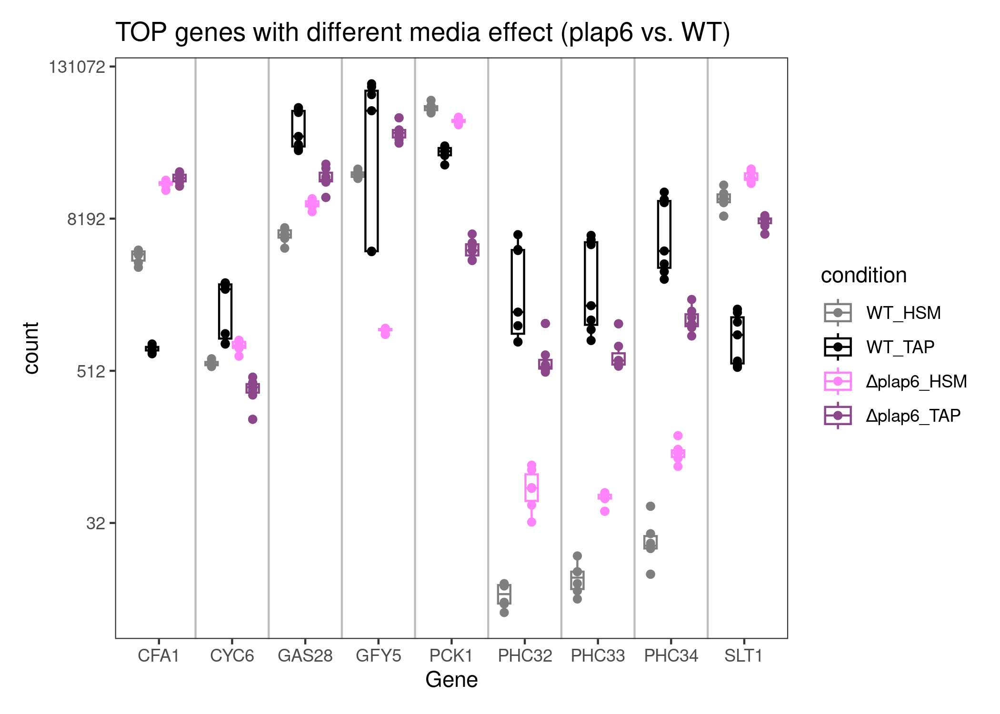

    ggexport(gcounts_coqs, filename = paste(pubdir,"Counts_plap6_COQs_aio_all.pdf",sep="/"),width = 8.2, height = 4.7)
    ggsave(gcounts_coqs, filename = paste(pubdir,"Counts_plap6_COQs_aoi_all.tiff",sep="/"),width = 8.2, height = 4.7)

## Heatmap

    library("pheatmap")
    ntd <- normTransform(dds)

    # select top 100 highest expressed genes
    select <- order(rowMeans(counts(dds,normalized=TRUE)),
                    decreasing=TRUE)[1:100]
    df <- as.data.frame(colData(dds)[,c("condition","media","strain")])

    anno_colors <- list(media = c("black","white"),
                        strain = c("grey30","orchid2"),
                        condition = group.colors)

    names(anno_colors$media) <- levels(df$media)
    names(anno_colors$strain) <- levels(df$strain)
    names(anno_colors$condition) <- levels(df$condition)

    pheatmap(assay(ntd)[select,], cluster_rows=TRUE, show_rownames=FALSE,
             cluster_cols=TRUE, annotation_col=df, annotation_colors = anno_colors)

    # all top genes
    # select <- unique(
    #   rownames(top_res1),
    #   rownames(top_res2)) %>% 
    #   unique(rownames(top_res3)) %>%
    #   unique(rownames(top_res4)) %>%
    #   unique(rownames(goi))

    select <- anno %>% .[.$geneSymbol %in% top,"gene_id"]

    length(select)

    ## [1] 41

    df <- assay(ntd)[select,]
    df <- df[,order(colData(dds)[,"condition"])]
    rownames(df) <- mcols(dds)[select,"id.symbol"]

    anno_col <- as.data.frame(colData(dds)[,c("media","strain","condition")])

    anno_colors <- list(media = c("white","black"),
                        strain = c("grey50","orchid1"),
                        condition = group.colors)

    names(anno_colors$media) <- levels(anno_col$media)
    names(anno_colors$strain) <- levels(anno_col$strain)
    names(anno_colors$condition) <- levels(anno_col$condition)

    xx <- pheatmap(df, cluster_rows=TRUE, show_rownames=TRUE,
                   cluster_cols=FALSE, annotation_col=anno_col, annotation_colors = anno_colors)

    # ggsave("graphs3/Heatmap_top.pdf",plot=xx,
    #        width = 10,
    #        height = 30)

    # # all fib genes
    # select <- unique(c(
    #   rownames(top_res1),
    #   rownames(top_res2),
    #   rownames(goi)))
    # 
    # select <- unique(c(head(rownames(top_res1),n=50),
    #                    tail(rownames(top_res1),n=50),
    #                    head(rownames(top_res2),n=50),
    #                    tail(rownames(top_res2),n=50),
    #                    rownames(goi)))
    # 
    # length(select)
    # 
    # df <- assay(ntd)[select,]
    # rownames(df) <- mcols(dds)[select,"id.symbol"]
    # 
    # anno_col <- as.data.frame(colData(dds)[,c("condition","media","genotype")])
    # xx <- pheatmap(df, cluster_rows=TRUE, show_rownames=TRUE,
    #                cluster_cols=TRUE, annotation_col=anno_col)
    # ggsave("graphs3/Heatmap_Δplap6.vs.WT.pdf",plot=xx,
    #        width = 10,
    #        height = 30)

### HM PQs

    library("pheatmap")
    ntd <- normTransform(dds)

    df <- assay(ntd)[goi$gene_id,]
    rownames(df) <- mcols(dds)[goi$gene_id,"id.symbol"]

    anno_col <- as.data.frame(colData(dds)[,c("condition","media","genotype")])
    xx <- pheatmap(df, cluster_rows=TRUE, show_rownames=TRUE,
                   cluster_cols=TRUE, annotation_col=anno_col)

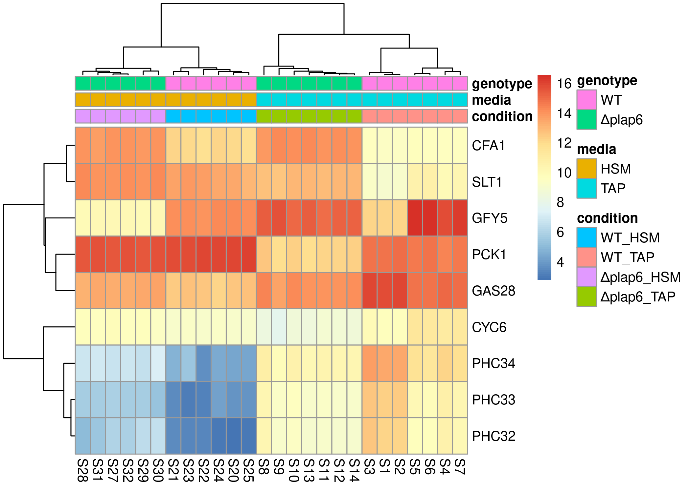

    # ggsave("graphs3/Heatmap_YYK.pdf",plot=xx,
    #        width = 10,
    #        height = 10)

## Selected Metabolic Genes

### Get gene set

    # 1. Glyoxylate Cycle Suppression
    glyoxylate <- c("MAS1","ICL1", "ICL3")
    goi <- glyoxylate
    colnames(anno)

    ##  [1] "locusName_4532"                       
    ##  [2] "initial_v6_locus_ID"                  
    ##  [3] "action"                               
    ##  [4] "Replacement_v5.v6._model"             
    ##  [5] "geneSymbol"                           
    ##  [6] "strainLocusId"                        
    ##  [7] "PMID"                                 
    ##  [8] "previousIdentifiers"                  
    ##  [9] "Description"                          
    ## [10] "Comments"                             
    ## [11] "Polycistronic"                        
    ## [12] "TMHMM_transmembrane"                  
    ## [13] "TargetP"                              
    ## [14] "Predalgo"                             
    ## [15] "interactions"                         
    ## [16] "experimental_localization"            
    ## [17] "CLiP_library"                         
    ## [18] "mutant_phenotypes"                    
    ## [19] "Plastid.ribosome_pulldown"            
    ## [20] "TF_database..PMID.27067009."          
    ## [21] "Flagellar_Proteome"                   
    ## [22] "Co.expression.cluster..PMID.28710131."
    ## [23] "GEnome.scale.Metabolic.Model"         
    ## [24] "gene_id"                              
    ## [25] "previousIdentifiers_list"             
    ## [26] "prev.symbols"                         
    ## [27] "id.symbol"

    gene_table <- anno[str_detect(anno[["geneSymbol"]],paste(goi, collapse="|")),c(24,5,9,10,8)]

    gene_table <- bind_rows(gene_table,anno[str_detect(anno[["prev.symbols"]],paste("ICL2", collapse="|")),c(24,5,9,10,8)]
    )
    gene_table["Cre03.g149250","geneSymbol"] <- "ICL2"
    gene_table$pathway <- "Glyoxylate_Supr."

    anno[str_detect(anno[["Description"]],paste("Isocitrate", collapse="|")),c(24,5,8,9,10)]

    ##                     gene_id geneSymbol previousIdentifiers
    ## Cre02.g143250 Cre02.g143250       IDH2           #g2620.t1
    ## Cre03.g149250 Cre03.g149250                  ICL2#g3035.t1
    ## Cre04.g214500 Cre04.g214500       IDH3            g4684.t1
    ## Cre06.g282800 Cre06.g282800       ICL1           g6576.t1#
    ## Cre17.g728800 Cre17.g728800       IDH1          g17614.t1#
    ##                                            Description
    ## Cre02.g143250  Isocitrate dehydrogenase, NAD-dependent
    ## Cre03.g149250                         Isocitrate lyase
    ## Cre04.g214500 Isocitrate dehydrogenase, NADP-dependent
    ## Cre06.g282800                         Isocitrate lyase
    ## Cre17.g728800  Isocitrate dehydrogenase, NAD-dependent
    ##                                                                                                                                                                                                                                       Comments
    ## Cre02.g143250                                                                                                                                   isocitrate dehydrogenase, NAD-dependent, possibly mitochondrial based on homology to AT3G09810
    ## Cre03.g149250                                                                                                                                                                                                Isocitrate lyase/phosphorylmutase
    ## Cre04.g214500 NADP specific isocitrate dehydrogenase (EC 1.1.1.42), mitochondrial precursor# similar to mammalian mitochondrial ICDH (e.g., GenBank XP_536192), predicted by Target-P to have an organellar targeting sequence (mitochondrial)
    ## Cre06.g282800                                                                                                                                      isocitrate lyase (EC 4.1.3.1)# isocitrase# 98% identical to cDNA (AAB61446) [PMID: 9049260]
    ## Cre17.g728800                                                                                                                                                           NAD-dependent isocitrate dehydrogenase, probable mitochondrial isoform

    anno[str_detect(anno[["Description"]],paste("Isocitrate", collapse="|")),c(5,8,9,10)]

    ##               geneSymbol previousIdentifiers
    ## Cre02.g143250       IDH2           #g2620.t1
    ## Cre03.g149250                  ICL2#g3035.t1
    ## Cre04.g214500       IDH3            g4684.t1
    ## Cre06.g282800       ICL1           g6576.t1#
    ## Cre17.g728800       IDH1          g17614.t1#
    ##                                            Description
    ## Cre02.g143250  Isocitrate dehydrogenase, NAD-dependent
    ## Cre03.g149250                         Isocitrate lyase
    ## Cre04.g214500 Isocitrate dehydrogenase, NADP-dependent
    ## Cre06.g282800                         Isocitrate lyase
    ## Cre17.g728800  Isocitrate dehydrogenase, NAD-dependent
    ##                                                                                                                                                                                                                                       Comments
    ## Cre02.g143250                                                                                                                                   isocitrate dehydrogenase, NAD-dependent, possibly mitochondrial based on homology to AT3G09810
    ## Cre03.g149250                                                                                                                                                                                                Isocitrate lyase/phosphorylmutase
    ## Cre04.g214500 NADP specific isocitrate dehydrogenase (EC 1.1.1.42), mitochondrial precursor# similar to mammalian mitochondrial ICDH (e.g., GenBank XP_536192), predicted by Target-P to have an organellar targeting sequence (mitochondrial)
    ## Cre06.g282800                                                                                                                                      isocitrate lyase (EC 4.1.3.1)# isocitrase# 98% identical to cDNA (AAB61446) [PMID: 9049260]
    ## Cre17.g728800                                                                                                                                                           NAD-dependent isocitrate dehydrogenase, probable mitochondrial isoform

    anno[str_detect(anno[["Comments"]],paste("Isocitrate lyase", collapse="|")),c(5,8,9,10)]

    ##               geneSymbol previousIdentifiers      Description
    ## Cre03.g149250                  ICL2#g3035.t1 Isocitrate lyase
    ##                                        Comments
    ## Cre03.g149250 Isocitrate lyase/phosphorylmutase

    # 2. Tricarboxylic Acid (TCA) Cycle & Malate Metabolism Disruption
    TCA = c("MDH5","MDH2","FUMm","ACONTm","CSm","ACS")
    goi <- TCA
    anno[str_detect(anno[["geneSymbol"]],paste(goi, collapse="|")),c(24,5,9,10,8)]

    ##                     gene_id geneSymbol                  Description
    ## Cre01.g055408 Cre01.g055408       ACS2          Acetyl-CoA synthase
    ## Cre01.g071662 Cre01.g071662       ACS1 Acetyl-CoA synthetase/ligase
    ## Cre07.g353450 Cre07.g353450       ACS3 Acetyl-CoA synthetase/ligase
    ## Cre09.g410700 Cre09.g410700       MDH5  NADP-Malate Dehydrogenase 5
    ## Cre10.g423250 Cre10.g423250       MDH2       Malate dehydrogenase 2
    ##                                                                                                                                                                                                                                          Comments
    ## Cre01.g055408                                                                                                                                     identical to XP_001700230# located in peroxisomal microbodies (Lauersen et al, Algal Res. 2016)
    ## Cre01.g071662                            Acetyl-CoA synthetase (EC 6.2.1.1)# Acetate-CoA ligase# Not in mitochondrion or plastid based on Target-P prediction (predicted as other with high reliability)# similar to rice ACS (GenBank XP_466041)
    ## Cre07.g353450 Acetyl-CoA synthetase (EC 6.2.1.1)# Acetate-CoA ligase# probable mitochondrial protein based on mass spectrometry identification (QFYTAPTLLR + SLLQLGDAWPR), although organelle targeting predicted as other by Target-P and iPSORT
    ## Cre09.g410700                                                                                                                             Malate dehydrogenase [NADP], possibly plastidic (NADP-MDH)# GI:1969739# Found in the flagellar proteome
    ## Cre10.g423250                                                                                                  Malate dehydrogenase ( MDH) (= malic dehydrogenase) [EC:1.1.1.37]# NAD-dependent# putative glyoxysomal localization# PMID: 1921471
    ##                                               previousIdentifiers
    ## Cre01.g055408                                            g1224.t1
    ## Cre01.g071662 Cre23.g765700.t1.1#Cre23.g765700.t1.2#ACS1#g1290.t1
    ## Cre07.g353450                                      ACS3#g8221.t1#
    ## Cre09.g410700                                 MDN5#MDH5#g10173.t1
    ## Cre10.g423250                                 MDN2#MDH2#g10469.t1

    anno[str_detect(anno[["Description"]],paste(c(goi,"Aconitate","Citrate","Fumarase"), collapse="|")),c(24,5,8,9,10)]

    ##                     gene_id geneSymbol previousIdentifiers
    ## Cre01.g042750 Cre01.g042750       ACH1            #g957.t1
    ## Cre03.g149100 Cre03.g149100       CIS2           g3032.t1#
    ## Cre12.g514750 Cre12.g514750       CIS1          #g12702.t1
    ##                                                Description
    ## Cre01.g042750                          Aconitate hydratase
    ## Cre03.g149100 Citrate synthase, glyoxysomal/microbody form
    ## Cre12.g514750              Citrate synthase, mitochondrial
    ##                                                                                                                                                                  Comments
    ## Cre01.g042750                                                                             Aconitate hydratase (EC 4.2.1.3), mitochondrial# citrate hydro-lyase# aconitase
    ## Cre03.g149100 Citrate synthase (EC 2.3.3.1), glyoxysomal/microbody form# similarity to Arabidopsis citrate synthase glyoxysomal precursor (GenBank Q9LXS6)# PMID: 1921471
    ## Cre12.g514750                            Citrate synthase (EC 2.3.3.1), mitochondrial form# similarity to carrot citrate synthase mitochondrial precursor (GenBank O8433)

    anno[str_detect(anno[["Comments"]],paste(c(goi,"Aconitate","Fumarase"), collapse="|")),c(24,5,8,9,10)]

    ##                     gene_id geneSymbol
    ## Cre01.g042750 Cre01.g042750       ACH1
    ## Cre01.g071662 Cre01.g071662       ACS1
    ## Cre03.g194850 Cre03.g194850       MDH1
    ## Cre10.g456400 Cre10.g456400           
    ##                                               previousIdentifiers
    ## Cre01.g042750                                            #g957.t1
    ## Cre01.g071662 Cre23.g765700.t1.1#Cre23.g765700.t1.2#ACS1#g1290.t1
    ## Cre03.g194850                                  MDN1#MDH1#g4035.t1
    ## Cre10.g456400                                      DAT1#g11198.t2
    ##                                                       Description
    ## Cre01.g042750                                 Aconitate hydratase
    ## Cre01.g071662                        Acetyl-CoA synthetase/ligase
    ## Cre03.g194850 NAD-dependent malate dehydrogenase 1, chloroplastic
    ## Cre10.g456400  Dicarboxylate/amino acid cation sodium transporter
    ##                                                                                                                                                                                                                                                                     Comments
    ## Cre01.g042750                                                                                                                                                                                Aconitate hydratase (EC 4.2.1.3), mitochondrial# citrate hydro-lyase# aconitase
    ## Cre01.g071662                                                       Acetyl-CoA synthetase (EC 6.2.1.1)# Acetate-CoA ligase# Not in mitochondrion or plastid based on Target-P prediction (predicted as other with high reliability)# similar to rice ACS (GenBank XP_466041)
    ## Cre03.g194850 Malate dehydrogenase (MDH) (= malic dehydrogenase) [EC:1.1.1.37]# NAD-dependent# sodium acetate-induced in Chlamydomonas reinhardtii# nuclear gene# gene product is localized in the chloroplast# Genbank entry U42979, as MDH2# present in thylakoid-enriched
    ## Cre10.g456400                                                                                                                                       related to dicarboxylate amino acids cation sodium proton (DAACS) transporter# DAACS family transporter absent in plants

    TCA2 <- c("Cre10.g423250","Cre09.g410700","Cre01.g055408","Cre01.g042750","Cre12.g514750","Cre03.g149100")

    genes_TCA <- anno[TCA2,c(24,5,9,10,8)]
    genes_TCA$pathway <- "TCA"

    gene_table <- bind_rows(gene_table,genes_TCA)

    # 3. Gluconeogenesis & Acetate Utilization Decline
    Gluconeogenesis <- c("PCK1","ENOm")
    goi <- Gluconeogenesis
    anno[str_detect(anno[["geneSymbol"]],paste(goi, collapse="|")),c(24,5,9,10,8)]

    ##                     gene_id geneSymbol                       Description
    ## Cre02.g141400 Cre02.g141400       PCK1 Phosphoenolpyruvate carboxykinase
    ##                                                                                                                                                                                                                                                                                               Comments
    ## Cre02.g141400 phosphoenolpyruvate carboxykinase# PEP carboxykinase (EC 4.1.1.49)# based on high similarity to PEPCK from Panicum maximum (GenBank AAQ10076) and many other plants# Target-P predicts no organelle targeting, so probably cytosolic form# may represent a minor splice variant of PCK1a
    ##               previousIdentifiers
    ## Cre02.g141400      g2662.t1#PCK1#

    anno[str_detect(anno[["Description"]],paste(c("Enolase"), collapse="|")),c(24,5,8,9,10)]

    ##                     gene_id geneSymbol previousIdentifiers Description
    ## Cre12.g513200 Cre12.g513200       ENO1 PGH1#ENO#g12671.t1#     Enolase
    ##                                                                                                                                                                                                                                                                                                                                                                                                                                              Comments
    ## Cre12.g513200 Phosphoenolpyruvate hydratase# 2-phosphoglycerate dehydratase# EC 4.2.1.11 [GI:18143, Dumont et al. (1993) Plant Sci. 89, 55-67]# product localization unsure: an N-terminal extension also found in Dunaliella and At1g74030 potentially targets it to an organelle, especially if cDNA is extended >6 nt upstream# found in the flagellar proteome [PMID: 15998802] and associated with central pair projection C1b (PMID: 16030251).

    Gluconeogenesis2 <- c("Cre02.g141400","Cre12.g513200")

    genes_Gluconeogenesis <- anno[Gluconeogenesis2,c(24,5,9,10,8)]
    genes_Gluconeogenesis$pathway <- "Gluconeogenesis"

    gene_table <- bind_rows(gene_table,genes_Gluconeogenesis)

    gene_table$pathway <- gene_table$pathway %>% factor()

    gene_table %>% kable()

<table>
<colgroup>
<col style="width: 2%" />
<col style="width: 2%" />
<col style="width: 1%" />
<col style="width: 7%" />
<col style="width: 73%" />
<col style="width: 9%" />
<col style="width: 2%" />
</colgroup>
<thead>
<tr class="header">
<th style="text-align: left;"></th>
<th style="text-align: left;">gene_id</th>
<th style="text-align: left;">geneSymbol</th>
<th style="text-align: left;">Description</th>
<th style="text-align: left;">Comments</th>
<th style="text-align: left;">previousIdentifiers</th>
<th style="text-align: left;">pathway</th>
</tr>
</thead>
<tbody>
<tr class="odd">
<td style="text-align: left;">Cre03.g144807</td>
<td style="text-align: left;">Cre03.g144807</td>
<td style="text-align: left;">MAS1</td>
<td style="text-align: left;">Malate synthase</td>
<td style="text-align: left;">Malate synthase (EC 2.3.3.9)# identical to
cDNA sequence (AAP75564)# PMID: 19214701</td>
<td
style="text-align: left;">g2904.t1#Cre01.g057800.t1.1#MAS1#Cre01.g057800.t1.2</td>
<td style="text-align: left;">Glyoxylate_Supr.</td>
</tr>
<tr class="even">
<td style="text-align: left;">Cre06.g282800</td>
<td style="text-align: left;">Cre06.g282800</td>
<td style="text-align: left;">ICL1</td>
<td style="text-align: left;">Isocitrate lyase</td>
<td style="text-align: left;">isocitrate lyase (EC 4.1.3.1)# isocitrase#
98% identical to cDNA (AAB61446) [PMID: 9049260]</td>
<td style="text-align: left;">g6576.t1#</td>
<td style="text-align: left;">Glyoxylate_Supr.</td>
</tr>
<tr class="odd">
<td style="text-align: left;">Cre03.g149250</td>
<td style="text-align: left;">Cre03.g149250</td>
<td style="text-align: left;">ICL2</td>
<td style="text-align: left;">Isocitrate lyase</td>
<td style="text-align: left;">Isocitrate lyase/phosphorylmutase</td>
<td style="text-align: left;">ICL2#g3035.t1</td>
<td style="text-align: left;">Glyoxylate_Supr.</td>
</tr>
<tr class="even">
<td style="text-align: left;">Cre10.g423250</td>
<td style="text-align: left;">Cre10.g423250</td>
<td style="text-align: left;">MDH2</td>
<td style="text-align: left;">Malate dehydrogenase 2</td>
<td style="text-align: left;">Malate dehydrogenase ( MDH) (= malic
dehydrogenase) [EC:1.1.1.37]# NAD-dependent# putative glyoxysomal
localization# PMID: 1921471</td>
<td style="text-align: left;">MDN2#MDH2#g10469.t1</td>
<td style="text-align: left;">TCA</td>
</tr>
<tr class="odd">
<td style="text-align: left;">Cre09.g410700</td>
<td style="text-align: left;">Cre09.g410700</td>
<td style="text-align: left;">MDH5</td>
<td style="text-align: left;">NADP-Malate Dehydrogenase 5</td>
<td style="text-align: left;">Malate dehydrogenase [NADP], possibly
plastidic (NADP-MDH)# GI:1969739# Found in the flagellar proteome</td>
<td style="text-align: left;">MDN5#MDH5#g10173.t1</td>
<td style="text-align: left;">TCA</td>
</tr>
<tr class="even">
<td style="text-align: left;">Cre01.g055408</td>
<td style="text-align: left;">Cre01.g055408</td>
<td style="text-align: left;">ACS2</td>
<td style="text-align: left;">Acetyl-CoA synthase</td>
<td style="text-align: left;">identical to XP_001700230# located in
peroxisomal microbodies (Lauersen et al, Algal Res. 2016)</td>
<td style="text-align: left;">g1224.t1</td>
<td style="text-align: left;">TCA</td>
</tr>
<tr class="odd">
<td style="text-align: left;">Cre01.g042750</td>
<td style="text-align: left;">Cre01.g042750</td>
<td style="text-align: left;">ACH1</td>
<td style="text-align: left;">Aconitate hydratase</td>
<td style="text-align: left;">Aconitate hydratase (EC 4.2.1.3),
mitochondrial# citrate hydro-lyase# aconitase</td>
<td style="text-align: left;">#g957.t1</td>
<td style="text-align: left;">TCA</td>
</tr>
<tr class="even">
<td style="text-align: left;">Cre12.g514750</td>
<td style="text-align: left;">Cre12.g514750</td>
<td style="text-align: left;">CIS1</td>
<td style="text-align: left;">Citrate synthase, mitochondrial</td>
<td style="text-align: left;">Citrate synthase (EC 2.3.3.1),
mitochondrial form# similarity to carrot citrate synthase mitochondrial
precursor (GenBank O8433)</td>
<td style="text-align: left;">#g12702.t1</td>
<td style="text-align: left;">TCA</td>
</tr>
<tr class="odd">
<td style="text-align: left;">Cre03.g149100</td>
<td style="text-align: left;">Cre03.g149100</td>
<td style="text-align: left;">CIS2</td>
<td style="text-align: left;">Citrate synthase, glyoxysomal/microbody
form</td>
<td style="text-align: left;">Citrate synthase (EC 2.3.3.1),
glyoxysomal/microbody form# similarity to Arabidopsis citrate synthase
glyoxysomal precursor (GenBank Q9LXS6)# PMID: 1921471</td>
<td style="text-align: left;">g3032.t1#</td>
<td style="text-align: left;">TCA</td>
</tr>
<tr class="even">
<td style="text-align: left;">Cre02.g141400</td>
<td style="text-align: left;">Cre02.g141400</td>
<td style="text-align: left;">PCK1</td>
<td style="text-align: left;">Phosphoenolpyruvate carboxykinase</td>
<td style="text-align: left;">phosphoenolpyruvate carboxykinase# PEP
carboxykinase (EC 4.1.1.49)# based on high similarity to PEPCK from
Panicum maximum (GenBank AAQ10076) and many other plants# Target-P
predicts no organelle targeting, so probably cytosolic form# may
represent a minor splice variant of PCK1a</td>
<td style="text-align: left;">g2662.t1#PCK1#</td>
<td style="text-align: left;">Gluconeogenesis</td>
</tr>
<tr class="odd">
<td style="text-align: left;">Cre12.g513200</td>
<td style="text-align: left;">Cre12.g513200</td>
<td style="text-align: left;">ENO1</td>
<td style="text-align: left;">Enolase</td>
<td style="text-align: left;">Phosphoenolpyruvate hydratase#
2-phosphoglycerate dehydratase# EC 4.2.1.11 [GI:18143, Dumont et
al. (1993) Plant Sci. 89, 55-67]# product localization unsure: an
N-terminal extension also found in Dunaliella and At1g74030 potentially
targets it to an organelle, especially if cDNA is extended &gt;6 nt
upstream# found in the flagellar proteome [PMID: 15998802] and
associated with central pair projection C1b (PMID: 16030251).</td>
<td style="text-align: left;">PGH1#ENO#g12671.t1#</td>
<td style="text-align: left;">Gluconeogenesis</td>
</tr>
</tbody>
</table>

    write_xlsx(data.frame(gene_table),
               paste(outdir,"Metabolic_Gene_List.xlsx",sep="/"))

    metabolic_genes <- gene_table

    # Import from XLS
    xls_table <- read_xlsx(paste(outdir,"Metabolic_Gene_List_v2.xlsx",sep="/"))

    anno[xls_table$gene_id,c(24,5,9,10,8)] %>% kable()

<table>
<colgroup>
<col style="width: 2%" />
<col style="width: 2%" />
<col style="width: 1%" />
<col style="width: 9%" />
<col style="width: 74%" />
<col style="width: 9%" />
</colgroup>
<thead>
<tr class="header">
<th style="text-align: left;"></th>
<th style="text-align: left;">gene_id</th>
<th style="text-align: left;">geneSymbol</th>
<th style="text-align: left;">Description</th>
<th style="text-align: left;">Comments</th>
<th style="text-align: left;">previousIdentifiers</th>
</tr>
</thead>
<tbody>
<tr class="odd">
<td style="text-align: left;">Cre03.g144807</td>
<td style="text-align: left;">Cre03.g144807</td>
<td style="text-align: left;">MAS1</td>
<td style="text-align: left;">Malate synthase</td>
<td style="text-align: left;">Malate synthase (EC 2.3.3.9)# identical to
cDNA sequence (AAP75564)# PMID: 19214701</td>
<td
style="text-align: left;">g2904.t1#Cre01.g057800.t1.1#MAS1#Cre01.g057800.t1.2</td>
</tr>
<tr class="even">
<td style="text-align: left;">Cre06.g282800</td>
<td style="text-align: left;">Cre06.g282800</td>
<td style="text-align: left;">ICL1</td>
<td style="text-align: left;">Isocitrate lyase</td>
<td style="text-align: left;">isocitrate lyase (EC 4.1.3.1)# isocitrase#
98% identical to cDNA (AAB61446) [PMID: 9049260]</td>
<td style="text-align: left;">g6576.t1#</td>
</tr>
<tr class="odd">
<td style="text-align: left;">Cre03.g149250</td>
<td style="text-align: left;">Cre03.g149250</td>
<td style="text-align: left;"></td>
<td style="text-align: left;">Isocitrate lyase</td>
<td style="text-align: left;">Isocitrate lyase/phosphorylmutase</td>
<td style="text-align: left;">ICL2#g3035.t1</td>
</tr>
<tr class="even">
<td style="text-align: left;">Cre10.g423250</td>
<td style="text-align: left;">Cre10.g423250</td>
<td style="text-align: left;">MDH2</td>
<td style="text-align: left;">Malate dehydrogenase 2</td>
<td style="text-align: left;">Malate dehydrogenase ( MDH) (= malic
dehydrogenase) [EC:1.1.1.37]# NAD-dependent# putative glyoxysomal
localization# PMID: 1921471</td>
<td style="text-align: left;">MDN2#MDH2#g10469.t1</td>
</tr>
<tr class="odd">
<td style="text-align: left;">Cre09.g410700</td>
<td style="text-align: left;">Cre09.g410700</td>
<td style="text-align: left;">MDH5</td>
<td style="text-align: left;">NADP-Malate Dehydrogenase 5</td>
<td style="text-align: left;">Malate dehydrogenase [NADP], possibly
plastidic (NADP-MDH)# GI:1969739# Found in the flagellar proteome</td>
<td style="text-align: left;">MDN5#MDH5#g10173.t1</td>
</tr>
<tr class="even">
<td style="text-align: left;">Cre01.g055408</td>
<td style="text-align: left;">Cre01.g055408</td>
<td style="text-align: left;">ACS2</td>
<td style="text-align: left;">Acetyl-CoA synthase</td>
<td style="text-align: left;">identical to XP_001700230# located in
peroxisomal microbodies (Lauersen et al, Algal Res. 2016)</td>
<td style="text-align: left;">g1224.t1</td>
</tr>
<tr class="odd">
<td style="text-align: left;">Cre01.g042750</td>
<td style="text-align: left;">Cre01.g042750</td>
<td style="text-align: left;">ACH1</td>
<td style="text-align: left;">Aconitate hydratase</td>
<td style="text-align: left;">Aconitate hydratase (EC 4.2.1.3),
mitochondrial# citrate hydro-lyase# aconitase</td>
<td style="text-align: left;">#g957.t1</td>
</tr>
<tr class="even">
<td style="text-align: left;">Cre12.g514750</td>
<td style="text-align: left;">Cre12.g514750</td>
<td style="text-align: left;">CIS1</td>
<td style="text-align: left;">Citrate synthase, mitochondrial</td>
<td style="text-align: left;">Citrate synthase (EC 2.3.3.1),
mitochondrial form# similarity to carrot citrate synthase mitochondrial
precursor (GenBank O8433)</td>
<td style="text-align: left;">#g12702.t1</td>
</tr>
<tr class="odd">
<td style="text-align: left;">Cre03.g149100</td>
<td style="text-align: left;">Cre03.g149100</td>
<td style="text-align: left;">CIS2</td>
<td style="text-align: left;">Citrate synthase, glyoxysomal/microbody
form</td>
<td style="text-align: left;">Citrate synthase (EC 2.3.3.1),
glyoxysomal/microbody form# similarity to Arabidopsis citrate synthase
glyoxysomal precursor (GenBank Q9LXS6)# PMID: 1921471</td>
<td style="text-align: left;">g3032.t1#</td>
</tr>
<tr class="even">
<td style="text-align: left;">Cre02.g141400</td>
<td style="text-align: left;">Cre02.g141400</td>
<td style="text-align: left;">PCK1</td>
<td style="text-align: left;">Phosphoenolpyruvate carboxykinase</td>
<td style="text-align: left;">phosphoenolpyruvate carboxykinase# PEP
carboxykinase (EC 4.1.1.49)# based on high similarity to PEPCK from
Panicum maximum (GenBank AAQ10076) and many other plants# Target-P
predicts no organelle targeting, so probably cytosolic form# may
represent a minor splice variant of PCK1a</td>
<td style="text-align: left;">g2662.t1#PCK1#</td>
</tr>
<tr class="odd">
<td style="text-align: left;">Cre12.g513200</td>
<td style="text-align: left;">Cre12.g513200</td>
<td style="text-align: left;">ENO1</td>
<td style="text-align: left;">Enolase</td>
<td style="text-align: left;">Phosphoenolpyruvate hydratase#
2-phosphoglycerate dehydratase# EC 4.2.1.11 [GI:18143, Dumont et
al. (1993) Plant Sci. 89, 55-67]# product localization unsure: an
N-terminal extension also found in Dunaliella and At1g74030 potentially
targets it to an organelle, especially if cDNA is extended &gt;6 nt
upstream# found in the flagellar proteome [PMID: 15998802] and
associated with central pair projection C1b (PMID: 16030251).</td>
<td style="text-align: left;">PGH1#ENO#g12671.t1#</td>
</tr>
<tr class="even">
<td style="text-align: left;">Cre06.g252650</td>
<td style="text-align: left;">Cre06.g252650</td>
<td style="text-align: left;">LEU1S</td>
<td style="text-align: left;">Isopropylmalate dehydratase, small
subunit</td>
<td style="text-align: left;">isopropylmalate dehydratase (EC 4.2.1.33)#
small subunit# second committed step in Leu biosynthesis</td>
<td style="text-align: left;">IPMI1#LEUS1#g5657.t1#LEU1S</td>
</tr>
<tr class="odd">
<td style="text-align: left;">Cre06.g258733</td>
<td style="text-align: left;">Cre06.g258733</td>
<td style="text-align: left;">LEU2</td>
<td style="text-align: left;">Isopropylmalate synthase</td>
<td style="text-align: left;">Involved in branched chain amino acid
biosynthesis# first committed step in Leu biosynthesis</td>
<td style="text-align: left;">g5818.t1#LEU2#Cre06.g258750.t2.1</td>
</tr>
<tr class="even">
<td style="text-align: left;">Cre03.g206600</td>
<td style="text-align: left;">Cre03.g206600</td>
<td style="text-align: left;">AAD1</td>
<td style="text-align: left;">Acetohydroxyacid dehydratase</td>
<td style="text-align: left;">acetohydroxyacid dehydratase (EC 4.2.1.9)#
ILVD# dihydroxy-acid dehydrase# probable plastid location, based on
homology and on Target-P prediction</td>
<td style="text-align: left;">#AAD1#g4179.t1</td>
</tr>
<tr class="odd">
<td style="text-align: left;">Cre13.g588150</td>
<td style="text-align: left;">Cre13.g588150</td>
<td style="text-align: left;">VTC2</td>
<td style="text-align: left;">GDP-L-galactose phosphorylase</td>
<td style="text-align: left;">first committed step in vitamin C
biosynthesis# mutant shows reduced vitamin C content, and increased
5mC/decreased 5gmC in its DNA, due to impairement of TET-mediated 5mC
modifications</td>
<td style="text-align: left;">#g14427.t1</td>
</tr>
<tr class="even">
<td style="text-align: left;">Cre02.g095137</td>
<td style="text-align: left;">Cre02.g095137</td>
<td style="text-align: left;">PFR1</td>
<td style="text-align: left;">Pyruvate ferredoxin oxidoreductase</td>
<td style="text-align: left;">Reversible pyruvate decarboxylation to
acetyl-CoA and CO2, two ferredoxins are reduced</td>
<td
style="text-align: left;">Cre11.g473950.t1.2#Cre11.g473950.t1.1#g1910.t2</td>
</tr>
<tr class="odd">
<td style="text-align: left;">Cre03.g199800</td>
<td style="text-align: left;">Cre03.g199800</td>
<td style="text-align: left;">HYDA1</td>
<td style="text-align: left;">Iron hydrogenase</td>
<td style="text-align: left;">Chloroplast Fe-hydrogenase (= HYDA1)#
corresponds to GI:18026272# reversible reduction of 2H+ to H2, oxidizing
two ferredoxins#</td>
<td style="text-align: left;">HYD1#g4331.t1</td>
</tr>
<tr class="even">
<td style="text-align: left;">Cre09.g396600</td>
<td style="text-align: left;">Cre09.g396600</td>
<td style="text-align: left;">HYDA2</td>
<td style="text-align: left;">Iron hydrogenase</td>
<td style="text-align: left;">Chloroplast Fe-hydrogenase (= HYDA2)#
corresponds to GI:18026272 [PMID: 12823545]# reversible reduction of 2H+
to H2, oxidizing two ferredoxins#</td>
<td style="text-align: left;">HYD2#g9355.t1</td>
</tr>
<tr class="odd">
<td style="text-align: left;">Cre06.g296700</td>
<td style="text-align: left;">Cre06.g296700</td>
<td style="text-align: left;">HYDG1</td>
<td style="text-align: left;">Hydrogenase assembly factor/biotin
synthase</td>
<td style="text-align: left;">Related to Thiazole biosynthesis protein
thiH/O. Pfam motif found in thiamin and biotin biosynthesis genes.
Radical SAM protein required for the assembly of an active
[Fe]-hydrogenase [PMID: 15082711]</td>
<td style="text-align: left;">HYDG#g6861.t1#</td>
</tr>
<tr class="even">
<td style="text-align: left;">Cre06.g296750</td>
<td style="text-align: left;">Cre06.g296750</td>
<td style="text-align: left;">HYDEF1</td>
<td style="text-align: left;">Iron hydrogenase assembly protein</td>
<td style="text-align: left;">Iron hydrogenase assembly protein,
contains domains homologous to prokaryotic HydE and HydF# radical SAM
domain present in N-terminal region. [PMID: 15082711]# maturation factor
required for biosynthesis of [FeFe]-hydrogenase active site#</td>
<td style="text-align: left;">HYDEF#g6862.t1</td>
</tr>
<tr class="odd">
<td style="text-align: left;">Cre16.g658400</td>
<td style="text-align: left;">Cre16.g658400</td>
<td style="text-align: left;">FDX2</td>
<td style="text-align: left;">Apoferredoxin</td>
<td style="text-align: left;">Fe2S2 containing redox protein, predicted
chloroplast localization</td>
<td style="text-align: left;">g15907.t1#</td>
</tr>
<tr class="even">
<td style="text-align: left;">Cre06.g278245</td>
<td style="text-align: left;">Cre06.g278245</td>
<td style="text-align: left;">PAO5</td>
<td style="text-align: left;">Pheophorbide a oxygenase-related
protein</td>
<td style="text-align: left;">Contains Rieske iron-sulfur cluster and
PAO domains and transmembrane domain for attachment to thylakoid
membrane# closely related to linked Cre06.g305650# belongs to the
classical family of short chain dehydrogenases [PMID: 15180984]#</td>
<td
style="text-align: left;">PAO9#Cre13.g600650.t1.2#g6387.t1#Cre13.g600650.t1.1</td>
</tr>
<tr class="odd">
<td style="text-align: left;">Cre08.g367400</td>
<td style="text-align: left;">Cre08.g367400</td>
<td style="text-align: left;">LHCSR3B</td>
<td style="text-align: left;">Stress-related chlorophyll a/b binding
protein 3</td>
<td style="text-align: left;">LHCSR3.2</td>
<td style="text-align: left;">LHCSR3.2#LHCSR3#LI818r#g8608.t1</td>
</tr>
<tr class="even">
<td style="text-align: left;">Cre08.g365900</td>
<td style="text-align: left;">Cre08.g365900</td>
<td style="text-align: left;">LHCSR1</td>
<td style="text-align: left;">Stress-related chlorophyll a/b binding
protein 1</td>
<td style="text-align: left;">LI818r-1# involved in protection against
UV-B and induced by UVR8# Low-CO2 and high-light inducible chlorophyll
a/b binding protein# regulated by CCM1 [PMID: 15235119]</td>
<td style="text-align: left;">LI818#g8574.t1</td>
</tr>
<tr class="odd">
<td style="text-align: left;">Cre01.g016600</td>
<td style="text-align: left;">Cre01.g016600</td>
<td style="text-align: left;">PSBS1</td>
<td style="text-align: left;">chloroplast Photosystem II-associated 22
kDa protein</td>
<td style="text-align: left;">one of the two neighbor genes homologous
to higher plant PsbS (Npq4) that is involved in Non-Photochemical
Quenching# corresponds to the gene mentioned in PMID: 16143839# shows a
single AA difference compared to downstream convergent PSBS2# involved
in acclimatation to UV-B# regulated by UVR8</td>
<td style="text-align: left;">#g397.t1</td>
</tr>
<tr class="even">
<td style="text-align: left;">Cre01.g016750</td>
<td style="text-align: left;">Cre01.g016750</td>
<td style="text-align: left;">PSBS2</td>
<td style="text-align: left;">chloroplast Photosystem II-associated 22
kDa protein</td>
<td style="text-align: left;">one of the two neighbor genes homologous
to higher plant PsbS (Npq4) that is involved in Non-Photochemical
Quenching (PMID: 10667783# <a href="PMID:15222740)#"
class="uri">PMID:15222740)#</a> shows a single AA difference compared to
upstream convergent PSBS1# involved in acclimatation to UV-B# regulated
by UVR8</td>
<td style="text-align: left;">#g400.t1</td>
</tr>
</tbody>
</table>

    metabolic_genes2 <- bind_cols(xls_table[,c(1:3,7)],anno[xls_table$gene_id,c(9,10,8)])
    metabolic_genes2$pathway <- metabolic_genes2$pathway %>% factor()

    # Cre16.g658400 FDX2 not in results
    metabolic_genes2 <- metabolic_genes2[-21,]

    anno[str_detect(anno[["geneSymbol"]],paste("FDX", collapse="|")),c(24,5,9,10,8)] %>% kable()

<table>
<colgroup>
<col style="width: 5%" />
<col style="width: 5%" />
<col style="width: 4%" />
<col style="width: 16%" />
<col style="width: 55%" />
<col style="width: 12%" />
</colgroup>
<thead>
<tr class="header">
<th style="text-align: left;"></th>
<th style="text-align: left;">gene_id</th>
<th style="text-align: left;">geneSymbol</th>
<th style="text-align: left;">Description</th>
<th style="text-align: left;">Comments</th>
<th style="text-align: left;">previousIdentifiers</th>
</tr>
</thead>
<tbody>
<tr class="odd">
<td style="text-align: left;">Cre01.g005600</td>
<td style="text-align: left;">Cre01.g005600</td>
<td style="text-align: left;">FDX8</td>
<td style="text-align: left;">Ferredoxin</td>
<td style="text-align: left;">Ferredoxin with 2Fe-2S iron-sulfur cluster
binding domain</td>
<td style="text-align: left;">FDX8#g136.t1#Cre01.g005650.t1.2</td>
</tr>
<tr class="even">
<td style="text-align: left;">Cre01.g006100</td>
<td style="text-align: left;">Cre01.g006100</td>
<td style="text-align: left;">FDX7</td>
<td style="text-align: left;">Ferredoxin</td>
<td style="text-align: left;">Ferredoxin with 2Fe-2S iron-sulfur cluster
binding domain</td>
<td style="text-align: left;">FDX7#g147.t1</td>
</tr>
<tr class="odd">
<td style="text-align: left;">Cre03.g183850</td>
<td style="text-align: left;">Cre03.g183850</td>
<td style="text-align: left;">FDX6</td>
<td style="text-align: left;">Apoferredoxin, chloroplast precursor</td>
<td style="text-align: left;">Fe2S2 containing redox protein, predicted
chloroplast localization# Target of CRR1</td>
<td style="text-align: left;">#g3810.t1</td>
</tr>
<tr class="even">
<td style="text-align: left;">Cre04.g225450</td>
<td style="text-align: left;">Cre04.g225450</td>
<td style="text-align: left;">FDX10</td>
<td style="text-align: left;">Putative ferredoxin</td>
<td style="text-align: left;"></td>
<td style="text-align: left;">0</td>
</tr>
<tr class="odd">
<td style="text-align: left;">Cre06.g291650</td>
<td style="text-align: left;">Cre06.g291650</td>
<td style="text-align: left;">FDX11</td>
<td style="text-align: left;">2Fe-2S ferredoxin</td>
<td style="text-align: left;">Possible 2Fe-2S ferredoxin# COG0633#
cd00207, fer2, 2Fe-2S iron-sulfur cluster binding domain</td>
<td style="text-align: left;">#g6758.t1</td>
</tr>
<tr class="even">
<td style="text-align: left;">Cre06.g306350</td>
<td style="text-align: left;">Cre06.g306350</td>
<td style="text-align: left;">FDX3</td>
<td style="text-align: left;">Apoferredoxin</td>
<td style="text-align: left;">Fe2S2 containing redox protein, predicted
chloroplast localization# PMID 28620699: Ferredoxin with 2Fe-2S
iron-sulfur cluster binding domain</td>
<td style="text-align: left;">g7097.t1#</td>
</tr>
<tr class="odd">
<td style="text-align: left;">Cre07.g334800</td>
<td style="text-align: left;">Cre07.g334800</td>
<td style="text-align: left;">FDX4</td>
<td style="text-align: left;">Apoferredoxin, chloroplast precursor</td>
<td style="text-align: left;">Fe2S2 containing redox protein, predicted
chloroplast localization# PMID 28620699: Ferredoxin with 2Fe-2S
iron-sulfur cluster binding domain</td>
<td style="text-align: left;">19586916#g7796.t2</td>
</tr>
<tr class="even">
<td style="text-align: left;">Cre08.g374550</td>
<td style="text-align: left;">Cre08.g374550</td>
<td style="text-align: left;">FDX12</td>
<td style="text-align: left;">Putative ferredoxin</td>
<td style="text-align: left;"></td>
<td style="text-align: left;">#FDX12#g8824.t1</td>
</tr>
<tr class="odd">
<td style="text-align: left;">Cre12.g487900</td>
<td style="text-align: left;">Cre12.g487900</td>
<td style="text-align: left;">FDX9</td>
<td style="text-align: left;">Ferredoxin</td>
<td style="text-align: left;"></td>
<td style="text-align: left;">FDX9#g12229.t1</td>
</tr>
<tr class="even">
<td style="text-align: left;">Cre12.g559950</td>
<td style="text-align: left;">Cre12.g559950</td>
<td style="text-align: left;">MFDX1</td>
<td style="text-align: left;">Adrenodoxin-like ferredoxin,
mitochondrial</td>
<td style="text-align: left;">Possibly mitochondrial#Orthologous to
AtMFDX1 in Arabidopsis thaliana#</td>
<td style="text-align: left;">MFDX# ADX1#g13320.t1</td>
</tr>
<tr class="odd">
<td style="text-align: left;">Cre14.g626700</td>
<td style="text-align: left;">Cre14.g626700</td>
<td style="text-align: left;">FDX1</td>
<td style="text-align: left;">Chloroplast ferredoxin</td>
<td style="text-align: left;">Apoferredoxin# [2Fe-2S] iron-sulfur
protein involved in photosynthetic electron transfer, chloroplast
localization [PMID: 16656453]</td>
<td style="text-align: left;">PETF#FDX1#g15094.t1</td>
</tr>
<tr class="even">
<td style="text-align: left;">Cre16.g658400</td>
<td style="text-align: left;">Cre16.g658400</td>
<td style="text-align: left;">FDX2</td>
<td style="text-align: left;">Apoferredoxin</td>
<td style="text-align: left;">Fe2S2 containing redox protein, predicted
chloroplast localization</td>
<td style="text-align: left;">g15907.t1#</td>
</tr>
<tr class="odd">
<td style="text-align: left;">Cre17.g700950</td>
<td style="text-align: left;">Cre17.g700950</td>
<td style="text-align: left;">FDX5</td>
<td style="text-align: left;">Ferredoxin 5</td>
<td style="text-align: left;">Fe2S2 containing redox protein#
Chloroplast localized#</td>
<td style="text-align: left;">#g16996.t1</td>
</tr>
</tbody>
</table>

    anno[str_detect(anno[["Description"]],paste(c("Ferredoxin"), collapse="|")),c(24,5,8,9,10)] %>% kable()

<table>
<colgroup>
<col style="width: 5%" />
<col style="width: 5%" />
<col style="width: 3%" />
<col style="width: 11%" />
<col style="width: 24%" />
<col style="width: 50%" />
</colgroup>
<thead>
<tr class="header">
<th style="text-align: left;"></th>
<th style="text-align: left;">gene_id</th>
<th style="text-align: left;">geneSymbol</th>
<th style="text-align: left;">previousIdentifiers</th>
<th style="text-align: left;">Description</th>
<th style="text-align: left;">Comments</th>
</tr>
</thead>
<tbody>
<tr class="odd">
<td style="text-align: left;">Cre01.g005600</td>
<td style="text-align: left;">Cre01.g005600</td>
<td style="text-align: left;">FDX8</td>
<td style="text-align: left;">FDX8#g136.t1#Cre01.g005650.t1.2</td>
<td style="text-align: left;">Ferredoxin</td>
<td style="text-align: left;">Ferredoxin with 2Fe-2S iron-sulfur cluster
binding domain</td>
</tr>
<tr class="even">
<td style="text-align: left;">Cre01.g006100</td>
<td style="text-align: left;">Cre01.g006100</td>
<td style="text-align: left;">FDX7</td>
<td style="text-align: left;">FDX7#g147.t1</td>
<td style="text-align: left;">Ferredoxin</td>
<td style="text-align: left;">Ferredoxin with 2Fe-2S iron-sulfur cluster
binding domain</td>
</tr>
<tr class="odd">
<td style="text-align: left;">Cre03.g193950</td>
<td style="text-align: left;">Cre03.g193950</td>
<td style="text-align: left;">FTRC3</td>
<td style="text-align: left;">FTRC#FTR3#g4014.t1#</td>
<td style="text-align: left;">Ferredoxin Thioredoxin Reductase,
catalytic subunit, chloroplastic</td>
<td style="text-align: left;"></td>
</tr>
<tr class="even">
<td style="text-align: left;">Cre08.g365692</td>
<td style="text-align: left;">Cre08.g365692</td>
<td style="text-align: left;">SIR2</td>
<td style="text-align: left;">SIR4#g8568.t1</td>
<td style="text-align: left;">Ferredoxin-sulfite reductase</td>
<td style="text-align: left;"></td>
</tr>
<tr class="odd">
<td style="text-align: left;">Cre11.g476750</td>
<td style="text-align: left;">Cre11.g476750</td>
<td style="text-align: left;">FNR1</td>
<td style="text-align: left;">#g11841.t1</td>
<td style="text-align: left;">Ferredoxin-NADP reductase,
chloroplast</td>
<td style="text-align: left;">Ferredoxin-NADP reductase, chloroplast
precursor# involved in photosynthetic linear, and possibly in cyclic,
electron flow# major isoform</td>
</tr>
<tr class="even">
<td style="text-align: left;">Cre12.g487900</td>
<td style="text-align: left;">Cre12.g487900</td>
<td style="text-align: left;">FDX9</td>
<td style="text-align: left;">FDX9#g12229.t1</td>
<td style="text-align: left;">Ferredoxin</td>
<td style="text-align: left;"></td>
</tr>
<tr class="odd">
<td style="text-align: left;">Cre12.g514050</td>
<td style="text-align: left;">Cre12.g514050</td>
<td style="text-align: left;">GSF1</td>
<td style="text-align: left;">#g12689.t1#GSF1</td>
<td style="text-align: left;">Ferredoxin-dependent glutamate
synthase</td>
<td style="text-align: left;">Glutamate synthase, ferredoxin-dependent#
also known as CRFG3 (genbank id # AF135592), could be chloroplast
targeted</td>
</tr>
<tr class="even">
<td style="text-align: left;">Cre16.g693202</td>
<td style="text-align: left;">Cre16.g693202</td>
<td style="text-align: left;">SIR1</td>
<td style="text-align: left;">g15615.t1</td>
<td style="text-align: left;">Ferredoxin-sulfite reductase</td>
<td style="text-align: left;"></td>
</tr>
<tr class="odd">
<td style="text-align: left;">Cre16.g687294</td>
<td style="text-align: left;">Cre16.g687294</td>
<td style="text-align: left;">FTRV1</td>
<td style="text-align: left;">FTRV#g16838.t1</td>
<td style="text-align: left;">Ferredoxin Thioredoxin reductase, variable
subunit, chloroplastic</td>
<td style="text-align: left;"></td>
</tr>
<tr class="even">
<td style="text-align: left;">Cre17.g700950</td>
<td style="text-align: left;">Cre17.g700950</td>
<td style="text-align: left;">FDX5</td>
<td style="text-align: left;">#g16996.t1</td>
<td style="text-align: left;">Ferredoxin 5</td>
<td style="text-align: left;">Fe2S2 containing redox protein#
Chloroplast localized#</td>
</tr>
</tbody>
</table>

    # (metabolic_genes2$gene_id...1 == metabolic_genes2$gene_id...5) %>% summary()

### Visualization Metabolic pathway

#### Plot counts

    goi <- metabolic_genes2

    (goi$gene_id %in% rownames(res)) %>% summary()

    ##    Mode    TRUE 
    ## logical      25

    # goi[21,]

    l <- nrow(goi[,])
    all_counts <- {}
    for (i in 1:l){
      d <-  plotCounts(dds, gene=goi$gene_id[i], intgroup=c("condition","strain","media"), col=col,main=res$symbol[goi[i,"gene_id"]],returnData=TRUE)
      d$Gene <- rep(goi[i,"geneSymbol"],length(rownames(d)))
      d$sample <- rownames(d)
      rownames(d) <- {}
      all_counts <- bind_rows(all_counts,d)
    }

    max_val <- 1.0*max(all_counts$count)

    all_counts$Gene <- factor(all_counts$Gene, levels = metabolic_genes2$geneSymbol)

    # Plot
    gcounts_metabolic <- ggplot(all_counts, aes(x = Gene, y = count, col=condition)) +
      geom_boxplot(fatten = 1) +
      scale_fill_manual(values = "grey") +
      scale_color_manual(values = "black") +
      geom_point(position = position_dodge(width = 0.75)) + 
      scale_color_manual(values = group.colors) +
      labs(title = "Metabolic Genes") + 
      theme_bw() +
      removeGrid(x=T, y=T) +
      geom_vline(xintercept=seq(1,length(levels(all_counts$Gene))-1,1)+.5,color="grey") +
      theme(axis.text.x = element_text(angle = 90)) +
      scale_y_continuous(trans = "log2", limits = c(2,NA)) & plot_annotation(title = colData(dds)$experiment[1])
    gcounts_metabolic %>% print()

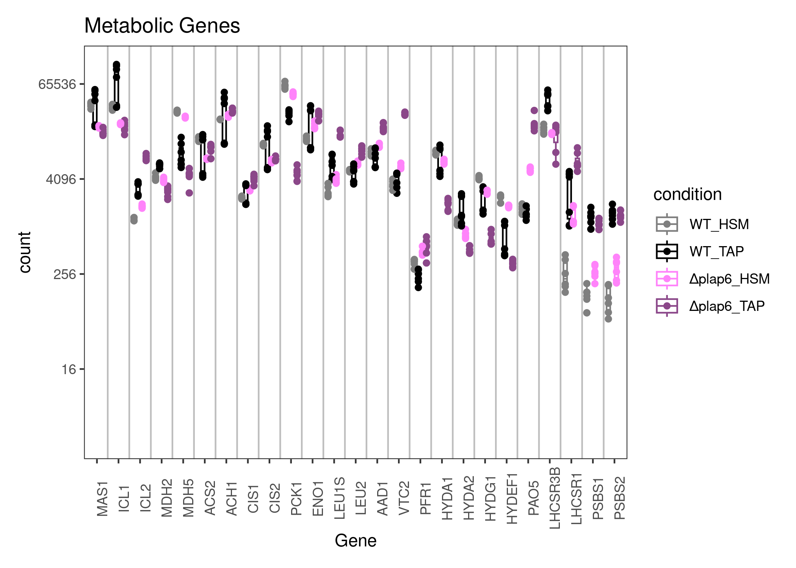

    ggexport(gcounts_coqs, filename = paste(pubdir,"Counts_metabolic.pdf",sep="/"),width = 8.2, height = 4.7)
    ggsave(gcounts_coqs, filename = paste(pubdir,"Counts_metabolic.tiff",sep="/"),width = 8.2, height = 4.7)

#### Volcano

    res <- res_ashr_list$plap6_TAPvHSM.vs.WT_TAPvHSM[metabolic_genes2$gene_id,]
    res_n <- res_l$plap6_TAPvHSM.vs.WT_TAPvHSM[metabolic_genes2$gene_id,]

    # of shrinked results
    total <- subset(res, padj< 0.05 & (log2FoldChange > 1 | log2FoldChange < -1 )) %>% nrow()
    up <- subset(res, padj< 0.05 & log2FoldChange > 1) %>% nrow()
    down <- subset(res, padj< 0.05 & log2FoldChange < -1) %>% nrow()

    # of "true" results
    total <- subset(res_n, padj< 0.05 & (log2FoldChange > 1 | log2FoldChange < -1 )) %>% nrow()
    up <- subset(res_n, padj< 0.05 & log2FoldChange > 1) %>% nrow()
    down <- subset(res_n, padj< 0.05 & log2FoldChange < -1) %>% nrow()

    # points outside the grid

    pmax <- 10^-50
    l2FCmax <- 6
    subset(res, padj < pmax | log2FoldChange > l2FCmax | log2FoldChange < -l2FCmax)

    ## log2 fold change (MMSE): strainΔplap6.mediaTAP effect 
    ## Wald test p-value: strainΔplap6.mediaTAP effect 
    ## DataFrame with 1 row and 5 columns
    ##                baseMean log2FoldChange     lfcSE      pvalue        padj
    ##               <numeric>      <numeric> <numeric>   <numeric>   <numeric>
    ## Cre02.g141400   34268.5       -2.13699  0.137036 9.99893e-57 1.82693e-53

    res[res$padj < pmax,]$padj <- pmax
    # res[res$log2FoldChange < -l2FCmax,]$log2FoldChange <- -l2FCmax

    subset(res, padj < pmax | log2FoldChange > l2FCmax | log2FoldChange < -l2FCmax)

    ## log2 fold change (MMSE): strainΔplap6.mediaTAP effect 
    ## Wald test p-value: strainΔplap6.mediaTAP effect 
    ## DataFrame with 0 rows and 5 columns

    mcols(dds) %>% nrow()

    ## [1] 14617

    res %>% nrow()

    ## [1] 25

    volcano_dd <- EnhancedVolcano(res,
                                  lab = metabolic_genes2$geneSymbol,
                                  selectLab =metabolic_genes2$geneSymbol,
                                  x = 'log2FoldChange',
                                  y = 'padj',
                                  col=c("grey","grey","grey","orchid2"),
                                  title = "Differences in media effect between plap6 and WT",
                                  titleLabSize = 12,
                                  subtitle = paste0("upregulated: ",up,", downregulated: ",down,"\n(total: ",total,")"),
                                  #    subtitle = {},
                                  subtitleLabSize = 10,
                                  caption = NULL,
                                  # xlim = c(-7,7),
                                  ylim = c(0,50),
                                  pCutoff = 0.05,
                                  FCcutoff = 1,
                                  maxoverlapsConnectors = 20,
                                  drawConnectors = TRUE,
                                  widthConnectors = 0.5,
                                  colConnectors = "grey70",
                                  legendLabels=c('ns','ns','ns',
                                                 'padj < 0.05 & Log2FC > 1'),
                                  labSize = 4,
                                  axisLabSize = 12,
                                  legendLabSize = 12,
                                  legendIconSize = 3,
                                  gridlines.major = FALSE,
                                  gridlines.minor = FALSE,
                                  pointSize = 3
    )
    volcano_dd

#### Heatmap

    select <- metabolic_genes2$gene_id

    length(select)

    ## [1] 25

    df <- assay(ntd)[select,]
    df <- df[,order(colData(dds)[,"condition"])]
    rownames(df) <- mcols(dds)[select,"id.symbol"]

    anno_col <- as.data.frame(colData(dds)[,c("media","strain","condition")])
    anno_row <- as.data.frame(metabolic_genes2["pathway"])
    rownames(anno_row) <- metabolic_genes2$geneSymbol

    pl <- metabolic_genes2$pathway %>% levels() %>% length()

    anno_colors <- list(media = c("white","black"),
                        strain = c("grey50","orchid1"),
                        condition = group.colors,
                        pathway = viridis(pl))

    names(anno_colors$media) <- levels(anno_col$media)
    names(anno_colors$strain) <- levels(anno_col$strain)
    names(anno_colors$condition) <- levels(anno_col$condition)
    names(anno_colors$pathway) <- levels(anno_row$pathway)

    xx <- pheatmap(df, cluster_rows=FALSE, show_rownames=TRUE,
                   cluster_cols=FALSE, annotation_col=anno_col,
                   annotation_row=anno_row,
                   annotation_colors = anno_colors)

 \#### Cross Plot

    res_l %>% names()

    ## [1] "WT_TAP.vs.HSM"               "plap6_TAP.vs.HSM"           
    ## [3] "HSM_plap6.vs.WT"             "TAP_plap6.vs.WT"            
    ## [5] "plap6_TAPvHSM.vs.WT_TAPvHSM"

    WT <- res_l$WT_TAP.vs.HSM %>% as.data.frame() %>% .[metabolic_genes2$gene_id,c("log2FoldChange","symbol")]
    plap6 <- res_l$plap6_TAP.vs.HSM %>% as.data.frame() %>% .[metabolic_genes2$gene_id,c("log2FoldChange","symbol")]

    df <- bind_cols(metabolic_genes2, WT, plap6)
    colnames(df)[8] <- "WT (log2FC)"
    colnames(df)[10] <- "plap6 (log2FC)"

    max <- max(df$`WT (log2FC)`,df$`plap6 (log2FC)`)
    min <- min(df$`WT (log2FC)`,df$`plap6 (log2FC)`)

    cross <- ggplot(df, aes(x = `WT (log2FC)`, y = `plap6 (log2FC)`, col=pathway)) +
      geom_point() +
      geom_text_repel(aes(label = df$geneSymbol), size=4) +
      theme_bw() +
      scale_colour_viridis_d() +
      coord_fixed(ratio = 1, xlim = c(min,max),ylim=c(min,max)) +
      geom_abline(col="grey") +
      ggtitle("Acetate effect (TAP vs. HSM)") +
      theme(plot.title = element_text(hjust = 0.5))

    goi <- metabolic_genes[c(5,10,11),]

    l <- nrow(goi)
    all_counts <- {}
    for (i in 1:l){
      d <-  plotCounts(dds, gene=goi[i,"gene_id"], intgroup=c("condition","strain","media"), col=col,main=res$symbol[i],returnData=TRUE)
      d$Gene <- rep(goi[i,"geneSymbol"],length(rownames(d)))
      d$sample <- rownames(d)
      rownames(d) <- {}
      all_counts <- bind_rows(all_counts,d)
    }

    max_val <- 1.0*max(all_counts$count)

    all_counts$Gene <- factor(all_counts$Gene, levels = metabolic_genes$geneSymbol)

    # Plot
    counts <- gcounts_metabolic <- ggplot(all_counts, aes(x = Gene, y = count, col=condition)) +
      geom_boxplot(fatten = 1) +
      scale_fill_manual(values = "grey") +
      scale_color_manual(values = "black") +
      geom_point(position = position_dodge(width = 0.75)) + 
      scale_color_manual(values = group.colors) +
      labs(title = "Metabolic Genes") + 
      theme_bw() +
      removeGrid(x=T, y=T) +
      geom_vline(xintercept=seq(1,length(levels(all_counts$Gene))-1,1)+.5,color="grey") +
      scale_y_continuous(trans = "log2", limits = c(2,NA)) & plot_annotation(title = colData(dds)$experiment[1])

    cross+counts

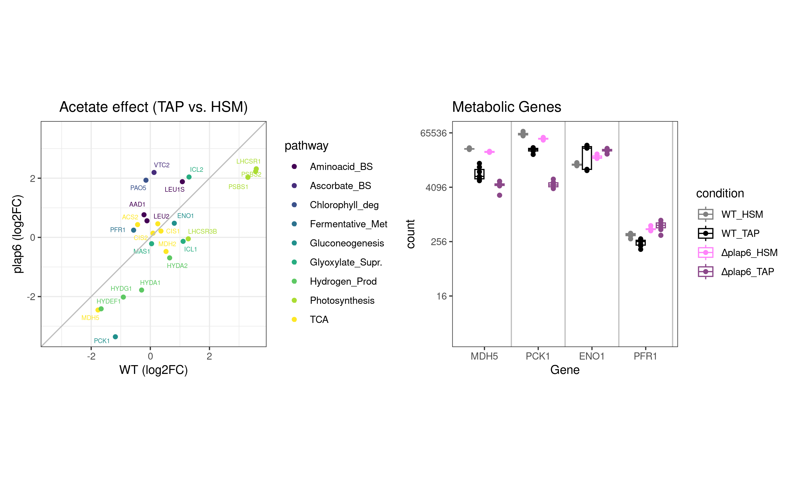

#### Simple log2FC

# GO-terms

    TOPGO

# Export

    library(writexl)

    # combine results

    colnames(anno)

    res_exp <- data.frame(
      # general
      "gene_id" = rownames(dds),
      "gene_name" = anno[rownames(dds),"geneSymbol"],
      "Alias" = anno[rownames(dds),"prev.symbols"],
      "id.symbol" = anno[rownames(dds),"id.symbol"],
      "Description" = anno[rownames(dds),"Description"],
      "Comments" = anno[rownames(dds),"Comments"],
      "TargetP" = anno[rownames(dds),"TargetP"],
      "Predalgo" = anno[rownames(dds),"Predalgo"],
      "baseMean" = res1$baseMean,
      # results 1
      "L2FC.Δplap6_TAP.vs.WT_TAP" = res1$log2FoldChange,
      "pvalue.Δplap6_TAP.vs.WT_TAP" = res1$pvalue,
      "padj.Δplap6_TAP.vs.WT_TAP" = res1$padj,
      # results 2
      "L2FC.Δplap6_HSM.vs.WT_HSM" = res2$log2FoldChange,
      "pvalue.Δplap6_HSM.vs.WT_HSM" = res2$pvalue,
      "padj.Δplap6_HSM.vs.WT_HSM" = res2$padj,
      # results 3
      "L2FC.WT_HSM.vs.WT_TAP" = res3$log2FoldChange,
      "pvalue.WT_HSM.vs.WT_TAP" = res3$pvalue,
      "padj.WT_HSM.vs.WT_TAP" = res3$padj,
      # results 4
      "L2FC.Δplap6_HSM.vs.Δplap6_TAP" = res4$log2FoldChange,
      "pvalue.Δplap6_HSM.vs.Δplap6_TAP" = res4$pvalue,
      "padj.Δplap6_HSM.vs.Δplap6_TAP" = res4$padj,
      counts(dds, normalized = TRUE))
    res_exp %>% head() %>% kable() %>% kable_styling("striped", full_width = T) %>% scroll_box(height = "400px")

    write_xlsx(data.frame(res_exp),
               paste(outdir,"2023_08 P3043 results.xlsx",sep="/"))

    write_xlsx(data.frame(colData(dds)),
               paste(outdir,"2023_08 P3043 samples.xlsx",sep="/"))

    read_xlsx

# End
